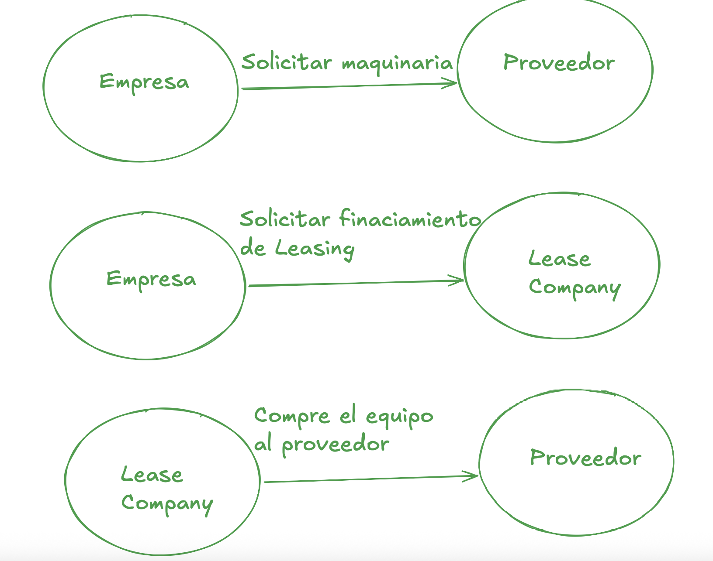
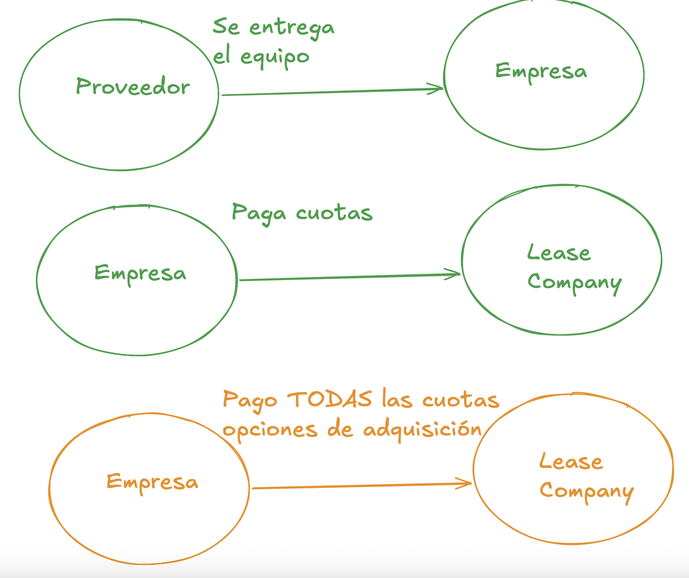

# Caso de Estudio #2 — Arquitectura de Software

**Universidad de Ingeniería y Tecnología**
Departamento de Ciencias de la Computación
Ciclo: 2026 - II

| | |
|---|---|
| **TEAM** | |
| **INTEGRANTES** | |
| **Puntos** | **20 ptos** |

**Background:** Pain Points, POC

---

## Caso de Estudio: Lea$e

**Dificultad:** Alta — **Duración:** 4h

Dado el crecimiento de créditos a nivel corporativo y pymes, las empresas por lo general
trabajan por proyectos y necesitan maquinaria, pero como aún el pago del proyecto es al
final, no pueden financiar todos los equipos y maquinaria requerida. Usted es contratado
como arquitecto para diseñar la arquitectura de una empresa de Leasing de maquinarias en
Perú.

---

## Entregables

- **EVAL** con resultados positivos o aproximados a **8/10**.
- **POC** con código implementado y corriendo para un Happy Path de algunos de sus usuarios.

---

## SPEC TEMPLATE.MD

> /// translate to english first.

- Resumen
- Problema
- Objetivo
- Fuera del objetivo (out of scope)
- Conceptos clave de producto
- Usuarios y sus necesidades
  - `Pedro.MD`
  - `Carlos.MD`
  - `Julia.MD`
- Decisiones claves de producto
- Experiencia de usuario esperada
- Flujos principales
- Alcance por etapas
- Criterios de aceptación

---

## Hints / Tips

- Identifique correctamente los requerimientos antes de diseñar.

---

## Diagramas del flujo (extraídos de `LAB-02-ARQ-2026.2.docx`)

El `.docx` original contiene dos diagramas con el flujo de la operación de leasing. Se extraen aquí
como imágenes porque la conversión a Markdown no capturó su contenido — sin esto, cualquier cita al
"diagrama del brief" en `specs/` no era verificable dentro del repositorio.

**Diagrama 1 — solicitud y compra:**

**Diagrama 2 — entrega, pago y adquisición:**

El segundo diagrama termina explícitamente en **"Pago TODAS las cuotas → opciones de adquisición"**
(resaltado en el original). Esto es lo que `specs/001-company-machinery-leasing/spec.md` cita como
la base del mecanismo de Acquisition Option — no es un requisito inventado.
