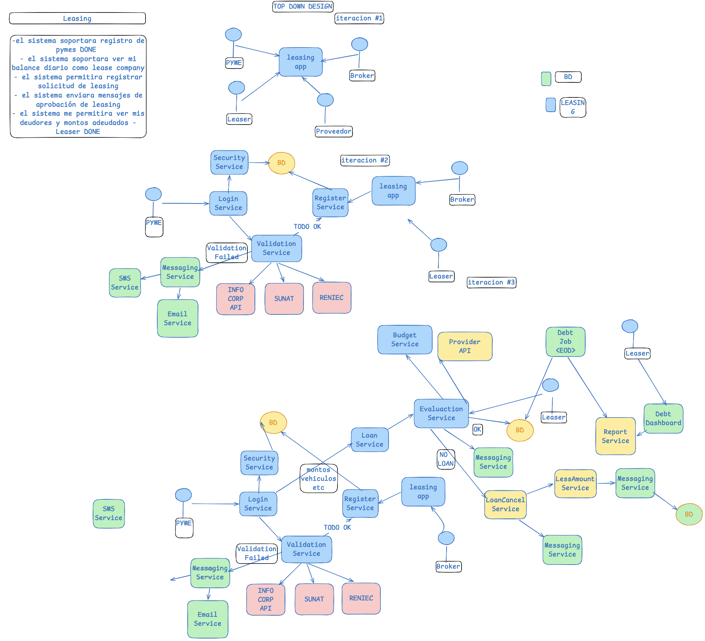

# El ejemplo de clase — Top Down Design

Transcripción y lectura del excalidraw que el profesor mostró en clase
([módulo del curso](https://utec.instructure.com/courses/24631/modules/items/2549106), requiere
sesión UTEC). El caso del ejemplo es **Leasing**, no SendIt: lo que se hereda es el **método**, no
el contenido.



> El original es un excalidraw; lo que se conserva acá es la captura
> ([`ejemplo-clase-top-down.png`](ejemplo-clase-top-down.png)). El resto de este documento la lee.

---

## Qué establece el ejemplo

**1. «Las iteraciones de su diseño» son iteraciones del diagrama de componentes.**

Es la lectura que decide el entregable. El enunciado del Caso #3 exige *"mostrar claramente las
iteraciones de su diseño"*, y el ejemplo muestra qué significa: **el mismo diagrama, dibujado tres
veces, cada vez más abierto.** No son versiones de un documento ni rondas de revisión: es
refinamiento sucesivo — *top down design*.

| Iteración | Qué se ve |
|---|---|
| **#1** | Los actores conectados a **una sola caja**. Todo el sistema es un cuadrado que dice `leasing app` |
| **#2** | Esa caja se abre en servicios, con sus bases de datos, sus APIs externas y sus dos ramas de resultado |
| **#3** | Se agrega lo que faltaba del backlog — evaluación, presupuesto, cobranza, reportes — repitiendo el subgrafo de la #2 |

La consecuencia práctica: **no se dibuja el diagrama final y después se inventan las iteraciones
previas.** El paso 1 es un cuadrado. Lo que fuerza el paso 2 es un ítem del backlog que el cuadrado
no explica, y lo mismo el 3.

**2. El backlog gobierna las iteraciones, y se marca `DONE`.**

El lienzo lleva, arriba a la izquierda, el backlog escrito a mano, y los ítems ya cubiertos por el
diagrama terminan con la palabra **DONE**:

```
Leasing
- el sistema soportara registro de pymes                                    DONE
- el sistema soportara ver mi balance diario como lease company
- el sistema permitira registrar solicitud de leasing
- el sistema enviara mensajes de aprobación de leasing
- el sistema me permitira ver mis deudores y montos adeudados - Leaser      DONE
```

Ese `DONE` es el mecanismo de trazabilidad completo: **una iteración del diagrama existe porque hay
un ítem sin `DONE`.** El diagrama no crece por gusto; crece hasta que el backlog está cubierto.

**3. El formato de un ítem de backlog.**

Literalmente: *"el sistema [verbo en futuro] [capacidad]"*. Y cuando el ítem pertenece a alguien en
particular, se le anexa el actor: *"...ver mis deudores y montos adeudados **- Leaser**"*.

Coincide con la restricción del enunciado del Caso #3 —*solo un título claro y entendible, sin
describirlo*— y le agrega algo que el enunciado no dice pero el ejemplo sí hace: **el ítem nombra a
su dueño**.

---

## El diagrama, iteración por iteración

### Iteración #1 — la caja única

```
PYME ──┐
Leaser ─┼──▶ [ leasing app ]
Broker ─┤
Proveedor ─┘
```

Cuatro actores y un cuadrado. Nada más. Lo único que afirma es **quién habla con el sistema**.

### Iteración #2 — la caja se abre

```
PYME ──▶ Login Service ──▶ Security Service ──▶ (BD)
              │
              ▼
      Validation Service ──▶ INFO CORP API   ┐
              │           ──▶ SUNAT           ├─ externos
              │           ──▶ RENIEC          ┘
              │
              ├──"TODO OK"────────▶ Register Service ──▶ (BD)
              │
              └──"Validation Failed"─▶ Messaging Service ──▶ SMS Service
                                                        └──▶ Email Service

Broker ──▶ leasing app ──▶ Register Service
Leaser ──▶ leasing app
```

Lo que aparece por primera vez, y que la iteración #1 no podía mostrar: la **autenticación**, la
**validación contra terceros**, la **bifurcación del resultado** y el **canal por el que se avisa
cuando falla**.

### Iteración #3 — el resto del backlog

Repite todo el subgrafo de la #2 y le agrega:

```
Loan Service ──▶ Evaluation Service ──▶ Budget Service
                        │            ──▶ Provider API
                        ├──"OK"──────▶ (BD)
                        │          ──▶ Messaging Service
                        └──"NO LOAN"─▶ LoanCancel Service ──▶ LessAmount Service ──▶ Messaging Service ──▶ (BD)
                                                          └──▶ Messaging Service

Debt Job <EOD> ──▶ Evaluation Service
               ──▶ Report Service ──▶ Debt Dashboard ◀── Leaser
```

---

## Convenciones que se adoptan

| Convención | Regla |
|---|---|
| **Servicio** | `<Nombre> Service` — `Login Service`, `Validation Service`, `Register Service` |
| **Proceso batch** | `<Nombre> Job <momento>` — `Debt Job <EOD>` (*end of day*) |
| **Base de datos** | `BD`, en elipse. **Hay varias**, no una sola: cada grupo de servicios tiene la suya |
| **Sistema externo** | Su nombre real — `SUNAT`, `RENIEC`, `INFO CORP API`, `Provider API` |
| **Actor** | Círculo con etiqueta, fuera del sistema |
| **Rama condicional** | La arista lleva su etiqueta: `TODO OK`, `Validation Failed`, `OK`, `NO LOAN` |

**Código de color.** Hay que leerlo del dibujo, no de su leyenda: la leyenda del lienzo declara
solo dos categorías —un cuadrado verde rotulado `BD` y uno azul rotulado `LEASING`— y el diagrama
usa cinco colores que no le corresponden. Es una leyenda de pizarra que quedó a medio hacer. Lo que
el cuerpo del diagrama efectivamente hace, que es lo que se adopta:

| Color | Qué agrupa |
|---|---|
| Azul | Servicios propios del sistema |
| Verde | Servicios de soporte y notificación — `Messaging`, `SMS`, `Email`, `Dashboard` |
| Rosado | Sistemas de terceros, fuera de la frontera de confianza |
| Amarillo | Procesos batch y servicios secundarios |
| Naranja (elipse) | Bases de datos — **pese a que la leyenda las pinta de verde** |

El código de color hace un trabajo real: **el rosado marca dónde termina el sistema**. Todo lo
rosado es algo sobre lo que el diseño no manda, y por lo tanto algo que puede fallar, mentir o
tardar sin que el sistema pueda impedirlo.

---

## Cómo se traduce a SendIt

Lo que se hereda es el método. Lo que cambia es qué hay del otro lado de cada frontera.

| En el ejemplo (Leasing) | En SendIt |
|---|---|
| `SUNAT`, `RENIEC`, `INFO CORP API` | Verificación de identidad, **listas de personas y entidades sancionadas**, proveedor de tipo de cambio, el procesador que cobra a Rosa, y la autoridad a la que reporta el oficial de cumplimiento. **El punto de pago no está en esta fila**: es propio |
| `Validation Service` con dos ramas | El tamizaje de cumplimiento — con la diferencia de que su rama de rechazo **no puede explicarse al cliente** (ver la tensión T2 en [`../personas/README.md`](../personas/README.md)) |
| `Messaging Service` → `SMS` / `Email` | El canal hacia Elena, que **no tiene datos ni correo**: llamada y mensaje de texto (tensión T5) |
| Una `BD` por grupo de servicios | Las varias bases, más el problema que el ejemplo no tiene: el registro contable del dinero, que es donde vive la consistencia |
| `Debt Job <EOD>` | El equivalente es la sincronización y el cierre de caja de los puntos de pago — el punto donde se descubre que un envío figura a la vez detenido en el centro y pagado en el mostrador |

La diferencia de fondo **no es de color, y ahí es donde el método heredado se queda corto.** En
Leasing lo rosado informa, y en SendIt lo rosado también informa: identidad, listas, tasa, la
autoridad. Un `SUNAT` que responde tarde retrasa una validación, y un proveedor de tasa que responde
tarde retrasa una cotización. Nada de eso es lo peor que le pasa a este caso.

Lo peor le pasa **adentro**. El punto de pago de Huanta es propio: azul, con la marca, corriendo
sobre el sistema de SendIt y obedeciendo sus órdenes. Pero puede quedarse sin conexión con billetes
en la caja y una autorización previa que dice «paga» — y entonces el centro y el mostrador afirman a
la vez que el mismo envío está detenido y disponible para cobro. Las dos afirmaciones son nuestras y
las dos están en nuestro registro.

El ejemplo de Leasing no tiene esa figura: todas sus cajas azules están conectadas por definición, y
el rosado le alcanza para marcar dónde deja de mandar el diseño. Aquí hacen falta dos marcas, no
una: **dónde termina el mando y dónde termina la conexión.** Lo primero lo resuelve el color
heredado. Lo segundo hay que inventarlo, y es la única parte del método que este caso obliga a
extender.

---

## Dónde aterriza cada cosa

| Lo que establece el ejemplo | Dónde se cumple en este repo |
|---|---|
| Iteraciones del diagrama | [`../redale/L-listar-componentes/`](../redale/L-listar-componentes/) — tres iteraciones, una sección cada una |
| Backlog con `DONE` | Tabla de trazabilidad *ítem → iteración que lo cubre* en el mismo paso `L` |
| Formato del ítem | [`../redale/R-requerimientos/backlog.md`](../redale/R-requerimientos/backlog.md) |
| Bitácora de qué cambió y por qué | [`../redale/ITERACIONES.md`](../redale/ITERACIONES.md) |
