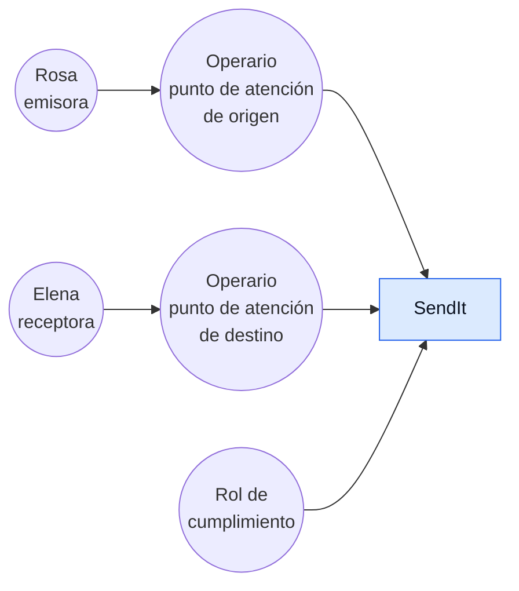
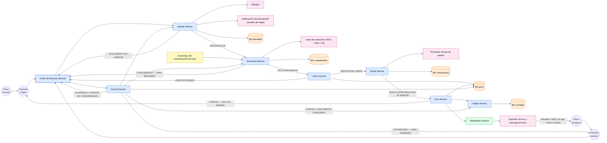
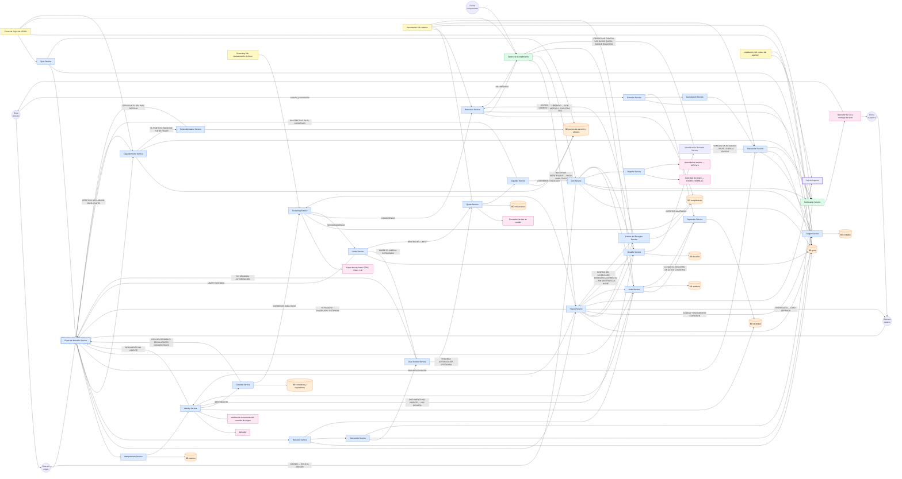
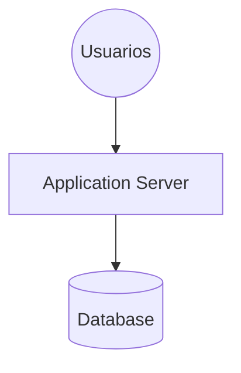
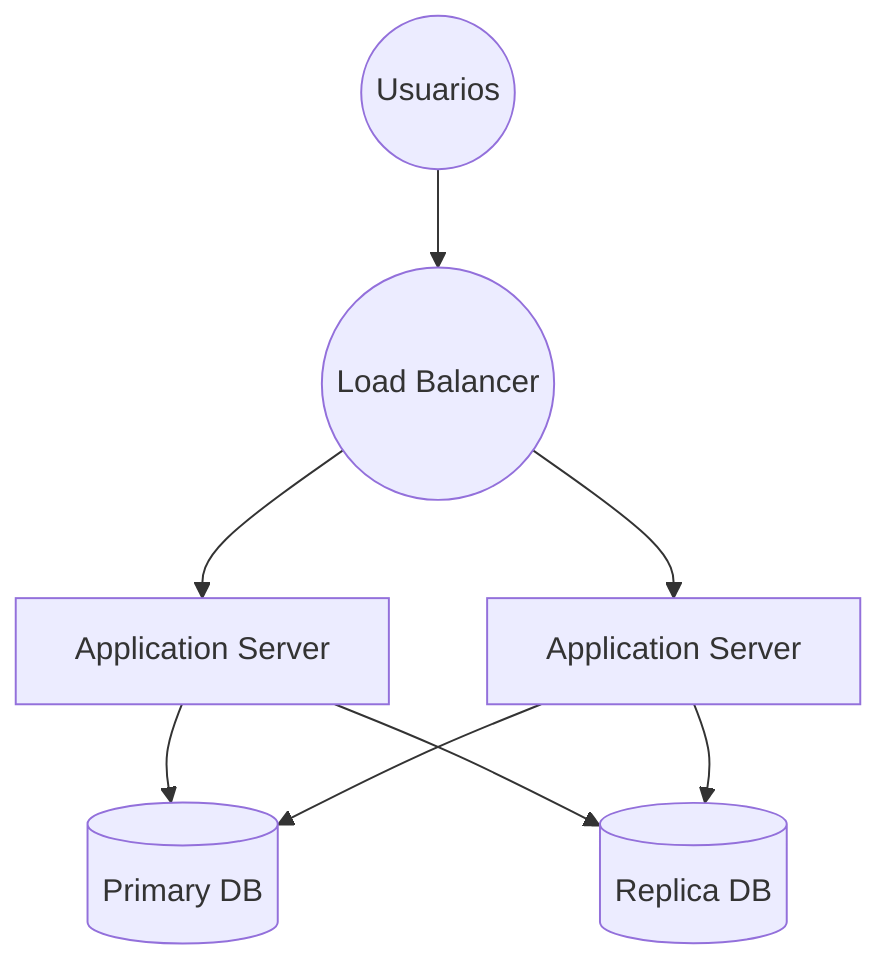
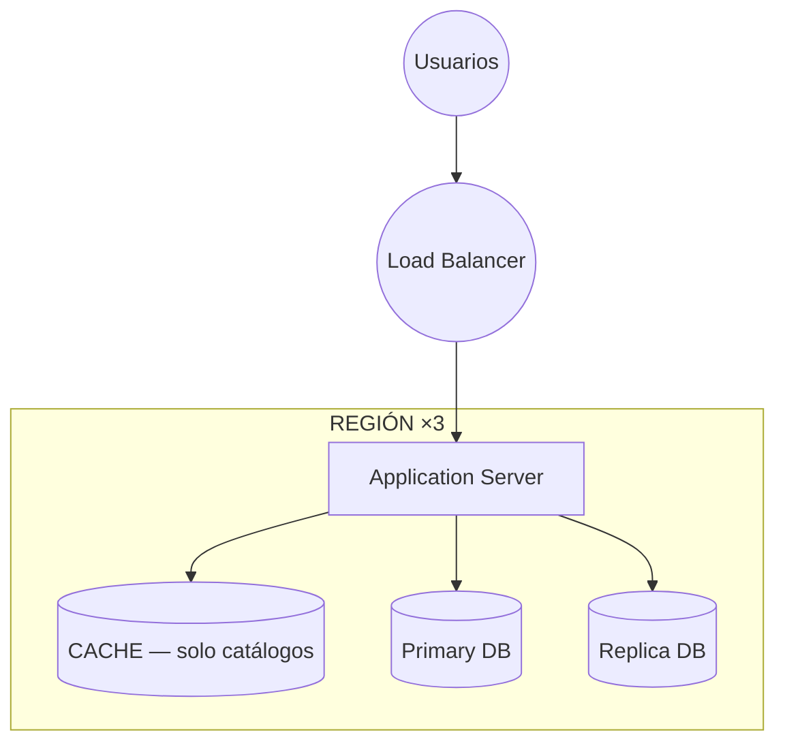
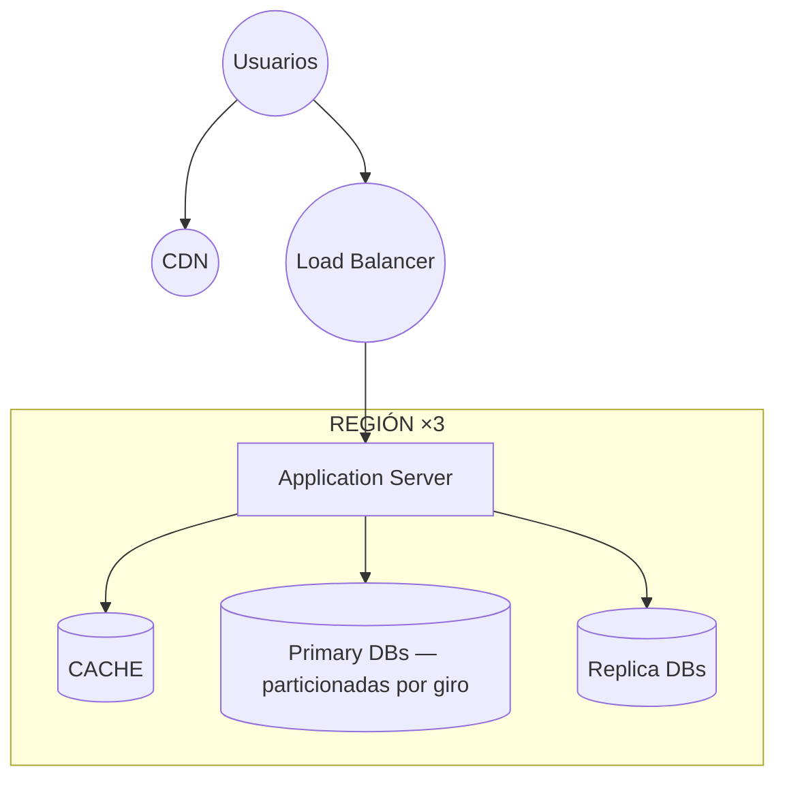
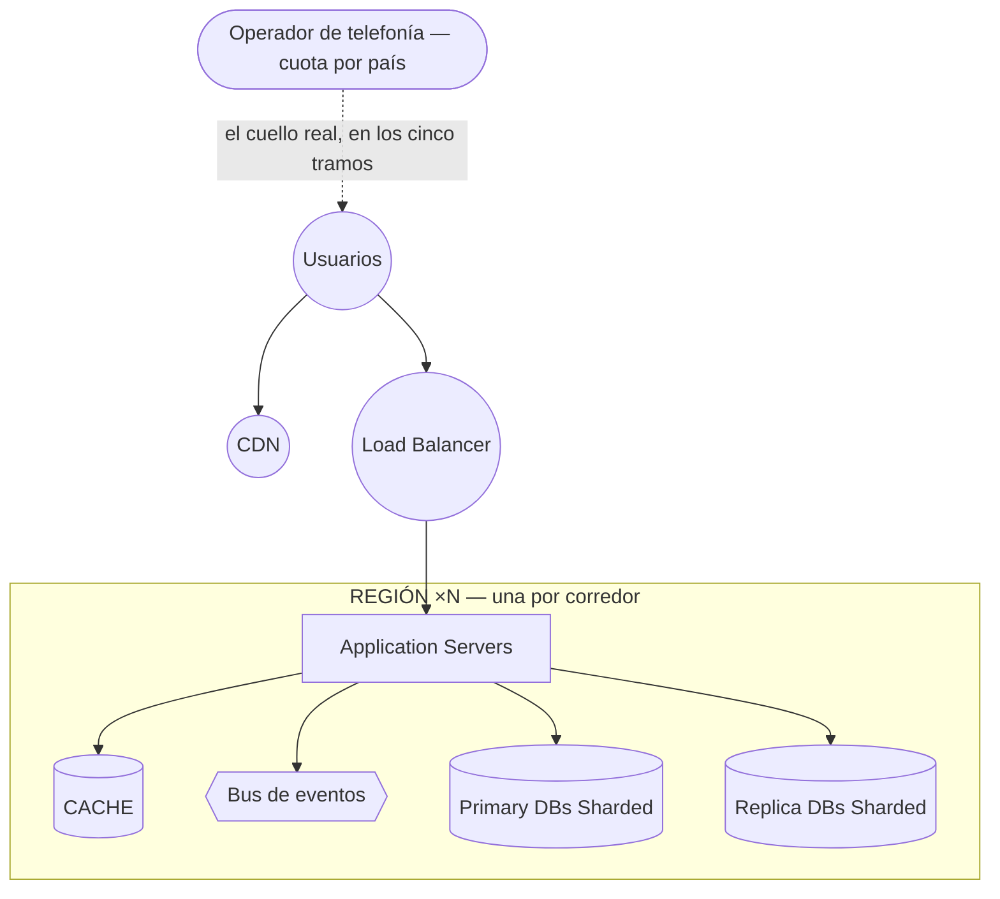

# Caso de Estudio #3 — SendIt

**Universidad de Ingeniería y Tecnología** · Departamento de Ciencias de la Computación
**Curso:** Arquitectura de Software (CS5382) — Teo. 1 · Lab. 11 · **Ciclo:** 2026-II
**Background:** Top Down Design · R.E.D.A.L.E. · **Puntaje:** 20 ptos · **Vence:** 2026-08-28 23:59

| | |
|---|---|
| **Integrantes** | _______________________________ |
| | _______________________________ |
| | _______________________________ |
| | _______________________________ |
| **Repositorio** | https://github.com/LuisMUtec/SWA-LAB03-SendIt |

> **Enunciado.** *Diseñe un sistema que permita mandar remesas a personas en diferentes países. El
> tema de seguridad es muy importante y también la consistencia de datos ya que estamos hablando de
> dinero.*
>
> **Entregables pedidos:** un **EVAL** con resultado de requerimientos —*8/10 aceptable*— y **todos
> los entregables del framework R.E.D.A.L.E.**, mostrando **claramente las iteraciones del diseño**.
> **Restricción:** los requerimientos van en **formato backlog**, solo el título.

---

> ### Estado de este documento
>
> Cerrado tras la **ronda 19** del EVAL, que **alcanzó el gate con 8,2669 / 10 y con margen**.
> **La sección 2 (`R`) se extrae del backlog vigente**, no se transcribe: sus 236 filas, las siete
> tensiones, el reparto de prioridad, la disciplina de alcance, los supuestos y la tabla de
> identificadores retirados son los del repositorio palabra por palabra. La tabla de rondas de la
> sección 8 se extrae de [`evals/HISTORY.md`](../evals/HISTORY.md).
>
> **La deuda de repropagación está saldada, y esto es lo que costó saldarla.** Durante doce rondas,
> las cifras de `E`, los endpoints de `D`, las entidades de `A` y los tramos de `E`-escalar estuvieron
> calculados sobre el backlog de **155 ítems** de la ronda 11, con la deuda declarada acá mismo. Se
> rehicieron los cinco pasos contra los **236** vigentes. Tres resultados:
>
> 1. **Las decisiones aguantaron.** Ninguna de las seis de `D` se reabrió, ningún motor de `A` cambió
>    y ningún tramo de `E`-escalar cambió de orden. Un corte arquitectónico que absorbe un 52 % más de
>    requerimientos sin moverse es la prueba de que el corte estaba en el lugar correcto.
> 2. **Los caudales no aguantaron, y el peor hallazgo no lo trajo un ítem nuevo.** `S-14` enumeraba
>    dieciocho avisos y el backlog despachaba veinticuatro: el primer cuello del sistema —la cuota del
>    operador de telefonía— se adelantó de `1 026` a **`831` giros/día**. La aritmética nunca falló;
>    la lista sobre la que corría estaba incompleta.
> 3. **Apareció un componente que no existía**: la identificación derivada al rol de cumplimiento
>    (`RF-218`, `RF-219`, `RF-223`), única salida del receptor que agota los intentos del desafío.
>    `D` le dio tres rutas, `A` una entidad con plazo y `L` una caja — y con eso, **cinco `DONE` que
>    `L` afirmaba sin que nadie los sostuviera pasaron a ser verdad.**
>
> `E`-escalar además **se alineó a la forma del capítulo 3**: las cinco láminas del material —el mismo
> diagrama creciendo, rotulado en usuarios— con su tabla de tres columnas y la comparación
> *scale out* / *scale up*. El análisis por `giros/día` queda como la capa propia del caso.

---

## Resumen

SendIt es una red de remesas con **efectivo en las dos puntas**, modelo Western Union: quien envía
entrega billetes en la ventanilla de un agente afiliado y sale con un código; quien recibe cobra
billetes en otro mostrador, en otro país, contra ese código y su documento. Ninguna de las dos
puntas necesita cuenta bancaria. Entre la entrega y el cobro el dinero no es de ninguna de las dos:
está con SendIt, que lo **debe**. Ese intervalo es todo el problema.

**El usuario modelo es Rosa Quispe**, la remitente. Es quien decide usar SendIt o abandonarlo, quien
paga, y la única de las tres personas que elige libremente. La acompañan Elena —la destinataria en
Huanta, sin datos móviles y con el DNI vencido— y Kevin —el operario del mostrador, que no es el
guardián de la seguridad sino **el vector por donde se rompe**.

El entregable cubre los seis pasos de R.E.D.A.L.E.: un **backlog de 236 ítems** (216 funcionales, 20
no funcionales), una estimación con su aritmética a la vista (**13 servidores**, **3,3 TB
retenidos**, **1,7 Mbit/s en pico**), una arquitectura mixta con **48 endpoints** y **siete
decisiones cerradas**, un modelo de **37 entidades** repartidas en **10 bases**, **tres iteraciones
del diagrama de componentes** con trazabilidad **236/236**, y el escalamiento entregado dos veces:
**en la forma del material** —los cinco tramos en usuarios, con el mismo diagrama creciendo— y en la
del caso, con sus seis cuellos de botella medidos en giros por día.

### El resultado del EVAL, dicho de una

**El EVAL alcanzó el gate en la decimonovena ronda: 8,2669 / 10 sobre un umbral de 8, y con margen.**

```
Ronda  01   02   03   04   05   06   07   08     09    10     11     12     13     14     15     16     17     18     19
Total 3,5  4,0  5,0  6,0  6,5  5,5  6,0  7,12  6,50  6,54   6,61   7,34   7,66   7,75   7,73   7,70   8,00   7,67   8,27
Ítems  41   69   81   97  110  119  118   137   137   137    155    175    192    200    207    216    222    227    236
```

**El gate se cruzó dos veces y la diferencia entre las dos importa.** En la ronda 17 con **8,0045**,
que el propio agregador declaró *dentro de la resolución del instrumento*: un hallazgo más de `D4`
habría dado 7,98. La ronda 18 lo perdió por un título nuevo que reemitía el código de seguridad. La
**ronda 19 lo recuperó con 8,2669 — 12,6 cuantums de margen**: para caerse habrían tenido que
omitirse **trece** hallazgos.

Diecinueve rondas con tres agentes de persona aislados entre sí y un agregador movieron el backlog de
**41 a 236 ítems** y el puntaje de **3,5 a 8,27**, con dos regresiones reales y **ninguna corrección
de la vara para alcanzar el número**.

**Lo que este trabajo entrega no es el puntaje: son los cuatro dictámenes que el aparato produjo
sobre sí mismo.**

1. **Ronda 07 — `D4` no estaba calibrada.** Varianza cero en siete rondas mientras `n` variaba 2,7×.
   La rúbrica **no se cambió en esa ronda**; se enmendó en la 08 con las cuatro condiciones del
   Principio IV exhibidas, incluida la que no se argumenta: se recalcularon las rondas viejas y
   **ninguna alcanzaba el gate que antes no alcanzaba**.
2. **Ronda 15 — una corrección deducida de un informe corrige el informe, no la dimensión.** Ocho de
   nueve bloques cerrados y el puntaje **bajó**.
3. **Ronda 17 — la enmienda candidata a `D2` se retira por el motivo contrario al esperado.**
   Satisface la condición 4, **pero esta ronda perdería el gate con ella**, y aplicar una enmienda en
   la corrida donde voltea el veredicto es indistinguible de endurecer por su efecto. *«El Principio
   IV es simétrico.»*
4. **Ronda 19 — la aritmética final del instrumento.** *«El gate se alcanza si y solo si `D3` = 2,0.
   `D4` no lo decide y nunca lo decidió.»* `D1` es el único punto y medio no explotado, **disponible
   en teoría y 0 de 9 en la práctica**: nueve rondas cerrando las reservas nombradas y nueve veces
   1,5, porque cada persona encuentra una reserva nueva de la misma clase que la que se le cerró.

La sección 8 desarrolla las diecinueve rondas y la 9 los dictámenes.

---

## 1. El caso y las personas

### El problema

Una persona necesita entregar dinero en un país y que otra lo reciba en otro, **sin que ninguna de
las dos tenga cuenta bancaria**. El enunciado nombra dos limitaciones y solo dos: **seguridad**,
porque el efectivo se entrega a un desconocido en una ventanilla que no es de SendIt, y
**consistencia de datos**, porque un giro pagado dos veces no es un registro sucio sino dinero
perdido que no se recupera. A eso se suma una tercera que el enunciado implica al decir *«diferentes
países»*: el negocio es transfronterizo y por tanto **multirregulador**, y un giro obedece a la vez
al regulador de origen y al de destino.

Lo que hace difícil el caso no es mover el dinero: es el intervalo. Mientras el giro viaja, SendIt no
es dueño del dinero —lo debe—, el tipo de cambio se mueve, las listas de sanciones cambian, el
mostrador de destino puede quedarse sin conexión con los billetes en la caja, y quien tiene que
decidir si paga es la persona con menos autoridad y más exposición de toda la cadena. **El diseño
entero consiste en decidir qué pasa dentro de ese intervalo.**

### Las tres personas

| Persona | Rol | Qué ancla | Modo de falla que solo ella ve |
|---|---|---|---|
| **Rosa Quispe** — *usuario modelo* | Remitente en Paterson, Nueva Jersey. Manda a Huanta USD 200–400 cada quincena | Que el envío llegue **por el monto y en la fecha prometidos** | La promesa de monto y fecha que nadie más está en posición de exigir |
| **Elena Quispe** | Destinataria en Huanta, 68 años. Cobra en efectivo en una bodega-agente. Sin datos, sin correo, sin cuenta. DNI vencido hace catorce meses | Que el último tramo, **el que no tiene pantalla**, también cierre | El envío que el sistema da por cerrado antes de que ella cuente los billetes |
| **Kevin Ramos** | Cajero del mostrador de un negocio afiliado. Paga con el efectivo **de su patrón**, no de SendIt | La **seguridad** del enunciado — es el vector, no el guardián | La operación cortada a la mitad: la única que rompe la **consistencia** con dinero ya en la mano |

### Por qué Rosa es el usuario modelo

El enunciado pide, como hint, *identificar correctamente quién es el usuario modelo*, en singular.
Una remesa tiene al menos cinco actores con un problema propio y legítimo. La decisión está
registrada como **D-01** y se argumenta por descarte:

| Candidato | Su problema | Por qué no es el usuario modelo |
|---|---|---|
| **Remitente (Rosa)** | Comprar una llegada: tantos soles, tal día | — |
| Destinataria (Elena) | Cobrar sin viajar en vano y sin que le falte | No elige el servicio: recibe por donde el remitente mandó |
| Operario (Kevin) | Cerrar la operación sin equivocarse, con cola detrás y con el efectivo de su patrón | Atiende el mostrador de un tercero afiliado. No elige SendIt: SendIt llegó a su negocio |
| Tesorería | Prefinanciar el corredor, cerrar la posición de cambio | Su problema es de la empresa, no del envío |
| Oficial de cumplimiento | Detener lo que hay que detener, con evidencia | Trabaja dentro de la empresa. Su día se resuelve sin que exista un cliente |

**Rosa.** Es quien decide usar SendIt o abandonarlo, quien paga, y la única de las cinco que elige
libremente. Un backlog que resuelve el día de Kevin y no el de Rosa **describe una red de agentes muy
bien controlada y sin clientes** — y el enunciado invita a ese error, porque nombra la seguridad y no
nombra al cliente.

**Elegirla no la vuelve la única, y esa es la otra mitad de la decisión:** el problema de Rosa **no se
resuelve dentro de la pantalla de Rosa**. La promesa que ella necesita la cumple o la rompe Elena en
la bodega de Huanta, y la sostiene o la pierde Kevin en el mostrador. Un diseño que solo mira su lado
declara el envío terminado cuando el dinero salió, que es exactamente el momento en que nada se
resolvió. Por eso hay tres personas y no una, y por eso **el usuario modelo no compra peso en la
rúbrica**: D1 reparte un punto por persona, igual para las tres.

### Las siete tensiones que el backlog tuvo que decidir

Estos conflictos son deliberados. Un conjunto de requerimientos que deja conformes a las tres
personas a la vez probablemente **evitó decidir** alguno — y eso lo cobra la rúbrica en D4 como
*tensión esquivada*.

| # | Tensión | Entre | En qué consiste |
|---|---|---|---|
| **T1** | Control ↔ rapidez | Rosa ↔ Kevin | Cada verificación que Kevin hace es tiempo que Rosa espera con la cola detrás. El control tiene que ocurrir **antes** de que Kevin toque el efectivo; Rosa quiere salir con su código y una promesa firme |
| **T2** | Explicación ↔ reserva | Rosa ↔ Kevin | Rosa exige saber por qué se detuvo su dinero. Kevin es la cara de SendIt y tiene **prohibido** decírselo cuando hay un reporte de por medio — y ni siquiera fue él quien decidió. No se resuelve redactando mejor un mensaje |
| **T3** | Verificación de identidad ↔ lo que Elena tiene | Elena ↔ Kevin | Kevin necesita saber quién cobra y responde con el efectivo de su patrón si se equivoca. Elena tiene un DNI vencido y una foto de hace veinte años, del lado donde no hay a quién reclamar |
| **T4** | Certeza del monto ↔ exposición cambiaria | Rosa ↔ la empresa | Rosa necesita que el monto en soles se fije al pagar. Fijarlo deja a SendIt cargando el movimiento del tipo de cambio hasta que Elena cobre — que puede ser nunca |
| **T5** | El canal de Rosa ↔ el canal de Elena | Rosa ↔ Elena | Rosa consulta desde su teléfono; Elena solo tiene llamada y mensaje de texto, y el código se lo pasa Rosa, no SendIt. Todo aviso que dependa de una pantalla deja a Elena afuera — y Elena es quien decide si viaja |
| **T6** | Cerrar el envío ↔ cerrarlo de verdad | Rosa ↔ Elena | Para el sistema es cómodo dar por terminado el envío cuando el dinero llegó al agente. Para Rosa y Elena termina cuando Elena contó los billetes. Entre esos dos momentos vive el defecto que nadie ve |
| **T7** | El código perdido | Rosa ↔ Elena | Rosa **nunca debe** poder recuperar el código por un canal de SendIt, porque eso lo volvería obtenible por quien se haga pasar por ella. Y Elena **no puede cobrar sin él**. Entre las dos cosas no hay término medio: o el secreto se puede reponer y deja de serlo, o el dinero queda atrapado hasta prescribir. La descubrió el EVAL en la iteración 07, después de que dos rondas la revirtieran en direcciones opuestas, cada una por un punto entero de D3 |

### Las decisiones que gobiernan el resto del documento

| # | Decisión | Qué gobierna |
|---|---|---|
| **D-01** | El usuario modelo es Rosa | Contra quién se mide si el backlog resolvió algo |
| **D-02** | Tres personas, no más | El reparto de D1: 3 = 1 + 1 + 1 |
| **D-03** | Se incluye el segundo paso `E` (Escalar), acotado | Cuántos entregables tiene R.E.D.A.L.E. en este caso |
| **D-04** | La rúbrica del EVAL se recorta respecto del Caso #2 | D3 pasa a medir **seguridad y consistencia**, que es lo que este enunciado nombra |
| **D-05** | «Las iteraciones del diseño» son iteraciones del **diagrama de componentes** | Qué se entrega como iteración y en qué orden se construye |
| **D-06** | El backlog adopta el formato literal del profesor | La forma exacta de cada ítem del único artefacto puntuado |
| **D-07** | SendIt opera el modelo **Western Union** | El canal de origen, quién es la tercera persona y la mitad de las reglas de seguridad |

**D-04** merece una línea, porque cambia qué mide el EVAL. La rúbrica llegó heredada del Caso #2,
donde D3 medía *«criterios de aceptación demostrables»*. Aquí el artefacto puntuado es un backlog de
**solo títulos** —el enunciado prohíbe describirlos—, así que la dimensión heredada mediría algo que
el enunciado prohíbe escribir y todo backlog sacaría 0. D3 pasa a ser **cobertura de seguridad y
consistencia**, dos puntos, uno por cada una: las dos únicas exigencias que el enunciado nombra por
su nombre dejan de depender de que alguien se acuerde de mirarlas.

**D-05** decide el entregable entero y no es una preferencia: es lo que el profesor mostró en clase.
El ejemplo de Leasing es **el mismo diagrama dibujado tres veces, cada vez más abierto** —#1 los
actores contra una sola caja; #2 esa caja abierta en servicios, bases y APIs externas; #3 el resto
del backlog—, con el backlog escrito en el mismo lienzo y los ítems ya cubiertos terminando en
`DONE`. La consecuencia operativa, que hay que sostener aunque incomode: **la iteración 1 es un
cuadrado**, y lo que fuerza la 2 es un ítem del backlog que el cuadrado no explica.

### Las reglas de negocio

Diecisiete reglas gobiernan el negocio y sobreviven a cualquier lista de requerimientos. Cada ítem
del backlog cita la que ejerce.

| # | Regla |
|---|---|
| **BR-01** | SendIt nunca es dueño del dinero, solo lo debe |
| **BR-02** | Un giro tiene exactamente un emisor, un receptor designado y un país destino |
| **BR-03** | El emisor se identifica **antes** de que SendIt acepte el efectivo |
| **BR-04** | Todo giro tiene un límite por operación, un acumulado por emisor y un acumulado por receptor |
| **BR-05** | Por encima de cierto monto, un giro exige una **segunda autorización** |
| **BR-06** | Emisor y receptor se tamizan contra listas de sanciones antes de mover dinero. Una coincidencia **detiene** el giro; no lo cancela |
| **BR-07** | El tipo de cambio se fija al crear el giro y **no se recalcula** |
| **BR-08** | El giro se identifica por un código que **solo el emisor** puede transmitir |
| **BR-09** | El receptor cobra contra código **y** documento; cuando el documento no está vigente, el tercer factor es el **desafío** que el emisor registró |
| **BR-10** | Un giro se paga **una sola vez** |
| **BR-11** | Ningún giro se paga sin que los fondos estén confirmados en el origen |
| **BR-12** | El emisor puede cancelar mientras el dinero no esté a disposición del receptor, y solo él |
| **BR-13** | Un giro pagado se corrige con un movimiento **nuevo**, nunca borrando el anterior |
| **BR-14** | Un giro no cobrado prescribe y el dinero vuelve al emisor |
| **BR-15** | Toda operación queda registrada con quién la hizo, y ese registro **no se altera** |
| **BR-16** | El operario ve lo que necesita para atender, **no el giro completo** |
| **BR-17** | Un giro transfronterizo obedece a los **dos** reguladores, y cuando chocan **no se elige uno**: no se crea |

---

## 2. R — Requerimientos (backlog)

**Este es el único artefacto que el EVAL puntúa.** Formato exigido por el enunciado: backlog, solo el
título, claro y entendible, sin descripción. Cada ítem sigue el formato literal del ejemplo de clase
fijado en **D-06**: *el sistema **[verbo en futuro] [capacidad]** - `<Persona>`*, con el sufijo de
persona cuando el ítem pertenece a alguien concreto — tal como *«el sistema me permitira ver mis
deudores y montos adeudados **- Leaser**»*. Eso da la trazabilidad que D4 exige —ningún huérfano— sin
agregar una sola línea de descripción.

### Preguntas de encuadre

| Pregunta | Respuesta |
|---|---|
| **¿Cuál es el problema?** | Una persona necesita entregar dinero en un país y que otra lo reciba en otro, **sin que ninguna de las dos tenga cuenta bancaria**. Entre la entrega y el cobro el dinero no está con ninguna: está con SendIt, que lo debe (BR-01). Ese intervalo es todo el problema |
| **¿Para quién lo resolvemos?** | Para **Rosa**, que paga y elige el servicio. Elena y Kevin existen porque sin ellos su operación no cierra |
| **¿Cuáles son las limitaciones?** | Las dos del enunciado: **seguridad**, porque el efectivo se entrega a un desconocido en una ventanilla ajena, y **consistencia de datos**, porque un giro pagado dos veces es dinero perdido, no un registro sucio. A eso se suma que el negocio es transfronterizo y por tanto **multirregulador** |

### El backlog — 236 ítems

**216 requerimientos funcionales y 20 no funcionales.** Los huecos en la numeración son
**identificadores retirados**, y un identificador retirado no se reutiliza: su número queda muerto
(la tabla al final de esta sección dice cuáles y por qué).

### Funcionales

#### Creación del giro

| ID | Título | Persona | Regla | Prioridad |
|---|---|---|---|---|
| RF-01 | el sistema identificará al emisor contra un documento oficial vigente antes de recibir su efectivo - Rosa | Rosa | BR-03 | P0 |
| RF-225 | el sistema resolverá con un segundo rol, y no con el criterio del operario, la duda sobre si la fotografía del documento corresponde al emisor - Kevin | Kevin | BR-03 | P0 |
| RF-229 | el sistema rechazará, antes de que el operario reciba el efectivo, el giro cuya duda sobre la fotografía no se resuelve en `[ASSUMPTION: 10 minutos]` - Kevin | Kevin | BR-03 | P0 |
| RF-02 | el sistema entregará al receptor su dinero en efectivo, sin exigirle cuenta bancaria - Elena | Elena | BR-01 | P0 |
| RF-79 | el sistema dará el giro por creado en el momento en que registra la recepción del efectivo - Kevin | Kevin | BR-03 | P0 |
| RF-03 | el sistema exigirá un único receptor designado por giro - Rosa | Rosa | BR-02 | P0 |
| RF-04 | el sistema exigirá un único país destino por giro - Rosa | Rosa | BR-02 | P0 |
| RF-63 | el sistema permitirá al emisor elegir el punto de atención donde cobrará el receptor, entre los disponibles en el país destino - Rosa | Rosa | BR-02 | P0 |
| RF-05 | el sistema informará al emisor el monto exacto en moneda destino antes de que entregue el efectivo - Rosa | Rosa | BR-07 | P0 |
| RF-06 | el sistema conservará sin recalcularlo, durante toda la vida del giro, el monto en moneda destino que informó al emisor - Rosa | Rosa | BR-07 | P0 |
| RF-07 | el sistema producirá y fechará la cotización de la que sale el monto en moneda destino - Rosa | Rosa | BR-07 | P0 |
| RF-157 | el sistema producirá y fechará la comisión que aplica a cada giro - Rosa | Rosa | BR-07 | P0 |
| RF-158 | el sistema producirá y fechará el margen que aplica sobre la cotización - Rosa | Rosa | BR-07 | P0 |
| RF-201 | el sistema dejará de ofrecer al emisor la cotización que no se ejecutó dentro de `[ASSUMPTION: 10 minutos]` de producida - Rosa | Rosa | BR-07 | P0 |
| RF-209 | el sistema conservará para el giro que espera la autorización de un segundo rol la cotización que se le informó al emisor antes de pedirla - Rosa | Rosa | BR-07 | P0 |
| RF-08 | el sistema rechazará, antes de que el operario reciba el efectivo, el giro que haga al emisor superar su límite por operación - Rosa | Rosa | BR-04 | P0 |
| RF-09 | el sistema rechazará, antes de que el operario reciba el efectivo, el giro que haga al emisor superar su acumulado en la ventana vigente `[ASSUMPTION: la ventana es de 30 días corridos]` - Rosa | Rosa | BR-04 | P0 |
| RF-10 | el sistema contará el límite por operación y el acumulado sobre la identidad del emisor y no sobre el punto de atención - Kevin | Kevin | BR-04 | P0 |
| RF-11 | el sistema hará llegar el código de seguimiento al emisor por llamada o mensaje de texto al teléfono que él registró - Rosa | Rosa | BR-08 | P0 |
| RF-125 | el sistema confirmará al operario que el código salió hacia el emisor, sin mostrárselo - Kevin | Kevin | BR-08 | P0 |
| RF-114 | el sistema recibirá la respuesta del desafío del propio receptor `[CLARIFY: por qué medio la introduce quien no tiene teléfono con pantalla]` - Elena | Elena | BR-09 | P0 |
| RF-94 | el sistema no volverá a entregar un código ya emitido, ni siquiera al emisor que lo perdió - Rosa | Rosa | BR-08 | P0 |
| RF-189 | el sistema tendrá por llegado el aviso cuyo canal no reporta fallo dentro de `[ASSUMPTION: 15 minutos]` del despacho - Rosa | Rosa | BR-15 | P0 |
| RF-217 | el sistema tendrá por no llegado el código de seguimiento cuyo canal no reporta entrega - Rosa | Rosa | BR-08 | P0 |
| RF-149 | el sistema dejará no pagable el giro del que no tiene constancia de que el código llegó a su emisor - Kevin | Kevin | BR-08 | P0 |
| RF-173 | el sistema volverá pagable el giro no pagable por falta de constancia cuando la constancia llega - Kevin | Kevin | BR-08 | P0 |
| RF-232 | el sistema avisará al emisor y al receptor, cada uno por su canal, cuando un giro vuelve a ser pagable - Rosa | Rosa | BR-08 | P0 |
| RF-174 | el sistema devolverá al emisor el giro que sigue sin constancia del código a las `[ASSUMPTION: 72 horas]` de emitido - Rosa | Rosa | BR-12 | P0 |
| RF-117 | el sistema permitirá rehacer al mismo receptor el giro que se canceló o se devolvió sin haberse pagado - Rosa | Rosa | BR-12 | P0 |
| RF-134 | el sistema conservará en el giro rehecho la cotización que fijó el giro cancelado - Rosa | Rosa | BR-07 | P0 |
| RF-135 | el sistema no volverá a cobrar la comisión del giro rehecho - Rosa | Rosa | BR-07 | P0 |
| RF-123 | el sistema volverá a correr sobre el giro rehecho los mismos controles que sobre uno nuevo, incluida la identificación del emisor contra su documento - Kevin | Kevin | BR-06 | P0 |
| RF-13 | el sistema exigirá la autorización de un segundo rol antes de que el operario reciba el efectivo de un giro sobre el umbral reforzado - Kevin | Kevin | BR-05 | P0 |
| RF-191 | el sistema rechazará, antes de que el operario reciba el efectivo, el giro cuya autorización de segundo rol no llega en `[ASSUMPTION: 10 minutos]` - Kevin | Kevin | BR-05 | P0 |
| RF-14 | el sistema avisará al emisor por llamada o mensaje de texto que su devolución está disponible y en qué punto retirarla - Rosa | Rosa | BR-12 | P0 |

#### La frontera

Este bloque existe por una sola razón: **el giro cruza un país.** La prueba se corre cada ronda y
**la ronda 16 la corrió en serio, con un resultado incómodo**: `RF-140` y `RF-161` —registrar la
fecha de nacimiento «cuando el reporte a una autoridad la exige»— **sobreviven palabra por palabra a
una red doméstica**, y llevaban catorce rondas bajo un encabezado que afirmaba que ninguno lo hacía.
Se quedan, porque el reporte transfronterizo los necesita; lo que se retira es la afirmación de que
todo el bloque muere, que era falsa. Es el mismo defecto que la
[iteración 03](../../evals/iterations/2026-08-26-03.md) encontró acá y que la 15 volvió a encontrar. La
[iteración 01](../../evals/iterations/2026-08-26-01.md) mostró que un backlog sin este bloque
describe un transmisor de dinero doméstico con un campo de moneda; la
[03](../../evals/iterations/2026-08-26-03.md) encontró que dos de sus ítems **sobrevivían a una red
doméstica** y estaban archivados bajo el rasgo equivocado: la liquidación con el agente pertenece al
efectivo y el aviso al receptor pertenece al canal. Los dos se mudaron a **Pago**.

| ID | Título | Persona | Regla | Prioridad |
|---|---|---|---|---|
| RF-16 | el sistema rechazará el giro cuando los dos reguladores impongan condiciones incompatibles, en vez de elegir una - Kevin | Kevin | BR-17 | P0 |
| RF-17 | el sistema reportará a la autoridad de origen el giro que supere su umbral de reporte transfronterizo `[ASSUMPTION: USD 10 000 por operación, o el que fije cada regulador si es menor]` - Kevin | Kevin | BR-17 | P0 |
| RF-139 | el sistema reportará a la autoridad del país de destino el giro que supere el umbral de reporte de esa jurisdicción - Kevin | Kevin | BR-17 | P0 |
| RF-185 | el sistema reportará a cada autoridad dentro del plazo que fija esa jurisdicción, y no del más largo de los dos - Kevin | Kevin | BR-17 | P0 |
| RF-140 | el sistema registrará la fecha de nacimiento del emisor cuando el reporte a una autoridad la exige - Kevin | Kevin | BR-17 | P0 |
| RF-161 | el sistema registrará la fecha de nacimiento del receptor cuando el reporte a una autoridad la exige - Kevin | Kevin | BR-17 | P0 |
| RF-18 | el sistema conservará el registro de un giro por el plazo más largo de los dos países que lo tocaron - Kevin | Kevin | BR-17 | P1 |
| RF-19 | el sistema informará al emisor que un país destino no puede atenderse antes de que entregue el efectivo - Rosa | Rosa | BR-02 | P0 |
| RF-20 | el sistema exigirá efectivo disponible en el corredor de destino antes de dar un giro por fondeado - Kevin | Kevin | BR-11 | P0 |
| RF-235 | el sistema producirá el efectivo disponible de cada corredor a partir de lo declarado por los puntos que lo integran - Kevin | Kevin | BR-11 | P0 |
| RF-22 | el sistema aplicará el umbral de reporte de cada país sobre el giro completo y no sobre su tramo local - Kevin | Kevin | BR-17 | P0 |
| RF-23 | el sistema impedirá que un giro rechazado por el regulador de destino se cree en el de origen - Kevin | Kevin | BR-17 | P2 |

#### Cumplimiento

| ID | Título | Persona | Regla | Prioridad |
|---|---|---|---|---|
| RF-26 | el sistema contrastará al emisor contra las listas de sanciones antes de aceptar el efectivo - Kevin | Kevin | BR-06 | P0 |
| RF-167 | el sistema rechazará la creación de un giro mientras no pueda contrastar a las dos puntas contra listas vigentes - Kevin | Kevin | BR-06 | P0 |
| RF-177 | el sistema rechazará, antes de aceptar el efectivo, el giro cuya consulta a una lista externa no responde en `[ASSUMPTION: 60 segundos]` - Kevin | Kevin | BR-06 | P0 |
| RF-186 | el sistema tratará como no vigente la copia de una lista de sanciones que no se actualizó en `[ASSUMPTION: 24 horas]` - Kevin | Kevin | BR-06 | P0 |
| RF-119 | el sistema contrastará al receptor designado contra las listas de sanciones antes de aceptar el efectivo - Kevin | Kevin | BR-06 | P0 |
| RF-27 | el sistema contrastará al receptor contra las listas vigentes al momento de autorizar el pago - Kevin | Kevin | BR-06 | P0 |
| RF-97 | el sistema volverá a tamizar los giros aún no pagados cuando cambia una lista de sanciones - Kevin | Kevin | BR-06 | P1 |
| RF-28 | el sistema separará una coincidencia exacta de sanciones de una coincidencia por homonimia - Kevin | Kevin | BR-06 | P0 |
| RF-78 | el sistema resolverá la coincidencia por homonimia en `[ASSUMPTION: 24 horas]`, plazo más corto que el de la coincidencia exacta - Kevin | Kevin | BR-06 | P1 |
| RF-29 | el sistema retendrá el giro con coincidencia de sanciones - Kevin | Kevin | BR-06 | P0 |
| RF-220 | el sistema dejará no pagable todo giro retenido - Kevin | Kevin | BR-06 | P0 |
| RF-182 | el sistema dejará no cancelable todo giro retenido - Kevin | Kevin | BR-06 | P0 |
| RF-213 | el sistema volverá cancelable el giro cuya retención terminó sin devolución - Rosa | Rosa | BR-06 | P0 |
| RF-30 | el sistema derivará el giro retenido a un rol distinto del operario que lo atendió - Kevin | Kevin | BR-06 | P0 |
| RF-31 | el sistema exigirá que toda retención lleve el plazo del regulador más estricto de los dos países del giro - Kevin | Kevin | BR-06 | P0 |
| RF-32 | el sistema devolverá al emisor el monto del giro cuya retención venció sin liberarse - Kevin | Kevin | BR-06 | P0 |
| RF-106 | el sistema avisará al receptor por llamada o mensaje de texto cuando un giro se devuelva al emisor - Elena | Elena | BR-12 | P0 |
| RF-71 | el sistema devolverá siempre en efectivo - Rosa | Rosa | BR-12 | P0 |
| RF-203 | el sistema exigirá el documento oficial vigente del emisor antes de entregarle en el mostrador el efectivo de una devolución - Kevin | Kevin | BR-12 | P0 |
| RF-88 | el sistema devolverá siempre en la moneda que el emisor entregó - Rosa | Rosa | BR-12 | P0 |
| RF-72 | el sistema devolverá en el punto de atención que el emisor elija, y a falta de elección en aquel donde entregó el efectivo - Rosa | Rosa | BR-12 | P0 |
| RF-207 | el sistema identificará contra los datos que registró al crear el giro, antes de admitirla, la elección del punto de devolución hecha fuera del mostrador - Rosa | Rosa | BR-12 | P0 |
| RF-73 | el sistema informará al emisor, antes de que entregue el efectivo, el plazo más largo de los que puede tomar una devolución - Rosa | Rosa | BR-12 | P0 |
| RF-234 | el sistema producirá el plazo más largo de una devolución a partir de los de cada causa que puede originarla - Rosa | Rosa | BR-12 | P0 |
| RF-96 | el sistema informará al emisor, antes de que entregue el efectivo, cuánto puede durar como máximo la retención de su giro - Rosa | Rosa | BR-06 | P0 |
| RF-115 | el sistema informará al emisor, antes de que entregue el efectivo, dentro de cuánto le avisará si su giro queda retenido - Rosa | Rosa | BR-06 | P0 |
| RF-133 | el sistema no dejará pasar más de `[ASSUMPTION: 1 hora]` entre la retención de un giro y el aviso a su emisor - Rosa | Rosa | BR-06 | P0 |
| RF-89 | el sistema mantendrá disponible la devolución no retirada durante `[ASSUMPTION: 12 meses]` contados desde que quedó disponible - Rosa | Rosa | BR-12 | P2 |
| RF-137 | el sistema dará por prescrita la devolución que nadie retiró al vencer su plazo de disponibilidad - Rosa | Rosa | BR-14 | P2 |
| RF-74 | el sistema devolverá también la comisión cobrada cuando el giro no llegó a pagarse - Rosa | Rosa | BR-12 | P0 |
| RF-33 | el sistema permitirá liberar un giro retenido únicamente al rol de cumplimiento - Kevin | Kevin | BR-06 | P0 |
| RF-87 | el sistema registrará el motivo de cada liberación de un giro retenido - Kevin | Kevin | BR-06 | P1 |
| RF-163 | el sistema mostrará al rol de cumplimiento el motivo con que se liberó cada giro retenido - Kevin | Kevin | BR-06 | P1 |
| RF-127 | el sistema avisará al emisor por llamada o mensaje de texto cuando su giro deja de estar retenido - Rosa | Rosa | BR-06 | P0 |
| RF-93 | el sistema rechazará, antes de que el operario reciba el efectivo, el giro cuyo receptor superó su acumulado de cobros en la ventana `[ASSUMPTION: 30 días corridos]` - Kevin | Kevin | BR-04 | P0 |
| RF-159 | el sistema fijará por jurisdicción de destino el acumulado de cobros que un receptor no puede superar en la ventana - Kevin | Kevin | BR-04 | P0 |

#### Pago

| ID | Título | Persona | Regla | Prioridad |
|---|---|---|---|---|
| RF-34 | el sistema exigirá el código del giro para autorizar un pago - Elena | Elena | BR-09 | P0 |
| RF-147 | el sistema recibirá el código del giro del propio receptor `[CLARIFY: por qué medio lo introduce quien no tiene teléfono con pantalla]` - Elena | Elena | BR-08 | P0 |
| RF-85 | el sistema exigirá un documento de identidad cuyo titular coincida con el receptor designado - Elena | Elena | BR-09 | P0 |
| RF-86 | el sistema exigirá que el documento del receptor esté vigente - Elena | Elena | BR-09 | P0 |
| RF-68 | el sistema exigirá al emisor registrar al crear el giro una pregunta acordada con el receptor, y su respuesta - Rosa | Rosa | BR-09 | P0 |
| RF-101 | el sistema no transmitirá a nadie la respuesta del desafío, ni siquiera a quien registró la pregunta - Rosa | Rosa | BR-09 | P0 |
| RF-102 | el sistema impedirá que el punto de atención cobre al receptor por recibir su dinero - Elena | Elena | BR-01 | P0 |
| RF-69 | el sistema entregará al receptor por llamada o mensaje de texto la pregunta del desafío cuando no tiene documento vigente - Elena | Elena | BR-09 | P0 |
| RF-122 | el sistema autorizará el pago con documento vencido cuando el receptor responde correctamente el desafío - Elena | Elena | BR-09 | P0 |
| RF-222 | el sistema autorizará con documento vencido la entrega de una reposición cuando el receptor responde correctamente el desafío - Elena | Elena | BR-13 | P0 |
| RF-82 | el sistema limitará a `[ASSUMPTION: 3]` los intentos de responder el desafío de un giro - Kevin | Kevin | BR-09 | P0 |
| RF-103 | el sistema devolverá al emisor el giro cuyos intentos de desafío se agotaron y cuya identificación por el rol de cumplimiento no prosperó - Kevin | Kevin | BR-09 | P0 |
| RF-212 | el sistema derivará al rol de cumplimiento la identificación del receptor cuyos intentos de desafío se agotaron, antes de devolver el giro - Elena | Elena | BR-09 | P0 |
| RF-218 | el sistema habilitará el pago del giro cuyo receptor identificó el rol de cumplimiento contra los datos que el emisor registró, tras agotarse los intentos - Elena | Elena | BR-09 | P0 |
| RF-219 | el sistema resolverá dentro de `[ASSUMPTION: 24 horas]` la identificación derivada al rol de cumplimiento - Elena | Elena | BR-09 | P0 |
| RF-223 | el sistema devolverá al emisor el giro cuya identificación derivada venció sin resolverse - Elena | Elena | BR-12 | P0 |
| RF-83 | el sistema caducará la respuesta del desafío cuando prescribe el giro que la lleva, y no cuando se cierra - Kevin | Kevin | BR-09 | P0 |
| RF-84 | el sistema decidirá qué diferencias de escritura cuentan como coincidencia de titular, y no el operario - Kevin | Kevin | BR-09 | P0 |
| RF-230 | el sistema dejará no pagable el giro cuyo documento presentado no coincide con el receptor designado - Kevin | Kevin | BR-09 | P0 |
| RF-148 | el sistema resolverá con el desafío, y no con el criterio del operario, la duda sobre si la fotografía del documento corresponde al receptor - Elena | Elena | BR-09 | P0 |
| RF-36 | el sistema no habilitará el pago de un giro cuyos fondos de origen no estén confirmados - Kevin | Kevin | BR-11 | P0 |
| RF-24 | el sistema liquidará con el agente el efectivo que puso de su caja, en el plazo acordado con él `[ASSUMPTION: al cierre del día hábil siguiente]` - Kevin | Kevin | BR-01 | P0 |
| RF-37 | el sistema avisará al receptor por llamada o mensaje de texto si su giro quedó retenido - Elena | Elena | BR-06 | P0 |
| RF-59 | el sistema repondrá al emisor o al receptor, según a quién le faltó, toda diferencia comprobada entre el monto fijado y el entregado - Elena | Elena | BR-13 | P0 |
| RF-154 | el sistema decidirá en un rol ajeno al punto donde ocurrió si una diferencia declarada queda comprobada - Kevin | Kevin | BR-13 | P0 |
| RF-193 | el sistema decidirá toda diferencia declarada dentro de `[ASSUMPTION: 5 días hábiles en la jurisdicción del punto donde se originó]` - Elena | Elena | BR-13 | P0 |
| RF-194 | el sistema repondrá la diferencia cuyo plazo de decisión venció sin decidirse - Elena | Elena | BR-13 | P0 |
| RF-214 | el sistema no repondrá por una diferencia más que lo que el giro fijó menos lo que la evidencia de entrega acredita - Kevin | Kevin | BR-13 | P0 |
| RF-155 | el sistema pagará al receptor en efectivo, en el punto donde cobró, la diferencia repuesta a su favor - Elena | Elena | BR-13 | P0 |
| RF-204 | el sistema exigirá el documento oficial vigente del receptor designado antes de entregarle en el mostrador el efectivo de una reposición - Elena | Elena | BR-13 | P0 |
| RF-156 | el sistema avisará al receptor por llamada o mensaje de texto que su reposición está disponible y en qué punto retirarla - Elena | Elena | BR-13 | P0 |
| RF-175 | el sistema mantendrá disponible la reposición no retirada durante `[ASSUMPTION: 12 meses]` contados desde que quedó disponible - Elena | Elena | BR-13 | P2 |
| RF-176 | el sistema dará por prescrita la reposición que nadie retiró al vencer su plazo de disponibilidad - Elena | Elena | BR-14 | P2 |
| RF-104 | el sistema no aplicará a la liquidación del agente ningún descuento por diferencia que no le haya informado antes - Kevin | Kevin | BR-13 | P0 |
| RF-195 | el sistema acompañará con la evidencia que lo sustenta todo descuento por diferencia que informe al agente - Kevin | Kevin | BR-13 | P0 |
| RF-143 | el sistema descontará de la liquidación del agente la diferencia repuesta que se originó en su punto - Kevin | Kevin | BR-13 | P0 |
| RF-145 | el sistema admitirá del agente una objeción a un descuento por diferencia antes de aplicarlo a su liquidación - Kevin | Kevin | BR-13 | P0 |
| RF-153 | el sistema resolverá toda objeción del agente a un descuento por diferencia dentro de `[ASSUMPTION: 5 días hábiles en la jurisdicción del punto donde se originó la diferencia]` - Kevin | Kevin | BR-13 | P0 |
| RF-184 | el sistema aplicará el descuento objetado cuyo plazo de resolución venció sin resolverse - Kevin | Kevin | BR-13 | P0 |
| RF-60 | el sistema informará al emisor por llamada o mensaje de texto toda diferencia registrada sobre el giro - Rosa | Rosa | BR-13 | P1 |
| RF-121 | el sistema informará al receptor por llamada o mensaje de texto toda diferencia registrada sobre el giro - Elena | Elena | BR-13 | P1 |
| RF-90 | el sistema permitirá al receptor declarar por llamada o mensaje de texto que el dinero recibido no coincide con el informado - Elena | Elena | BR-13 | P0 |
| RF-166 | el sistema admitirá del receptor, en el mostrador donde cobró y contra su documento, la declaración de que el dinero recibido no coincide con el informado - Elena | Elena | BR-13 | P0 |
| RF-91 | el sistema ofrecerá al emisor por llamada o mensaje de texto otro punto de atención del mismo distrito que el elegido cuando ese se queda sin efectivo para pagar - Rosa | Rosa | BR-02 | P0 |
| RF-129 | el sistema devolverá al emisor el giro para el que no queda ningún punto de atención con efectivo para pagarlo en el distrito elegido - Rosa | Rosa | BR-12 | P0 |
| RF-105 | el sistema no cambiará el punto de atención elegido sin la respuesta del emisor, salvo el cambio que el receptor solicitó y el emisor dejó vencer - Rosa | Rosa | BR-02 | P0 |
| RF-208 | el sistema identificará contra los datos que registró al crear el giro, antes de admitirla, la respuesta del emisor a un cambio de punto hecha fuera del mostrador - Rosa | Rosa | BR-02 | P0 |
| RF-187 | el sistema admitirá del receptor designado la solicitud de cambio de punto de atención - Elena | Elena | BR-02 | P0 |
| RF-192 | el sistema informará al emisor, al ofrecerle un cambio de punto de atención, si la solicitud la originó el receptor - Rosa | Rosa | BR-02 | P0 |
| RF-111 | el sistema devolverá al emisor el giro cuyo punto se quedó sin efectivo para pagar, cuya respuesta no llega dentro del plazo y para el que el receptor no solicitó otro punto - Rosa | Rosa | BR-12 | P0 |
| RF-211 | el sistema cambiará al punto que el receptor solicitó el giro cuyo emisor no respondió dentro del plazo, en vez de devolverlo - Elena | Elena | BR-02 | P0 |
| RF-164 | el sistema devolverá al emisor el giro cuyo punto se quedó sin efectivo para pagar y cuyo cambio de punto el emisor rechazó - Rosa | Rosa | BR-12 | P0 |
| RF-116 | el sistema informará al emisor por llamada o mensaje de texto, al ofrecerle otro punto de atención, dentro de cuánto debe responder - Rosa | Rosa | BR-11 | P0 |
| RF-183 | el sistema no dará al emisor menos de `[ASSUMPTION: 24 horas]` para responder a un cambio de punto de atención - Rosa | Rosa | BR-11 | P0 |
| RF-39 | el sistema asociará al menos una acción ofrecible a todo giro rechazado - Kevin | Kevin | BR-16 | P0 |
| RF-151 | el sistema asociará al menos una acción ofrecible a todo giro no pagable - Kevin | Kevin | BR-16 | P0 |
| RF-152 | el sistema asociará al giro cuyo motivo de rechazo está prohibido revelar una acción ofrecible que no permita deducirlo - Kevin | Kevin | BR-16 | P0 |
| RF-171 | el sistema asociará al giro cuyo motivo de retención está prohibido revelar una acción ofrecible que no permita deducirlo - Kevin | Kevin | BR-16 | P0 |
| RF-130 | el sistema mostrará al operario la acción ofrecible del giro que tiene delante - Kevin | Kevin | BR-16 | P0 |
| RF-231 | el sistema informará al emisor por llamada o mensaje de texto la acción ofrecible del giro suyo que quedó no pagable - Rosa | Rosa | BR-16 | P0 |
| RF-221 | el sistema mostrará al operario en qué estado quedó la operación que acaba de cerrar - Kevin | Kevin | BR-16 | P0 |
| RF-40 | el sistema omitirá al operario el motivo de un rechazo cuando revelarlo esté prohibido - Kevin | Kevin | BR-16 | P0 |
| RF-170 | el sistema omitirá al operario el motivo de una retención cuando revelarlo esté prohibido - Kevin | Kevin | BR-16 | P0 |
| RF-25 | el sistema avisará al receptor que hay un giro a su nombre por llamada o mensaje de texto - Elena | Elena | BR-09 | P0 |
| RF-210 | el sistema no avisará al receptor que hay un giro a su nombre antes de tener constancia de que el código llegó al emisor - Elena | Elena | BR-08 | P0 |
| RF-41 | el sistema informará al receptor por llamada o mensaje de texto, antes de que viaje, el monto que cobrará - Elena | Elena | BR-09 | P0 |
| RF-199 | el sistema informará al receptor por llamada o mensaje de texto, antes de que viaje, en qué punto de atención puede cobrar - Elena | Elena | BR-11 | P0 |
| RF-75 | el sistema informará al receptor por llamada o mensaje de texto si el punto elegido tiene efectivo para pagarle - Elena | Elena | BR-11 | P0 |
| RF-109 | el sistema volverá a avisar al receptor por llamada o mensaje de texto si el punto elegido se queda sin efectivo para pagarle - Elena | Elena | BR-11 | P0 |
| RF-124 | el sistema informará al receptor por llamada o mensaje de texto a qué otro punto de atención puede ir, una vez que el cambio de punto queda en firme - Elena | Elena | BR-11 | P0 |
| RF-76 | el sistema registrará el efectivo que cada punto de atención declara al abrir y al cerrar su caja - Kevin | Kevin | BR-01 | P0 |
| RF-92 | el sistema informará al operario el efectivo disponible en su punto antes de habilitarle un pago o una devolución - Kevin | Kevin | BR-01 | P0 |
| RF-95 | el sistema descontará del efectivo del punto cada pago y cada devolución que autoriza, sin esperar al cierre de caja - Kevin | Kevin | BR-01 | P0 |
| RF-141 | el sistema informará al agente cada cierre de caja de sus puntos en que el efectivo declarado difiere del esperado - Kevin | Kevin | BR-01 | P1 |
| RF-77 | el sistema informará al emisor la fecha desde la cual el giro estará disponible para cobro, antes de que entregue el efectivo - Rosa | Rosa | BR-07 | P0 |
| RF-136 | el sistema informará al emisor la comisión que se le cobra por el giro, antes de que entregue el efectivo - Rosa | Rosa | BR-07 | P0 |
| RF-142 | el sistema informará al emisor el margen que se aplica sobre la cotización, antes de que entregue el efectivo - Rosa | Rosa | BR-07 | P0 |

#### Interrupción y consistencia

| ID | Título | Persona | Regla | Prioridad |
|---|---|---|---|---|
| RF-42 | el sistema dejará el giro interrumpido en un estado único que el operario puede leer y retomar - Kevin | Kevin | BR-10 | P0 |
| RF-118 | el sistema dejará el efectivo ya recibido sin giro creado en un estado único que el operario puede leer y retomar - Kevin | Kevin | BR-10 | P0 |
| RF-138 | el sistema devolverá al emisor el efectivo en custodia que nadie retomó al vencer `[ASSUMPTION: 72 horas]` - Kevin | Kevin | BR-12 | P0 |
| RF-43 | el sistema tratará todo reintento de una creación interrumpida como la misma operación - Kevin | Kevin | BR-10 | P0 |
| RF-44 | el sistema tratará todo reintento de un pago interrumpido como la misma operación - Kevin | Kevin | BR-10 | P0 |
| RF-100 | el sistema impedirá que un punto sin conexión autorice un pago que no puede comprobar contra el centro - Kevin | Kevin | BR-10 | P0 |
| RF-144 | el sistema dejará el pago cuya confirmación no llegó del punto al centro en un estado único que el operario puede leer y retomar - Kevin | Kevin | BR-10 | P0 |
| RF-146 | el sistema resolverá contra el registro del centro el pago cuya confirmación no llegó, sin intervención del operario - Kevin | Kevin | BR-10 | P0 |

#### Cancelación y prescripción

| ID | Título | Persona | Regla | Prioridad |
|---|---|---|---|---|
| RF-46 | el sistema permitirá al emisor cancelar su giro mientras el receptor no lo haya cobrado - Rosa | Rosa | BR-12 | P0 |
| RF-47 | el sistema devolverá al emisor, al cancelar, el efectivo que entregó por el giro - Rosa | Rosa | BR-12 | P0 |
| RF-48 | el sistema admitirá la cancelación de un giro únicamente del emisor que lo creó - Rosa | Rosa | BR-12 | P0 |
| RF-206 | el sistema identificará contra los datos que registró al crear el giro, antes de admitirla, la cancelación pedida fuera del mostrador - Rosa | Rosa | BR-12 | P0 |
| RF-49 | el sistema dejará no pagable el giro cuyo plazo de prescripción venció - Rosa | Rosa | BR-14 | P0 |
| RF-50 | el sistema devolverá al emisor el monto del giro prescrito - Rosa | Rosa | BR-14 | P0 |
| RF-51 | el sistema avisará al emisor por llamada o mensaje de texto antes de que el giro prescriba - Rosa | Rosa | BR-14 | P1 |
| RF-120 | el sistema avisará al receptor por llamada o mensaje de texto antes de que el giro prescriba - Elena | Elena | BR-14 | P1 |

#### Consulta

| ID | Título | Persona | Regla | Prioridad |
|---|---|---|---|---|
| RF-52 | el sistema permitirá al emisor consultar por llamada o mensaje de texto el estado de sus giros sin depender del receptor - Rosa | Rosa | BR-01 | P0 |
| RF-205 | el sistema identificará contra los datos que registró al crear el giro, antes de responderle, a quien consulta fuera del mostrador el estado de sus giros como emisor - Rosa | Rosa | BR-09 | P0 |
| RF-128 | el sistema permitirá al receptor consultar por llamada o mensaje de texto el estado de los giros a su nombre sin depender del emisor - Elena | Elena | BR-01 | P0 |
| RF-178 | el sistema confirmará al receptor designado, por llamada o mensaje de texto, si el código que dice tener corresponde a un giro a su nombre, sin decirle cuál es - Elena | Elena | BR-09 | P0 |
| RF-179 | el sistema limitará a `[ASSUMPTION: 3]` los intentos de comprobar un código contra un mismo giro - Elena | Elena | BR-09 | P0 |
| RF-180 | el sistema identificará contra los datos que el emisor registró, antes de responderle, a quien consulta fuera del mostrador el estado de un giro a su nombre - Elena | Elena | BR-09 | P0 |
| RF-196 | el sistema identificará contra los datos que el emisor registró, antes de admitirla, la declaración de diferencia hecha fuera del mostrador - Elena | Elena | BR-09 | P0 |
| RF-197 | el sistema identificará contra los datos que el emisor registró, antes de responderle, a quien comprueba un código fuera del mostrador - Elena | Elena | BR-09 | P0 |
| RF-198 | el sistema identificará contra los datos que el emisor registró, antes de admitirla, la solicitud de cambio de punto hecha fuera del mostrador - Elena | Elena | BR-09 | P0 |
| RF-53 | el sistema distinguirá al emisor el giro disponible para cobro del que todavía no lo está - Rosa | Rosa | BR-01 | P0 |
| RF-64 | el sistema dará el giro por cerrado en el momento en que el receptor recibe el dinero - Elena | Elena | BR-10 | P0 |
| RF-65 | el sistema avisará al emisor por llamada o mensaje de texto que su giro fue cobrado - Rosa | Rosa | BR-01 | P0 |
| RF-66 | el sistema mostrará al emisor que su giro está retenido y hasta qué fecha - Rosa | Rosa | BR-06 | P0 |
| RF-67 | el sistema avisará al emisor por llamada o mensaje de texto cuando su giro pase a estar retenido - Rosa | Rosa | BR-06 | P0 |
| RF-172 | el sistema avisará al emisor por llamada o mensaje de texto cuando su giro quede no pagable - Rosa | Rosa | BR-08 | P0 |
| RF-190 | el sistema avisará al receptor por llamada o mensaje de texto cuando el giro a su nombre quede no pagable - Elena | Elena | BR-08 | P0 |
| RF-200 | el sistema informará al operario que registró la recepción del efectivo que ese giro quedó no pagable, sin mostrarle ningún otro dato de la operación - Kevin | Kevin | BR-08 | P0 |

#### Registro y privilegio

| ID | Título | Persona | Regla | Prioridad |
|---|---|---|---|---|
| RF-54 | el sistema asociará cada acto sobre un giro a la identidad de quien lo ejecutó - Kevin | Kevin | BR-15 | P0 |
| RF-56 | el sistema registrará la corrección del **monto** de un giro pagado como un movimiento nuevo - Kevin | Kevin | BR-13 | P1 |
| RF-70 | el sistema impedirá alterar el receptor designado de un giro después de creado - Rosa | Rosa | BR-09 | P0 |
| RF-61 | el sistema exigirá la autorización de un segundo rol para corregir el monto de un giro pagado - Kevin | Kevin | BR-13 | P0 |
| RF-57 | el sistema limitará lo que el operario ve a los datos de la operación que está atendiendo, excluida la respuesta del desafío - Kevin | Kevin | BR-16 | P0 |
| RF-80 | el sistema conservará la evidencia de la identificación del emisor de cada giro - Kevin | Kevin | BR-15 | P1 |
| RF-160 | el sistema conservará la evidencia de la identificación del receptor de cada giro - Kevin | Kevin | BR-15 | P1 |
| RF-168 | el sistema conservará la evidencia del monto que el receptor firma haber contado, después de contarlo - Kevin | Kevin | BR-15 | P0 |
| RF-98 | el sistema conservará constancia de cada aviso enviado - Elena | Elena | BR-15 | P0 |
| RF-162 | el sistema mostrará la constancia de un aviso únicamente a su destinatario - Elena | Elena | BR-15 | P0 |
| RF-224 | el sistema mostrará la constancia de un aviso únicamente por el canal por el que lo despachó - Elena | Elena | BR-15 | P0 |
| RF-131 | el sistema registrará el resultado que el canal reporta sobre cada aviso - Elena | Elena | BR-15 | P0 |
| RF-132 | el sistema tratará como no avisado a quien tenga constancia de que el aviso no llegó - Elena | Elena | BR-15 | P0 |
| RF-202 | el sistema volverá a despachar por llamada o mensaje de texto el aviso que el canal reporta como no entregado - Elena | Elena | BR-15 | P0 |
| RF-227 | el sistema volverá a despachar el aviso que su destinatario, identificado, dice no haber recibido - Elena | Elena | BR-15 | P0 |
| RF-228 | el sistema no volverá a despachar por ningún motivo el aviso que lleva el código de seguimiento - Rosa | Rosa | BR-08 | P0 |
| RF-169 | el sistema no descartará ningún aviso, cualquiera sea la causa - Elena | Elena | BR-15 | P0 |
| RF-188 | el sistema entregará primero el aviso sujeto a un plazo cuando la capacidad del canal no alcanza para todos - Elena | Elena | BR-15 | P1 |
| RF-99 | el sistema descartará a los `[ASSUMPTION: 3 días]` la evidencia de identificación de un emisor que no llegó a crear un giro - Rosa | Rosa | BR-16 | P2 |
| RF-81 | el sistema suprimirá a pedido los datos personales de quien los entregó, y de nadie más - Rosa | Rosa | BR-16 | P2 |
| RF-215 | el sistema identificará contra los datos que registró, antes de admitirla, la supresión de datos personales pedida fuera del mostrador - Rosa | Rosa | BR-16 | P2 |
| RF-226 | el sistema exigirá el documento oficial vigente de quien pide en el mostrador cancelar un giro - Kevin | Kevin | BR-12 | P0 |
| RF-233 | el sistema exigirá el documento oficial vigente de quien pide en el mostrador suprimir sus datos personales - Kevin | Kevin | BR-16 | P0 |

### No funcionales

El enunciado nombra dos como críticos —**seguridad** y **consistencia de datos**— y no da ninguna
cifra. Para la consistencia la medida correcta no es un número sino un **invariante**: algo que
nunca puede ser falso, y que por lo tanto se comprueba en cualquier momento.

#### Seguridad

| ID | Título | Medida | Regla | Prioridad |
|---|---|---|---|---|
| RNF-01 | el sistema mantendrá ilegibles los datos de identidad para quien administre la infraestructura | Nadie que tenga acceso al almacenamiento reconstruye un documento de identidad | BR-08, BR-16 | P0 |
| RNF-15 | el sistema mantendrá ilegible el código de seguimiento para quien administre la infraestructura y para quien atiende el mostrador | Ni quien administra la infraestructura ni quien atiende el mostrador reconstruye un código: el sistema lo comprueba sin mostrárselo a ninguno de los dos | BR-08 | P0 |
| RNF-17 | el sistema mantendrá ilegible la respuesta del desafío para quien administre la infraestructura y para quien atiende el mostrador | Ni quien administra la infraestructura ni quien atiende el mostrador reconstruye una respuesta: el sistema la comprueba sin mostrársela a ninguno de los dos | BR-08 | P0 |
| RNF-02 | el sistema impedirá que una misma identidad ejerza dos roles sobre un giro | Ninguna identidad aparece dos veces en la cadena crear → autorizar → pagar → liberar → corregir de un mismo giro | BR-05 | P0 |
| RNF-18 | el sistema impedirá que quien atiende un mostrador inicie una corrección sobre un giro pagado | Ninguna identidad que opere un mostrador inicia la corrección del monto de un giro ya pagado, en ningún punto y en ningún momento | BR-05 | P0 |
| RNF-03 | el sistema conservará inalterable el registro de actos | Ningún acto registrado se modifica ni se borra, cualquiera sea quien lo pida — y esa conservación prevalece sobre toda supresión | BR-15 | P0 |
| RNF-04 | el sistema dejará traza de todo acceso a datos de identidad | Todo acceso tiene autor, momento y giro; ninguno es anónimo | BR-16 | P1 |

#### Consistencia de datos

| ID | Título | Invariante | Regla | Prioridad |
|---|---|---|---|---|
| RNF-05 | el sistema impedirá que un giro quede pagado dos veces | Ningún giro registra dos entregas al receptor, en ningún punto y en ningún momento | BR-10, BR-11 | P0 |
| RNF-16 | el sistema impedirá que un giro quede pagado con un monto distinto del que se le informó al emisor | Ningún giro se registra como entregado por una cifra distinta de la que el emisor vio antes de entregar su efectivo. El invariante habla del registro; la diferencia entre lo registrado y lo que el receptor contó a mano la remedian RF-59 y RF-194 | BR-07, BR-13 | P0 |
| RNF-06 | el sistema mantendrá un solo estado del giro entre el centro y el punto de atención | Dos lugares del sistema nunca afirman a la vez que un giro está retenido y disponible para cobro | BR-10 | P0 |
| RNF-13 | el sistema impedirá que un giro quede devuelto y cobrado a la vez | Ningún giro figura simultáneamente devuelto al emisor y entregado al receptor, en ningún punto y en ningún momento | BR-12 | P0 |
| RNF-19 | el sistema impedirá que un giro quede devuelto y pagable a la vez | Ningún giro figura simultáneamente devuelto al emisor y habilitado para que el receptor lo cobre, en ningún punto y en ningún momento | BR-12 | P0 |
| RNF-07 | el sistema conservará la suma del dinero en toda operación | Lo que sale de una cuenta entra en otra; ningún movimiento deja el total distinto | BR-01 | P0 |
| RNF-08 | el sistema recuperará el estado de los giros de un punto caído sin intervención del operario | Un punto que vuelve no necesita que nadie le diga qué pasó mientras no estaba | BR-10 | P1 |

#### Servicio

| ID | Título | Medida | Prioridad |
|---|---|---|---|
| RNF-09 | el sistema resolverá en un tiempo acotado la parte de una atención que solo depende de él | `[ASSUMPTION: menos de 3 minutos]` desde que alguien llega al mostrador, incluida la verificación del documento contra el sistema, **y `[ASSUMPTION: menos de 24 minutos]` sumándole toda espera que ocurra con la persona en el mostrador**, cualquiera sea su origen — hoy las de RNF-20, RF-177 y RF-229, y la regla vale para cualquiera que se agregue sin que este techo haya que reescribirlo. No se mide contra una disponibilidad: son plazos | P0 |
| RNF-20 | el sistema resolverá en un tiempo acotado la espera por la autorización de un segundo rol | `[ASSUMPTION: 10 minutos]` desde que la autorización se solicita, con la persona esperando en el mostrador. RF-191 dice qué pasa al vencerlo | P0 |
| RNF-10 | el sistema dejará un giro fondeado disponible para cobro en el destino en un tiempo acotado | `[ASSUMPTION: menos de 15 minutos]` desde su creación | P0 |
| RNF-11 | el sistema sostendrá la capacidad de crear y de pagar giros | `[ASSUMPTION: 99,9 % mensual]`, medida sobre crear y pagar, no sobre consultar | P1 |
| RNF-12 | el sistema no supondrá un solo país de origen en ninguna cifra ni en ninguna regla | Ninguna cifra ni regla del sistema queda falsa al agregar un país de origen, y agregarlo no exige reescribir ninguna. Los corredores concretos del lanzamiento los fija el supuesto único de la tabla de abajo | P0 |
| RNF-14 | el sistema operará con más de una moneda destino desde el primer día | Ninguna cifra del sistema supone una sola moneda de destino | P0 |

### Las siete tensiones, y dónde quedan decididas

| Tensión | Entre | Cómo se decide | Ítem |
|---|---|---|---|
| **T1** Control ↔ rapidez | Rosa ↔ Kevin | **A favor del control, con precio acotado — y desde la ronda 13 el precio está acotado de verdad.** El tamizaje corre *antes* de aceptar el efectivo, de modo que se detiene en vez de revertir; a cambio, toda retención nace con plazo y se resuelve sola al vencerlo. Y desde la ronda 14 **los tres plazos que ocurren con la persona delante están partidos y los tres tienen final**: la atención en `RNF-09`, el segundo rol en `RNF-20` con `RF-191` diciendo qué pasa al vencerlo, y la lista externa en `RF-177`. Ninguno se mide ya contra una disponibilidad | RF-26 · RF-31 · RF-32 · RNF-09 · RNF-20 · RF-191 · RF-177 |
| **T2** Explicación ↔ reserva | Rosa ↔ Kevin | **Se decide en los dos mostradores, y la reserva de la ronda 11 queda cerrada.** Cuando revelar el motivo está prohibido, el operario recibe **una salida concreta que ofrecer, no la razón** (RF-39, RF-40) y esa salida **no permite deducir el motivo** (RF-152): atiende sin saber y sin poder deducir. **La ronda 13 cerró el agujero que partir RF-39 destapó:** lo que RF-40 y RF-152 decidían solo para el *rechazo* lo deciden ahora también para la *retención* —RF-170 y RF-171—, que es el estado que puede tener un reporte detrás y el que T2 existe para gobernar. Y del lado de Rosa: ve **que** está retenido y **hasta cuándo**, nunca por qué, y sabe de antemano dentro de cuánto le avisarán (RF-66, RF-67, RF-115) | RF-39 · RF-40 · RF-170 · RF-152 · RF-171 · RF-66 · RF-67 · RF-115 |
| **T3** Identidad del receptor | Elena ↔ Kevin | **Se parte, como T5, y sus tres ejes quedan decididos.** La regla dura queda en un título solo, desde que la ronda 13 lo partió: el documento tiene que estar **vigente** (RF-86), y la única excepción vive entera en su propio título (RF-122); **qué cuenta como coincidencia de escritura lo decide el sistema, no el operario** (RF-84); y **la duda sobre la fotografía tampoco la decide el operario, la resuelve el desafío** (RF-148). La salida al documento vencido es el mismo desafío: el emisor registra una pregunta **acordada con el receptor** (RF-68), el sistema le entrega la pregunta por su canal (RF-69) y **autoriza el pago cuando la responde** (RF-122), sin transmitir la respuesta a nadie (RF-101) y comprobándola sin mostrarla ni a la infraestructura ni al mostrador (RF-114, RNF-17), con intentos acotados (RF-82) | RF-86 · RF-84 · RF-148 · RF-68 · RF-69 · RF-122 · RF-101 · RF-114 · RNF-17 · RF-82 |
| **T4** Certeza del monto ↔ exposición cambiaria | Rosa ↔ la empresa | **A favor de Rosa.** El monto de destino se fija al crear el giro y no se recalcula nunca, con una cotización que el sistema produce y fecha. La empresa carga el movimiento | RF-05 · RF-06 · RF-07 |
| **T5** El canal de Rosa ↔ el de Elena | Rosa ↔ Elena | **Se parte en dos, y el secreto tiene decidido quién lo mueve en los dos extremos — no por qué medio lo introduce Elena, que sigue sin título y ella lo reporta cada ronda.** El **código** llega **solo al emisor**, por llamada o mensaje de texto al teléfono que él registró (RF-11), y ni quien atiende el mostrador puede leerlo o transcribirlo (RNF-15, que desde la ronda 16 lo dice solo, sin RF-113 repitiendo su mitad) ni el sistema lo reemite (RF-94): al receptor se lo pasa Rosa, nunca el sistema. En el mostrador **lo introduce el propio receptor, sin que quien atiende pueda leerlo ni digitarlo** (RF-147), igual que la respuesta del desafío (RF-114). Para que el operario no quede mudo, RF-125 le confirma que el código salió sin mostrárselo, y el giro del que no hay constancia de que llegó queda **no pagable con acción ofrecible** (RF-149, RF-151) en vez de quedar mudo — y desde la ronda 14 ese estado **viaja a las dos puntas y no a una**: RF-172 se lo avisa al emisor, RF-190 al receptor y RF-200 al operario que recibió el efectivo, cada uno por su canal — y **desde la ronda 16 el que *nace* no pagable tampoco se anuncia como cobrable**: RF-210 impide que RF-25 salga antes de la constancia, con la constancia por fin producida (RF-189), RF-173 lo revierte si la constancia llega y RF-174 le pone fondo a las 72 horas. Del lado de Elena, RF-178 le deja comprobar antes de viajar si el código que le dictaron sirve, con intentos acotados (RF-179) y contra su identidad (RF-197), **sin que el sistema se lo diga nunca**. La **respuesta del desafío** es lo único que el sistema no transmite a nadie (RF-101). Todo lo demás —aviso, monto, disponibilidad, pregunta del desafío, mala noticia— viaja **por llamada o mensaje de texto a los dos**, porque ninguno origina desde una aplicación | RF-11 · RF-147 · RF-125 · RF-149 · RF-210 · RNF-15 · RF-94 · RF-101 · RF-25 · RF-41 · RF-69 · RF-14 · RF-65 · RF-67 |
| **T6** Cerrar ↔ cerrar de verdad | Rosa ↔ Elena | **A favor de Elena, ahora con ítem que lo diga.** El giro cierra en el momento en que el receptor recibe el dinero, no al fondearse ni al quedar disponible. Y el límite de la cancelación se corre para que Rosa no pueda anular con Elena en la ventanilla: no es «mientras no esté disponible» sino **mientras el receptor no lo haya cobrado**, que es donde la ronda 18 fijó el borde — un solo borde y un solo título, desde que RF-110 se retiró por decir lo mismo que RF-46 | RF-64 · RF-65 · RF-46 |
| **T7** El código perdido | Rosa ↔ Elena | **A favor del secreto, con salida, y sin que la salida cueste dos veces.** El código no se reemite nunca (RF-94) ni se redespacha su aviso por ningún motivo (RF-228) — es el «nunca debe» de Rosa, RNF-15 lo hace imposible, y **RF-228 es el «salvo» que la ronda 18 no escribió y que le costó medio punto de D3**: RF-227 redespacha a pedido del destinatario identificado, y RF-228 excluye de ese alcance el único aviso que no puede redespacharse. Lo que se decide es la salida que faltaba: el emisor **cancela** el giro mientras nadie lo haya cobrado (RF-46) y **lo rehace al mismo receptor** (RF-117), conservando la cotización (RF-134) y **sin volver a pagar comisión** (RF-135, ahora P0 como el rehacer que la necesita). El dinero deja de quedar atrapado hasta prescribir, y el secreto sigue siendo secreto | RF-94 · RF-46 · RF-117 · RF-134 · RF-135 · RNF-15 |

### Reparto de prioridad

| | P0 | P1 | P2 |
|---|---|---|---|
| Funcionales | 194 | 14 | 8 |
| No funcionales | 17 | 3 | 0 |

### Disciplina de alcance

> **Regla de escritura, en vigor desde la ronda 14.** Cada título nuevo **muere en una transferencia
> doméstica entre dos cuentas de banco en la misma moneda**, o lleva escrito por qué no. La razón no
> es estética: el [EVAL](../../evals/README.md) mide en D2 la fracción del backlog que deja de tener
> sentido si el envío no cruza una frontera, y esa fracción bajó tres rondas seguidas —61,3 %,
> 54,9 %, 53,1 %— **sin que nadie empeorara un ítem**. Cayó porque el backlog creció por su mitad
> genérica.
>
> **La ronda 14 declaró que sus «diez» títulos morían los diez. Eran nueve y morían cinco.** La
> corrección de la afirmación es parte de la regla: una disciplina que se autocertifica sin contar no
> es una disciplina. El conteo auditado por el EVAL fue **5 de 9 = 55,6 %**, contra 33 % en la
> ronda 13 — la regla funcionó donde se aplicó y se mintió donde no.
>
> **Ronda 15 — siete títulos nuevos, contados de verdad. Mueren seis:** `RF-196`, `RF-197` y
> `RF-198` dicen «fuera del mostrador», y el mostrador existe porque el último tramo se paga en
> efectivo; `RF-199` nombra el punto de atención; `RF-200` nombra al operario que recibió el
> efectivo; `RF-201` nombra la cotización, que solo existe porque el giro cruza una moneda.
>
> **Uno sobrevive, y la razón se escribe en vez de negarse:** `RF-202` —volver a despachar el aviso
> que el canal reporta como no entregado— vale igual para un giro doméstico. Entra porque `A:139`
> ya lo ejecutaba sin título, y **la regla de dirección obliga a escribirlo arriba antes que a
> tolerarlo abajo**: un huérfano declarado cuesta menos que una decisión sin requerimiento.
>
> **Ronda 16 — once títulos, mueren diez.** `RF-203`, `RF-204`, `RF-205`, `RF-206`, `RF-207` y
> `RF-208` nombran el mostrador o el punto de atención; `RF-209` la cotización; `RF-210` el código;
> `RF-211` el punto de atención; `RF-212` al receptor en el mostrador de destino. **Sobrevive
> `RF-213`** —volver cancelable el giro cuya retención terminó—: una retención por sanciones existe
> igual en una red doméstica, y el título entra porque `RF-182` abría un estado que nada cerraba.
>
> **Corrección del 2026-08-28, ronda 19. Los dos párrafos de abajo estuvieron mal contados y el EVAL
> los cobró tres veces en cinco rondas.** Bajo la regla escrita arriba —el título muere si sus propias
> palabras dejan de ser lo que una transferencia doméstica necesita— **sobreviven `RF-214`, `RF-218`,
> `RF-219`, `RF-220`, `RF-223` y `RF-224`**, y la razón que se le atribuyó a `RF-224` («el canal de
> voz») **no está en su título**. Los conteos correctos son **2 de 6 muertos en la ronda 17** y **4 de
> 6 en la 18**, no 6/6 y 6/6.
>
> **Tres autocertificaciones falsas en cinco rondas dejan de ser un error de conteo y pasan a ser una
> propiedad del documento.** La regla se conserva porque la mortalidad sí subió —33 % en la ronda 13,
> 55,6 % en la 14, 85,7 % en la 15— pero **el conteo de las rondas 17 y 18 se corrige acá en vez de
> defenderse**, y los seis sobrevivientes se quedan porque cierran huecos que las personas nombraron,
> que es la excepción que la propia regla admite cuando la razón se escribe.
>
> **Ronda 19 — nueve títulos nuevos, mueren cinco.** Mueren `RF-228` (el código), `RF-229` (antes de
> que el operario reciba el efectivo), `RF-230` (el receptor designado en el mostrador), `RF-233` (el
> mostrador) y `RF-235` (el corredor y sus puntos). **Sobreviven `RF-227`, `RF-231`, `RF-232` y
> `RF-234`**, y la razón se escribe: los cuatro cierran actos sin consumidor y cifras sin productor
> que el EVAL cobró por ID, y ninguno de los cuatro habría existido si el backlog no tuviera que
> avisar por voz a quien no tiene pantalla.
>
> **Ronda 17 — seis títulos nuevos, dos mueren.** `RF-214` nombra la evidencia de entrega en el
> mostrador; `RF-215` la supresión pedida fuera del mostrador; `RF-217` el código de seguimiento;
> `RF-218` y `RF-219` la identificación del receptor en el mostrador de destino; `RF-220` el giro
> retenido en la ventanilla. **100 %.** El párrafo anterior de esta sección contaba nueve metiendo
> `RF-213` —ya contado en la ronda 16— y dos **ediciones**, `RF-162` y `RF-194`, que la regla no
> llama títulos nuevos. Lo corrigió el EVAL de la ronda 17 y se recuenta acá, que es donde la regla
> vive: **una disciplina que se autocertifica sin contar no es una disciplina**, y ésta ya cometió
> ese error una vez.
>
> **Ronda 18 — seis títulos nuevos, cuatro mueren.** `RF-221` («al operario»), `RF-222` (la
> reposición en el mostrador), `RF-225` (la fotografía del documento en la ventanilla) y `RF-226` (el
> documento en el mostrador). **Sobreviven `RF-223` y `RF-224`**: un giro doméstico también se
> devuelve, y el título de `RF-224` no nombra el canal de voz aunque su intención lo sea.

### Supuestos y ambigüedades

| Marca | Dónde | Estado |
|---|---|---|
| `[ASSUMPTION: modelo Western Union — red de agentes, efectivo contra efectivo, sin cuenta bancaria en ninguna punta]` | Todo el backlog | Vigente — indicación del profesor |
| `[ASSUMPTION: umbral de límites (BR-04) y umbral reforzado (BR-05)]` | RF-08 · RF-09 · RF-13 | Vigente |
| `[ASSUMPTION: umbrales de servicio de RNF-09 a RNF-11]` | RNF-09 · RNF-10 · RNF-11 | Vigente — los consume el paso `E` |
| `[ASSUMPTION: el plazo de prescripción es el que fije el regulador del país de origen; a falta de norma expresa, 12 meses desde la creación]` | RF-49 · RF-50 · RF-51 · BR-14 | **Cerrada** — alineada con BR-14, que lo fija por jurisdicción |
| `[ASSUMPTION: la conservación es el plazo más largo de los dos reguladores del giro, con un piso de 5 años]` | RNF-03 · RF-18 | **Cerrada** en la iteración 03 — el paso `E` ya puede dimensionar |
| `[ASSUMPTION: dos corredores al lanzamiento — Estados Unidos → Perú y Estados Unidos → México]` | RNF-12 · RNF-14 | **Cerrada** — dos monedas destino, para no romper RNF-14 |
| `[ASSUMPTION: la retención dura lo que fije el regulador más estricto de los dos países; a falta de norma expresa, 72 horas]` | RF-31 · RF-32 · RF-96 | **Cerrada** — es el máximo que RF-96 promete informar |
| `[ASSUMPTION: umbral de reporte transfronterizo — USD 10 000 por operación, o el que fije cada regulador si es menor]` | RF-17 · RF-22 · RF-139 | **Cerrada en la iteración 11** — era una cifra sin productor que `E` había inventado |
| `[ASSUMPTION: la ventana del acumulado es de 30 días corridos]` | RF-09 · RF-93 | **Cerrada en la iteración 11** |
| `[ASSUMPTION: la homonimia se resuelve en 24 horas; 3 intentos de desafío; 3 días para descartar la identificación sin giro; 72 horas de custodia; 24 horas de piso para responder un cambio de punto; liquidación al cierre del día hábil siguiente]` | RF-78 · RF-82 · RF-99 · RF-116 · RF-138 · RF-24 | **Cerradas en la iteración 11** — las seis cifras que la ronda 10 encontró sin productor |
| `[ASSUMPTION: la objeción del agente se resuelve en 5 días hábiles de la jurisdicción del punto donde se originó la diferencia]` | RF-153 · RF-184 | **Abierta en la ronda 12, desambiguada en la 13** — «hábiles de cuál de los dos países» era la ambigüedad, y RF-184 dice qué pasa al vencer |
| `[ASSUMPTION: la consulta a una lista externa responde en 60 segundos o el giro no se crea]` | RNF-09 · RF-177 | **Abierta en la ronda 13** — era la única espera con la persona delante y remitía a RNF-11, que mide disponibilidad y no tiempo |
| `[ASSUMPTION: una copia de lista de sanciones con más de 24 horas no está vigente]` | RF-167 · RF-186 | **Abierta en la ronda 13** — la cifra la inventaba `D` y la consumían `E` y `E-escalar` |
| `[ASSUMPTION: 72 horas sin constancia del código devuelven el giro; 3 intentos de comprobar un código; la reposición no retirada dura 12 meses]` | RF-174 · RF-179 · RF-175 · RF-176 | **Abiertas en la ronda 13** — los tres terminadores que faltaban |
| `[ASSUMPTION: el código se tiene por llegado si el canal no reporta fallo en 15 minutos]` | RF-189 | **Abierta en la ronda 14** — era la cifra sin productor de la que colgaban RF-149, RF-173 y RF-174 |
| `[ASSUMPTION: el segundo rol autoriza en 10 minutos o el giro se rechaza]` | RNF-20 · RF-191 | **Abierta en la ronda 14** — el único de los tres plazos de RNF-09 que había quedado sin final |
| `[ASSUMPTION: la cotización no ejecutada deja de ofrecerse a los 10 minutos, salvo la del giro que espera un segundo rol]` | RF-201 · RF-209 | **Abierta en la ronda 15, cerrada en la 16** — los dos relojes de diez minutos chocaban sobre la misma persona en el mostrador |
| `[ASSUMPTION: el reintento de un aviso solo procede si el fallo se reporta dentro de los 15 minutos del despacho]` | RF-189 · RF-202 | **Abierta en la ronda 16** — sin la ventana, un aviso podía ser a la vez llegado y no entregado |
| `[ASSUMPTION: la duda sobre la fotografía se resuelve en 10 minutos o el giro se rechaza; el techo de mostrador es de 24 minutos con todas las esperas]` | RF-225 · RF-229 · RNF-09 | **Abierta en la ronda 19** — `RF-225` abría una cuarta espera que `RNF-09` no contaba |
| `[ASSUMPTION: el silencio del canal vale como entrega para todo aviso salvo el que lleva el código]` | RF-189 · RF-217 | **Abierta en la ronda 17** — era la reserva de Rosa: su teléfono está en la cartera y el canal no se queja |
| `[ASSUMPTION: la identificación derivada al rol de cumplimiento se resuelve en 24 horas, y al vencer el giro se devuelve]` | RF-212 · RF-218 · RF-219 · RF-223 | **Abierta en la ronda 17, terminada en la 18** |
| `[ASSUMPTION: toda diferencia declarada se decide en 5 días hábiles de la jurisdicción del punto donde se originó]` | RF-193 · RF-194 | **Abierta en la ronda 14** — el mismo reloj que RF-153 y RF-184 le habían dado al agente y no a la receptora |
| `[ASSUMPTION: la devolución no retirada queda disponible 12 meses desde que quedó disponible, y no hasta la prescripción del giro que la originó]` | RF-89 · RF-137 | **Abierta en la ronda 12** — cierra la devolución que nacía vencida |
| `[ASSUMPTION: la comisión y el margen los fija el sistema y quedan fechados, como la cotización]` | RF-157 · RF-158 | **Abierta en la ronda 12** — eran las dos cifras con lectores y sin productor |

### Identificadores retirados

Un identificador retirado **no se reutiliza**: su número queda muerto. La iteración 05 aprendió por
qué —reusar `RF-02`, `RF-12`, `RF-14`, `RF-37` y `RF-58` produjo una deriva semántica que ningún
`grep` delata, porque el puntero sigue resolviendo a un ítem que dice otra cosa. Los `BR-nn` nunca
cometieron ese error.

| ID | Por qué se retira | Qué lo cubre ahora |
|---|---|---|
| `RF-35` | Duplicado encubierto: decía como comportamiento lo que un invariante ya decía | RNF-05 — «ningún giro registra dos entregas al receptor, en ningún punto y en ningún momento» |
| `RF-62` | Duplicado encubierto: decía como comportamiento lo que un invariante ya decía | RNF-13 — «ningún giro figura simultáneamente devuelto al emisor y entregado al receptor» |
| `RF-55` | Duplicado encubierto: decía como comportamiento lo que un invariante ya decía | RNF-03 — «ningún acto registrado se modifica ni se borra» |
| `RF-38` | Duplicado encubierto: decía como comportamiento lo que un invariante ya decía | RNF-16 — «ninguna entrega difiere de la cifra que el emisor vio antes de entregar su efectivo» |
| `RF-45` | Duplicado encubierto, **por el mismo criterio con que se retiraron los cuatro de arriba** | RNF-05, RNF-06 y RNF-13 — los tres invariantes que ya prohíben pagar, retener y devolver a la vez |
| `RF-58` | Duplicado encubierto: contar el acumulado del receptor está contenido en retenerlo por superarlo, y estaba un escalón de prioridad por debajo | RF-93 |
| `RF-107` | Duplicado encubierto: caso particular de avisar al receptor toda devolución, porque RF-47 hace de la cancelación una devolución | RF-106 vía RF-47 |
| `RF-21` | Duplicado encubierto: caso particular de informar el monto **en moneda destino**, y estaba dos escalones de prioridad por debajo | RF-05 |
| `RF-112` | Duplicado encubierto: no volver a consultar un código está contenido en no poder leerlo | RNF-15 |
| `RF-12` | Duplicado encubierto: comprobar sin mostrar al mostrador está contenido en recibirla del receptor sin que el mostrador pueda leerla, una vez que RNF-17 se extendió al mostrador | RF-114 y RNF-17 |
| `RF-110` | Duplicado encubierto: caso particular de cancelar, con el mismo borde palabra por palabra desde que T6 lo alineó | RF-46 |
| `RF-15` | **Título comodín**, por las tres pruebas de la rúbrica: «aplicar las reglas de los dos reguladores» nombra un área y ningún sistema concreto lo incumple. Lo que decía en serio lo dicen los que nombran el hecho | RF-16 · RF-17 · RF-139 · RF-185 · RF-22 · RF-31 · RF-23 |
| `RF-113` | Duplicado encubierto: «impedirá que quien atiende el mostrador lea o transcriba el código» es, palabra por palabra, la mitad del invariante de `RNF-15`. Es el mismo criterio con que se retiraron `RF-35`, `RF-38`, `RF-45`, `RF-55` y `RF-62` | RNF-15 |
| `RF-126` | Duplicado encubierto: identificar al receptor remoto antes de atenderlo, dicho dos veces por dos disparadores distintos, desde que la ronda 15 escribió un título por disparador | RF-180 · RF-196 · RF-197 · RF-198 |
| `RF-181` | **Número muerto por error de numeración, no por retiro.** Nunca se asignó a ningún título: la ronda 13 saltó de `RF-180` a `RF-182`. Se declara acá porque la tabla existe para que no queden números muertos sin declarar | — |
| `RF-150` | Duplicado encubierto: desde que `RF-220` deja no pagable a **todo** giro retenido, asociar acción ofrecible al retenido es un caso particular de asociarla al no pagable. Mismo criterio con que se retiraron `RF-58`, `RF-112` y `RF-165` | RF-151 vía RF-220 |
| `RF-216` | **Nunca se asignó a ningún título.** La ronda 17 saltó de `RF-215` a `RF-217` y lo declaró en la prosa de «Disciplina de alcance» en vez de acá, que es donde esta tabla promete que estará | — |
| `RF-165` | Duplicado encubierto: dar de baja los cobros anteriores a la ventana está contenido en contar «en la ventana», por el mismo criterio con que se retiraron `RF-58` y `RF-112` | RF-93 |
| `RF-108` | Duplicado encubierto: caso particular de avisar al receptor — y además anunciaba una devolución que ningún título ordena: un cambio de lista **retiene** (RF-29) y la devolución la produce el vencimiento de la retención (RF-32) | RF-37 y RF-106 |


## 3. E — Estimar

**Las tres cifras, con su aritmética a la vista.** Ninguna sale del enunciado —**el enunciado no da
ni un número**— y por eso cada entrada lleva su `[ASSUMPTION]` con la calibración contra la que se
defiende. Las divisiones se muestran enteras: esto se audita dividiendo, no creyendo.

> ### 🖥 13 servidores  ·  💾 3,3 TB retenidos  ·  📡 1,7 Mbit/s en pico
>
> `1,03 GB/día` de almacenamiento nuevo · `209 KB/s` en la hora pico · `2 800 giros/día` de carga

### El hallazgo, antes que las cifras

**La carga de SendIt pide `0,15` servidores. Lo que pide trece es RNF-11 y la geografía de los dos
corredores.** Este sistema no se rompe por CPU: se rompe por la cuota del canal de voz y SMS y por el
efectivo de la caja del punto, y ninguna de las dos se arregla comprando máquinas.

### Las entradas, y por qué no son las del material

El material pide cinco entradas: usuarios registrados, usuarios activos, RPS, **logins por segundo**
y almacenamiento. Tres de ellas suponen un modelo que este backlog no tiene. **SendIt no tiene cuenta
ni sesión:** RF-01 identifica al emisor presencialmente contra un documento vigente **cada vez** que
se crea un giro, y RF-11 le entrega un código de seguimiento —no una credencial— que solo él
transmite. No hay padrón que contar ni login que medir. Dimensionar sobre «usuarios registrados»
mediría un sistema que no es este.

Las unidades de carga de SendIt son tres, y la tercera no deriva de las otras dos:

| Entrada | Qué cuenta | Valor | De dónde sale |
|---|---|---:|---|
| **Giros por día** | Giros creados sobre los dos corredores de RNF-12 | **2 800** | `0,5 % de USD 61 300 M/año ÷ USD 300 de ticket ÷ 365` — derivación abajo |
| **Operaciones de ventanilla por día** | Atenciones presenciales: crear, pagar, autorizar, corregir, devolver, declarar diferencia, rederivar | **5 900** | `2 800 crear + 2 690 pagar + 84 autorizar (RF-13) + 8 corregir + 95 entregar devolución + 13 declarar diferencia + 54 rederivar + 179 identificar sin giro = 5 921`. Son **2,11 ventanillas por giro**, no 2 |
| **Aperturas y cierres de caja por día** | `puntos × turnos × 2` (RF-76). **No depende de los giros** | **9 000** | `3 000 puntos × 1,5 turnos × 2`. Es **3,2 veces** el número de giros del día: la carga con piso es mayor que la carga de negocio |
| **Avisos por día — al receptor y al emisor** | Unidades de voz o SMS entregadas a un tercero, por **veinticuatro** requerimientos. Se pagan **por unidad**, no por byte | **22 467** | `8,02 unidades por giro × 2 800` (`S-14`). A USD 0,05: `USD 1 123/día` = **USD 410 k/año** = **USD 0,401 por giro** |
| Giros por día en pico | `giros × 3,0` (componente **diario** de `P`) | **8 400** | `2 800 × 3,0` |
| RPS | Derivada del desglose por operación | **1,53 promedio · 16,9 en pico** | `132 564 requests/día ÷ 86 400 s = 1,534` · `× 11 = 16,88` |
| **Factor de pico `P`** | Ventana de **una hora** | **11** | `3,0 (día señalado) × 3,6 (hora del día) = 10,8` |

#### De dónde salen los 2 800 giros por día

Un supuesto de volumen que no se calibra contra nada es un número inventado con formato de
estimación. Se calibra contra el tamaño real de los dos corredores:

1. **Tamaño de los corredores.** México recibe del orden de **USD 62 000 M/año** en remesas, ≈ 96 %
   desde Estados Unidos → `62 000 × 0,96 ≈ USD 59 700 M`. Perú recibe ≈ **USD 4 600 M/año**, ≈ 35 %
   desde Estados Unidos → `4 600 × 0,35 ≈ USD 1 600 M`. Suma: `59 700 + 1 600 = USD 61 300 M/año`.
2. **Cuota de SendIt al lanzamiento: 0,5 %** → `61 300 × 0,005 = USD 306,5 M/año`. Medio punto de un
   mercado con incumbentes de treinta años es agresivo sin ser fantasioso para un año 1 apoyado en
   red afiliada. **Es la cifra de la que más depende todo el documento.**
3. **Ticket promedio USD 300** (punto medio del rango de Rosa) → `306 500 000 / 300 = 1 021 667`
   giros/año.
4. **A giros por día** → `1 021 667 / 365 = 2 799` → **2 800 giros/día**.

**Contraste *bottom-up*, que es la única forma de saber si el número de arriba miente.** `2 800 ×
30,4 = 85 120 giros/mes`; a 2 giros por emisor y mes (la quincena de Rosa) son `85 120 / 2 = 42 560`
emisores distintos al mes. Repartidos en 3 000 puntos: `42 560 / 3 000 ≈ 14` emisores por punto y
mes, es decir **menos de un giro por punto y por día**. Una red ancha y flojamente cargada es
exactamente la forma del modelo Western Union. Si el *bottom-up* hubiera dado cien giros por punto y
día, uno de los dos supuestos estaría roto.

**El reparto entre corredores no es uniforme,** y decide el multiplicador de retención:
`1 600 × 5,0 % = USD 80 M` (Perú) y `59 700 × 0,38 % = USD 226,5 M` (México). A ticket igual, el
reparto por giros es `80 / 306,5 = 26 %` **Perú** y `226,5 / 306,5 = 74 %` **México**.

#### El factor de pico

Las remesas no son planas: el volumen se concentra en la quincena y se dispara en fechas señaladas.
El sistema pasa la mayor parte del año por debajo de su capacidad y falla los pocos días que a Rosa
le importan. De ahí la regla: **se dimensiona contra el pico, no contra el promedio.**

| Ventana | Multiplicador | Qué la produce |
|---|---:|---|
| Quincena / fin de mes | **2,0×** | `40 % del volumen del mes en 6 días` → `(0,40/6) / (1/30,4) = 2,03` |
| Fecha señalada | **3,0×** | Día de la Madre, Navidad, inicio del año escolar. Se **apilan** sobre la quincena → `2,0 × 1,5 = 3,0`. **Es el que dimensiona** |
| Hora del día | **3,6×** | Huso del emisor. `15 % del día en 1 h → 0,15 × 24 = 3,6` |

**El compuesto no es la suma de los tres.** La quincena ya está dentro de la fecha señalada:
`P = 3,0 (diario) × 3,6 (intradía) = 10,8` → **`P` = 11**, ventana de **una hora**. Un pico de una
hora se enfrenta con capacidad ya encendida; uno de una semana, con otra arquitectura.

**Ningún RNF del backlog fija este factor**, y se declara así en vez de heredarlo de un RNF que no lo
dice. Es el supuesto más frágil de los grandes.

#### Los umbrales de servicio, consumidos aquí

| RNF | Umbral | Qué restringe | Valor derivado |
|---|---|---|---|
| **RNF-09** | Ventanilla en < 3 min, incluida la verificación del documento | Servidores (latencia por operación) | `180 s − 150 s de tiempo humano = 30 s de máquina`. Una creación encadena ≈ 9 requests → `30/9 = ` **3,3 s por request en p99**. Cabe la llamada a las listas; **no** cabe la espera por el segundo rol, y RNF-09 la mide aparte por eso |
| **RNF-10** | Disponible para cobro en destino en < 15 min | Servidores y ancho de banda | `900 s` de ventana. Una réplica asíncrona propaga en ≈ 1 s → **900× de margen**. Conclusión: **RNF-10 no obliga a escritura síncrona multirregión** |
| **RNF-11** | 99,9 % mensual sobre **crear y pagar**, no sobre consultar | Servidores | `43 200 min × 0,001 = ` **43,2 min/mes** de presupuesto de error. Un nodo solo no lo cumple → **3 nodos con quórum** en escritura; la consulta queda excluida y se sostiene con **2** sin quórum. **Es el término que manda** |

### Cálculo 1 — Servidores requeridos

El método del material: capacidad de un core → capacidad de un servidor → `carga / capacidad`.

> **Ejemplo del material, para la forma.** Un core a 5 req/s · servidor de 32 cores → `32 × 5 = 160`
> req/s · carga de 100 k req/s → `100 000 / 160 = ` **625 servidores**.

Se calcula **en dos columnas y no en una**: promediar una escritura contable con una consulta de
estado promedia dos cosas que no se promedian.

| Paso | Fórmula | Escritura contable | Lectura |
|---|---|---|---|
| 1. Capacidad de un core | req/s por tipo de operación | **5 req/s** | **50 req/s** |
| 2. Capacidad de un servidor | `#cores × core`, servidor de 16 vCPU | `16 × 5 = ` **80 req/s** | `16 × 50 = ` **800 req/s** |
| 3. Carga objetivo | `RPS × P` | `91 887 / 86 400 = 1,063`, `× 11 = ` **11,70 req/s** | `40 677 / 86 400 = 0,471`, `× 11 = ` **5,18 req/s** |
| 4. Servidores | `carga / capacidad` | `11,70 / 80 = ` **0,146** | `5,18 / 800 = ` **0,006** |
| | | **Suma: 0,153 → 0,15 servidores** | |

Donde el material obtiene `100 000 / 160 = 625 servidores`, SendIt obtiene `6,45 / 80 = 0,081`. **No
es un error de método: es el resultado, y dice algo.** Un sistema de remesas en efectivo mueve
**dinero**, no bytes: 2 800 giros diarios son `USD 840 000` al día atravesando la frontera con dos
reguladores encima, y **caben en una máquina**. La dificultad de SendIt nunca fue el cómputo.

Tres advertencias que este caso obliga y el ejemplo del material no necesita:

- **Un `request` no cuesta lo mismo que otro.** Consultar el estado de un giro es una lectura;
  ejecutar un pago es una escritura contable que toca varias filas, cruza la frontera del corredor y
  **no puede servirse desde caché**.
- **Cotizar no es una lectura.** RF-07 hace que el sistema *produzca y feche* la cotización, y RF-06
  la conserva sin recalcular: es una **escritura durable**, una por giro, en el camino crítico de
  RNF-09. Contarla como lectura cacheable subestimaría el eje que más caro escala.
- **El aviso al receptor no se mide en requests.** Es una llamada o un SMS que entrega un operador de
  telefonía, con cuota diaria y precio por unidad. Cinco requerimientos se apoyan en él —RF-25,
  RF-37, RF-41 y RF-75, los cuatro P0, y RF-60— y **ninguno tiene alternativa**: Elena no tiene
  aplicación ni datos, así que un aviso no entregado no degrada, **desaparece**.

#### Desglose por operación

| Operación | Tipo | Ítems | Peso | Volumen diario |
|---|---|---|---:|---:|
| Identificar al emisor contra documento | escritura + verificación externa | RF-01, RF-79 | 6 | **2 980** |
| Conservar la evidencia de identidad de las dos puntas | escritura de binario | RF-80, RNF-01 | **40** | **1 734** |
| Registrar pregunta y respuesta al crear | escritura ilegible, 1 por giro | RF-68, RNF-17 | 2 | **2 800** |
| Cotizar y fechar la cotización | **escritura durable** | RF-05, RF-06, RF-07 | 10 | **3 640** |
| Contar límites sobre la identidad del emisor | lectura agregada | RF-08, RF-09, RF-10 | 3 | **2 980** |
| Contar los cobros del receptor en la ventana | lectura agregada por identidad | RF-93 | 3 | **2 690** |
| Tamizar contra listas | lectura externa + escritura de evidencia | RF-26, RF-119, RF-27, RF-97, RF-123 | 12 | **11 326** — cuatro por giro, no dos |
| Crear el giro y emitir su código | escritura contable | RF-79, RF-11, RF-13, RF-20 | 10 | **2 800** |
| Declarar el efectivo al abrir y cerrar caja | escritura, `puntos × turnos × 2` | RF-76 | 4 | **9 000** — no depende del volumen |
| Informar al agente la diferencia de cada cierre | escritura + salida al agente | RF-141 | 2 | **4 500** |
| Informar al operario el efectivo del punto | lectura previa a cada pago | RF-92 | 1 | **2 690** |
| **Mostrar al operario el estado de la operación que acaba de cerrar** | lectura | **RF-221** | 1 | **5 955** — una por atención de ventanilla |
| **Producir el plazo más largo de una devolución** | lectura agregada | **RF-234**, RF-73 | 2 | **2 800** |
| Mostrar la acción ofrecible del giro que tiene delante | lectura | RF-130, RF-39, RF-151 | 1 | **250** |
| Comprobar la respuesta del desafío sin mostrarla | lectura ilegible | RF-114, RF-69, RF-82 | 2 | **896** |
| **Ejecutar el pago en destino** | escritura contable + frontera | RF-34, RF-36, RF-85, RF-86, RNF-05, RNF-16 | **15** | **2 690** |
| **Derivar al rol de cumplimiento la identificación del receptor que agotó los intentos** | escritura de apertura + cierre | **RF-218, RF-219, RF-223** | 10 | **86** |
| **Resolver con un segundo rol la duda sobre la fotografía** | escritura + segunda identidad | **RF-225, RF-229** | 6 | **102** |
| Resolver el pago cuya confirmación no llegó | escritura de estado + resolución | RF-144, RF-146 | 15 | **27** |
| Rederivar el cobro a otro punto | escritura de estado + 2ª ventanilla | RF-91, RF-105, RF-129 | 6 | **54** |
| Admitir una declaración de diferencia hecha fuera del mostrador | escritura + identificación remota | RF-90, RF-196, RF-59 | 8 | **26** |
| **Comprobar el techo de una reposición contra la evidencia de entrega** | lectura de la evidencia firmada | **RF-214**, RF-168 | 3 | **13** |
| Informar, descontar y objetar la diferencia en la liquidación | escritura contable + salida al agente | RF-104, RF-143, RF-145 | 6 | **29** |
| **Dejar no pagable el giro cuyo documento no coincide** | escritura de estado | **RF-230**, RF-220 | 4 | **27** |
| **Identificar a quien cancela, suprime o cobra una reposición** | escritura de identificación | **RF-226, RF-215, RF-233, RF-222** | 6 | **27** |
| Cerrar el giro y avisar al emisor | escritura + notificación | RF-64, RF-65 | 10 | **2 690** |
| **Consultar estado — las dos puntas** | lectura | RF-52, RF-53, RF-66, RF-128 | 1 | **22 400** — el **18 %** de todos los requests |
| **Avisar por llamada o mensaje de texto** | **unidad de tercero** | 24 ítems; ver `S-14` | *no se mide en requests* | **22 467 unidades** + **40 441** escrituras propias (constancia RF-98 y resultado RF-131) |
| **Atender el redespacho de un aviso a pedido** | escritura de identificación | **RF-227, RF-228** | 4 | **78** |
| Rehacer el giro cancelado por código perdido | escritura contable + tamizaje completo | RF-46, RF-117, RF-123 | 12 | **42** |
| Traspasar el código y recibir la respuesta del receptor | escritura ilegible | RNF-15, RF-114, RF-147 | 4 | **3 696** |
| Dejar constancia de lo informado antes del efectivo | escritura de constancia, 1 por giro | RF-73, RF-77, RF-96, RF-115, RF-136, RF-142 | 1 | **2 854** |
| Devolver al emisor | escritura contable | RF-32, RF-47, RF-50, RF-103, RF-111 | 15 | **112** |
| Entregar la devolución en ventanilla | escritura + notificación + ventanilla | RF-14, RF-71, RF-72, RF-74 | 12 | **95** |
| Dar por prescrita la devolución que nadie retiró | escritura de cierre | RF-89, RF-137 | 4 | **17** |
| Custodiar y devolver el efectivo sin giro creado | escritura de estado + devolución | RF-118, RF-138 | 6 | **6** |
| **Producir el efectivo disponible de cada corredor** | lectura agregada | **RF-235**, RF-76 | 3 | **3** |
| Reportar a las dos autoridades | escritura + salida regulatoria | RF-17, RF-22, RF-139, RF-140 | 10 | **6** |
| **Suprimir a pedido los datos de una persona** | **búsqueda transversal + borrado parcial** | RF-81 | **400** | **1,3** — *«1,3 requests al día que dictan una decisión de particionado en `A`»* |

**Suma:** `132 564 requests/día` = **91 887 escrituras + 40 677 lecturas**.
`132 564 / 86 400 = 1,53 req/s` de promedio; `× 11 = ` **16,9 req/s en pico**. Son **32,82 escrituras
por giro**.

**Lo que esta repropagación encontró, y no lo trajo un ítem nuevo.** `S-14` enumeraba **dieciocho**
avisos y el backlog despachaba **veinticuatro**: faltaban `RF-91`, `RF-156`, `RF-172`, `RF-178`,
`RF-190` y `RF-199`. El factor sube de `6,5` a `8,02` unidades por giro y **el primer cuello del
sistema se adelanta un 19 %**, de `1 026` a `831` giros diarios. La aritmética nunca falló: la
fórmula reproducía su propio total sobre una lista incompleta, que es la clase de defecto que ningún
`grep` delata.

**Y del lado de la lectura mandan tres ítems de veintiuno:** `RF-221` agrega `5 955` lecturas —una
por atención de ventanilla, para que Kevin vea en qué estado quedó lo que acaba de cerrar— y `RF-234`
otras `2 800`, porque `RF-73` informaba desde la ronda 03 un plazo que nada calculaba. Entre los dos,
el `99 %` del salto de `31 906` a `40 677`.

**La comprobación que este cálculo se exigió a sí mismo.** Normalizando por peso: las escrituras dan
`503 414 / 10 = 50 341` equivalentes —**menos** que el recuento plano, porque la familia más numerosa,
la constancia de aviso, es la más liviana— y las lecturas `45 302`, `1,11×` el plano. Ninguno mueve la
cifra medio orden de magnitud: `50 341 / 86 400 × 11 / 80 = 0,080` servidores. **El sistema sigue
pidiendo menos de un décimo de máquina por el camino ponderado, y quince centésimas por el plano.**

#### Lo que sí dimensiona: RNF-11, RNF-10 y la geografía

`0,15` no es un número de servidores: es **la prueba de que la carga no es la restricción activa.**
El número real sale del **máximo** entre lo que pide la carga y lo que piden los umbrales.

| Plano | Por qué existe | Nodos |
|---|---|---:|
| Escritura del giro | RNF-11 pide 99,9 % sobre crear y pagar; RNF-06 exige un solo estado. Quórum que tolera una caída sin gastar los 43,2 min/mes | **3** |
| Réplica de lectura en destino | Dos países (RNF-12, RNF-14) y RNF-10 con 900 s de margen: alcanza réplica asíncrona. Dos nodos por país | **4** = `2 × 2` |
| Consulta del emisor | RF-52, RF-53, RF-66. RNF-11 **la excluye** de su medida, así que no lleva quórum — pero es el 22 % de los requests y no puede compartir suerte con la escritura | **2** |
| Cumplimiento y tamizaje | RF-26, RF-27, RF-97 llaman a listas cuya latencia SendIt no fija. Aislarlo evita que una lista lenta consuma el techo de 3,3 s de RNF-09 | **2** |
| Módulo del desafío | `D`(f) exige que la llave del verificador **nunca salga del módulo** y que la derivación corra adentro (RF-114, RNF-17): es una frontera de proceso y de credenciales, no una biblioteca. Compartir plano con el giro le daría al mismo host la llave y los datos que protege | **2** |
| | | **13** |

```
servidores = max(carga / capacidad ; piso de disponibilidad y geografía)
           = max(0,15 ; 13)
           = 13
```

**Y la consecuencia que este paso entrega a `E`-escalar:** para que el término de carga alcance al de
disponibilidad, el volumen tendría que multiplicarse por `13 / 0,15 ≈ 87` — **244 000 giros
diarios**, `USD 73 M` al día, el 44 % de los dos corredores. **Antes de eso se rompen otras tres
cosas, y ninguna se arregla con servidores:** la cuota diaria del operador de telefonía, el efectivo
de la caja del punto y el caudal de la cola de cumplimiento. Ese es el orden en que este sistema se
rompe.

### Cálculo 2 — Almacenamiento requerido

El método: **tipos de dato → espacio de cada tipo → agregar y multiplicar por el volumen diario** —
y aquí, obligatoriamente, **por los años de retención**, que es el paso que el método del material no
tiene porque su ejemplo no está regulado.

**La intuición engaña.** El instinto dice que lo que ocupa es la transacción, y una transacción es
una fila de unos pocos cientos de bytes. **Lo que ocupa es la evidencia**, en tres familias: la
prueba de quién es cada quien (binarios de identidad, que **RF-80 pide de las dos puntas**); la
prueba de que se tamizó (RF-26 al aceptar y RF-27 al autorizar: **dos evidencias por giro, haya o no
coincidencia** — la ausencia de coincidencia también hay que poder demostrarla); y el registro
inalterable, que **crece con las lecturas** porque RNF-04 exige traza de todo acceso a identidad.

**Y una cuarta familia con signo menos, con dos miembros.** RF-81 suprime a pedido; **RF-99 es el
mayor de los dos por un factor de treinta**: descarta la evidencia del emisor que se identificó y no
llegó a crear un giro —porque RF-01 corre antes de RF-02, y entre los dos caben el rechazo por
límite, el país no atendible y el emisor que simplemente se fue.

| Tipo de dato | Tamaño unitario | Por giro | Volumen diario |
|---|---|---:|---:|
| **Documento de identidad (binario, RF-80: emisor **y** receptor)** | **500 KB** por captura · 2 KB por referencia | `0,619` capturas + 2 referencias | **878 MB — el 87 % del diario** |
| Comprobante de entrega en destino | 35 KB | `0,96` | **94,1 MB** |
| Traza de auditoría de actos y accesos | 0,35 KB | `25` ≈ 18 actos + 7 accesos | **24,5 MB** |
| Resultado de tamizaje | 2 KB sin coincidencia · 60 KB con | `3` · 2 % con coincidencia | **20,2 MB** |
| Aviso al receptor (constancia, RF-98) | 0,3 KB | `4,9` | **4,1 MB** |
| Asiento contable | 0,4 KB | `3,2` | **3,6 MB** |
| Declaración de caja (RF-76) — **por punto y turno** | 0,4 KB | `3,21` equivalentes | **3,6 MB** |
| Caso de cumplimiento y su liberación | 40 KB | `0,025` → 70 casos/día | **2,8 MB** |
| Registro del giro | 1,0 KB | 1 | **2,8 MB** |
| Cotización producida y fechada | 0,3 KB | `1,3` | **1,1 MB** |
| Pregunta y respuesta del desafío, ilegibles | 0,25 KB | 1 — coste fijo | **0,7 MB** |
| Acumulado de cobros por identidad de receptor | 0,2 KB **por identidad** | `0,45` | **0,25 MB** |
| Devolución y su disponibilidad abierta | 1,5 KB | `0,04` | **0,17 MB** |
| Intentos de respuesta al desafío | 0,15 KB | `0,32` | **0,13 MB** |
| Declaración de diferencia del receptor | 5 KB | `0,005` | **0,07 MB** |
| **Supresión a pedido (RF-81)** — negativo | **−700 KB** por pedido | `−0,00046` | **−0,9 MB** |
| **Descarte sin giro (RF-99)** — negativo, **el mayor** | **−500 KB** por captura | `−0,019` | **−27,0 MB — 30× lo que resta RF-81** |

#### Agregado

| | Fórmula | Valor |
|---|---|---|
| **Espacio por giro** | suma de los tipos por su multiplicidad | `376,9 KB brutos − 9,64 KB (RF-99) − 0,32 KB (RF-81) = ` **366,9 KB**. El binario de identidad son `313,5` de esos `376,9`: **el 83 %** |
| **Almacenamiento diario** | `espacio × giros/día` | `366,9 KB × 2 800 = ` **1,03 GB/día**. Para escala: YouTube, en el ejemplo del material, hace `52 TB` diarios — **51 000 veces esto** |
| **Almacenamiento retenido** | `diario × 365 × años` | Los dos reguladores no piden lo mismo: **5 años** en el corredor peruano, **10** en el mexicano. El multiplicador se pondera por el reparto: `0,26 × 5 + 0,74 × 10 = ` **8,7 años** → `1,008 × 365 × 8,7 = ` **3,2 TB** |
| Piso / techo defendible | si los dos pidieran 5 / 10 años | **1,87 TB** / **3,74 TB** |
| **Almacenamiento caliente** | `diario × 365 × 1` (12 meses de prescripción) | **375 GB ≈ 0,37 TB**, el **11,5 %** del retenido. El otro `88,5 %` es archivo: dato que hay que conservar y casi nunca leer |
| Independiente del giro | caja de RF-76, capturas de RF-99, acumulados | `11,5 GB` — irrelevante en el total y **el único piso que no baja cuando el volumen baja**: un día sin un solo giro sigue escribiendo 9 000 declaraciones de caja |

> **Detenerse en el diario habría dicho `1 GB` en vez de `3 200 GB`.** Son los dos órdenes de
> magnitud que el método del material no tiene por qué contemplar y este caso sí.

**Verificación mínima antes de dar por buena la cifra:** si el binario de identidad no es la partida
más grande, o se contó una identidad por giro en vez de **las dos** que pide RF-80, o el cálculo
omitió la retención, o supuso que solo se guarda evidencia cuando hay coincidencia, o restó la
supresión de RF-81 contra la traza en vez de contra la evidencia. Los primeros cuatro errores
producen un número demasiado pequeño y demasiado creíble; **el último produce un número que además es
ilegal.**

### Cálculo 3 — Ancho de banda requerido

El método: **entrada por día → salida por día → dividir entre 86 400 s.**

| Paso | Detalle | Valor |
|---|---|---|
| **1. Entrada por día** | `identidad 1 734 × 500 KB = 867 MB` **(73 %)** · `listas 8 400 × 15 KB = 126 MB` · `comprobantes 2 690 × 35 KB = 94,2 MB` · `resto de ventanilla 28 905 × 3 KB = 86,7 MB` · `ráfaga de RNF-08: 45 puntos × 400 KB = 18 MB` · `caja 9 000 × 0,4 KB = 3,6 MB` | **1 195,5 MB ≈ 1,20 GB/día** |
| **2. Salida por día** | `consultas 22 400 × 8 KB = 179,2 MB` · `respuestas de ventanilla 20 750 × 6 KB = 124,5 MB` · `estado de la operación cerrada (RF-221) 5 955 × 1 KB = 5,96 MB` · `descargas de evidencia 71 × 2 × 500 KB = 71 MB` · `cotizaciones 3 640 × 4 KB = 14,6 MB` · `saldos de caja 2 690 × 2 KB = 5,4 MB` · `reportes 3 × 50 KB = 0,15 MB` | **349,1 MB ≈ 0,35 GB/día** |
| **2b. Salida por canal de terceros** | **No se mide en bytes.** `22 467 unidades/día`; en el día señalado `× 3,0 = ` **67 401**. Contra una cuota típica de `10 000/día` por país, los dos dan `20 000` → **el día pico la excede por 3,4×**. **El agujero se abre antes que el pico:** `20 000 ÷ (8,02 × 3,0) = ` **831 giros/día**, menos de un tercio de los `2 800` de llegada. Costo `USD 1 123/día` | **Primer cuello de botella del sistema** |
| 3. Entrada por segundo | `1 228 300 KB / 86 400` | **14,2 KB/s** ≈ 0,12 Mbit/s |
| 4. Salida por segundo | `413 200 KB / 86 400` | **4,8 KB/s** ≈ 0,04 Mbit/s |
| **5. Pico** | `(14,2 + 4,8) × 11` | **209 KB/s ≈ 1,7 Mbit/s** — entrada `156 KB/s`, salida `53 KB/s` |

Y hay una que **no obedece a `P`**: la ráfaga de reconexión de RNF-08, `18 MB en 60 s = 300 KB/s`,
que sola supera el pico entero. Se dimensiona contra ella, no contra los 209 KB/s.

Dos observaciones específicas de este caso:

- **La asimetría se invierte respecto del ejemplo del material.** En YouTube la salida aplasta a la
  entrada: se sube un vídeo y se descarga cien millones de veces. En SendIt el binario pesado —el
  documento de identidad— **entra** y casi nunca sale, y entra **dos veces por giro** desde que RF-80
  lo pide de las dos puntas. Con las cifras: YouTube `40 PB / 52 TB = 769×` a favor de la salida;
  SendIt `1 195,5 / 349,1 = 3,4×` a favor de la **entrada**.
- **Dividir entre 86 400 supone que la carga es uniforme, y no lo es.** El paso 3 es un promedio
  contra el que no se dimensiona nada. **La cifra que se usa es la del paso 5.**

### Qué invalida esta estimación

| Si cambia… | Se recalcula | Y hay que revisar |
|---|---|---|
| La **cuota de mercado (0,5 %)** o el ticket | Los tres cálculos, en proporción directa | Nada mientras no cruce un orden de magnitud: `0,15` aguanta `×87` antes de alcanzar el piso de 13 |
| El reparto entre corredores (26/74) | El multiplicador de retención: `8,7 años` se mueve entre 5 y 10 | `A` — la conservación es **por giro**, no global |
| El **factor de pico** | Servidores y ancho de banda | `E`(escalar) — el tramo en que el sistema se rompe |
| El tamaño de la red afiliada | Servidores y almacenamiento, por el piso de RF-76 | `E`(escalar) — el tramo más bajo, que ya nace con carga aunque no haya giros |
| La cuota o el coste del canal de voz y SMS | El costo por giro, no el cómputo | `E`(escalar) — cuello que **no se resuelve con servidores** |
| **Un requerimiento funcional nuevo** | Los tres | **Todo lo de aguas abajo** |

---

## 4. D — Diseñar el servicio

El material pide tres salidas: **arquitectura high-level**, **tipo de persistencia** y **diseño de la
API**. Las tres están decididas, más las **seis decisiones** que este caso obliga, cada una con su
alternativa descartada, el requisito que la obliga y **lo que se pierde**.

**La frontera con `R`, que ordena todo este paso:** el backlog **enuncia la garantía**; este paso
**elige el mecanismo**. Un requerimiento que nombra un mecanismo se verifica contra la implementación
en vez de contra el efecto, y sobrevive a su propia obsolescencia. Toda decisión técnica desplazada
desde el backlog aterriza aquí, no se suprime.

### 4.1 Arquitectura high-level

| Opción | A favor | En contra | Decisión |
|---|---|---|---|
| **Monolito 3-tier** | Una sola transacción cubre el asiento contable y el estado del giro, que es literalmente lo que piden RNF-07 y RNF-05 | Mete en el mismo proceso cinco terceros que fallan por su cuenta: un proveedor de listas lento consume los hilos del camino del pago. Y no puede satisfacer RNF-17 — dentro de un proceso y una base únicos, quien administra la base lo alcanza todo | **Descartada como forma total.** Su núcleo se conserva |
| Monolito modular | Fronteras de compilación sin fronteras de red; una sola base transaccional | Un módulo comparte proceso y credenciales con los demás: no aísla el fallo de un tercero ni el secreto de RNF-17. Y no dice nada sobre el mostrador, que es un despliegue separado lo quiera el diseño o no | **Descartada sola. Adoptada como forma interna del núcleo** |
| Servicios | Cada frontera que falla distinto se aísla y se despliega sola | **Parte el libro contable en escrituras distribuidas:** RNF-07 dejaría de ser una transacción para volverse un protocolo, y el doble pago que RNF-05 prohíbe pasaría a depender de una compensación en vez de una restricción. Es un problema que el diseño se crea a sí mismo | **Descartada como forma total** |
| MVC | Organiza bien la única superficie con pantalla | No es una arquitectura de sistema: es un patrón de la capa de presentación. Adoptarlo arriba obliga a reimplementar el mismo control en cada mostrador — con RF-84 diciendo explícitamente que decide el sistema y no el operario | **Descartada como arquitectura.** Se usa dentro del cliente de ventanilla y del tablero |
| **Mixta — núcleo monolítico + servicios en la frontera** | Conserva la transacción única donde el dinero la exige y aísla exactamente lo que falla distinto: los cinco terceros, el secreto del desafío y el mostrador que se queda sin línea | Son cuatro clases de unidad de despliegue con cuatro formas de fallar. La frontera núcleo↔mostrador introduce el problema más caro del caso —la decisión **(c)**— y **ninguna otra opción lo evita**, porque el mostrador está lejos por geografía y no por diseño | **✅ Elegida** |

**Arquitectura elegida: mixta — un núcleo monolítico modular, en 3 capas, con servicios adaptadores
en cada frontera externa, un servicio aislado para el secreto del desafío, y el punto de atención
como unidad de despliegue propia y desconectable.**

| Unidad | Qué contiene | Por qué está separada | Ítems |
|---|---|---|---|
| **Núcleo transaccional** (un despliegue, una base) | Libro contable, giro y su estado, límites, acumulados, cotización aplicada, idempotencia, doble control, retención, devolución, cancelación, prescripción, caja por punto | **No se separa**, y esa es la decisión: todo lo que tiene que entrar en la misma transacción que el asiento vive acá. Partirlo convierte una escritura atómica en un protocolo | RNF-07, RNF-05, RNF-13, RNF-16, RF-08, RF-09, RF-58, RF-93 |
| **Adaptadores de frontera** (uno por tercero) | Verificación del documento, listas de sanciones, proveedor de cotización, reporte a la autoridad, canal de voz y SMS | Cada uno falla, tarda o miente por su cuenta y ninguno puede arrastrar el camino del pago. Tienen su propio reintento y su tiempo medido **aparte** del techo de RNF-09 | RF-01, RF-26, RF-07, RF-17, RF-25, RF-98 |
| **Servicio de desafío** (proceso, base y credenciales propias) | Pregunta, respuesta derivada, contador de intentos y comparación | RNF-17 exige que el valor sea inalcanzable **para quien administra la infraestructura**. Un módulo del núcleo comparte credenciales con el núcleo; una base aparte con su propio administrador es el único mecanismo que hace **declarable** el invariante | RF-114, RF-68, RF-101, RF-82, RF-83, RNF-17 |
| **Punto de atención** (una instancia por mostrador, con almacén local) | Cliente de ventanilla, diario local de actos, copia de catálogos de solo lectura | Está en una plaza de Huanta y **pierde la conexión**. RF-45 y RF-100 obligan a que esa condición sea explícita en el diseño en vez de un accidente de red | RF-45, RF-100, RF-42, RF-57, RNF-06, RNF-08 |

**Las tres capas** —presentación, lógica, datos— con una sola regla que las hace útiles: **ninguna
regla de negocio vive en presentación.** Lo que Kevin ve o no ve (RF-40, RF-57) es una decisión de la
capa de lógica que la presentación obedece; si viviera en la pantalla, un cliente modificado en un
mostrador afiliado la anularía — y el mostrador afiliado es precisamente el vector que Kevin modela.

**El criterio del material no se cumple aquí, y por eso el argumento es otro.** El ejemplo del
material elige monolito 3-tier con el argumento de que su aplicación **no tiene conexiones hacia
afuera**. SendIt es lo contrario: tiene al menos **cinco**. De modo que el criterio queda descartado,
no invocado. El núcleo sigue siendo monolítico, pero por un argumento distinto: **no por ausencia de
fronteras externas, sino por presencia de una invariante contable.** Y se paga el precio inverso, que
también hay que decir: **el núcleo se despliega entero o no se despliega**, y una regresión en el
módulo de devoluciones detiene también la creación de giros.

### 4.2 Persistencia — por familia de dato, no global

El propio material lo hace así en su ejemplo —NoSQL para las imágenes, SQL para la metadata— y aquí
la diferencia es más marcada: el mismo giro tiene una parte que exige integridad transaccional
estricta y otra que es un binario de megabytes que nunca se consulta salvo por auditoría.

| Familia de dato | Motor | Por qué |
|---|---|---|
| **Registro contable del dinero** | **SQL relacional, solo-adición** | RNF-07 es una restricción sobre un conjunto de filas escritas juntas: sin transacción no es declarable. Tabla de asientos con débito y crédito, **restricción de suma cero por asiento**, sin `UPDATE` ni `DELETE` concedidos. Es el único escritor de dinero del sistema |
| Giro y su estado | **SQL, misma base y misma transacción que el asiento** | RNF-06 y RNF-13 prohíben dos afirmaciones incompatibles a la vez; escribir el estado en otra base o en otro momento **fabrica esa posibilidad**. Proyección materializada del libro, reconstruible desde él. Cuando difieren, **manda el libro** |
| Código de seguimiento | **SQL, y no el valor: su derivado** | RNF-15: «puede comprobar un código sin poder mostrarlo». Se genera con aleatoriedad criptográfica, se muestra **una sola vez** y se persiste solo como derivado con sal. **RF-94 deja de ser una política que alguien puede saltarse: es una consecuencia** — el sistema ya no lo puede reconstruir |
| Respuesta del desafío | **SQL en base propia, credenciales propias, derivado con función lenta** | RNF-17 extiende la prohibición a los dos lados del mostrador. Una columna de la base de giros la incumple por construcción |
| Acumulado del emisor / del receptor | **SQL, agregado en la transacción, sin caché** | RF-08 y RF-09 rechazan **antes** de registrar la recepción del efectivo. Un acumulado en caché de un minuto es una ventana para el fraccionamiento que BR-04 existe para impedir |
| Identidad de personas | **SQL con cifrado por campo, clave fuera del motor** | RNF-01 y RF-81. **Suprimir es destruir la clave**, no recorrer filas: RF-81 se ejecuta sin violar RNF-03 |
| Binarios de identidad (RF-80) | **Almacenamiento de objetos, cifrado por objeto** | Volumen alto, lectura rarísima, retención larga. Un objeto por captura, cifrado con clave **por giro**; la fila guarda puntero y huella, nunca el binario |
| Resultado de tamizaje | **NoSQL documental** | Hace falta la respuesta **completa** del proveedor como evidencia, y su esquema no es nuestro ni es estable. Un documento por tamizaje, con veredicto y **versión de lista** |
| Traza de auditoría | **SQL solo-inserción, encadenada por huella, base propia** | RNF-03 y RNF-04. **El encadenamiento hace que borrar una fila del medio sea detectable**, no solo prohibido |
| Cotizaciones | **SQL, y copiada por valor al giro** | Una clave foránea a una tabla que cambia no es una promesa: **es una promesa que alguien puede editar** |
| Catálogo de puntos / efectivo del corredor | **SQL, catálogo cacheado, saldo sin caché** | RF-63 tolera segundos de atraso; RF-20 exige efectivo disponible **antes** de fondear, y ahí un saldo atrasado promete un pago que no existe |
| Declaraciones de caja (RF-76) | **SQL solo-adición** | RF-76 registra **declaraciones**, no un saldo: una declaración corregida con `UPDATE` borra la única prueba de qué dijo el operario |
| Estado local del punto sin conexión | **Base embebida, solo-adición, firmada** | RF-100 prohíbe autorizar lo que no se puede comprobar contra el centro: **lo local no decide, solo recuerda.** Nunca es fuente de verdad de un pago |

### 4.3 Diseño de la API — 48 endpoints

Los ejemplos del material listan rutas desnudas. Aquí la tabla lleva tres columnas más, y las tres
son obligatorias: **quién la usa** —una ruta sin llamador identificado es una superficie de ataque
sin dueño—, **qué garantiza** —un endpoint que mueve dinero y no declara su comportamiento ante el
reintento **es un defecto**, no una omisión de documentación— y **traza a** —una ruta sin ítem no
existe.

**Convención de idempotencia (`IDEMP`):** el llamador envía `Idempotency-Key`; el servidor la
persiste **antes** de escribir el primer asiento; el reintento con la misma clave devuelve **la misma
respuesta** y no ejecuta nada; con la misma clave y distinto contenido devuelve `409`.

| Método | Ruta | Quién la usa | Qué garantiza | Traza a |
|---|---|---|---|---|
| `POST` | `/cotizaciones` | Ventanilla de origen, por Rosa | Monto en moneda destino con su nombre, tasa e instante de vencimiento. **No reserva dinero.** Segura de repetir | RF-05, RF-07, RF-21 |
| `GET` | `/corredores/{origen}/{destino}` | Ventanilla de origen | Antes del efectivo: si el país se puede atender, desde cuándo se cobra, plazo de una eventual devolución y cuánto dura como máximo una revisión | RF-19, RF-73, RF-77, RF-96 |
| `GET` | `/puntos?pais=&cerca_de=` | Ventanilla de origen | Puntos del país destino con su capacidad declarada de pago | RF-63, RF-20 |
| `POST` | `/identificaciones` | Ventanilla de origen | Registra la verificación y conserva la evidencia. Devuelve una referencia, **nunca el documento**. `IDEMP` | RF-01, RF-80, RF-84, RNF-01 |
| `POST` | `/tamizajes` | Ventanilla, **antes del efectivo** | Veredicto —limpio, homonimia o exacta— y versión de lista. **Nunca devuelve la entrada de la lista** | RF-26, RF-28, RF-78 |
| `POST` | `/giros` | Ventanilla de origen, por Rosa | Crea el giro pendiente de efectivo. Devuelve el código **una sola vez y solo al emisor**; el sistema no puede reemitirlo. `IDEMP` | RF-03, RF-04, RF-11, RF-63, RF-94, RNF-15 |
| `POST` | `/giros/{id}/desafio` | Ventanilla, tecleado por Rosa | Registra pregunta y respuesta. **Responde sin cuerpo: no hay lectura de vuelta, para nadie** | RF-68, RF-101, RNF-17 |
| `POST` | `/giros/{id}/autorizaciones` | Segundo rol, **nunca el mismo operario** | Segunda autorización sobre el umbral reforzado. Rechaza si la identidad ya actuó sobre este giro. `IDEMP` | RF-13, RNF-02 |
| `POST` | `/giros/{id}/recepcion-efectivo` | Ventanilla de origen | **El acto que da el giro por creado.** Comprueba límites y efectivo del corredor; escribe el asiento. `IDEMP` | RF-79, RF-08, RF-09, RF-10, RF-20, RF-36, RNF-07 |
| `GET` | `/giros?emisor={id}` | Rosa, sin depender del receptor | Estado de sus giros, lo retenido con su fecha límite — **nunca su motivo** | RF-52, RF-53, RF-66 |
| `POST` | `/giros/{id}/cancelacion` | Rosa, **nunca el receptor** | Cancela mientras el dinero no esté a disposición del receptor y abre la devolución. `IDEMP` | RF-46, RF-47, RF-48, RNF-13 |
| `POST` | `/giros/{id}/punto-alternativo` | Ventanilla, con respuesta del emisor | Traslada el cobro a otro punto. **No cambia nada sin la respuesta del emisor.** `IDEMP` | RF-91, RF-105, RF-39 |
| `POST` | `/giros/{id}/arrendamiento` | Punto → centro | Emite el **arrendamiento exclusivo** del giro por una ventana corta: re-tamiza, comprueba fondos y efectivo, y **mientras vive el centro no dispone del giro en ningún otro lado**. Solo en línea. `IDEMP` | RF-27, RF-36, RF-100, RNF-06 |
| `GET` | `/puntos/{id}/efectivo` | Punto, antes de cada pago | Efectivo disponible, derivado de la apertura y del libro | RF-92, RF-95 |
| `POST` | `/puntos/{id}/caja` | Punto → centro | Declaración de apertura o cierre. Solo-adición: **no corrige la anterior**. `IDEMP` | RF-76 |
| `POST` | `/giros/{id}/desafio/intentos` | Punto → centro | Comprueba y **devuelve un veredicto, nunca el valor**. Consume un intento. Corre solo en el centro. **No es idempotente y no debe serlo**: cada envío *es* un intento | RF-114, RF-69, RF-82, RF-83, RF-86, RNF-17 |
| `POST` | `/giros/{id}/pago` | Punto → centro | Registra la entrega contra código y documento, por el monto fijado y **sin cobrarle nada al receptor**; descuenta el efectivo y cierra el giro. Exige arrendamiento vigente. `IDEMP` **y con unicidad natural** | RF-02, RF-34, RF-85, RF-86, RF-64, RF-95, RF-102, RNF-05, RNF-16 |
| `POST` | `/giros/{id}/diferencias` | Punto → centro, por el receptor | Registra la declaración de Elena y abre el caso con responsable nombrado. Solo-adición. `IDEMP` | RF-90, RF-59 |
| `POST` | `/puntos/{id}/sincronizacion` | Punto → centro | Sube el diario local y baja el estado autoritativo. **Sin intervención del operario.** Repetible sin efecto | RF-45, RF-100, RF-42, RNF-06, RNF-08 |
| `GET` | `/retenciones` | Rol de cumplimiento | Giros retenidos con su plazo y clase de coincidencia. **Excluye los que el propio solicitante atendió** | RF-29, RF-30, RF-28, RF-78 |
| `POST` | `/retenciones/{id}/liberacion` | Cumplimiento, distinto del que atendió | Libera **exigiendo motivo escrito**; rechaza si la identidad ya ejerció otro rol. `IDEMP` | RF-33, RF-87, RNF-02 |
| `POST` | `/retenciones/{id}/vencimiento` | Proceso interno, tarea diaria | Vence la retención no liberada y dispara la devolución, avisando al receptor. `IDEMP` | RF-31, RF-32 |
| `GET` | `/receptores/{id}/acumulado` | Proceso interno → cumplimiento | Cobros del receptor en la ventana, sobre identidad estable | RF-58, RF-93 |
| `POST` | `/tamizajes/relista` | Proceso interno, al cambiar una lista | Re-tamiza los no pagados y avisa por su canal a quien deja de poder cobrar. `IDEMP` por versión | RF-97, RF-27 |
| `POST` | `/reportes-autoridad` | Proceso interno → autoridad | Reporta el giro sobre el umbral, medido **sobre el giro completo**. `IDEMP` por giro y periodo | RF-17, RF-22 |
| `POST` | `/avisos` | Proceso interno → canal de voz y SMS | Entrega el aviso **sin exigir aplicación ni datos**, y conserva constancia. `IDEMP` por hecho avisado | RF-25, RF-37, RF-41, RF-51, RF-60, RF-65, RF-67, RF-75, RF-98 |
| `GET` | `/devoluciones?emisor={id}` | Rosa | Devoluciones disponibles y dónde retirarlas, con su plazo | RF-14, RF-72, RF-89 |
| `POST` | `/devoluciones/{id}/retiro` | Punto elegido por el emisor → centro | Entrega **en efectivo y en la moneda que el emisor entregó**, con comisión cuando el giro no llegó a pagarse. `IDEMP` | RF-71, RF-74, RF-88, RF-89 |
| `POST` | `/prescripciones` | Proceso interno, tarea diaria | Deja no pagable el giro vencido, pone el monto a disposición y avisa antes. `IDEMP` | RF-49, RF-50, RF-51 |
| `POST` | `/correcciones` | Segundo rol, sobre un giro pagado | Registra la corrección como **movimiento nuevo**, nunca editando el anterior. `IDEMP` | RF-56, RF-61, RF-59, RNF-03 |
| `POST` | `/liquidaciones` | Proceso interno → agente afiliado | Liquida el efectivo que el agente puso de su caja. `IDEMP` por agente y periodo | RF-24 |
| `POST` | `/identificaciones/{id}/segunda-opinion` | **Segundo rol, nunca el operario que atiende** | Resuelve la duda sobre si la fotografía corresponde al emisor. `RF-225` la saca del criterio del operario | `RF-225` |
| `POST` | `/identificaciones/{id}/vencimiento` | Proceso interno, tarea minutada | Rechaza el giro cuya duda no se resolvió en `[ASSUMPTION: 10 min]`, **antes de que entre el efectivo**: no hay nada que revertir | `RF-229` |
| `POST` | `/giros/{id}/identificacion-derivada` | Punto de atención → centro, al agotarse los intentos | **La salida que el desafío no tenía.** Abre la derivación al rol de cumplimiento y arranca el reloj | `RF-218`, `RF-82` |
| `POST` | `/identificaciones-derivadas/{id}/resolucion` | **Rol de cumplimiento** | Identifica al receptor **contra los datos que el emisor registró** —no contra un documento que no tiene— y habilita el pago | `RF-218` |
| `POST` | `/identificaciones-derivadas/{id}/vencimiento` | Proceso interno, tarea diaria | **El terminador.** Vence a las `[ASSUMPTION: 24 h]` y devuelve al emisor | `RF-219`, `RF-223` |
| `POST` | `/reposiciones/{id}/retiro` | Punto elegido por el receptor → centro | Entrega la reposición en efectivo con documento vigente, o vencido si responde el desafío, y **nunca por más de lo que la evidencia acredita** | `RF-194`, `RF-204`, `RF-222`, `RF-214` |
| `POST` | `/avisos/{id}/redespacho` | Adaptador de canal, por el destinatario identificado | Redespacha el aviso que dice no haber recibido. **Rechaza el que lleva el código** | `RF-227`, `RF-228` |
| `GET` | `/corredores/{o}/{d}/efectivo` | Proceso interno | Efectivo del corredor **producido a partir de lo que declaran sus puntos** | `RF-235`, `RF-20` |
| `POST` | `/supresiones` | Rosa → proceso interno | Suprime los datos **de quien los pide y de nadie más**, destruyendo la clave de su evidencia. **No toca la traza** | RF-81, RF-99, RNF-03 |

**Dos ausencias deliberadas, porque una API se define también por lo que no expone.** No hay
`GET /giros/{id}/desafio` ni `GET /giros/{id}/codigo`: RNF-17 y RNF-15 los prohíben, y **una ruta que
no existe es un control más fuerte que una ruta con permisos**. Y **no hay ningún endpoint dirigido
al receptor**: Elena no es clienta de SendIt, no tiene datos ni aplicación, y todo lo que le llega
viaja por `POST /avisos` hacia su teléfono.

### 4.4 Las decisiones que este caso obligaba

Cada una lleva lo mismo: **qué se eligió, contra qué alternativa, qué requisito la obliga y qué se
pierde.** Esta última columna no es cortesía: es la mitad que vuelve auditable la decisión.

| | Decisión | Contra qué alternativa | Qué requisito la obliga | **Qué se pierde** |
|---|---|---|---|---|
| **(a)** | **Dónde vive la verdad del dinero.** Libro de movimientos de **partida doble, solo-adición**, con el estado del giro como **proyección** escrita en la misma transacción y reconstruible. Cuando difieren, **manda el libro**. Cuentas: `Efectivo recibido en origen`, `Obligación con el receptor`, `Obligación retenida`, `Caja del agente por punto`, `Comisión`, `Diferencia de cambio`, `Devoluciones por retirar`. **Todo hecho es un asiento, incluidos los que no parecen contables**: la retención no mueve dinero pero *reclasifica* la obligación, suma cero | Un campo `estado` o `saldo` que se actualiza en el sitio: se lee más rápido y **no tiene historia** | RNF-07 no es una propiedad que un campo mutable pueda tener: es una restricción sobre un conjunto de filas escritas juntas. Y RNF-03 prohíbe modificar el registro de un acto. **Nadie audita un campo que se sobrescribió** | Cada hecho nuevo obliga a inventarle un asiento y una contrapartida con nombre, aunque no mueva un centavo · El estado ya no se lee con un `SELECT` barato, y hay **dos lugares** donde puede estar el error en vez de uno · **No se puede corregir un error de tipeo, solo compensarlo**: la traza conserva los errores para siempre, con nombre y autor — y eso incluye los de Kevin · El volumen crece: el multiplicador de almacenamiento no es uno |
| **(b)** | **Idempotencia. Dos mecanismos, no uno, porque protegen cosas distintas.** ① **Unicidad natural en el libro** —índice único sobre `(giro, acto)`—: un segundo pago **no entra en la base**, venga del punto que venga y llegue cuando llegue. ② **Clave de intento generada por el cliente**, persistida **antes de mover un centavo**: el reintento devuelve el resultado original, no un error. Ventana de vida: **la del giro pagable**, y la restricción de unicidad **no caduca nunca** | Clave generada por el servidor —un corte antes de que llegue la respuesta convierte el reintento en operación nueva— y ventana corta de 24 h, que **rehabilita el doble pago al día siguiente** y contradice el «en ningún momento» de RNF-05 | RF-43 y RF-44 enuncian el efecto; RNF-05 lo vuelve invariante «en ningún punto y en ningún momento», y ese *ningún punto* obliga al mecanismo ①: **dos puntos desconectados no se ven entre sí, pero el índice único del libro los ve a los dos** | La lista de actos deja de ser extensible sin migración · La tabla de claves **nunca se purga** mientras el giro sea pagable · Si al punto se le corta la corriente **antes** de escribir la clave, el reintento sí es un intento nuevo, y lo único que queda entre eso y un doble pago es el índice único — **la red de abajo, no la de arriba** · Un `409` es correcto y antipático: Kevin corrigió un dígito y no sabe cuál de los dos cuerpos quedó |
| **(c)** | **La frontera centro ↔ punto de atención. Arrendamiento exclusivo del giro, emitido solo en línea.** El centro no baja «autorizaciones» abiertas: baja un arrendamiento de un giro concreto a un punto concreto por `[ASSUMPTION: 120 s, renovable solo en línea]`, y **mientras vive el centro se prohíbe a sí mismo disponer del giro**. Al reconectar, el pago ejecutado y no confirmado pasa a **pago en duda**, no arrendable en ningún punto | Pagar contra autorización pre-bajada con caducidad y tope —**prohibida por RF-100**— y empujar las prohibiciones antes de la caída, que **se rompe con la retención que nace mientras el punto está caído** | RF-45 y RF-100 son P0 y entre los dos eliminan pagar-y-arreglar: **las tres opciones son la misma cosa, un punto decidiendo sin poder comprobar.** El mecanismo lleva la ventana de RNF-06 **a cero y no a «poco»**: no sincroniza dos afirmaciones más rápido, **hace que solo uno de los dos tenga derecho a afirmar** | **Una caída de línea cierra el mostrador para pagos, sin excepción.** Elena viajó cuarenta minutos en combi, hizo la cola y vuelve con las manos vacías después de que RF-41 y RF-75 le prometieran que ese punto podía pagarle · El estado *pago en duda* congela un giro que **ni se paga ni se devuelve**, y **no hay mensaje que lo mejore** · Toda la disponibilidad de RNF-11 queda apoyada en el enlace del mostrador, que es lo que menos controla SendIt · El arrendamiento agrega una llamada en línea al camino del pago y consume presupuesto de RNF-09 |
| **(d)** | **Cuándo se fija el tipo de cambio.** Cotización con vencimiento de `[ASSUMPTION: 15 min]`, **copiada por valor** dentro del giro; la exposición **la absorbe SendIt** en una cuenta `Diferencia de cambio`, financiada por un margen incorporado y cubierta **por corredor** al cierre del día, no giro a giro | Fijar al pagar —prohibido por RF-06 y BR-07, y **es exactamente lo que Elena ya vivió**: treinta soles menos «por el cambio», explicados por un mostrador que no produjo esa diferencia— y cotización sin vencimiento, que expone a SendIt sin límite | RF-05 obliga a informar el monto **antes** del efectivo, RF-06 a no recalcularlo y RF-07 a producir y fechar la cotización. Copiada **por valor** y no referenciada, porque una clave foránea a una tabla que cambia es una promesa editable | La cotización vencida obliga a **recotizar con Rosa delante**, y el número que le prometió a su madre por teléfono puede cambiar entre que llegó al local y llegó a la ventanilla · SendIt carga la exposición hasta el cobro, que por RF-89 puede ser **muy** largo — y **el margen lo paga Rosa aunque no lo vea**, que es exactamente la mecánica del «cero comisión» que la enfureció · La cuenta `Diferencia de cambio` puede quedar negativa sin que nadie haya hecho nada mal |
| **(e)** | **Dónde corre el tamizaje. Copia local versionada de las listas**, contra la que corren los dos tamizajes de forma sincrónica: **el camino del dinero nunca llama al proveedor en vivo**. **Falla cerrada**: si la copia supera `[ASSUMPTION: 24 h]` sin actualizarse, el sistema **deja de crear giros**. El **punto de no retorno tiene nombre: la emisión del arrendamiento de (c)** — todo control que quiera *detener* en vez de *deshacer* corre antes de esa llamada | Llamar al proveedor en línea dentro del camino del pago —un tercero lento consume los 3 min de RNF-09 y su caída cierra la red con dinero adentro— y tamizar **después** de aceptar el efectivo, que convierte la herramienta de Kevin de *detener* en *revertir*, que es el movimiento que el lavado busca provocar | RF-26 fija el momento y T1 lo decide a favor del control. **El mecanismo que impide deducir el motivo:** el mensaje y el plazo son los mismos para toda retención — se informa siempre el plazo **máximo** (RF-31), nunca el esperado, porque RF-78 resuelve la homonimia más rápido y **la duración filtraría la causa** | Hay que replicar, versionar y almacenar listas ajenas, y **aceptar que la copia va atrasada**: existe una ventana real en que un giro se aprueba contra lista vieja · **Fallar cerrado es indisponibilidad autoinfligida**: una caída del proveedor de más de 24 h detiene la creación en toda la red. Es la decisión correcta y hay que estar dispuesto a sostenerla el día que pase · Informar siempre el plazo máximo significa **decirle a Rosa un número peor que el probable**, y ella va a esperar angustiada por un plazo que casi nunca se cumple |
| **(f)** | **Dónde vive la respuesta del desafío. No se guarda ni se transmite en claro en ningún punto del sistema.** Vive como derivado irreversible —normalización versionada, función lenta con sal por giro, sellado con clave de servicio **fuera de la base**— en base propia, y **la comparación corre solo en el centro**. Por la línea sube el sobre y baja **un veredicto booleano y los intentos restantes**. Caducar es **destruir la sal y el sellado**: borrado criptográfico, no `DELETE` | Cifrado reversible con clave del sistema —**una llave que descifra *es* una ruta de lectura**, y RNF-17 lo prohíbe— y bajar el derivado al mostrador para comparar ahí, que resolvería el caso sin línea y entrega el material para un ataque de diccionario **dentro de un local que no es de SendIt** | RF-114 (no mostrarla a quien atiende), RNF-17 (ni a quien administra la infraestructura), RF-101 (**no transmitirla a nadie, ni siquiera a quien registró la pregunta**). Y el lado que el código no tiene: **la respuesta es un secreto compartido entre dos personas que el sistema solo arbitra** | **Nadie puede recuperar la respuesta.** Ni SendIt para ayudar a Elena, ni Rosa si se olvidó — **y no hay procedimiento de excepción, porque un procedimiento de excepción es un agujero con formulario** · A los tres intentos el giro se devuelve **aunque quien estaba delante fuera la receptora legítima** · Un error de tipeo de Kevin **gasta un intento real** y él no puede ver qué tecleó mal · **El desafío no funciona sin línea**, que es justo el escenario del documento vencido en una plaza de Ayacucho: la salida de RF-69 es la más frágil del sistema **precisamente donde más falta hace** |

### Supuestos que este paso introduce

Cuatro, y son suyos: ninguno viene del backlog, y cada uno es un número que el enunciado no da.

| Marca | Dónde | Qué pasa si se retira |
|---|---|---|
| `[ASSUMPTION: el arrendamiento dura 120 s, renovable solo en línea]` | (c) | El mecanismo sobrevive; cambia cuánto espera una retención y cuán frecuente es *pago en duda* |
| `[ASSUMPTION: la cotización vive 15 minutos]` | (d) | Sube o baja la exposición cambiaria y la frecuencia con que se recotiza con Rosa delante |
| `[ASSUMPTION: la copia de listas falla cerrada a las 24 h]` | (e) | Mueve el equilibrio entre BR-06 y RNF-11 |
| `[ASSUMPTION: tres intentos de desafío por giro]` | (f) | Cambia cuántos giros legítimos terminan devueltos por RF-103 |

---

## 5. A — Modelo de datos

**Treinta y siete entidades, diez bases, ninguna elipse decorativa y ninguna tabla huérfana.** El material
pide cuatro cosas —tablas, campos, opciones de base de datos y otros tipos de almacenamiento— y acá
se entregan las cuatro, más una quinta que este caso obliga: **en qué `BD` del diagrama de
componentes vive cada entidad.** Esa columna es el contrato con el paso `L`, y se lee en las dos
direcciones: **una `BD` sin entidad es una elipse decorativa, y una entidad sin `BD` es una tabla
que nadie escribe.** Las diez bases que la sección 6 dibuja se deciden acá y no hay una undécima:
`BD identidad`, `BD giros`, `BD cumplimiento`, `BD cotizaciones`, `BD contable`, `BD intentos`,
`BD corredores y reguladores`, `BD puntos de atención y efectivo`, `BD auditoría` y `BD desafíos`.

**Una convención atraviesa todo el modelo y conviene enunciarla antes que las tablas: nadie se
identifica por su documento.** Toda persona —emisor, receptor, operario, rol de cumplimiento— entra
al modelo por un **seudónimo estable y opaco**, `persona_ref`, y es ese seudónimo el que viaja al
asiento contable, a la traza y a los acumulados. El nombre y el documento viven detrás de una
referencia, en otra base y con otra llave. De esa decisión sola dependen tres cosas que ninguna
política escrita conseguiría: que `RF-81` pueda borrar a una persona sin destruir el asiento que
`RNF-07` obliga a conservar, que `RNF-02` sea una restricción de unicidad comprobable en vez de una
comparación de cadenas de texto, y que `RF-10` cuente los límites sobre la identidad del emisor y
no sobre el mostrador que lo atendió.

**Convenciones de nombre de campo:** `*_ref` es un seudónimo opaco de persona · `*_cif` es una
columna cifrada con llave por corredor · `*_hmac` y `verificador` son valores que **se comparan y no
se leen** · `*_id` es una clave foránea corriente.

### 5.1 Las entidades — campos, clave y base

**Treinta y siete en el modelo; las treinta y tres que deciden algo están abajo.** Las cuatro que no
aparecen —catálogos de jurisdicción, corredor, acción ofrecible y acumulado del emisor— viven en
[`redale/A-armar-modelo-datos/`](../redale/A-armar-modelo-datos/README.md) y no cargan ninguna
decisión de este documento.

| # | Entidad · `BD` | Campos | Clave y restricción |
|---|---|---|---|
| 1 | **Emisor** · `BD identidad` | `persona_ref`, `token_documento` (HMAC determinista), `tipo_documento`, `pais_documento`, `documento_cif`, `nombre_cif`, `fecha_nacimiento_cif`, `telefono_cif`, `jurisdiccion_origen_id`(FK), `declarante`=`emisor`, `giro_captura_id`(FK), `estado_supresion`, `creado_en` | `persona_ref` |
| 2 | **Receptor** · `BD identidad` | `persona_ref`, `token_documento`, `nombre_designado_cif` (lo escribe el emisor al crear), `nombre_verificado_cif` (lo captura el mostrador de destino), `telefono_cif`, `pais_destino`, `declarante`=`receptor`, `punto_captura_id`(FK), `es_cliente`=`false`, `estado_supresion` | `persona_ref`. **Dos filas de persona por giro con dos `declarante` distintos**: es lo que permite ejecutar el *«y de nadie más»* de `RF-81` |
| 3 | **Identidad de actor** (operario, segundo rol, cumplimiento) · `BD identidad` | `identidad_id`, `persona_ref`, `rol`, `agente_id`(FK), `punto_id`(FK), `alta_en`, `baja_en`, `activa` | `identidad_id` |
| 4 | **Giro** · `BD giros` | `giro_id`, `emisor_ref`(FK), `receptor_ref`(FK), `jurisdiccion_origen_id`(FK), `jurisdiccion_destino_id`(FK), `version_regla_jurisdiccion` (congelada al crear), `monto_origen`, `moneda_origen`, `monto_destino`, `moneda_destino`, `comision`, `cotizacion_id`(FK), `punto_eleccion_id`(FK), `punto_pago_id`(FK), `estado` (**proyección**), `version_estado`, `disponible_desde`, `prescribe_en`, `conservar_hasta`, `clave_idempotencia`(FK), `creado_en`, `creada_por_identidad_id`(FK) | `giro_id` |
| 5 | **Código de seguimiento** · `BD giros` | `giro_id`(PK,FK), `codigo_hmac`, `llave_id` (la llave nunca sale del módulo), `prefijo_busqueda` (4 caracteres, para no barrer la tabla), `emitido_en`, `emitido_a`=`emisor`, `reemitible`=`false`, `estado` | `giro_id`. **Ninguna columna guarda el código en claro, en ninguna base** — `RNF-15`, y `RF-94` deja de ser política para ser consecuencia |
| 6 | **Desafío** · `BD desafíos` | `giro_id`(PK), `pregunta_cif`, `verificador` (HMAC de la respuesta normalizada, llave del módulo), `llave_id`, `normalizacion_version` (congelada al crear), `intentos_fallidos`, `intentos_max`, `caduca_en`, `estado` ∈ {`vigente`,`agotado`,`caducado`,`consumido`} | `giro_id`, **por referencia y sin clave foránea comprobable desde `BD giros`**: quien administra la base del giro no alcanza esta |
| 7 | **Pago** · `BD giros` | `pago_id`, `giro_id`(FK), `punto_id`(FK), `identidad_operario_id`(FK), `monto_entregado`, `moneda`, `entregado_en`, `verificacion_receptor_id`(FK), `desafio_usado` (bool, nunca el valor), `asiento_id`(FK), `clave_idempotencia`(FK) | `pago_id`; **`UNIQUE(giro_id)`**. Ese índice **es** `RNF-05`: no hay forma de escribir dos entregas del mismo giro, en ningún punto y en ningún momento |
| 8 | **Devolución** · `BD giros` | `devolucion_id`, `giro_id`(FK), `causa` ∈ {`cancelacion`,`retencion_vencida`,`prescripcion`,`intentos_agotados`}, `monto`, `moneda` (=`giro.moneda_origen`), `incluye_comision`, `punto_retiro_id`(FK), `disponible_desde`, `disponible_hasta` (=`giro.prescribe_en`), `estado`, `retirada_en`, `asiento_id`(FK) | `devolucion_id`; **`UNIQUE(giro_id)`**. Los dos `UNIQUE` más la exclusión mutua entre `Pago` y `Devolución` son `RNF-13` |
| 9 | **Movimiento contable** · `BD contable` | `movimiento_id`, `asiento_id`, `secuencia`, `giro_id`(FK), `cuenta` ∈ {`efectivo_origen`,`obligacion_receptor`,`caja_agente`,`comision`,`diferencia_cambio`}, `debe`, `haber`, `moneda`, `tipo_hecho`, `identidad_autor_id`(FK), `ocurrido_en`, `registrado_en`, `compensa_movimiento_id`(FK), `hash_anterior` | `movimiento_id`; `UNIQUE(asiento_id, cuenta)`. **`SUM(debe) − SUM(haber) = 0` por `asiento_id`** — `RNF-07` escrito como restricción del motor, no como intención |
| 10 | **Cotización** · `BD cotizaciones` | `cotizacion_id`, `par_monedas`, `tasa`, `proveedor`, `emitida_en`, `vence_en`, `margen_aplicado`, `giro_id`(FK, nulo hasta congelarse), `congelada_en` | `cotizacion_id`. Con `giro_id` no nulo es la que `RF-06` prohíbe recalcular; con `giro_id` nulo caduca sola por `vence_en` |
| 11 | **Verificación de identidad** · `BD identidad` | `verificacion_id`, `persona_ref`(FK), `giro_id`(FK), `rol`, `momento`, `resultado`, `fuente`, `documento_vigente` (bool), `evidencia_uri`, `evidencia_hash`, `llave_objeto_id`, `regla_coincidencia_version`, `identidad_operario_id`(FK) | `verificacion_id`. `evidencia_uri` **no es un binario en la fila**: apunta al almacenamiento de objetos |
| 12 | **Resultado de tamizaje** · `BD cumplimiento` | `tamizaje_id`, `giro_id`(FK), `sujeto_ref`(FK), `rol`, `momento` ∈ {`creacion`,`autorizacion_pago`,`retamizaje`}, `lista`, `version_lista`, `consultada_en`, `veredicto`, `grado` ∈ {`exacta`,`homonimia`,`sin_coincidencia`}, `nombre_contrastado_cif` (**el valor tal como se vio, no un puntero**), `payload_proveedor` (documento), `hash` | `tamizaje_id`. **Dos filas por giro como mínimo** —`RF-26` y `RF-27`— y una más por cada `RF-97` |
| 13 | **Caso de cumplimiento** · `BD cumplimiento` | `caso_id`, `giro_id`(FK), `tamizaje_id`(FK), `tipo` ∈ {`exacta`,`homonimia`}, `abierto_en`, `plazo_vence_en`, `derivado_a_rol`, `identidad_excluida_id`(FK), `estado`, `motivo_liberacion_cif`, `liberado_por_identidad_id`(FK), `liberado_en` | `caso_id`. El motivo vive **acá y no en `Retención`**: es el dato cuyo lector es distinto |
| 14 | **Retención** · `BD cumplimiento` | `retencion_id`, `giro_id`(FK), `caso_id`(FK, nulo cuando la origina `RF-93`), `origen` ∈ {`sancion`,`acumulado_receptor`}, `regulador_id`(FK, **el más estricto de los dos**), `vence_en`, `estado`, `liberada_en` | `retencion_id`. La existencia y la fecha se le sirven al emisor (`RF-66`); **el motivo no está en esta tabla, y por eso no se puede filtrar por descuido** |
| 15 | **Punto de atención** · `BD puntos de atención y efectivo` | `punto_id`, `agente_id`(FK), `pais`, `jurisdiccion_id`(FK), `geo`, `horario`, `monedas_que_paga`, `estado_operativo`, `estado_conexion`, `ultima_sincronizacion`, `tope_pago_sin_conexion` | `punto_id` |
| 16 | **Agente** · `BD puntos de atención y efectivo` | `agente_id`, `razon_social`, `pais`, `jurisdiccion_id`(FK), `plazo_liquidacion`, `moneda_liquidacion`, `cuenta_libro` | `agente_id`. Entidad **distinta** del punto: `RF-24` liquida por agente, no por mostrador |
| 17 | **Caja del punto** · `BD puntos de atención y efectivo` | `caja_id`, `punto_id`(FK), `jornada`, `turno`, `moneda`, `declarado_apertura`, `declarado_cierre`, `saldo_corriente`, `declarada_por_identidad_id`(FK), `abierta_en`, `cerrada_en`, `diferencia_cierre` | `caja_id`; `UNIQUE(punto_id, jornada, turno)`. **No es el efectivo del corredor** de `RF-20`: ese se agrega sobre esta tabla por `jurisdiccion_id`, y son dos cifras distintas |
| 18 | **Liquidación con el agente** · `BD puntos…` + asiento en `BD contable` | `liquidacion_id`, `agente_id`(FK), `periodo_desde`, `periodo_hasta`, `total_efectivo_puesto`, `total_liquidado`, `moneda`, `estado`, `asiento_id`(FK), `archivo_export_uri`, `corrida_en` | `liquidacion_id` |
| 19 | **Acumulado del emisor** · `BD giros` | `emisor_ref`(FK), `jurisdiccion_origen_id`(FK), `ventana_desde`, `ventana_hasta`, `monto_acumulado`, `giros_contados`, `limite_operacion`, `limite_ventana`, `actualizado_en` | `(emisor_ref, jurisdiccion_origen_id, ventana_desde)`. **La clave no lleva `punto_id`, y esa ausencia es literalmente `RF-10`** |
| 20 | **Acumulado de cobros del receptor** · `BD cumplimiento` | `receptor_ref`(FK), `pais_destino`, `ventana_desde`, `ventana_hasta`, `cobros_contados`, `limite_ventana`, `actualizado_en` | `(receptor_ref, pais_destino, ventana_desde)`. **Sobrevive a la supresión** porque no tiene ni un atributo personal: un seudónimo y un número |
| 21 | **Segunda autorización** · `BD auditoría`, compuerta en `BD giros` | `autorizacion_id`, `secuencia`, `giro_id`(FK), `motivo` ∈ {`umbral_reforzado`,`correccion_monto`}, `identidad_solicitante_id`(FK), `identidad_autorizante_id`(FK), `rol_autorizante`, `otorgada_en`, `resultado`, `hash_anterior` | `autorizacion_id`. **`RNF-02`:** `identidad_autorizante_id` no puede aparecer en ninguna otra fila de la cadena crear → autorizar → pagar → liberar → corregir del mismo `giro_id` |
| 22 | **Prescripción** · `BD giros` | `giro_id`(PK,FK), `prescribe_en`, `jurisdiccion_origen_id`(FK), `version_regla`, `aviso_previo_enviado_en`, `ejecutada_en`, `devolucion_id`(FK) | `giro_id`. `prescribe_en` es **fecha absoluta congelada al crear**, no un plazo que se recalcula |
| 23 | **Jurisdicción** · `BD corredores y reguladores` | `jurisdiccion_id`, `version`, `pais`, `regulador`, `plazo_conservacion_anios`, `plazo_retencion_horas`, `plazo_prescripcion_meses`, `umbral_reporte`, `limite_operacion`, `limite_acumulado_ventana`, `umbral_reforzado`, `motivo_revelable` (bool, `RF-40`), `vigente_desde`, `vigente_hasta` | `(jurisdiccion_id, version)`. **Versionada**: el giro congela la versión que obedeció, porque `RNF-03` exige calcular por giro y no por política global |
| 24 | **Corredor** · `BD corredores y reguladores` | `corredor_id`, `jurisdiccion_origen_id`(FK), `jurisdiccion_destino_id`(FK), `habilitado`, `incompatibilidad` (`RF-16`), `monedas_destino`, `motivo_no_atendible` (`RF-19`), `plazo_devolucion_mas_largo` (**derivado**, `RF-234`), `efectivo_disponible` (**derivado desde las cajas de sus puntos**, `RF-235`) | `corredor_id`. Es la entidad que hace que `RF-16` aplique **las dos** jurisdicciones y `RF-16` rechace en vez de elegir |
| 25 | **Aviso enviado** · `BD auditoría` | `aviso_id`, `secuencia`, `giro_id`(FK), `destinatario_ref`(FK), `rol`, `tipo` (uno de nueve: `RF-25`, `RF-41`, `RF-75`, `RF-37`, `RF-60`, `RF-14`, `RF-51`, `RF-65`, `RF-67`), `canal` ∈ {`llamada`,`sms`}, `telefono_token`, `enviado_en`, `acuse`, `intentos`, `resumen_contenido`, `hash_anterior` | `aviso_id`. **`telefono_token` y no el número**: la constancia de `RF-98` tiene que sobrevivir a la supresión del contacto, y sobrevive porque no lo contiene |
| 26 | **Declaración de diferencia del receptor** · `BD giros` | `declaracion_id`, `giro_id`(FK), `pago_id`(FK), `monto_informado`, `monto_declarado_recibido`, `moneda`, `declarada_en`, `canal`=`mostrador`, `punto_atribuido_id`(FK, `RF-59`), `identidad_operario_id`(FK), `estado`, `correccion_movimiento_id`(FK) | `declaracion_id`. El operario registrado es aquel **sobre el que** se declara |
| 27 | **Reporte a la autoridad** · `BD auditoría` + archivo plano | `reporte_id`, `giro_id`(FK), `autoridad`, `jurisdiccion_id`(FK), `umbral_aplicado`, `base_del_umbral`=`giro_completo` (`RF-22`), `enviado_en`, `acuse`, `archivo_uri`, `hash_anterior` | `reporte_id`. **No tiene ninguna relación hacia `Retención` ni hacia el estado que ve el emisor**, y esa ausencia es la garantía de que su existencia no se deduce |
| 28 | **Traza de auditoría** · `BD auditoría` | `traza_id`, `secuencia`, `giro_id`(FK), `tipo_acto` (incluidas las **lecturas** de identidad, `RNF-04`), `identidad_autor_id`(FK), `rol`, `punto_id`(FK), `entidad_objetivo`, `id_objetivo`, `valores_relevantes` (el valor que se vio, no un puntero), `ocurrido_en`, `registrado_en`, `conservar_hasta`, `hash_anterior` | `traza_id`. **Crece con las lecturas**: cada consulta de Kevin sobre un expediente es una fila |
| 29 | **Supresión** · `BD auditoría`, ejecuta sobre `BD identidad` y los objetos | `supresion_id`, `solicitante_ref`(FK), `rol_declarante`, `solicitada_en`, `alcance`, `ejecutada_en`, `campos_borrados`, `objetos_criptoborrados`, `conservado_por_regla` (**qué no se borró y qué ítem lo obliga**), `identidad_ejecutor_id`(FK), `resultado`, `hash_anterior` | `supresion_id`. Es el acto que **demuestra** el borrado, y por eso no puede vivir en la base que borra |
| 30 | **Clave de idempotencia** · `BD intentos` | `clave`, `operacion` ∈ {`crear`,`pagar`,`cancelar`,`devolver`,`liberar`}, `punto_id`(FK), `giro_id`(FK, nulo hasta que existe), `huella_contenido`, `estado`, `resultado_serializado`, `creada_en`, `expira_en` (TTL) | `clave`. **Misma clave con distinta `huella_contenido` es conflicto, no operación nueva** — es lo único que impide que un corte convierta un giro en dos |
| **31** | **Identificación derivada** · `BD cumplimiento` | `derivacion_id`, `giro_id`(FK, **ÚNICO por giro vivo**), `receptor_ref`(FK), `abierta_en`, `vence_en` (`abierta_en + [ASSUMPTION: 24 h]`, **`RF-219`**), `origen` = `intentos_agotados`, `estado` ∈ {`abierta`,`identificada`,`vencida`}, `resuelta_por_identidad_id`(FK, **nunca un operario de mostrador**), `contrastada_contra` = `datos_registrados_por_el_emisor` (**`RF-218`**: el enum **no** admite `documento_presentado`, porque quien llega acá es justamente quien no lo tiene), `motivo_cif`, `devolucion_id`(FK, nulo salvo al vencer, `RF-223`) | `derivacion_id`; `UNIQUE(giro_id) WHERE estado = 'abierta'` — sin ella, dos derivaciones abiertas habilitarían el pago dos veces |
| **32** | **Duda sobre la fotografía** · `BD identidad` | `duda_id`, `verificacion_id`(FK), `giro_id`(FK, **nulo a propósito**), `abierta_en`, `vence_en` (`+ [ASSUMPTION: 10 min]`), `identidad_operario_id`(FK), `estado` ∈ {`abierta`,`corresponde`,`no_corresponde`,`vencida`}, `resuelta_por_identidad_id`(FK), `motivo_cif` | `duda_id`; `CHECK(resuelta_por_identidad_id <> identidad_operario_id)` — es `RF-225` escrito como restricción: la duda **no** la decide el criterio del operario. `giro_id` nulo porque `RF-229` rechaza antes del efectivo: no hay giro que revertir |
| **33** | **Reposición** · `BD giros` | `reposicion_id`, `declaracion_id`(FK, **ÚNICO**), `giro_id`(FK), `monto_repuesto`, `techo` (**`RF-214`**: `lo que el giro fijó − lo que acredita la evidencia de RF-168`), `origen` ∈ {`comprobada`,`plazo_vencido`}, `punto_id`(FK), `verificacion_retiro_id`(FK, **NOT NULL** al entregar, `RF-204`), `documento_vigente_relevado_por_desafio` (bool, **`RF-222`**), `retirada_en`, `estado` | `reposicion_id`; `UNIQUE(declaracion_id)`; `CHECK(monto_repuesto <= techo)` — `RF-194` reponía desde la ronda 13 y **nadie modelaba la entrega** |

### 5.2 Elección de motor — por entidad, no global

El material ya lo hace así en su ejemplo —NoSQL para las imágenes, SQL para la metadata—. El
criterio no es la preferencia sino **qué garantía necesita cada dato**: integridad transaccional,
capacidad de agregar sin bloquear, o volumen barato de solo escritura. **El dinero y la traza no
toleran lo mismo que un historial de avisos, y por eso no comparten motor.**

| Entidades | Necesidad dominante | Motor · `BD` |
|---|---|---|
| `Giro`, `Pago`, `Devolución`, `Prescripción`, `Código de seguimiento`, `Declaración de diferencia`, `Acumulado del emisor` | Restricciones de unicidad y transacción sobre varias filas | **Relacional transaccional** — `BD giros` |
| `Movimiento contable`, `Liquidación con el agente` | Suma que cuadra y valor anterior que no desaparece | **Relacional en modo append-only** (`INSERT` únicamente; **sin `UPDATE` ni `DELETE` concedidos**) — `BD contable` |
| `Traza de auditoría`, `Segunda autorización`, `Reporte a la autoridad` | Escritura masiva que nunca se modifica y casi nunca se lee | **Append-only encadenado por huella, particionado por fecha** — `BD auditoría` |
| `Aviso enviado` | Volumen alto, valor probatorio bajo, retención corta | **Append-only barato**, misma `BD auditoría` pero **partición propia con retención propia** |
| `Cotización` | Serie temporal fechada, lectura por giro y análisis por rango | **Append-only fechado con lectura columnar** — `BD cotizaciones` |
| `Emisor`, `Receptor`, `Identidad de actor`, `Verificación de identidad` | Cifrado por columna, control de acceso propio y **borrado selectivo de fila** | **Relacional con cifrado por columna y llave fuera del motor** — `BD identidad` |
| `Resultado de tamizaje`, `Caso de cumplimiento` | Payload heterogéneo de un tercero, guardado **tal como llegó** | **Documental**, dentro de `BD cumplimiento` |
| `Retención`, `Acumulado de cobros del receptor` | Plazo que vence y contador por identidad | **Relacional** — `BD cumplimiento` |
| `Desafío` | Comparar sin poder leer, con contador de intentos y caducidad | **Clave-valor con llave propia y TTL, en base separada y con administrador distinto** — `BD desafíos` |
| `Clave de idempotencia` | Escritura antes de mover dinero, lectura por clave, muerte por TTL | **Clave-valor durable con TTL** — `BD intentos` |
| `Punto de atención`, `Agente`, `Caja del punto` | Lectura muy frecuente del catálogo, escritura transaccional del saldo | **Relacional** — `BD puntos de atención y efectivo` |
| `Jurisdicción`, `Corredor` | Volumen mínimo, lectura en cada operación, **historial de versiones** | **Relacional versionado** — `BD corredores y reguladores` |
| `Supresión` | Prueba de un borrado, que no puede vivir donde se borra | **Append-only** — `BD auditoría` |

**Lo que este reparto deja dicho de una vez: ninguna base guarda a la vez el secreto y el dato que
el secreto protege.** El código vive en `BD giros` como verificador y su llave no; la respuesta del
desafío vive en `BD desafíos` y ni siquiera comparte administrador; el documento vive en
`BD identidad` cifrado y su llave está fuera del motor. **Un administrador con acceso total a una
cualquiera de las diez bases no reconstruye ninguno de los tres**, y eso es `RNF-01`, `RNF-15` y
`RNF-17` cumplidos por la forma de las tablas y no por la configuración del servidor.

### 5.3 Otros almacenamientos

| Necesidad | Qué guarda | Decisión |
|---|---|---|
| **Almacenamiento de objetos** | Binarios de identidad de `RF-80` y evidencia adjunta de un caso | Un objeto por verificación, **cifrado con llave por giro**; la fila guarda `evidencia_uri`, `evidencia_hash` y `llave_objeto_id`, nunca el binario |
| **Caché — lo que sí** | Catálogo de puntos de `RF-63` y `RF-91`, jurisdicciones y corredores | Cacheados **por versión**, no por tiempo: `RF-63` tolera segundos de atraso |
| **Caché — lo que no, y es la decisión que importa** | Estado del giro (`RF-52`, `RF-53`, `RF-66`), saldo de caja (`RF-92`, `RF-95`), resultado de tamizaje (`RF-27`), efectivo del corredor (`RF-20`) | **No se cachea nada de esto.** Cachear es servir un dato que puede estar viejo, y estos son exactamente los que no lo toleran. Justificar la caché *por capa* —«las lecturas van por caché»— habría metido el estado del giro adentro sin que nadie lo decidiera, y `RNF-06` no admite ese segundo lugar que afirma |
| **Sistema de archivos distribuido** | Archivo frío: binarios y particiones de traza de giros cerrados cuyo `conservar_hasta` sigue corriendo; lotes de re-tamizaje de `RF-97` | Frío, barato, sin latencia comprometida |
| **Archivos planos / exportación** | Reportes a la autoridad (`RF-17`) y liquidaciones con cada agente (`RF-24`) | **Archivo firmado por corrida**, con su `acuse` y su `hash` guardados en `BD auditoría` |
| **Almacén local del punto de atención** | Lo que el mostrador sostiene sin conexión | **Base embebida append-only y firmada.** No sostiene *estados*: sostiene **hechos** (`hecho_local_pendiente`), y nunca es fuente de verdad de un pago |

### 5.4 El desafío — un secreto que se comprueba y no se lee

Es el problema de modelado más interesante del paso porque **las tres salidas obvias están cerradas
por un ítem cada una**, y hay que verlas cerradas antes de aceptar la cuarta.

| Salida obvia | Qué la cierra |
|---|---|
| Guardar la respuesta en claro | `RNF-17` — la vuelve legible para quien administra `BD desafíos`, que es **exactamente el lector que el invariante nombra** |
| Guardarla **cifrada** con llave del sistema | `RF-101` —*no transmitirá a nadie la respuesta*—. **Una llave que descifra *es* una ruta de lectura:** quien la tiene reconstruye el valor, y `RNF-17` no dice «difícil de leer», dice ilegible |
| No guardar nada | `RF-69` — sin nada guardado no hay contra qué comparar, y la única excepción a la vigencia del documento que `RF-86` admite deja de existir. Elena vuelve a quedarse sin cobrar |

**Lo que se guarda, entonces: un verificador y ninguna forma del valor.**

```
Tabla: Desafío  ·  BD desafíos  ·  clave: giro_id
Campos: giro_id, pregunta_cif, verificador, llave_id, normalizacion_version,
        intentos_fallidos, intentos_max, caduca_en, estado

verificador = HMAC(llave_del_módulo, normalizar(respuesta, normalizacion_version))
```

Cinco decisiones, y **ninguna es de infraestructura**: todas cambian qué columnas existen.

1. **La llave nunca sale del módulo de claves, y la derivación corre dentro de él.** No es lo mismo
   que un hash con sal guardado en la fila, y la razón es del dominio: **el espacio de respuestas es
   diminuto** —el nombre de un perro, el pueblo de la abuela, un apodo—, así que un hash con sal
   robado se rompe con un diccionario en una tarde. Con la llave adentro, quien copia `BD desafíos`
   entera se lleva verificadores que no puede atacar, y **el módulo no responde «cuál es» sino
   «coincide»**. Eso es lo que hace verdadero el invariante frente a **quien administra la
   infraestructura**, y no solo frente a quien roba el disco.
2. **`normalizacion_version` es una columna, no una constante del código.** La regla —minúsculas,
   sin tildes, sin puntuación, sin espacios en los extremos— se congela **al crear el giro** y viaja
   en la fila. Sin esa columna, cambiar la regla mañana invalidaría en silencio todos los
   verificadores vigentes **y nadie podría saber cuáles**: no hay forma de recalcularlos, porque no
   hay dónde leer el valor original.
3. **El contador vive en esta tabla y no en la del giro.** `RF-82` acota los intentos y `RF-103`
   devuelve el giro al agotarlos, así que el contador decide sobre dinero; pero es un dato **sobre**
   el secreto, y en la fila del giro le delataría a cualquier lector que hubo desafío y cuántas
   veces falló. Al mostrador le llega *«quedan N intentos»*, que es lo que `RF-57` le concede.
4. **La comparación corre en el centro y devuelve un veredicto.** Del desafío **no baja nada al
   almacén local del punto** —ni verificador, ni pregunta, ni contador—, y por lo tanto la salida de
   `RF-69` no existe mientras el punto está incomunicado. Es `RF-100` aplicado, no una preferencia.
5. **Caducar es destruir, no marcar.** Al vencer se borran `verificador` y `pregunta_cif`; la fila
   queda con `estado = caducado` y su traza en `BD auditoría` (`RF-83`).

**Qué se pierde, que es la mitad de la respuesta.** Nadie puede corregir un error de tipeo: si Rosa
escribió mal la respuesta, ni ella ni Kevin ni SendIt pueden leerla para ver qué pasó, y la única
salida es agotar los intentos y devolver el giro — **una devolución causada por un error de tipeo**.
La regla de normalización no se puede revisar sobre datos vivos. No hay analítica ni detección de
respuestas débiles: el sistema no puede saber que la respuesta es `«1234»`, y por tanto no puede
desaconsejarla. El módulo de claves se vuelve **dependencia dura del camino de pago**. Y **la
ilegibilidad es de ida**: ningún requerimiento futuro que necesite leer una respuesta —una disputa,
una investigación, un pedido judicial— se va a poder cumplir sobre giros ya creados.

### 5.5 La frontera entre inmutabilidad y supresión

No hace falta invocar a nadie: lo exige el backlog con ítems que se pueden contar. `RNF-03` declara
que ningún acto registrado se modifica ni se borra *cualquiera sea quien lo pida*; `RF-54` ata cada
acto a la identidad de quien lo ejecutó; `RF-56` obliga a que la corrección de un giro pagado sea un
movimiento **nuevo**; `RF-18` conserva todo eso por el plazo más largo de los **dos** reguladores.

**La frontera, en una frase:** *se agrega lo que describe un **acto**; se actualiza lo que describe
un **estado derivado de esos actos**; y cuando los dos difieren, manda el acto.*

| Dato | ¿Se agrega o se actualiza? | Por qué |
|---|---|---|
| Movimiento contable | **Solo se agrega** | Corregir el monto de un giro pagado es un movimiento nuevo con `compensa_movimiento_id` y segunda autorización (`RF-56`, `RF-61`) |
| Traza de auditoría | **Solo se agrega, y ni el administrador tiene `UPDATE`** | `RNF-03` dice *cualquiera sea quien lo pida*: eso es un privilegio que **no se concede**, no una política que se escribe |
| Decisión de cumplimiento | **Se agrega** — cada transición es una fila | Un `UPDATE` de `retenido` a `liberado` no dice quién, ni cuándo, ni con qué a la vista, y `RF-87` obliga a las tres |
| Evidencia sobre la que se decidió | **Se agrega, con el valor y no con el puntero** | `RF-27` decide contra listas **vigentes al momento de pagar**: un puntero a `Receptor` no reconstruye lo que se vio |
| Código de seguimiento | **Se agrega una vez y no se toca nunca más** | `RF-94` prohíbe reemitirlo aun al emisor que lo perdió |
| Declaración de diferencia (`RF-90`) | **Se agrega. Nunca se corrige ni se retira** | Es la única versión de los hechos que **no escribió** el punto al que `RF-59` le atribuye la diferencia |
| Estado del giro | **Se actualiza** — es proyección | Existe porque `RF-52`, `RF-53` y `RF-66` le deben a Rosa una consulta barata. Lleva `version_estado` y **se reconstruye entera** desde `BD contable` y `BD auditoría` |
| Acumulados del emisor y del receptor | **Se actualizan** — son proyecciones | Reconstruibles desde `BD giros` y `BD contable`, y por eso seguros de actualizar |
| Datos de contacto | **Se actualiza, y además se borra** | Es el único dato del que `RF-81` dice **sí** sin excepción |

**La regla operativa que sale de ahí es estrecha y hay que decirla: ningún servicio decide contra la
proyección.** `Payout Service` no consulta `giro.estado` para autorizar un pago; consulta la
**ausencia de fila** en `Pago` y en `Devolución` —las dos con `UNIQUE(giro_id)`— y la ausencia de
`Retención` vigente. **La proyección se lee para mostrar, nunca para permitir.**

**Y hay un tercer lector que el material no tiene: el punto que estuvo sin conexión.** Una fila que
cambia de estado **no se fusiona** con la que el punto trae al reconectar —una de las dos pisa a la
otra y la que pierde desaparece sin dejar rastro, que es justo lo que `RNF-03` prohíbe—. Por eso el
almacén local sostiene hechos y no estados, y sube filas nuevas con **`ocurrido_en` (el reloj del
punto) y `registrado_en` (el del centro) en dos columnas separadas**: un pago hecho a las 10:40 en
Huanta y registrado a las 17:05 es **un solo hecho con dos momentos**, y confundirlos hace
irreconstruible el orden.

El precio se paga y se nombra: **dos hechos contradictorios pueden convivir en el registro** —el
pago que subió tarde y la devolución que el `Vencimiento Job` ya asentó—. `RNF-06` no tolera que esa
convivencia sea *observable como estado*, y no lo es: la proyección no se recalcula hasta que la
contradicción se resuelve. `RNF-08` no tolera que resolverla dependa del operario, y no depende:
**`UNIQUE(giro_id)` hace que el segundo `INSERT` falle en el motor**, y el hecho rechazado no se
descarta sino que se asienta como movimiento de excepción con su contrapartida. **Nadie tiene que
contar nada.**

**Y cripto-borrado, no anonimización.** Anonimizar es reescribir filas —un `UPDATE` sobre
`BD auditoría`, que `RNF-03` prohíbe *cualquiera sea quien lo pida*—. **Destruir la llave deja la
fila byte por byte como estaba y la vuelve ilegible**, así que el encadenamiento `hash_anterior`
sigue verificando y la traza sigue demostrando que el acto ocurrió. Es **la única forma de borrar
que no rompe lo inmutable**, y es la misma primitiva que ejecuta `RF-81` años antes: la diferencia
entre las dos no es el mecanismo, es el alcance y quién lo pide.

### 5.6 Datos personales — seudónimo opaco y token determinista

**Cifrar el disco protege contra el robo del disco. No protege contra la consulta legítima que no
debía ocurrir** — y ese es el lector que este caso nombra: `RF-57` limita al operario a los datos de
la operación que atiende, `RNF-01` exige que la identidad quede ilegible para quien administra la
infraestructura y `RNF-04` obliga a que **todo acceso** a datos de identidad deje autor, momento y
giro. Esas garantías se cumplen decidiendo dónde vive el dato, detrás de qué referencia y con qué
llave: **es la forma de las tablas, no la configuración del servidor.**

| Dato | ¿Se guarda? | Cómo | Quién puede leerlo |
|---|---|---|---|
| Documento del emisor y del receptor | Sí, **partido en dos columnas** | `token_documento` **tokenizado con HMAC determinista** (llave en el módulo) **y** `documento_cif` cifrado con llave por corredor | El token: `Limits Service` y `Cobros del Receptor Service`, **sin poder leer el documento**. El cifrado: `Identity Service`, con traza |
| Imagen del documento (`RF-80`) | Sí | Almacenamiento de objetos, **cifrada con llave por giro**; en la fila solo `evidencia_uri`, `evidencia_hash`, `llave_objeto_id` | `Identity Service` al verificar; cumplimiento sobre un caso abierto |
| Código de seguimiento (`RNF-15`) | **No en claro, en ninguna base** | `codigo_hmac` con llave en el módulo, más `prefijo_busqueda` de 4 caracteres | **Nadie.** Ningún servicio tiene ruta de lectura: se compara y se recibe un booleano |
| Respuesta del desafío | **No.** Se guarda un verificador | HMAC con llave que **nunca sale del módulo** | **Nadie, en ninguna condición** |
| Teléfono de Elena | Sí, **mientras haya avisos pendientes** | `telefono_cif` en `BD identidad`; en la constancia de `RF-98` solo `telefono_token` | `Notification Service` al despachar; nadie más |
| Motivo de retención y de liberación | Sí | `motivo_liberacion_cif` en `Caso de cumplimiento`, **no en `Retención`** | Solo el rol de cumplimiento, sobre el caso que tiene asignado, con traza |
| Existencia de un reporte a la autoridad | Sí | Fila propia en `BD auditoría`, **sin relación alguna hacia `Retención` ni hacia el estado que ve el emisor** | Cumplimiento y `Reporte Service`. Nunca por la ruta del emisor |
| **Domicilio** | **No se guarda** | **Ninguna forma: no existe la columna** | Nadie, porque no hay dato. **Ningún ítem lo pide**, y un dato personal sin requerimiento que lo exija es un pasivo |

**El token determinista es la pieza que resuelve el problema de fondo: contar sin leer.** `RF-08`,
`RF-09` y `RF-58` obligan a saber si dos giros son de la misma persona; `RNF-01` prohíbe que quien
los cuenta pueda leer quién es. Un HMAC determinista sobre el documento da lo primero sin conceder
lo segundo: **valores iguales producen tokens iguales, y ningún token produce un documento** — la
llave que lo generaría vive en el módulo y el servicio de límites no la tiene.

**Del reporte a la autoridad, lo que se oculta es el motivo, no el hecho.** Al operario `RF-39` le
entrega **la acción** que corresponde ofrecer y `RF-40` le **omite el motivo** cuando revelarlo está
prohibido; al emisor `RF-66` le muestra **que** su giro está retenido y **hasta qué fecha**. Motivo
y hecho son dos datos con lectores distintos —no una fila que se muestra u oculta entera—, y por eso
están en **dos tablas** y no en una: ocultarlo en la interfaz no habría bastado.

### 5.7 Retención por jurisdicción — tres fechas absolutas congeladas al crear

`RNF-03` exige conservar *«calculado por giro y no por política global»* y `RF-18` fija el criterio:
el plazo más largo de los **dos** países que tocaron el giro. **Eso no se cumple con una constante
en un archivo de configuración —una constante es exactamente una política global— y tampoco con una
consulta a la tabla de jurisdicciones al momento de purgar, porque para entonces la norma puede
haber cambiado.** Se cumple con tres fechas absolutas congeladas al crear el giro, **con la versión
de la norma que las produjo al lado**.

| Campo | Dónde vive | Cómo se calcula | Qué ítem lo fija |
|---|---|---|---|
| `giro.conservar_hasta` | `Giro`, en `BD giros`; se copia a `traza.conservar_hasta` y a la partición del asiento | `creado_en + MAX(origen.plazo_conservacion_anios, destino.plazo_conservacion_anios)`, **piso de 5 años** | `RF-18`, `RNF-03`, `BR-15` |
| `retencion.vence_en` | `Retención`, en `BD cumplimiento` | `abierto_en + MIN_estricto(origen.plazo_retencion_horas, destino.plazo_retencion_horas)`, **piso de 72 h**, y más corto para la homonimia que para la coincidencia exacta | `RF-31`, `RF-32`, `RF-78` |
| `giro.prescribe_en` | `Giro` y `Prescripción`, en `BD giros` | `creado_en + origen.plazo_prescripcion_meses`, 12 meses a falta de norma expresa | `RF-49`, `RF-50`, `BR-14` — el del **regulador de origen, y solo ese** |

**Tres reglas distintas sobre los mismos dos reguladores, y ninguna se puede derivar de las otras:**
la conservación toma el **máximo**, la retención el **mínimo estricto**, y la prescripción **no mira
al destino**. Guardarlas como plazo relativo —«cinco años», «72 horas»— y resolverlas al vencer
haría que una norma nueva **reescribiera retroactivamente** el plazo de giros ya creados; guardarlas
como fecha absoluta con `version_regla_jurisdiccion` al lado las vuelve defendibles una por una,
años después, ante el regulador que las pregunte. **Es una columna del giro, no una línea de
configuración.**

Un plazo que nadie hace vencer no vence. **El ejecutor es uno solo y ya está dibujado en la sección
6: el `Vencimiento Job <diario>`, que barre por fecha absoluta y no por cálculo.**

| Plazo | Qué ejecuta el vencimiento | Ítem |
|---|---|---|
| Retención sin liberar | Devuelve al emisor y avisa al receptor por su canal | `RF-31`, `RF-32` |
| Giro no cobrado | Lo deja no pagable, pone el monto a disposición del emisor, y **avisa antes** | `RF-49`, `RF-50`, `RF-51` |
| Respuesta del desafío | **Borra** `verificador` y `pregunta_cif`; deja `estado = caducado` y su traza | `RF-83` |
| Devolución no retirada | Se mantiene disponible **hasta `giro.prescribe_en`**, no antes | `RF-89` |
| Supresión pedida | Borra los campos del alcance y **destruye las llaves** de los objetos, dejando en pie el asiento y la traza | `RF-81` |
| Conservación del giro (`conservar_hasta`) | **Cripto-borrado**: se destruye la llave de corredor de las columnas cifradas y la llave por giro de los objetos. El asiento y la traza **quedan enteros** con `persona_ref` | `RF-18`, `RNF-03` |

**Lo que esta tabla decide sin que lo parezca.** Si el nombre y el documento de Rosa vivieran
*dentro* de la fila del giro, borrar a Rosa destruiría el asiento contable y con él la posibilidad
de demostrar que la suma cuadra, que es el invariante de `RNF-07`. Viviendo **detrás de una
referencia**, se puede borrar la identidad y dejar en pie la operación. Es decir: **la convivencia
entre el derecho de supresión y la obligación de conservación se resuelve en el diseño de las
tablas, y solo ahí.** Y `RF-81` alcanza también al receptor —sus datos los entregó él en el
mostrador—, lo cual se ejecuta gracias a la columna `declarante`: **una supresión pedida por Rosa no
toca la fila de Elena.** El contador de `RF-58` sobrevive a las dos porque no vive en `BD identidad`
sino en `BD cumplimiento`, con un seudónimo y un número.

### Lo único que este paso no puede cerrar solo

`[CLARIFY: la ventana de vida de la clave de idempotencia (BD intentos). El backlog no la da —RNF-09
acota la operación de ventanilla y RNF-10 la disponibilidad, ninguno la vida de un intento— y
depende de cuánto tarda un mostrador en reintentar tras un corte. La destraba una cifra de D(b) o
una medición de campo del tiempo entre corte y reintento; mientras tanto el modelo la trata como
columna `expira_en` y no como constante, así que cambiarla no rehace ninguna tabla.]`

---

## 6. L — Componentes

**Este es el paso donde el enunciado exige «mostrar claramente las iteraciones del diseño»**, y el
ejemplo que el profesor mostró en clase define qué significa eso: **el mismo diagrama, dibujado tres
veces, cada vez más abierto.** La regla que las gobierna, y que decide si el trabajo es honesto:
**no se dibuja el diagrama final y después se inventan las iteraciones previas.** La primera es un
cuadrado. Lo que fuerza la segunda es un ítem del backlog que el cuadrado no explica, y lo mismo la
tercera. **El diagrama deja de crecer cuando el backlog está cubierto**, no cuando «ya se ve
completo».

El vocabulario es el del backlog y no se traduce: **giro**, **emisor**, **receptor**, **punto de
atención**, **operario**. Un componente que dice «envío» o «remitente» está nombrando otra cosa.

| Qué muestra el diagrama | Qué no muestra |
|---|---|
| Los componentes y sus relaciones | Cómo está implementado cada uno |
| Los actores, fuera del sistema | Pantallas, rutas de navegación, texto de interfaz |
| Las bases de datos —**diez, no una**— | Esquemas, tablas ni campos: eso es la sección 5 |
| Los sistemas de terceros, marcados como externos | Versiones, proveedores concretos, topología de despliegue |
| La etiqueta de cada rama condicional | Números de rendimiento: eso son las secciones 3 y 7 |

**Convenciones, heredadas del ejemplo de clase sin cambios:** un servicio es `<Nombre> Service`; un
proceso batch es `<Nombre> Job <momento>`; una base de datos es `BD <de qué>` en cilindro; un sistema
externo lleva su nombre real, sin eufemismo; un actor es un círculo fuera del sistema; y **toda rama
condicional lleva su etiqueta** en la arista.

**El código de color hace un trabajo real, no decorativo: el rosado marca dónde termina el mando.**
Todo lo rosado puede fallar, tardar o mentir sin que el diseño pueda impedirlo. Azul, servicios
propios; verde, soporte y notificación; **rosado, terceros**; amarillo, procesos batch; naranja, las
bases.

**Y el color no alcanza — hacen falta dos marcas más, porque son dos fronteras distintas que caen
sobre la misma clase de caja:**

| Marca | Qué afirma | Dónde, y con qué ítem |
|---|---|---|
| **Borde punteado** | Propio en el mando y **cortable en la conexión**. El diseño manda ahí, salvo mientras no llega | `Punto de Atención Service` — `RF-45`, `RNF-06`, `RNF-08` |
| **Borde grueso** | Propio en el mando y **ajeno en la contabilidad**: el efectivo que se entrega no salió de la caja de SendIt | `Caja del agente` — `RF-24`, `RF-20` |

Pintar el punto de atención de rosado diría que el diseño no manda ahí —y sí manda—; pintarlo de
azul a secas escondería los dos únicos modos de falla que importan.

### 6.1 Iteración 1 — la caja única

Lo único que afirma: **quién habla con el sistema.**


**Las dos puntas pasan por una ventanilla, y por eso ni Rosa ni Elena tocan la caja.** Rosa entrega
efectivo y se identifica ante un operario (`RF-01`, `RF-79`); Elena cobra efectivo ante otro operario
en el país destino (`RF-02`, `RF-34`). Dibujarlas conectadas directamente a la caja es cómodo y
falso: **la corrección de esa arista es todo lo que esta pasada decide.**

**El operario es actor, no una caja.** El argumento que decide: hay ítems que el sistema le muestra
**a él y a nadie más** —`RF-39` le entrega la acción, `RF-40` le oculta el motivo, `RF-57` le recorta
lo que ve—, y **un componente interno no puede ser el destinatario de un requisito de mínimo
privilegio**. Son **dos** círculos de operario y no uno: el de origen y el de destino están en países
distintos, con reguladores distintos (`RF-16`), y colapsarlos borra la única frontera que este caso
tiene por definición. El **rol de cumplimiento** entra como actor por `RF-30`: el giro retenido se
deriva a un rol **distinto** del operario que lo atendió, y un actor que no existe en el diagrama no
puede recibir una derivación.

**Qué queda `DONE`: `RF-11`, y solo ese.** Es el único ítem que se demuestra con el grafo de
actores: que el código sea **únicamente** del emisor es **la ausencia de una arista**, no una regla
escrita adentro de una caja. Las iteraciones 2 y 3 agregan avisos hacia el receptor (`RF-25`,
`RF-37`, `RF-41`) y **ninguno transporta el código** — esa distinción nace acá.

**Qué ítem fuerza la iteración 2: `RF-26`** — contrastar a emisor y receptor contra las listas de
sanciones **antes de aceptar el efectivo**. **Un cuadrado no tiene «antes»:** no hay dónde dibujar un
control que corre previo al instante en que el dinero se compromete, que es la decisión `D`(e). Con
`RF-26` sin cubrir, hay una pasada más.

### 6.2 Iteración 2 — la caja se abre en servicios

La caja deja de ser una caja. En el ejemplo de clase, esta pasada es la que hace aparecer por primera
vez la **autenticación**, la **validación contra terceros**, la **bifurcación del resultado** y el
**canal por el que se avisa cuando falla**. El equivalente en SendIt cubre el camino que va desde que
Rosa entrega el efectivo hasta que Elena lo cobra, con su rama de rechazo: **identificación,
tamizaje, límites, cotización, creación del giro y pago.**


| Componente | Qué hace | Ítems |
|---|---|---|
| `Punto de Atención Service` | Lo que corre en la ventanilla. Recibe el efectivo, muestra al operario **la acción y no el motivo**, y le recorta la vista a la operación que atiende. **Ningún rechazo sale de acá sin una salida que ofrecer** | `RF-39`, `RF-40`, `RF-57`, `RNF-09` |
| `Identity Service` | Documento oficial vigente del emisor antes de crear, titularidad del receptor antes de pagar. **Es el sistema y no el operario quien decide qué diferencia de escritura cuenta como coincidencia** | `RF-01`, `RF-80`, `RF-84`, `RF-85`, `RNF-01` |
| `Screening Service` | Contrasta emisor y receptor contra las listas **antes de aceptar el efectivo**, separa coincidencia exacta de homonimia y deja el giro retenido | `RF-26`, `RF-28`, `RF-29` |
| `Screening Job <actualización de lista>` | Re-tamiza los giros ya aprobados cuando una lista cambia — el caso que `D`(e) señaló como imposible de resolver «antes o después» | `RF-27` |
| `Limits Service` | Cuenta el límite por operación y el acumulado de la ventana **sobre la identidad del emisor**, no sobre el punto de atención | `RF-08`, `RF-09`, `RF-10` |
| `Quote Service` | Produce y fecha la cotización, fija el monto en moneda destino y lo conserva **sin recalcular** | `RF-05`, `RF-06`, `RF-07`, `RF-21` |
| `Giro Service` | Crea el giro con un receptor que después ya no se altera, un país, un punto elegido y un código que entrega **solo** al emisor y guarda comprobable, nunca legible. Da el giro por creado en el instante en que se registra la recepción del efectivo | `RF-03`, `RF-04`, `RF-63`, `RF-70`, `RF-79`, `RNF-10`, `RNF-15` |
| `Ledger Service` | Escribe el libro de movimientos. **Toda operación deja la suma igual** | `RNF-07` |
| `Payout Service` | Autoriza el pago contra código **y** documento, rechaza el segundo intento **en cualquier punto**, entrega el monto fijado en efectivo y cierra el giro | `RF-02`, `RF-34`, `RF-36`, `RF-64`, `RNF-05`, `RNF-16` |
| `Notification Service` | El canal hacia el receptor. Habla por **llamada o mensaje de texto**, sin exigir aplicación, correo ni datos móviles | `RF-25`, `RF-41` |
| `BD identidad`, `BD cumplimiento`, `BD cotizaciones`, `BD giros`, `BD contable` | **Cinco, no una.** Cada grupo de servicios tiene la suya | — |

**Lo que esta pasada hace visible y la iteración 1 no podía.** El punto exacto en que el dinero se
compromete y qué control corre **antes** de él: `Screening Service` está aguas arriba de
`Ledger Service`, de modo que la herramienta es **detener y no revertir**. La rama de rechazo del
tamizaje, que **no puede explicarse al cliente**: la arista lleva etiqueta igual que
`Validation Failed`, pero lo que sale por ella hacia el operario es la acción y no el motivo —`RF-39`
y `RF-40` son **dos aristas distintas del mismo rechazo**—. El canal hacia Elena, que no tiene datos
ni correo: `Notification Service` sale a un `Operador de voz y mensaje de texto`, **no a un
`Email Service`**. Y la frontera centro↔mostrador dibujada con borde punteado: azul porque es
nuestra, punteada porque **la conexión se corta aunque el mando no**.

**Qué queda `DONE`: los 29 `RF` y 7 `RNF` marcados con 2 en la tabla de trazabilidad — 36 ítems.**

**Qué ítems fuerzan la iteración 3. Cuatro huecos, cuatro razones:** `RF-13` exige la autorización de
un segundo rol sobre el umbral reforzado y `RNF-02` prohíbe que una misma identidad ejerza dos roles
del mismo giro —**y en el diagrama de arriba no hay un segundo rol en ninguna parte**—; `RF-45`
prohíbe que un punto sin conexión pague un giro que el centro ya retuvo, **y nada dibujado reconcilia
esas dos versiones**; `RF-24` dice que el efectivo lo pone el agente de su caja, **y no hay ninguna
caja del agente**; y `RF-69` deja cobrar con documento no vigente a quien responde un desafío que
`RF-114` y `RNF-17` prohíben mostrar **a los dos lados del mostrador**, lo que exige un almacén que
esta pasada no tiene.

### 6.3 Iteración 3 — cobertura del backlog restante

Repite el subgrafo de la iteración 2 y le agrega lo que falta **hasta que ningún ítem quede sin
`DONE`**. En el ejemplo de clase, esta pasada trae la evaluación, el presupuesto, la cobranza, el
proceso batch de fin de día y el tablero.


**Lo que esta pasada agrega, y contra qué ítem.** Solo lo nuevo: los diez componentes de la
iteración 2 siguen ahí con el mismo nombre.

| Componente nuevo | Qué hace | Ítems |
|---|---|---|
| `Idempotencia Service` | Persiste la clave del intento **antes de mover un centavo**. El reintento de una creación o un pago interrumpidos es la misma operación, no una nueva | `RF-42`, `RF-43`, `RF-44` |
| `Corredor Service` | Aplica a un mismo giro las reglas del regulador de origen **y** las del de destino, **rechaza cuando son incompatibles en vez de elegir una**, y avisa el país no atendible antes del efectivo | `RF-16`, `RF-16`, `RF-19`, `RF-23`, `RNF-12`, `RNF-14` |
| `Dual Control Service` | Segunda autorización sobre el umbral reforzado y para corregir un giro pagado, con la identidad de los dos roles separada en toda la cadena crear → autorizar → pagar → liberar → corregir | `RF-13`, `RF-61`, `RNF-02` |
| `Liquidez Service` | Exige efectivo disponible **en el corredor de destino** antes de dar el giro por fondeado; de ahí sale la fecha desde la cual se podrá cobrar, que el emisor ve **antes** de entregar el efectivo | `RF-20`, `RF-77` |
| `Reporte Service` | Reporta a la autoridad el giro sobre el umbral transfronterizo, midiéndolo **sobre el giro completo** y no sobre su tramo local | `RF-17`, `RF-22` |
| `Retención Service` | Abre el caso con el plazo del regulador **más estricto de los dos países** —más corto para la homonimia que para la exacta—, lo deriva a un rol distinto del operario que atendió y avisa al emisor **y al receptor** | `RF-30`, `RF-31`, `RF-37`, `RF-78` |
| `Tablero de Cumplimiento` | Donde trabaja el rol de cumplimiento: es el `Debt Dashboard` de este caso. **Libera solo ese rol**, y toda liberación deja su motivo registrado | `RF-33`, `RF-87` |
| `Identificación Derivada Service` | **La salida que el desafío no tenía.** Cuando `RF-82` agota los intentos, deriva al rol de cumplimiento en vez de dejar a Elena delante de un giro no pagable sin camino: `RF-218` la identifica **contra los datos que el emisor registró**, `RF-219` le pone `[ASSUMPTION: 24 h]` y `RF-223` la termina devolviendo. **Es el único componente que las rondas 17-19 obligaron a crear** |
| `Desafío Service` | Guarda la pregunta y **comprueba** la respuesta sin mostrarla: ni al operario ni a quien administra la infraestructura. Es lo que deja cobrar con documento no vigente **sin bajar la vara de identificación**. Acota los intentos y caduca | `RF-114`, `RF-68`, `RF-69`, `RF-82`, `RF-83`, `RNF-17` |
| `Cobros del Receptor Service` | Cuenta cuántos giros cobró **un mismo receptor** en la ventana y retiene el que la supera. **El gemelo del `Limits Service` en la otra punta**: aquel cuenta sobre el emisor al crear, este sobre el receptor al pagar | `RF-58`, `RF-93` |
| `Caja del Punto Service` | El efectivo **por punto**, que el `Liquidez Service` no ve porque mira el corredor entero. Registra lo que cada punto declara al abrir y al cerrar, y le dice al operario cuánto tiene antes de habilitarle un pago | `RF-76`, `RF-92`, `RF-95` |
| `Punto Alternativo Service` | La salida cuando el punto que el emisor eligió no puede pagar: habilita el cobro en otro punto del país destino **en vez de dejar a Elena sin dinero frente al mostrador** | `RF-91`, `RF-105` |
| `Reclamo Service` | **La voz del receptor, que hasta acá no tenía ninguna.** Elena declara en el mostrador que el dinero recibido no coincide con el informado, y eso abre el caso que el `Corrección Service` resuelve. Sin esta caja, la diferencia solo se detecta en el cierre de caja y **del lado de SendIt** | `RF-90`, `RF-59` |
| `Corrección Service` | Registra la corrección de un giro pagado **como movimiento nuevo**, atribuye la diferencia al punto donde se entregó el dinero y se la informa al receptor | `RF-56`, `RF-59`, `RF-60` |
| `Cancelación Service` | Cancela mientras el dinero **no esté a disposición del receptor**, y solo a pedido del emisor que creó el giro | `RF-46`, `RF-48` |
| `Devolución Service` | Devuelve al emisor por cancelación, retención vencida y prescripción: **siempre en efectivo, siempre en la moneda que entregó**, comisión incluida cuando el giro no llegó a pagarse, en el punto que él elija | `RF-14`, `RF-47`, `RF-50`, `RF-71`, `RF-72`, `RF-73`, `RF-74`, `RF-88`, `RF-89`, `RNF-13` |
| `Consulta Service` | **El único canal directo de Rosa, y es de lectura**: estado de sus giros sin depender del receptor, y la retención con su fecha | `RF-52`, `RF-53`, `RF-66` |
| `Supresión Service` | Suprime los datos personales **de quien los entregó y de nadie más**, dejando en pie lo que el registro de actos debe conservar. **La arista con el `Audit Service` es la que hace visible el conflicto**: `RNF-03` es inmutable y esta caja no lo toca | `RF-81`, `RF-99` |
| `Sync Service` | Reconcilia lo que el punto sostuvo sin conexión. Impide que un punto incomunicado pague un giro que el centro ya retuvo, canceló o dio por pagado, y recupera el estado **sin que el operario haga nada** | `RF-45`, `RNF-06`, `RNF-08` |
| `Audit Service` | Asocia cada acto a la identidad de quien lo ejecutó, impide modificar o eliminar lo ya ejecutado, **deja traza de todo acceso a identidad** y conserva por el plazo más largo de los dos países | `RF-18`, `RF-54`, `RNF-03`, `RNF-04` |
| `Vencimiento Job <diario>` | **El terminador.** Hace caducar solas las retenciones sin liberar, las cotizaciones, las respuestas de desafío y los giros prescritos —y con ellos la devolución que nadie retiró—, y avisa antes | `RF-32`, `RF-49`, `RF-51`, `RF-83`, `RF-89` |
| `Cierre de Caja Job <EOD>` | El equivalente del `Debt Job <EOD>`. Cuadra la caja de cada punto contra el libro **y es donde aparece el doble pago si apareció** | `RNF-05` |
| `Liquidación Job <plazo del agente>` | Liquida con el agente el efectivo que puso de su caja, en el plazo acordado con él | `RF-24` |
| `Caja del agente` | **No es un servicio: es una cuenta contable** del efectivo que el agente puso y SendIt todavía no le liquidó. Borde grueso porque es propia en el mando y ajena en la contabilidad | `RF-24`, `RF-20` |
| `BD desafíos` · `BD intentos` · `BD corredores y reguladores` · `BD puntos de atención y efectivo` · `BD auditoría` | Las cinco que esta pasada agrega a las cinco de la iteración 2 — **diez en total, y son exactamente las diez que decide la sección 5**. `BD desafíos` es **su propia base y no una columna de `BD giros`**: quien administra la infraestructura del giro no debe poder alcanzarla | `RF-114`, `RNF-17` |

**Qué queda `DONE`: los 71 `RF` y 10 `RNF` marcados con 3 — 81 ítems. Con eso la columna `DONE` no
tiene ningún vacío, y por lo tanto no hay iteración 4.**

### 6.4 Inventario

| Clase | Cuántos | Cuáles |
|---|---|---|
| **Actores** | 5 | Rosa (emisora), Elena (receptora), operario de origen, operario de destino, rol de cumplimiento |
| **Servicios propios** | 27 | Punto de Atención, Idempotencia, Identity, Corredor, Screening, Limits, Dual Control, Quote, Liquidez, Giro, Ledger, Payout, Desafío, Identificación Derivada, Cobros del Receptor, Caja del Punto, Punto Alternativo, Reclamo, Retención, Cancelación, Devolución, Consulta, Supresión, Corrección, Sync, Reporte, Audit |
| **Soporte** | 2 | Notification Service, Tablero de Cumplimiento |
| **Procesos batch** | 4 | `Screening Job <actualización de lista>`, `Vencimiento Job <diario>`, `Cierre de Caja Job <EOD>`, `Liquidación Job <plazo del agente>` |
| **Sistemas externos** (rosados) | 7 | RENIEC · Verificación documental del corredor de origen · Listas OFAC/ONU/UE · Proveedor de tipo de cambio · Autoridad de origen (FinCEN/SEPBLAC) · Autoridad de destino (UIF-Perú) · Operador de voz y mensaje de texto |
| **Bases de datos** | 10 | identidad · giros · cumplimiento · cotizaciones · contable · intentos · corredores y reguladores · puntos de atención y efectivo · auditoría · desafíos |
| **Cuenta contable dibujada** | 1 | `Caja del agente`, con borde grueso |

**Dos cajas se borraron por la regla del huérfano, y conviene dejar dicho cuáles porque volverían
solas.** `Procesador del cobro a Rosa`: no traza a ningún ítem **y no puede trazar**, porque `RF-02`
dice que el efectivo se **recibe** en la ventanilla — Rosa entrega billetes a un operario, no hay
cobro que procesar. Y `Tablero de cumplimiento` **como sistema externo**: el tablero existe y traza
(`RF-33`, `RF-87`), pero **no es de un tercero** — es nuestro, lo opera un rol de SendIt, y estaba en
la tabla equivocada; no se borró, se mudó a componente propio de soporte.

### 6.5 La frontera de confianza — dos clases, no una

En el ejemplo de Leasing, lo rosado —`SUNAT`, `RENIEC`, `INFO CORP API`— **informa**. En SendIt lo
rosado también informa casi todo el tiempo. **Pero el peor defecto de consistencia de este caso no
está en una frontera rosada: está adentro.** El punto de atención es azul —es de SendIt, corre su
sistema, obedece sus órdenes— **hasta que pierde la conexión**, y entonces sigue teniendo billetes en
la caja y una autorización previa que dice «paga».

**De ahí que haya dos clases de frontera, y no fallen por la misma causa. Dónde termina el mando no
es dónde termina la conexión.**

- **Con un tercero**, la consistencia se rompe porque **del otro lado hay otro registro** que no
  participa de nuestra transacción.
- **Con el punto de atención no hay otro registro** —la contabilidad es una sola— y **aun así se
  rompe**: mientras el punto está incomunicado, el centro y la ventanilla sostienen cada uno una
  versión del mismo giro, y **las dos son nuestras**.

El repertorio del diseño es el mismo en los dos casos —detectar la divergencia, acotar cuánto dura y
decidir cuál lado manda mientras tanto, que es la decisión `D`(c)—, **con una diferencia a favor del
caso interno: aquí sí se puede decidir de antemano qué se le permite hacer a la ventanilla sin
conexión, cosa que con un tercero no se puede.**

**Todo lo de esta tabla es rosado, y nada más lo es.**

| Sistema externo | Qué se le manda / qué se recibe | Qué se rompe si no responde, tarda o miente | Ítems |
|---|---|---|---|
| `RENIEC` | Documento del emisor o del receptor peruano → vigencia y titularidad | Sin él no se identifica y `RF-01` no se cumple. **Si miente, se paga a quien no es**: `RF-85` queda satisfecho en la forma y violado en el fondo | `RF-01`, `RF-85`, `RF-86` |
| `Verificación documental del corredor de origen` | Documento del emisor → vigencia y titularidad | Igual, y **con un corredor caído se cae un país entero, no una operación** — que es lo que `RNF-12` obliga a mirar | `RF-01`, `RNF-12` |
| `Listas OFAC / ONU / UE` | Nombre y documento → coincidencia, su grado y la **versión** de la lista | Sin respuesta no se acepta el efectivo. Si tarda, el costo lo paga la cola de la ventanilla (`RNF-09`). Si la lista se actualiza sin aviso, **alcanza a giros ya aprobados** — por eso existe el `Screening Job` | `RF-26`, `RF-27`, `RF-28` |
| `Proveedor de tipo de cambio` | Par de monedas y momento → tasa con su vigencia | Sin tasa no hay cotización. **Si miente, el error queda congelado por `RF-06` durante toda la vida del giro y lo carga la empresa** | `RF-05`, `RF-07`, `RF-21` |
| `Autoridad de origen — FinCEN / SEPBLAC` | El reporte del giro sobre el umbral → acuse | **Un reporte no entregado es incumplimiento regulatorio, no un mensaje perdido.** Y su **existencia** no puede filtrarse hacia el cliente por ninguna arista | `RF-17`, `RF-22` |
| `Autoridad de destino — UIF-Perú` | El reporte cuando el umbral que aplica es el peruano → acuse | Igual, y `RF-22` obliga a medir sobre el giro completo: **reportar el tramo local es reportar mal** | `RF-22`, `RF-16` |
| `Operador de voz y mensaje de texto` | El aviso al receptor y al emisor → entrega o fallo de entrega | Si no entrega, Elena no sabe que hay un giro a su nombre, ni si el punto puede pagarle, **y viaja o no viaja a ciegas**. **Nunca transporta el código ni la respuesta del desafío**: `RF-11`, `RNF-17` | `RF-14`, `RF-25`, `RF-37`, `RF-41`, `RF-51`, `RF-60`, `RF-65`, `RF-67`, `RF-75` |

**La frontera interna, que la tabla de arriba no puede contener porque no es un sistema externo y
pintarla de rosado sería mentir.** Dos filas y dos marcas distintas:

| Frontera interna | Marca | Qué le baja / qué sube | Qué se rompe | Ítems |
|---|---|---|---|---|
| **`Punto de Atención Service`** — propio, incomunicable | Borde punteado | Baja: la autorización de pago, el catálogo de giros disponibles, la acción a ofrecer ante un rechazo · Sube: el pago hecho, el efectivo contado, la identificación del receptor | Mientras dura el corte, **el centro y la ventanilla afirman cosas distintas del mismo giro y las dos son nuestras**. El `Sync Service` es lo que las vuelve una | `RF-45`, `RNF-06`, `RNF-08` |
| **`Caja del agente`** — propia en el mando, ajena en la contabilidad | Borde grueso | Baja: nada, **no es un sistema, es una cuenta del libro** · Sube: el efectivo entregado a Elena que todavía no se liquidó | El agente pone billetes suyos y SendIt se los debe hasta que corre el `Liquidación Job`. **Si esa cuenta no existe en el libro, `RNF-07` no cierra**: sale dinero que no entró de ninguna cuenta de SendIt | `RF-24`, `RF-20` |

**Tres preguntas que las tablas tienen que contestar y suelen quedar sin contestar.**

1. **¿Qué entra desde afuera y se cree sin verificar?** La tasa del proveedor y el resultado de las
   listas entran y se creen. Y lo que sube un punto que estuvo sin conexión entra al registro
   contable **como hecho consumado**: no es dato de un tercero, es **dato nuestro llegando tarde**, y
   el centro no tuvo forma de impedirlo.
2. **¿Qué sale y no debería?** La existencia de un reporte a la autoridad **no puede filtrarse hacia
   el cliente por ninguna arista**, ni siquiera por un estado que se deduzca. Por eso el diagrama
   **no tiene ninguna arista** desde `Reporte Service` hacia el `Punto de Atención Service` ni hacia
   el `Consulta Service`, **y esa ausencia es la garantía**.
3. **¿Qué frontera está dibujada como externa y no lo es?** El operario de Huanta **sí** es usuario
   de SendIt. Dibujarlo en rosado haría creer que el diseño no puede mandarle —cuando puede, salvo
   en el único caso en que no puede—. Ese caso hay que dejarlo visible, y **no se resuelve con un
   color**: se resuelve con el borde punteado y con el `Sync Service` dibujado.

### 6.6 Trazabilidad — 236 / 236

La tabla completa vive en `redale/L-listar-componentes/README.md`, una fila por ítem, ninguna
agrupada, ninguna vacía, y **nombrando la iteración y el componente** que la cierra — porque decir
«iteración 3» sin decir qué caja no es verificable. **Esa tabla es el `DONE` escrito a mano del
profesor, en forma comprobable.** El resumen:

| Iteración | `RF` | `RNF` | Total | Qué cerró |
|---|---|---|---|---|
| **1** — la caja única | 1 | 0 | **1** | `RF-11`: el código sale por una sola arista, y hacia el receptor no hay ninguna |
| **2** — la caja se abre en servicios | 40 | 7 | **47** | Identificación, tamizaje, límites, cotización, creación y pago, con su rama de rechazo |
| **3** — cobertura del backlog restante | 175 | 13 | **188** | Doble control, corredores, desafío, sin conexión, caja del agente, devoluciones, cumplimiento, auditoría, supresión y los cuatro procesos batch |
| | **216** | **20** | **236 / 236** | **Ningún hueco, y por eso no hay una cuarta pasada** |

**La regla se lee en las dos direcciones, y las dos importan.** *De componente a ítem:* un componente
que no traza a ningún ítem es un **huérfano** — se borra, o se descubre que el backlog tenía un hueco
y entonces el arreglo va en `R`, no en el diagrama. *De ítem a componente:* un ítem que ninguna
iteración cubre es un **hueco**, y es exactamente lo que obliga a una pasada más. **El diagrama está
terminado cuando la columna `DONE` no tiene ningún vacío. No antes, y tampoco porque «ya se ve
completo».**

---

## 7. E — Escalar

**Este paso se entrega dos veces: en la forma del material y en la del caso.** El capítulo 3 lo dibuja
de una manera concreta —láminas 40 a 45: el mismo diagrama, cinco veces, cada vez con una caja más,
rotulado en **usuarios**— y esa versión va primero, en 7.0. Después viene el análisis por
**giros por día**, que es la unidad en la que la sección 3 estimó y en la que las roturas de este caso
se dejan medir.

### 7.0 Los cinco tramos del material, en su unidad

**Dónde cae SendIt, que es lo primero que hay que decir.** `S-02` cuenta **42 500 emisores distintos
al mes** para los `2 800` giros diarios del lanzamiento. SendIt **no arranca en el primer tramo del
material: arranca en el tercero.** La arquitectura de la lámina 40 —un servidor y una base— nunca es
la de este sistema, ni el día uno.

| Nivel de carga | Problema típico *(material)* | Solución *(material)* | Qué pasa en SendIt |
|---|---|---|---|
| `< 1 000` usuarios | Ninguno | 1 servidor + 1 DB | **Tramo que SendIt no vive.** Y si lo viviera, ya tendría roto el canal de voz: la cuota se agota en `831` giros/día |
| `1K – 10K` | La DB es el cuello | LB + varios app servers + réplica | **La DB no es el cuello de SendIt en ningún tramo.** Lo que aparece acá es el piso de `RF-76`: `9 000` declaraciones de caja diarias que no dependen del volumen |
| `10K – 100K` | Lecturas muy altas | Cache + CDN | **Acá arranca SendIt** (`42 500`). Y la caché **no aplica al dato caliente**: `RNF-05` y `RNF-07` exigen leer del libro. Lo cacheable son catálogos |
| `100K – 1M` | Cache miss, escrituras lentas | Sharding + réplicas + regiones | **El tramo real**, y llega por donde el material anticipa: el plano único de escritura de `D`(a) deja de caber en una máquina en `19 100` giros/día. La partición es **por giro**, y la decide `RNF-07` |
| `> 1M` | Todo a la vez | Microservicios + event-driven + multi-región | **No se alcanza con arquitectura.** `1 M` giros/día son `USD 109 500 M/año`, `1,8×` los dos corredores enteros |

### El mismo diagrama, cinco veces

**Tramo 1 · `< 1 000` usuarios** — un servidor y una base. SendIt nunca vive acá.



**Tramo 2 · `1K – 10K` usuarios** — la DB es el cuello: balanceador, varios servidores y réplica.



**Tramo 3 · `10K – 100K` usuarios — donde SendIt arranca.** Entra la caché, y acá la caché **solo
guarda catálogos**: `RNF-05` y `RNF-07` obligan a leer el dato caliente del libro.



**Tramo 4 · `100K – 1M` usuarios** — entra el CDN y la base se parte. **La partición es por giro**, y
la decide `RNF-07`: dos giros nunca comparten transacción, un giro nunca se parte.



**Tramo 5 · `> 1M` usuarios** — todo a la vez. No se alcanza con arquitectura: `1 M` giros/día son
`USD 109 500 M/año`, `1,8×` los dos corredores enteros.



**Y lo que estas cinco láminas no muestran es el resultado de este paso:** la caja que rompe primero
no está en ninguna de ellas. Es el **operador de telefonía** —un tercero con cuota diaria— y se agota
en `831` giros/día, antes del primer tramo del material. Las cinco láminas escalan cómputo y
almacenamiento; **SendIt no se rompe por ninguno de los dos.**

**Escalar hacia afuera o hacia arriba (lámina 46).** Los servicios de aplicación escalan
**horizontal**: `D` los dejó sin estado y el arrendamiento de `D`(c) vive en el centro. El libro de
`D`(a) escala **vertical** hasta `19 100` giros/día, porque `RNF-07` pide que el asiento y el estado
del giro quepan en una transacción; cuando la vertical se acaba, la partición **por giro** es la
única que ese invariante admite. **Y hay una tercera dirección que el material no tiene porque su
ejemplo no la necesita:** SendIt escala por **red afiliada**, que no es cómputo y se compra con
tesorería, no con máquinas.

---

### 7.1 Los tramos en la unidad del caso

**Un tramo de SendIt se rotula en giros por día** —la unidad que produce la estimación de la sección
3— y se lee junto a tres columnas derivadas que **no crecen con el mismo factor**: las operaciones de
ventanilla (más de dos por giro), el pico diario, y una cuarta que **no es carga sino superficie**:
los puntos de atención afiliados.

**Esa cuarta columna es la que rompe la intuición del material.** Los puntos no crecen con los giros:
`S-12` pone **3 000 desde el día uno**. Y son ellos —no el volumen— los que fijan cuántas cajas
declara `RF-76` cada turno, cuánto efectivo hay parado en mostradores ajenos y **cuántos mostradores
cierran cuando se les cae el enlace**. Un tramo con muchos giros en pocos puntos y otro con los
mismos giros repartidos en miles **no se rompen por lo mismo**.

Cada celda se calcula en el **techo** de su tramo, con los factores que la sección 3 ya derivó y sin
inventar ninguno: `2,11` ventanillas por giro · `3,0` de pico diario · `4,9` avisos por giro ·
`0,96` pagos por giro.

| Tramo (giros/día) | Ventanillas/día | Giros/día en pico | Puntos activos | Avisos de voz y SMS/día | Corredores |
|---|---|---|---|---|---|
| `< 1 k` | **2 110** — menos que las **9 000** declaraciones de caja del mismo día | 3 000 | **3 000** — piso de `S-12`, no derivado del volumen | 4 900 | 2 |
| `1 k – 10 k` | **21 300** — **SendIt entra acá**, en `2 800` (`5 955` ventanillas) | 30 000 | 3 000 — la red sigue al `11 %` de su techo de caja | 80 200 | 2 |
| `100 k` | 211 000 | 300 000 | **3 200** — primer tramo en que la red deja de estar sobrada | 490 000 | 2, al `18 %` de los dos corredores |
| `500 k` | 1 055 000 | 1 500 000 | 16 000 | 2 450 000 | **≥ 12** — el `89 %` de los dos corredores es inalcanzable |
| `1 M` | 2 110 000 | 3 000 000 | 32 000 | 4 900 000 | **≥ 24** — `1,8×` los dos corredores enteros |

**Los puntos son la única columna que no se multiplica**, y su cruce está calculado: un punto que
paga `N` giros por turno tiene que tener `N × USD 300` inmovilizados en su cajón —de **su** dinero,
`RF-24`—, lo que con `[ASSUMPTION: USD 6 000 de caja por punto y turno]` da `20` pagos por turno y
`30` por día. De ahí `puntos = max(3 000; pagos/día ÷ 30)`, y el cruce cae en
`3 000 × 30 ÷ 0,96 = ` **93 750 giros/día**: por debajo manda `S-12`, por encima manda la tesorería
del agente.

### 7.2 El hallazgo: el sistema nace pasado su primer cuello

**El primer cuello de botella de SendIt no es técnico, y se rompe por debajo del volumen de
llegada.**

```
Avisos por giro (S-14) ................................  4,9
Pico diario ...........................................  3,0×
Unidades por giro el día señalado .....................  14,7

Cuota del operador, 10 000/día por país × 2 países ....  20 000
Techo del tramo:  20 000 ÷ 24,1 = ................    831 giros/día

Volumen de llegada estimado (sección 3) ...........  2 800 giros/día
```

**`831 < 2 800`. El sistema arranca ya pasado su primer cuello, y por un factor de 3,4.** El día
señalado se necesitan `67 401` unidades contra `20 000` de cuota. **Y el factor empeoró en esta
repropagación sin que entrara un solo ítem nuevo:** `S-14` enumeraba dieciocho avisos y el backlog
despachaba veinticuatro —faltaban `RF-91`, `RF-156`, `RF-172`, `RF-178`, `RF-190` y `RF-199`—, de
`6,5` a `8,02` unidades por giro.

**Y no hay plan B, porque el plan B es la persona.** Los avisos P0 —`RF-25`, `RF-37`, `RF-41`,
`RF-75`, `RF-199`, `RF-190`— y los P1 `RF-60` y `RF-121` salen por ese canal, y **Elena no tiene aplicación ni datos móviles**: un
aviso no entregado no degrada, **desaparece**. El sistema se ve sano en todas sus métricas —el giro
está creado, fondeado y disponible— y nadie lo cobra.

**Lo que la arquitectura puede aportar es poco, y hay que decir exactamente cuánto.** Nada en el
diagrama; todo en el contrato. El `Notification Service` que la sección 6 dibuja como **una** caja
pasa a ser **uno por país** —`RNF-12` obliga a contar **dos operadores**, no dos endpoints— y gana lo
único que la arquitectura sí da: **cola con prioridad, para que la cuota se agote en `RF-60` (P1) y
no en `RF-25` (P0)**, y constancia de `RF-98` también de lo **no** entregado, que hoy solo registra
lo enviado. El resto se negocia.

**Como contraste, el cuello que un servidor sí arregla llega tercero y muy arriba:** el plano único de
escritura de `D`(a), en **19 100 giros/día**. `32,82` escrituras por giro —porque `D`(a) hizo que
*todo hecho sea un asiento con contrapartida*, incluida la retención de `RF-29`, que no mueve un
centavo y reclasifica `Obligación con el receptor` contra `Obligación retenida`— dan
`giros × 32,82 ÷ 86 400 × 11 = 80 req/s`, que es la capacidad de un plano de 16 vCPU. **Ese es el
único de los seis cuellos que se compra.**

### 7.3 Los tramos por giros/día y qué se rompe primero en cada uno

| Tramo | Qué se rompe primero | Por qué | Qué cambia en la arquitectura |
|---|---|---|---|
| **`< 1 k`** *(el tramo donde el material dibuja «un servidor y una base»)* | **La cuota del operador de telefonía**, en `831` giros/día | `24,1` unidades por giro el día señalado contra `20 000` de cuota. **El tramo se rompe adentro, y por debajo del volumen de llegada** | Nada en el diagrama, todo en el contrato: `Notification Service` **uno por país**, cola con prioridad, constancia de lo no entregado. *En segundo plano ya asoman el mostrador sin línea —los `3 000` puntos de `S-12`— y el piso de `RF-76`: `9 000` declaraciones de caja al día, **`4,3×` la carga que sí se apaga**. Un día sin un solo giro sigue escribiendo `9 000` filas* |
| **`1 k – 10 k`** *(SendIt entra acá, en `2 800`)* | **La cuota, ya rota, se vuelve estructural**, y aparece el primer límite medido en personas | En el techo del tramo son `80 200` avisos/día y `240 600` el día señalado: **`12×` la cuota**. Un factor de dos se negocia en un mes; **uno de siete cambia el modelo comercial del canal**, y con él el `USD 0,24` por giro que `S-14` cargó al costo unitario | El canal deja de ser un adaptador y pasa a ser una **decisión de compra por corredor**. **Es el único cuello del sistema que se renegocia en vez de rediseñarse.** Y la cola de cumplimiento revela **dos términos que no se parecen**: el de sanciones crece como el volumen; el de `RF-93` crece con los cobros por receptor, **que es justo lo que sube cuando el negocio va bien** |
| **`100 k`** *(el primer tramo en que algo se rompe por volumen — y no es la base de lectura)* | **El plano único de escritura de `D`(a)**, roto desde `19 100` giros/día | `32,82` escrituras por giro. Los tres nodos de `RNF-11` son **un plano con quórum, no tres capacidades**. A `100 k` hacen falta `2,9` | Aparece el **particionamiento del libro, por giro** —porque `RNF-07` exige que las dos líneas del asiento entren juntas y las dos son del mismo giro—. **Lo que queda a caballo**: `RF-81` busca a una persona **a través de** todos sus giros, y `RF-58`/`RF-93` cuentan por identidad de receptor. En paralelo la caja por punto (`3 200` puntos contra `3 000`) hace de `Caja del Punto Service` **el segundo escritor más caliente del libro**, y el `Desafío Service` pasa a ser dependencia dura del pago |
| **`500 k`** *(deja de ser un tramo de carga)* | **El mercado direccionable, antes que cualquier componente** | `500 000 × USD 300 × 365 = USD 54 750 M/año`: el **`89 %`** de los dos corredores enteros, que valen `USD 61 300 M`. Ningún incumbente de treinta años tiene el `89 %` de un corredor. **No se llega vendiendo más: se llega abriendo corredores** | Lo que crece **no es el número de corredores: son los pares origen–destino** (`o × d`). Y **es el tramo donde una decisión de `D` deja de sostenerse**: con varios orígenes una misma Elena cobra giros de corredores distintos, y el acumulado de `RF-58` que `D` exigió *sin caché y dentro de la transacción* **cruza particiones**. Las dos salidas cuestan: partir por identidad de receptor —y entonces `RNF-07` queda a caballo— o un segundo recurso en el camino crítico de `RNF-09` |
| **`1 M`** *(no se alcanza con arquitectura)* | **Los supuestos de la estimación, antes que cualquier caja** | `USD 109 500 M/año`: **1,8 veces** los dos corredores de lanzamiento y del orden del `13 %` de todo el flujo mundial de remesas. La cuota del `0,5 %` y el ticket de `USD 300` son las dos entradas de las que todo cuelga en proporción directa; este tramo exige mover una por un factor grande. **Ninguna de las tres cosas es una decisión de arquitectura** | **Se devuelve a la estimación, no se resuelve acá.** Lo que sí es una prueba de arquitectura: **si el corredor enésimo cuesta lo mismo que el segundo.** Si los pares viven como **filas** de `BD corredores y reguladores`, el costo es constante; si viven como **ramas** en el `Corredor Service`, crece con los que ya hay. Y con `[ASSUMPTION: 99 % de enlace por punto]`, en `32 000` mostradores hay **320 que no pueden pagar nada en cualquier instante** — del orden de `9 600` pagos diarios que no ocurren donde Elena fue a buscarlos |

### 7.4 El orden en que este sistema se rompe

Se ordenan **por el tramo en el que caen, no por gravedad**. Cinco de los seis son de personas, de
tesorería, de contrato o de un tercero.

| Orden | Cuello | Tramo en que cae | Se responde con |
|---|---|---|---|
| **1** | La cuota del operador de telefonía | **`831` giros/día — a un tercio del volumen de llegada** | Un contrato, no una máquina |
| **2** | El mostrador sin línea | `< 1 k`, con los `3 000` puntos de `S-12` | Un segundo camino de conectividad, o **aceptar la indisponibilidad por escrito** |
| **3** | El plano único de escritura de `D`(a) | `19 100` giros/día | Particionar el libro por giro — y asumir lo que queda a caballo |
| **4** | La caja por punto de atención | `93 750` giros/día | Tesorería del agente, y `RF-91` como **balanceo** y no como excepción |
| **5** | La capacidad de decidir dentro del plazo de la retención | `100 k`, creciendo **más rápido** que el volumen por `RF-93` | Personas, o achicar el caudal con `RF-78` — **que es un ítem de `R`, no una caja** |
| **6** | Los roles distintos por punto y turno (`RNF-02`) | `500 k`, con la red ya ensanchada | Más personas **distintas y simultáneas**, que no es lo mismo que más horas |

**El cuello número 3 es el único de los seis que un servidor arregla, y es el tercero en llegar.**

**Dos correcciones que este paso obligó a hacer sobre pasos anteriores, y conviene decirlas porque
son el trabajo real del método.**

- **El candidato obvio era falso.** Se esperaba que el primer cuello fuera la **cola de casos de
  cumplimiento** —Kevin revisa uno por uno y la cola crece sin fin—. `RF-31` y `RF-32` le quitan la
  premisa: toda retención nace con plazo y la que vence sin liberarse **se resuelve sola**
  devolviendo el monto. **La cola no es un acumulado: es un caudal con tiempo de residencia
  acotado**, y su tamaño en régimen no diverge. Lo que satura no se apila — se manifiesta como
  **tasa de devolución automática**, no como retraso: Rosa recupera su dinero, Elena no cobra, **y
  el libro queda perfecto**. Un fallo silencioso con recibo contable correcto.
- **La ventana de divergencia entre el centro y el punto dejó de existir, y esa ausencia es un
  resultado.** Estaba escrita como cuello cuando el candidato era el centro diciendo «retenido» y el
  mostrador «disponible». `D`(c) eligió **arrendamiento exclusivo emitido solo en línea**, y `RF-100`
  invertido **elimina esa ventana por construcción, no la acorta**. **`RNF-06` y `RNF-13` dejaron de
  ser dimensionables y por eso no aparecen en ninguna tabla de tramo.** Lo que queda en su lugar no
  es un invariante roto sino **una capacidad perdida**: una caída de enlace **cierra el mostrador
  para pagos, sin excepción** — y eso crece con el número de puntos exactamente igual que crecía la
  divergencia. No es dinero pagado dos veces: **es dinero que no se paga ninguna.**

**Una deuda que este paso devuelve hacia atrás, y que ya está saldada en la cifra de la sección 3.**
El `Desafío Service` que `D`(f) exige con proceso, base y credenciales propias necesita **su propio
par de nodos** —`RNF-11` mide sobre *pagar*, y el `20 %` de los pagos pasa por él—. Con esa fila, el
piso de disponibilidad y geografía es **13 servidores** —`3` de escritura, `4` de réplica de lectura
(dos por país), `2` de consulta, `2` de cumplimiento y `2` del módulo del desafío— y no una cifra
menor: `max(0,09 ; 13) = 13`.

---

## 8. El EVAL

El enunciado pide *«un EVAL con resultado de requerimientos»* y fija el umbral en **8/10**. Eso
decide el alcance del aparato: **se puntúa el backlog, y nada más.** Los otros cinco pasos de
R.E.D.A.L.E. son entregable exigido, no puntaje.

**Lo que impide que los pasos aguas abajo diverjan del backlog no es puntuarlos, sino una regla de
dirección: los requerimientos bajan, nunca suben.** Si `D` diseña un endpoint que responde algo que
ningún título exige, o `A` guarda un campo que ningún título obliga a conocer, **el defecto es del
backlog** y se cobra en D4 como *decisión sin requerimiento*. La corrección va arriba —se agrega el
título y se vuelve a puntuar—, nunca abajo. **La regla se paga sola:** convierte cualquier invención
aguas abajo en una deducción de la única dimensión que sí se puntúa, y así la coherencia entre pasos
deja de depender de la buena voluntad de quien los escribe.

### 8.1 La rúbrica — 10 puntos, gate en 8

| Dim | Pts | Qué mide | Quién juzga |
|---|---:|---|---|
| **D1** Satisfacción de las personas | 3 | El flujo principal de Rosa, Elena y Kevin corre de extremo a extremo, **incluido cuando sale mal**. 1 pt por persona, **solo deducciones** | Los tres agentes de persona |
| **D2** Ajuste al problema | 3 | Ataca **la remesa internacional** —dinero que cruza una frontera y una moneda y termina en efectivo en la mano de alguien sin banco— y no un «enviar plata» genérico. Un punto por rasgo, **contra un censo** | Agregador |
| **D3** Cobertura de seguridad y consistencia | 2 | Los dos requerimientos que el enunciado nombra, **con medida o invariante y no como adjetivo**. Un punto cada uno | Agregador |
| **D4** Coherencia del backlog | 2 | Sin huérfanos ni duplicados encubiertos; títulos atómicos y entendibles **sin descripción**; tensiones decididas; prioridad asignada. **`D4 = 2 − 0,25 n`**, piso en 0 | Agregador |

**Gate: ≥ 8/10.** Se pueden perder dos puntos, no más. **Un puntaje por debajo del gate no baja la
vara: se corrige el backlog y se vuelve a evaluar.**

**La aritmética del gate no admite un camino barato.** Aun con el agregador entregando sus siete
puntos perfectos, dos personas pueden devolver `No funciona` y el total sigue siendo exactamente 8.
En cualquier otro escenario, **un solo `No funciona` obliga a que el agregador ceda como máximo un
punto entre D2, D3 y D4**. El gate se alcanza por acuerdo de los dos lados, o no se alcanza.

**Dos exigencias de forma que valen la pena porque son las que hacen puntuable un backlog sin
descripciones.** Primero, **un título cubre un paso solo si pasa tres pruebas**: nombra un hecho y no
un área (*«Gestión de tipo de cambio»* no pasa: un sistema que no hace nada de eso también podría
llevar ese título); **es negable** (*«Seguridad de extremo a extremo»* no pasa: ningún sistema lo
incumple y ninguno lo cumple); y admite **una sola lectura**. Un título que falla las dos primeras es
un **comodín**, y el agente lo cuenta como paso **no cubierto** — porque un comodín *no es cobertura
débil, es ausencia de cobertura con apariencia de presencia*, que es peor: **nadie va a buscar el
requerimiento que falta**. Segundo, la ambigüedad **se marca, nunca se rellena en silencio**:
`[CLARIFY: …]` cuando la respuesta determina el contenido, `[ASSUMPTION: …]` cuando se avanza bajo
una hipótesis declarada.

### 8.2 Cómo funciona el aparato

**Tres agentes de persona, cada uno con una sola voz y una sola capacidad: restar.** Viven en
`.claude/agents/` y leen **exactamente dos archivos**: el suyo en `personas/` y el backlog. Nada más:
ni las otras personas, ni los veredictos ajenos, ni el historial.

| Agente | Persona | Veredictos posibles |
|---|---|---|
| `sendit-rosa` | Rosa Quispe, la emisora | `Funciona` (−0) · `Funciona con reservas` (−0,5) · `No funciona` (−1) |
| `sendit-elena` | Elena, la receptora en Huanta | ídem |
| `sendit-kevin` | Kevin, el operario del mostrador | ídem |
| `sendit-agregador` | Ninguna. Ve el conjunto | Puntúa D2, D3 y D4 y corre los cuatro rebarridos de propagación |

**La regla de asimetría: un agente de persona solo puede restar de D1, nunca sumar. Si ninguno
objeta, D1 vale 3.** No es una cortesía metodológica, es una consecuencia de **qué puede observar
cada quien**. Un agente ve un ángulo del problema y no ve el conjunto; **si además pudiera sumar, una
lectura entusiasta compraría puntos que ninguna otra lectura está en condiciones de contestar**, y D1
terminaría midiendo la generosidad del agente en lugar de la calidad del backlog. Restringido a
restar, el agente solo puede aportar evidencia de un tipo —*acá se me corta el día*— que es
exactamente el tipo de evidencia que **nadie más puede producir**. Del mismo lado: **un puntaje alto
debe costar. El máximo de D1 no se gana, se conserva.**

**Por qué el agente NO lee `personas/README.md`** —la exclusión que más cuesta explicar y la que más
importa—: ese archivo contiene las siete tensiones y el ángulo de las otras dos personas. **Un agente
que lo lee deja de reclamar y empieza a negociar** —«entiendo que Kevin necesita tiempo»— y ahí se
pierde la única señal que el agente existe para producir. **Las tensiones las decide el backlog y las
juzga el agregador, no la persona que las sufre.**

**Dos salvaguardas más.** *Precondición:* sin los tres veredictos **no se emite total** — D1 se
declara no computable y el total queda en blanco; no se sustituye el veredicto ausente por el
criterio del agregador. Y *un veredicto sin cita al backlog es inadmisible y cuenta como
`No funciona`*; una cita a un identificador que no existe **tampoco es cita**.

**El agregador busca por nombre las cuatro variantes de propagación**, y registra el rebarrido
**aunque no encuentre nada** —un rebarrido vacío es un resultado; uno que nadie corrió no lo es, y
son indistinguibles si no se anota—:

| Variante | Qué es |
|---|---|
| **Cifra sin productor** | Un valor del que todo depende y que ningún ítem produce |
| **Acto sin consumidor** | Algo que se puede hacer, registrar y recuperar, y que **no llega a nadie** ni puede ser respondido |
| **Reparación en la altitud equivocada** | El arreglo se aplica donde se vio el síntoma, no en el enunciado que lo gobierna |
| **Estado sin terminador** | Un estado que se abre y que **nada cierra** |

**Y dos reglas de higiene que valen todo el aparato: medir y corregir no ocurren a la vez** —las
correcciones se aplican **después** de puntuar y quedan sin puntaje hasta la ronda siguiente, porque
*quien corrige conoce la vara*—; y **ni la rúbrica ni las personas se editan para elevar el puntaje.
Son la vara.**

### 8.3 Las diecinueve rondas

Una fila por corrida, **extraída** de [`evals/HISTORY.md`](../evals/HISTORY.md), que es la fuente.
El detalle de cada una vive en `evals/iterations/`.

| Ronda | Fecha | Ítems | D1 /3 | D2 /3 | D3 /2 | D4 /2 | **Total** | Gate | Qué cambió |
|---|---|---:|---:|---:|---:|---:|---:|---|---|
| **01** | 26-08 | 41 | 1,0 | 1,5 | 1,0 | 0,0 | **3,5** | FALLÓ | Primera corrida sobre 31 RF + 10 RNF. El hallazgo que ordena todos los demás es un censo: **solo 4 de 41 ítems cambiarían si el envío dejara de cruzar un país** — los trece de Marco valen igual para un giro doméstico, y el corredor vive en un `[ASSUMPTION]`, no en un requerimiento. Marco devolvió `No funciona`: reportar a la autoridad no tiene ID, y RF-30 + RF-04 + RF-05 le anuncian siempre al remitente que su envío está detenido y hasta cuándo, que es revelar la medida con el porqué tachado. T2 no quedó sin decidir: quedó **mal** decidida y registrada como virtud |
| **02** | 26-08 | 69 | 0,5 | 2,5 | 1,0 | 0,0 | **4,0** | FALLÓ | Backlog reescrito entero desde `insumos.md` sobre el modelo Western Union. **D2 subió un punto**: el bloque «La frontera» no es decorado —diez de sus once ítems mueren si el envío deja de cruzar un país— y la tasa por fin tiene productor. **D1 bajó**: dos correcciones incompletas costaron dos `No funciona`. De las diez correcciones de la 01, **2 aplicadas, 6 a medias, 2 no aplicadas**, y las seis a medias comparten forma: entró el ítem visible y no la decisión que lo gobernaba — la *reparación en la altitud equivocada* aplicada al propio informe anterior |
| **03** | 26-08 | 81 | 1,0 | 2,5 | 1,5 | 0,0 | **5,0** | FALLÓ | **Dos tensiones cerradas en una ronda** (T5 y T6), la retención por fin termina, y D3 sube a 1,5. El censo de D2 llega a 41 de 81 ítems. D4 sigue en el piso con n=24 hallazgos. El patrón cambió de forma: ya no entra el ítem sin su decisión, ahora **entra la decisión y no se barre lo que la contradecía** — RF-25 nombra el canal y RF-41 lo referencia; RF-31 pone jurisdicción y el supuesto pone techo global; RNF-12 cierra y RNF-14 queda falso |
| **04** | 26-08 | 97 | 1,5 | **3,0** | 1,5 | 0,0 | **6,0** | FALLÓ | **D2 al máximo**: 51 de 97 ítems mueren en una transferencia doméstica, y la proporción se sostuvo mientras el backlog crecía 20 %. **Ninguna tensión sin decidir por primera vez** — D4 está en el piso por volumen (n=30), no por tensión esquivada. Elena sale de `No funciona`. El patrón mutó otra vez: ahora **entra la corrección y trae consigo un defecto de la clase que vino a corregir** — la pregunta de seguridad que salvó a Elena le muestra a Kevin la respuesta que él mismo debe verificar |
| **05** | 26-08 | 110 | 1,5 | 3,0 | **2,0** | 0,0 | **6,5** | FALLÓ | **D3 al máximo**: el triángulo del desafío cerró con invariante declarable (RNF-17). Censo de D2 en 73 de 110. Gradiente verificado exacto. D4 sigue en el piso con n=28. El patrón: *entra la corrección y trae consigo un defecto de la clase que vino a corregir* |
| **06** | 27-08 | 119 | 1,5 | 3,0 | 1,0 | 0,0 | **5,5** | FALLÓ | **Primera regresión de la serie, entera en D3.** Tres de los nueve ítems nuevos niegan el invariante que los justificaba: RF-94 contra RNF-15 —un sistema que no puede mostrar un código no puede reentregarlo—, RF-100 contra RNF-05, y RF-101 contra RF-69, que reabre T3. `n` sube a 41 y T3 y T5 quedan sin decidir |
| **07** | 27-08 | 118 | 1,0 | 3,0 | **2,0** | 0,0 | **6,0** | FALLÓ | **Se revierte la regresión**: RF-94 y RF-100 pasan de negar su invariante a ejercerlo, y D3 vuelve a 2,0. `n` baja de 41 a **26**, la mejor densidad de la serie, y el backlog **se achica por primera vez**. Elena baja a `No funciona` por tres bloqueos que la misma ronda introdujo. **Y el agregador dictamina que `D4` no está calibrada para 118 ítems: varianza cero en siete rondas.** La rúbrica no se cambia |
| **08** | 27-08 | 137 | 1,5 | 3,0 | 1,5 | **1,12** | **7,12** | FALLÓ | **Primera ronda con D4 enmendada** — puntúa por densidad, y las corridas 01–07 dejan de ser comparables. La comprobación sobre datos nuevos: con la fórmula vieja y n=22 habría leído 0,00 por octava vez y el total habría sido 6,0, idéntico al de la 07. **La enmienda no ablandó la vara.** D3 baja porque el agregador empieza a cobrar en D3 el hueco del mostrador que antes solo cobraba en D1 |
| **09** | 27-08 | 137 | 1,0 | 3,0 | 1,5 | 1,00 | **6,5** | FALLÓ | **El techo duro de las tensiones ata por primera vez en nueve rondas.** T2 y T3 se reabrieron, las dos por correcciones de la 08: RF-39 le quitó a Kevin la acción y le dio la razón, que es lo que RF-40 prohíbe; y al partir RF-69 se perdió el título que autorizaba el pago con documento vencido. La auditoría de densidad: la ronda tocó el 18 % del backlog y produjo el 81 % de los hallazgos — **un factor de 19× que la fórmula por densidad promedia hasta hacerlo invisible** |
| **10** | 27-08 | 137 | **1,5** | 3,0 | 1,5 | 0,54 | **6,54** | FALLÓ | **Primera ronda sin un solo `No funciona`**: los tres devuelven `Funciona con reservas` y Elena sale del piso. T2 y T3, las dos que la 09 reabrió, quedan cerradas. Y el puntaje sube 0,04, porque **es la primera ronda que rebarre enteras las tres mil líneas de `E`, `D`, `A`, `L` y `E-escalar`**: `n` salta de 26 a **40**, con los cuarenta anclados a un identificador y a una línea. El hallazgo que ordena a los demás: **T5, la tensión de los canales, es la única que no decide el suyo** — la fila dice que el código no se transmite a nadie, RF-11 dice que se entrega al emisor, RNF-15 dice que no puede mostrarse, y ningún título nombra el canal |
| **11** | 27-08 | 155 | 1,5 | 3,0 | 1,5 | 0,61 | **6,61** | FALLÓ | **Cero tensiones sin decidir por primera vez desde la ronda 05**, y **28 de los 40 hallazgos de la 10 cerrados** — el camino del descuento que costaba medio punto de D3 quedó cerrado *«y mejor que lo pedido»*: RF-104 pasó de un deber de informar a una prohibición negable. El puntaje se movió **siete centésimas**, porque el rebarrido encontró 43 hallazgos nuevos. **El hueco del mostrador se movió de extremo en vez de cerrarse**: la ronda 10 decidió cómo *sale* el código y esta ronda descubre que no está decidido cómo *entra* — RF-34 lo exige, RF-113 prohíbe transcribirlo, y no existe para el código el equivalente de RF-114. Elena y Kevin chocaron con la misma pared leyendo por separado |
| **12** | 27-08 | 175 | 1,5 | 3,0 | 1,5 | **1,34** | **7,34** | FALLÓ | **El salto más grande de la serie: +0,73.** `n` cae de 43 a **23** mientras el backlog crece 13 %, y la densidad se parte casi por la mitad. Se cierran los dos extremos del secreto —`RF-147` decide por dónde **entra** el código— y **T3 queda decidida entera por primera vez** con `RF-148`. La contradicción `A`↔`D` de las cuentas contables, el defecto más grave del rebarrido anterior, queda saldada. El medio punto de D3 se mueve: partir `RF-39` en tres **destapó** que `RF-40` y `RF-152` protegen el motivo del *rechazo* y dejan descubierto el de la *retención* — el defecto estaba tapado dentro de un título no atómico desde que `RF-40` se escribió. Y la fracción específica de remesa baja por segunda vez, de 61,3 % a **54,9 %** |
| **13** | 27-08 | 192 | 1,5 | 3,0 | 1,5 | **1,66** | **7,66** | FALLÓ | **`n` cae a 13 y la densidad a 6,77 %, la mejor de la serie por un margen amplio** — y **dos clases enteras de hallazgo llegan a cero por primera vez**: sin huérfanos y sin comodines. El total lo aporta D4 entero: D1, D2 y D3 no se mueven. **Los cuatro bloques que separaban del gate se escribieron los cuatro, cerraron las tres reservas nombradas, y D1 siguió en 1,5**: cada persona encontró una reserva nueva *de la misma clase* que la que se le cerró, y esta vez con la forma «el título existe y le falta el par». `RF-187`, escrito para cerrar el lado de Elena, **cerró 0,5 de D1 y abrió 0,5 de D3**: es el tercer acto remoto del receptor y el único sin compuerta de identidad, y además obliga a ocultarle a Rosa el origen de la solicitud. El agregador deja anotado un **candidato a enmienda de D2** —diez rondas leyendo 3,0 con la fracción moviéndose entre 52,6 % y 61,3 %— y no lo aplica |
| **14** | 27-08 | 200 | 1,5 | 3,0 | 1,5 | **1,75** | **7,75** | FALLÓ | **`n = 10` y `D4 = 1,75`, las dos mejores lecturas de la serie** — y cuatro clases de hallazgo en cero. El movimiento vuelve a ser D4 entero: D1, D2 y D3 no se mueven por segunda ronda. **El medio punto de D3 lo produjo la corrección que venía a recuperarlo**: retirar `RF-126` declarándolo «contenido en `RF-180`» fue falso —`RF-180` enumera consultar, comprobar y solicitar, y **declarar una diferencia no está**— y detrás de esa declaración `RF-194` repone por vencimiento de plazo, o sea **un pago por silencio**. La no atomicidad de `RF-180` es lo que permitió que el cuarto disparador desapareciera sin que nadie lo viera, y **cuatro pasos aguas abajo creen que la compuerta existe**. La disciplina de alcance subió la mortalidad de títulos nuevos de 33 % a 55,6 % y su autocertificación es falsa: dice diez títulos, son nueve, y cuatro sobreviven |
| **15** | 28-08 | 207 | 1,5 | 3,0 | 1,5 | 1,73 | **7,73** | FALLÓ | **Segunda regresión de la serie, −0,02, con ocho de nueve bloques cerrados enteros.** El pliego afirmaba que su bloque 1 cruzaba el gate solo; se aplicó mejor de lo pedido —`RF-180` partido en cuatro— y **D3 no se movió**. El dictamen del agregador vale más que el puntaje: *«una corrección deducida de un informe corrige el informe, no la dimensión»*. La otra mitad de la seguridad llevaba **quince rondas abierta**: `RF-01` exige documento para recibir el efectivo y `RF-85`/`RF-86` para cobrarlo, **y para devolverlo no exige nada** — ocho títulos producen devoluciones que se pagan en efectivo en un mostrador sin compuerta, y la superficie remota del emisor tampoco la tiene. La encontraron Rosa y Kevin por separado. D2 **sube por primera vez en cuatro rondas** (50,2 %) porque la disciplina de alcance mató seis de siete títulos nuevos, y su autocertificación es verdadera |
| **16** | 28-08 | 216 | 1,5 | 3,0 | 1,5 | 1,70 | **7,70** | FALLÓ | **Las seis compuertas del dinero que sale se escribieron, cubren más de lo pedido, y D3 no subió** — segunda confirmación consecutiva de que *«una corrección deducida de un informe corrige el informe, no la dimensión»*, y el agregador **deja de publicar escenarios**. El medio punto de D3 se mueve de *quién* a *cuánto*: `RF-194` repone «por el monto que el receptor declaró», nada lo acota ni lo produce, y `RF-168` guarda la evidencia firmada sin que ningún título obligue a leerla. Lo reportaron dos personas y **Elena contra su propio interés**. `n = 13` con **cinco clases en cero**, incluida *decisión sin requerimiento* por primera vez, y la integridad de identificadores verificada: cada número de 1 a 213 está exactamente una vez, vivo o declarado muerto. El hallazgo más viejo: `insumos.md` lleva **dieciséis rondas** en la numeración de la ronda 01, contradiciendo al documento que lo cita |
| **17** | 28-08 | 222 | 1,5 | 3,0 | **2,0** | 1,50 | **8,00** | **ALCANZADO** | **Primer cruce del gate en diecisiete rondas**, por **0,0045** — y el agregador lo declara antes de emitirlo: *«el puntaje cae dentro de la resolución del instrumento; un hallazgo más da 7,98»*. Lo cruza **D3, no D4**: la seguridad sube a 1,0 porque `RF-194` perdió «por el monto que el receptor declaró» y `RF-214` le puso techo contra la evidencia de `RF-168`, que deja de ser acto sin consumidor. **Las nueve superficies por donde sale dinero tienen compuerta.** D4 **baja** a 1,50 con `n = 22`. D2 estrena **regla de conteo escrita** y publica el piso honesto: 28 de los 111 muertos por efectivo mueren por una cláusula adverbial, y el censo sustantivo es **49,5 %**. El agregador **recomienda retirar la enmienda de D2** —aplicarla en la ronda que voltea el veredicto sería endurecer por su efecto— y **declara sin enmendar** la falla que sí importa: a 222 ítems el cuantum de D4 es menor que el error de criterio de quien cuenta |
| **18** | 28-08 | 227 | 1,5 | 3,0 | 1,5 | 1,67 | **7,67** | FALLÓ | **El cruce de la 17 no se sostuvo, y lo revirtió un título que esta ronda escribió para cerrar un hallazgo.** `RF-202` se amplió a «el aviso que el destinatario dice no haber recibido» y **el código viaja como aviso**: reemite el código a quien llame diciendo que no le llegó, sin que ningún título identifique a quien reclama, contra `RF-94`, que promete no reemitirlo nunca. **Lo encontró Rosa contra su propia conveniencia** —*«lo reporto aunque un reenvío me convendría»*— y le habilitaba un `No funciona`. Nueve de los diez bloques cerraron limpio, incluida la racha de diez rondas de *reparación en la altitud equivocada* en la pata de `RF-105`. Y el agregador **mide el error de criterio del instrumento** —0,044 dentro de su propia corrida, 0,154 contra la 17, sobre un cuantum de 0,022— y concluye sin enmendar nada: **«la rúbrica quedó con una sola dimensión decisoria y tres descriptivas»** |
| **19** | 28-08 | 236 | 1,5 | 3,0 | **2,0** | 1,77 | **8,27** | **ALCANZADO** | **El gate recuperado, y esta vez con margen: 12,6 cuantums de `D4`** — para caerse habrían tenido que omitirse **trece** hallazgos, contra **uno** en la ronda 17. Lo decidió el bloque hecho **en su altitud**: `RF-202` volvió a su alcance, `RF-227` exige identificación y **`RF-228` excluye el aviso del código de forma incondicional**. El agregador **no cobra `RF-46` en D3** —*«Rosa mueve su propio dinero; no es un agujero de autorización, es una decisión de política»*— y sí cobra que **la fila T6 afirme que el borde se corrió para lograr lo contrario de lo que produce**. `n = 11` con **siete clases en cero**, incluidas *acto sin consumidor* y *estado sin terminador*. Y responde la pregunta con aritmética: **«el gate se alcanza si y solo si D3 = 2,0; D4 no lo decide y nunca lo decidió»**, con `D1 = 2,0` disponible en teoría y **0 de 9 en la práctica** |

```
Ronda  01   02   03   04   05   06   07   08     09    10     11     12     13     14     15     16     17     18     19
Total 3,5  4,0  5,0  6,0  6,5  5,5  6,0  7,12  6,50  6,54   6,61   7,34   7,66   7,75   7,73   7,70   8,00   7,67   8,27
Ítems  41   69   81   97  110  119  118   137   137   137    155    175    192    200    207    216    222    227    236
```

**El resultado: el EVAL alcanzó 8,2669 / 10 sobre un gate de 8, con un margen de 12,6 cuantums de `D4`.** El primer cruce, en la ronda 17, fue por 0,0045 y el propio agregador lo declaró dentro de la resolución del instrumento; la ronda 18 lo perdió y la 19 lo recuperó con holgura. Lo que
la serie sí muestra es una señal fuerte y bien capturada: **D2 subió 1,5 → 3,0 y se sostuvo cuatro
rondas; D3 hizo 1,0 → 2,0 → 1,0 → 2,0 siguiendo defectos identificables; D1 se movió cinco veces.**
La única dimensión que **nunca se movió** es D4 — y esa es la sección siguiente.

**Las dos correcciones que revirtieron la regresión, para que se vea qué clase de cambio mueve un
punto:**

| | Ronda 06 | Ronda 07 |
|---|---|---|
| **`RF-94`** | «el sistema **volverá a entregar** el código… tras identificarlo de nuevo» | «el sistema **no volverá a entregar** un código ya emitido, **ni siquiera al emisor que lo perdió**» |
| **`RF-100`** | «**acotará por monto y por antigüedad** lo que un punto sin conexión puede pagar» | «**impedirá** que un punto sin conexión autorice un pago que no puede comprobar contra el centro» |

**Rosa confirma `RF-94` contra su propio interés.** Kevin confirma `RF-100`: *«RNF-05 está escrito
fuerte, no confiado en mi honestidad.»*

---

## 9. El dictamen de calibración

**Este es el resultado que este trabajo entrega, y vale más que el puntaje.**

Al cerrar la séptima ronda se le pidió al agregador que juzgara —con la severidad de cualquier otro
hallazgo y **sin cambiar la rúbrica**— si `D4 = 2 − 0,25 n` mide lo que dice medir en un artefacto de
este tamaño. El dictamen fue:

> **No. Por encima de unos treinta ítems, `D4` deja de medir coherencia y mide tamaño.**

### 9.1 Los siete puntos de datos

| Ronda | Ítems | `n` | Densidad | **D4** | Qué hizo el backlog |
|---:|---:|---:|---:|---:|---|
| 01 | 41 | 15 | 36,6 % | **0,00** | primera corrida |
| 02 | 69 | 23 | 33,3 % | **0,00** | reescrito entero; D2 +1,0 |
| 03 | 81 | 24 | 29,6 % | **0,00** | dos tensiones cerradas; D3 +0,5 |
| 04 | 97 | 30 | 30,9 % | **0,00** | cero tensiones sin decidir por primera vez |
| 05 | 110 | 28 | 25,5 % | **0,00** | D3 al máximo |
| 06 | 119 | 41 | 34,5 % | **0,00** | **regresión de un punto entero** |
| 07 | 118 | **26** | **22,0 %** | **0,00** | 4 retirados, 3 partidos, 13 citas, 2 tensiones recerradas |

> **El artefacto varió `n` entre 15 y 41 —un rango de 2,7×— y D4 no se movió una sola vez. Su
> varianza es cero.** Una dimensión con varianza cero **no aporta información** sobre lo que dice
> medir.

### 9.2 La prueba decisiva es el par 06 → 07

Entre esas dos rondas el backlog mejoró **en la métrica propia de D4 y en nada más**: cuatro
duplicados retirados, tres títulos partidos, trece citas corregidas, dos tensiones recerradas.

**`n` cayó 37 %. D4 leyó 0,00 antes y 0,00 después.**

Y el par anterior cierra la pinza por el otro lado: entre 05 y 06 el backlog **empeoró** de una forma
que la rúbrica **sí** detectó —un punto entero— **y lo detectó en D3, no en D4**, aunque `n` había
subido de 28 a 41 **por esos mismos ítems**. La rúbrica tiene sensibilidad; D4 no participa de ella.

### 9.3 Por qué es estructural, y no un accidente de esta serie

**D4 es la única dimensión de la rúbrica con un conteo absoluto.** Las otras tres están normalizadas
o son existenciales — **y el propio documento lo sabe**:

| Dim | Forma | Efecto del tamaño |
|---|---|---|
| **D1** | Puntúa **por persona** | Independiente del tamaño por construcción |
| **D2** | Existencial, **y su censo se reportó siempre como razón** — «4 de 41», «51 de 97», «73 de 110», «78 de 118» | **El autor de la rúbrica normalizó ahí** |
| **D3** | Existencial | Independiente |
| **D4** | Cuenta hallazgos **sin denominador**, sobre un artefacto cuyo tamaño la rúbrica no acota | Crece con el tamaño |

Que D2 reporte su censo como razón y D4 no tenga denominador **no es una diferencia de estilo: es la
prueba de que la normalización estaba disponible y se aplicó en un lugar y no en el otro.**

**La aritmética.** La densidad observada en siete rondas va de `22,0 %` a `36,6 %`, media `≈ 29,6 %`,
y **nunca bajó de 22 %** — ni siquiera en la ronda en que se prohibió agregar superficie y se
retiraron ítems. Con el piso en `n ≥ 8`, `D4 > 0` exige `n ≤ 7`:

```
A la mejor densidad alcanzada (22,0 %) → un backlog de a lo sumo  31 ítems
A la densidad media          (29,6 %) → un backlog de a lo sumo  23 ítems
El ejemplo del profesor tiene ..........................  5 ítems
```

> A la densidad media, un backlog de cinco ítems daría `n ≈ 1,5` → `D4 ≈ 1,6`. **En un backlog de
> cinco ítems D4 nunca toca el piso y siempre discrimina. En uno de 118 nunca sale del piso y nunca
> discrimina.**

**Y este artefacto salió de ese régimen antes de la primera medición:** la ronda 01 ya tenía 41 ítems
y `n = 15`, **casi el doble del umbral**. No hubo una sola corrida dentro del rango donde la
dimensión funciona.

**Dos corroboraciones internas, que el dictamen buscó a propósito.**

1. **Los dos techos duros de D4 nunca ataron.** En las siete rondas —incluidas las tres con tensiones
   abiertas— el puntaje **ya estaba en 0,00 por debajo de los dos techos**. Una restricción que jamás
   fue la restricción activa no influyó en ningún resultado.
2. **La aritmética del gate que el propio `evals/README.md` describe no existe a este tamaño.** Ese
   documento explica que dos personas pueden devolver `No funciona` y el total seguir siendo 8 —
   cálculo que supone `D4 = 2,0`, o sea `n = 0`.

### 9.4 La consecuencia aritmética: el techo real es 8,0 y coincide con el gate

Con D4 fijada en 0,00, el máximo alcanzable es:

```
D1 = 3,0  ·  D2 = 3,0  ·  D3 = 2,0  ·  D4 = 0,0   →   Total = 8,0
```

**El máximo alcanzable es exactamente 8,0, y solo con las tres personas devolviendo `Funciona` sin
una sola reserva.**

Y ahí está el nudo: **otra regla de la misma rúbrica —el contraste cruzado— declara sospechosa
precisamente esa configuración.** El `README.md` dice que *tres personas conformes a la vez es el
resultado esperado de un backlog que decidió bien, y también el resultado esperado de un backlog que
evitó decidir*.

> **A este tamaño, el gate exige la única combinación que la rúbrica misma advierte que hay que mirar
> con desconfianza, y el escape que ella ofrece está aritméticamente cerrado.**

### 9.5 ¿Y no será que el backlog es simplemente malo?

**No es esa la explicación, y la evidencia lo separa limpiamente.** La calidad de este backlog **sí
se mueve y sí se mide**: D2 subió `1,5 → 3,0` y se sostuvo cuatro rondas; D3 hizo
`1,0 → 2,0 → 1,0 → 2,0` siguiendo defectos identificables; D1 se movió cinco veces; el total recorrió
`3,5 → 6,5 → 5,5 → 6,0`.

**La señal existe, es fuerte, y las otras tres dimensiones la capturan. La única que no la ve es la
que no tiene denominador.**

### 9.6 La decisión: la rúbrica no se cambia

El propio `evals/README.md` fija el procedimiento para enmendarla —por escrito, en su propia ronda,
declarando las corridas anteriores no comparables— **y la justificación para invocarlo está probada
arriba**.

**No se invoca. Y esa es la decisión.**

| Razón | Por qué pesa |
|---|---|
| **El momento** | Cambiar el instrumento después de siete rondas de no alcanzarlo, **aun con razón**, es exactamente lo que este EVAL existe para hacer imposible. La regla de asimetría, la precondición de los tres veredictos y la prohibición de que un agente sume están **todas** construidas sobre la idea de que un puntaje alto tiene que costar |
| **El procedimiento lo permite y también lo encarece** | Al cambiar una regla, *«las corridas anteriores dejan de ser comparables»*. Aplicarla **convertiría siete puntos de datos en uno** |
| **El hallazgo vale más que el punto** | Que un instrumento diseñado por el propio grupo resulte mal calibrado, **se pruebe con siete mediciones y no se explote**, dice más sobre el método que un 6,9 |

**Lo que sí se declara, con las palabras del dictamen: el techo real de este EVAL es 8,0 y coincide
con el gate.**

### 9.7 La enmienda redactada y no aplicada

Para que la decisión sea auditable y no una excusa, **la enmienda está escrita**, en
`evals/ENMIENDA-PROPUESTA-D4.md`, con su encabezado diciendo que **no está en vigor**. Sustituye el
conteo absoluto por **densidad**, que es lo que D2 ya hacía:

```
D4 = 2 × (1 − d/D)     acotado a [0, 2]
     d = n / ítems     densidad de hallazgos observada
     D = 0,40          densidad de referencia
```

`D = 0,40` se fija **por encima de la peor densidad observada** (36,6 %), de modo que un backlog peor
que cualquiera de los siete puntúe 0 y uno perfecto puntúe 2. Los dos techos duros se conservan sin
cambios y **por primera vez podrían atar**.

| Ronda | `d` | D4 enmendada | Total con la enmienda | Total real |
|---:|---:|---:|---:|---:|
| 01 | 36,6 % | 0,17 | 3,67 | 3,5 |
| 02 | 33,3 % | 0,33 | 4,33 | 4,0 |
| 03 | 29,6 % | 0,52 | 5,52 | 5,0 |
| 04 | 30,9 % | 0,45 | 6,45 | 6,0 |
| 05 | 25,5 % | 0,73 | 7,23 | 6,5 |
| 06 | 34,5 % | 0,28 | 5,78 | 5,5 |
| **07** | **22,0 %** | **0,90** | **6,90** | **6,0** |

**Y este es el dato que hace legítima la enmienda: no alcanza el gate en ninguna ronda.** El mejor
total simulado es 6,90 contra un gate de 8. **La enmienda no está calibrada para pasar** — lo que
hace es devolverle a D4 la sensibilidad al trabajo, recorriendo de `0,17` a `0,90` siguiendo la
calidad real, en vez de leer `0,00` siete veces.

**Si el grupo decidiera aplicarla**, habría que hacerlo en su propia ronda, declarando por escrito
que las corridas 01 a 07 dejan de ser comparables y volviendo a correr el EVAL completo. **Las rondas
viejas no se recalculan**: la tabla de arriba es una simulación para juzgar la enmienda, **no un
resultado**.

---

## 10. Las iteraciones del diseño

**Hay dos clases de iteración y confundirlas arruina el entregable.** Las dos viven en la bitácora
`redale/ITERACIONES.md`, en tablas separadas, **porque una fuerza a la otra**.

| Clase | Qué es | Qué la hace avanzar |
|---|---|---|
| **Del diseño** (*top-down*) | El **mismo diagrama de componentes**, dibujado otra vez y más abierto | **Un ítem del backlog que el diagrama actual no explica** |
| **Del EVAL** | Una pasada de evaluación que **cambia una decisión** del backlog | Un puntaje bajo el gate, o el veredicto de una persona |

**La que el enunciado pide mostrar es la primera** —así la mostró el profesor en clase—. **La segunda
es cómo se llega a un backlog que valga la pena diagramar.**

### 10.1 Las tres del diagrama

| # | Qué muestra | **Qué ítem la forzó** | `DONE` |
|---|---|---|---:|
| **1** | Los cinco actores y **una sola caja**. Rosa y Elena hablan cada una con un operario, y el operario con el sistema | **Nada la fuerza: es el punto de partida.** Lo único que afirma es *quién habla con el sistema* | **1** |
| **2** | La caja se abre: identificación, tamizaje, límites, cotización, creación del giro y pago, con sus `BD`, sus terceros y las aristas condicionales etiquetadas | **`RF-26`** — el tamizaje contra listas **antes de aceptar el efectivo** no cabe dentro de un cuadrado. **Un cuadrado no tiene «antes»** | **36** |
| **3** | El resto: doble control, corredores, desafío, sin conexión, caja del agente y del punto, cobro alternativo, reclamo del receptor, devolución, supresión, acumulado de cobros, liquidación y los cuatro procesos batch | **`RF-68` y `RF-69`** — el desafío obliga a un servicio y un almacén **propios**, porque `RNF-17` exige que la respuesta sea ilegible **en los dos lados del mostrador**. Más `RF-13`+`RNF-02` (no hay segundo rol en ninguna parte), `RF-45` (nada reconcilia las dos versiones) y `RF-24` (no hay caja del agente) | **81** |
| | | **Total** | **236 / 236** |

**Y no hay una cuarta, por la única razón admisible: la columna `DONE` no tiene ningún vacío.** El
registro de cada pasada exige cuatro cosas y en ese orden: qué ítem no explicaba el diagrama
anterior · qué caja dejó de ser una caja · qué queda `DONE` · **y qué quedó sin cubrir, que es lo que
va a forzar la siguiente.**

### 10.2 Las siete del EVAL

| # | Total | Qué la forzó y qué cambió |
|---|---:|---|
| **01** | 3,5 | Primera corrida sobre 41 ítems escritos **antes** del modelo Western Union. **El censo de D2 la mató: solo 4 de 41 ítems cambiaban si el envío dejaba de cruzar un país.** El corredor vivía en un `[ASSUMPTION]` — *la frontera no era puntuable porque no era exigible* |
| **02** | 4,0 | Backlog **reescrito entero** sobre el modelo nuevo. Entra el bloque «La frontera» y D2 sube un punto. D1 baja: de diez correcciones, **2 aplicadas, 6 a medias, 2 no aplicadas** |
| **03** | 5,0 | **Dos tensiones cerradas en una ronda** (T5 y T6) y la retención por fin termina. D3 sube con `RNF-13` y `RF-45` ampliado |
| **04** | 6,0 | **D2 al máximo**: 51 de 97 ítems mueren en una transferencia doméstica. **Cero tensiones sin decidir por primera vez.** Elena sale de `No funciona` gracias al desafío — **que abrió el agujero que la 05 tuvo que cerrar** |
| **05** | 6,5 | **D3 al máximo**: el triángulo `RF-68`/`RF-69`/`RF-57` cierra con invariante declarable (`RNF-17`). Censo de D2 en 73 de 110. Gradiente de prioridad verificado exacto |
| **06** | 5,5 | **Primera regresión de la serie, entera en D3.** Tres de los nueve ítems nuevos niegan el invariante que los justificaba |
| **07** | 6,0 | **Se revierte la regresión entera.** `n` cae 37 %, el backlog **se achica por primera vez**, y sale el **dictamen de calibración de D4** de la sección 9 |

### 10.3 El patrón que mutó — la propagación, ronda por ronda

**El defecto dominante no fue la sustancia: fue la propagación.** Y lo que hace valioso el registro
es que **no repitió su forma ni una sola vez**. Cada ronda encontró la misma enfermedad con un
disfraz nuevo, y nombrarlo es lo que permitió cazarla la vez siguiente:

| Ronda | La forma que tomó |
|---|---|
| **02** | **Entró el ítem sin su decisión** — el título visible se agregó y la decisión que lo gobernaba se quedó afuera |
| **03** | **Entró la decisión sin barrer lo que la contradecía** — `RF-25` nombra el canal y `RF-41` lo referencia; `RF-31` pone jurisdicción y el supuesto pone techo global; `RNF-12` cierra y `RNF-14` queda falso |
| **04** | **La corrección trajo un defecto de su propia clase** — la pregunta de seguridad que salvó a Elena **le muestra a Kevin la respuesta que él mismo debe verificar** |
| **05** | **El defecto sobrevivió una altitud más abajo** — la misma forma, atenuada: cuatro instancias sobre veintiocho hallazgos |
| **06** | **La corrección negó el invariante que la justificaba** — `RF-94` prometía reentregar un código que `RNF-15` hace irrecuperable: *un sistema que no puede mostrar un código no puede reentregarlo* |
| **07** | **Dos correcciones vecinas del mismo commit se contradijeron** — la corrección 2 nombra el canal de Rosa en cuatro títulos; la corrección 3, **escrita al lado**, deja el de Elena sin nombrar en otros cuatro. **La regla existía, se aplicó, y se aplicó a la mitad del problema** |

**De ahí sale la regla operativa que la séptima ronda dejó escrita, y que es la lección más
transferible del trabajo: antes de cerrar, releer las correcciones propias unas contra otras, no solo
contra el backlog.**

### 10.4 El error de método que más caro salió

**Al partir y limpiar el backlog se reusaron identificadores en vez de retirarlos.** `RF-02` dejó de
ser «rechazar el efectivo antes de identificar» y pasó a ser «entregar en efectivo sin cuenta
bancaria»; `RF-114` dejó de ser la prohibición del canal y pasó a ser el desafío; `RF-14`, `RF-37` y
`RF-58` cambiaron igual.

**Ahorró cuatro ítems en el documento puntuado y movió el defecto de la contradicción explícita —que
se ve— a la deriva semántica silenciosa, que no se ve porque la cita sigue resolviendo.** Siete
lugares en cuatro pasos siguieron leyendo `RF-02` con su significado viejo, y **ningún `grep` lo
delata: el puntero apunta a un ítem que existe y dice otra cosa.**

**La regla se corrigió y ya pagó su dividendo.** La séptima ronda retiró cuatro identificadores **sin
reutilizarlos**, y con eso convirtió la deriva invisible en **32 punteros muertos que un `grep`
encuentra**. Se barrieron en el commit siguiente, junto con **20 títulos de la trazabilidad de `L`
que habían derivado** y **12 filas que faltaban** — y así `L` quedó en 118/118.

> **La deuda de propagación no se saldó porque alguien la recordara: se saldó porque se la volvió
> visible para una herramienta.** Los `BR-nn` de `business-rules.md` no cometen ese error — su
> catálogo declara que no se renumeran ni se reutilizan. **El backlog debería haber hecho lo mismo
> desde el principio.**

---

## 11. Anexo — el repositorio

Todo el trabajo, con su historia de commits, está en:

**https://github.com/LuisMUtec/SWA-LAB03-SendIt**

Este documento es **autocontenido**: no hace falta abrir el repositorio para evaluarlo. El
repositorio existe para que cada cifra, cada veredicto y cada iteración **se puedan verificar en su
fuente**.

| Ruta | Qué hay |
|---|---|
| `docs/ENTREGA.md` | **Este documento.** La fuente en Markdown, con los tres bloques `mermaid` que se renderizan al convertir a PDF |
| `docs/LAB-03-ARQ-2026.2.md` | El enunciado del caso, transcrito |
| `docs/EJEMPLO-CLASE-TOP-DOWN.md` · `ejemplo-clase-top-down.png` | El ejemplo de Leasing que el profesor mostró en clase — **la referencia que define qué es una iteración del diseño** |
| `docs/DECISIONES.md` | Las decisiones de encuadre (`D-01` …) que gobiernan el resto: el modelo Western Union, el usuario modelo, qué cuenta como iteración |
| `business-rules.md` | El catálogo `BR-nn`. **Declara que no se renumeran ni se reutilizan**, que es la regla que el backlog aprendió tarde |
| `personas/` | `Rosa.MD`, `Elena.MD`, `Operario.MD` (Kevin) y el `README.md` con **las siete tensiones** y la designación del usuario modelo. Son la vara: **no se editan para elevar el puntaje** |
| `redale/R-requerimientos/backlog.md` | **El backlog de 118 ítems.** Lo único que el EVAL puntúa |
| `redale/R-requerimientos/insumos.md` | El material crudo del que salió el backlog |
| `redale/E-estimar/` | La estimación: 13 servidores, 3,2 TB retenidos, 1,6 Mbit/s en pico, con toda su aritmética y sus supuestos `S-nn` |
| `redale/D-disenar-servicio/` | La arquitectura, los endpoints y las decisiones cerradas con su columna de *qué se pierde* |
| `redale/A-armar-modelo-datos/` | Las 30 entidades, el motor por entidad y las cuatro tensiones del modelo |
| `redale/L-listar-componentes/` | Las tres iteraciones del diagrama y **la tabla de trazabilidad ítem por ítem, 118 filas** |
| `redale/E-escalar/` | Los cinco tramos, los seis cuellos de botella y el orden en que este sistema se rompe |
| `redale/ITERACIONES.md` | **La bitácora.** Las dos clases de iteración, en tablas separadas |
| `evals/README.md` | **La rúbrica completa**: las cuatro dimensiones, el gate, la regla de asimetría y las cuatro variantes de propagación |
| `evals/HISTORY.md` | Una fila por ronda: las siete corridas con su puntaje por dimensión |
| `evals/iterations/2026-08-26-01.md` … `2026-08-27-07.md` | **El detalle de cada corrida**, con los veredictos citados y las correcciones que produjo |
| `evals/iterations/2026-08-27-07.md` | La séptima ronda **y el dictamen de calibración de D4** que desarrolla la sección 9 |
| `evals/ENMIENDA-PROPUESTA-D4.md` | **La enmienda redactada y no aplicada**, con su encabezado declarando que no está en vigor |
| `.claude/agents/` | Los cuatro agentes del EVAL: `sendit-rosa`, `sendit-elena`, `sendit-kevin` y `sendit-agregador` |
| `scripts/entrega-a-pdf.sh` | Convierte este documento en PDF **con los diagramas renderizados**, sin red |
