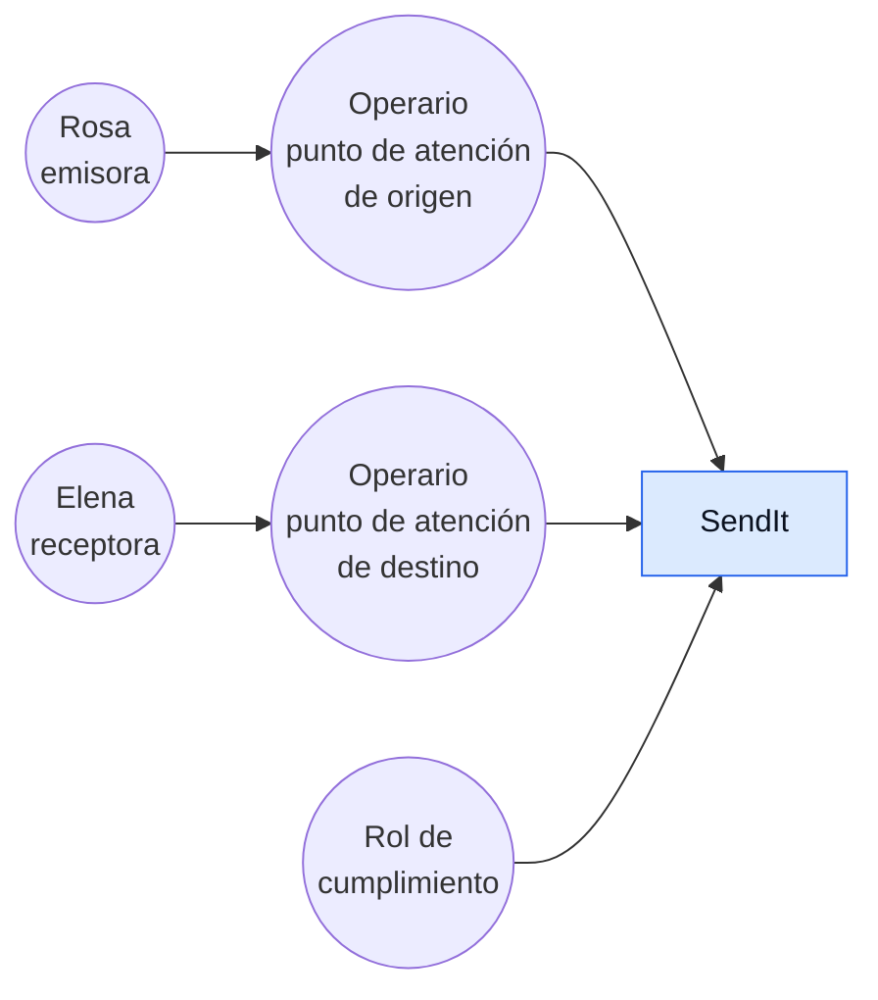
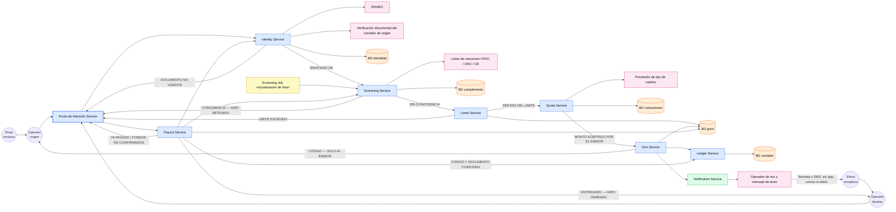
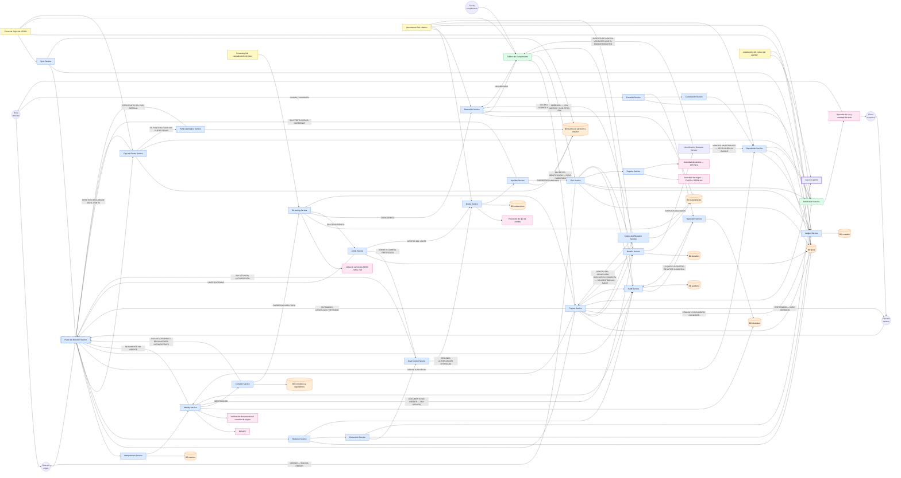

<div class="hoja portada">

<div class="marca">Universidad de Ingeniería y Tecnología · Departamento de Ciencias de la Computación<br/>Arquitectura de Software (CS5382) · Ciclo 2026-II</div>

# SendIt

## Arquitectura de un sistema de remesas internacionales

<div class="autores">Luis Maquera · Johar Barzola</div>

<div class="lede">

Una persona entrega billetes en una ventanilla de Paterson y otra cuenta billetes en una bodega de
Huanta, **sin que ninguna de las dos tenga cuenta bancaria**. Entre los dos momentos el dinero no es
de ninguna: está con SendIt, que lo debe. **Ese intervalo es todo el problema**, y el diseño entero
consiste en decidir qué pasa dentro de él.

</div>

<div class="cifras">
<div class="cifra"><b>236</b><span>ítems de backlog<br/>216 funcionales · 20 no funcionales</span></div>
<div class="cifra"><b>8,27</b><span>/ 10 en el EVAL<br/>19 rondas · umbral 8</span></div>
<div class="cifra"><b>13</b><span>servidores<br/>3,3 TB · 1,7 Mbit/s en pico</span></div>
<div class="cifra"><b>48</b><span>endpoints<br/>7 decisiones cerradas</span></div>
<div class="cifra"><b>37</b><span>entidades<br/>en 10 bases de datos</span></div>
<div class="cifra"><b>3</b><span>iteraciones del diagrama<br/>trazabilidad 236 / 236</span></div>
</div>

<div class="indice">

| | Hoja | |
|---|---|---|
| **1** | El caso y las tres personas | *el intervalo, y quién lo sufre* |
| **2** | `R` — el backlog de 236 ítems | *las siete tensiones, decididas* |
| **3** | El EVAL — 8,27 / 10 | *diecinueve rondas de una vara que no se movió* |
| **4** | `E` — estimar | *13 servidores, y por qué no los pide la carga* |
| **5** | `D` + `A` — servicio y datos | *arquitectura mixta, 10 bases, un secreto que no se lee* |
| **6** | `L` — las tres iteraciones | *el mismo diagrama, tres veces* |
| **7** | `L` — iteración 3 completa | *27 servicios, 10 bases, 7 terceros* |
| **8** | `E` — escalar | *los seis cuellos, en el orden en que llegan* |

</div>

<div class="pie">Documento completo, con la aritmética y las tablas: <code>docs/ENTREGA.pdf</code> · Repositorio: <code>github.com/LuisMUtec/SWA-LAB03-SendIt</code></div>

</div>

<div class="hoja">

# 1 · El caso y las tres personas

Una remesa no es una transferencia. El dinero cruza dos jurisdicciones con dos reguladores, cambia de
moneda a una tasa que se mueve mientras el envío viaja, y termina en efectivo en la mano de alguien
que no tiene cuenta ni teléfono con datos. **El último tramo no tiene pantalla:** lo ejecuta un
agente de una red de terceros, con su propio registro contable, sobre el que este diseño no manda.

Dos exigencias gobiernan el resultado. **Seguridad:** el efectivo se entrega a un desconocido en una
ventanilla ajena, y un control que corre *después* de aceptar el dinero ya no detiene nada —revierte—,
y revertir cruza la frontera. **Consistencia de datos:** un giro pagado dos veces no es un registro
sucio, es dinero perdido que no se recupera. A las dos se suma una tercera que nace de *«diferentes
países»*: el negocio es **multirregulador**, y un giro obedece a la vez al regulador de origen y al de
destino.

## Las tres personas

| Persona | Rol | Qué ancla | El modo de falla que solo ella ve |
|---|---|---|---|
| **Rosa Quispe** *— usuario modelo* | Remitente en Paterson, Nueva Jersey. Manda a Huanta USD 200–400 cada quincena | Que el envío llegue **por el monto y en la fecha prometidos** | La promesa de monto y fecha que nadie más está en posición de exigir |
| **Elena Quispe** | Destinataria en Huanta, 68 años. Cobra en efectivo en una bodega-agente. Sin datos, sin correo, sin cuenta. DNI vencido hace catorce meses | Que el último tramo, **el que no tiene pantalla**, también cierre | El envío que el sistema da por cerrado antes de que ella cuente los billetes |
| **Kevin Ramos** | Cajero del mostrador de un negocio afiliado. Paga con el efectivo **de su patrón**, no de SendIt | La seguridad — es **el vector, no el guardián** | La operación cortada a la mitad: la única que rompe la consistencia con dinero ya en la mano |

**Rosa es el usuario modelo** porque es quien decide usar SendIt o abandonarlo, quien paga, y la
única de los cinco actores del caso que elige libremente. Un backlog que resuelve el día de Kevin y
no el de Rosa **describe una red de agentes muy bien controlada y sin clientes**.

**Elegirla no la vuelve la única, y esa es la otra mitad de la decisión:** el problema de Rosa no se
resuelve dentro de la pantalla de Rosa. La promesa que ella necesita la cumple o la rompe Elena en la
bodega, y la sostiene o la pierde Kevin en el mostrador. Un diseño que solo mira su lado declara el
envío terminado cuando el dinero salió, que es exactamente el momento en que nada se resolvió.

## Las siete tensiones que el backlog tuvo que decidir

Son conflictos deliberados: un conjunto de requerimientos que deja conformes a las tres personas a la
vez probablemente **evitó decidir** alguno.

| | Tensión | Entre | Cómo quedó decidida |
|---|---|---|---|
| **T1** | Control ↔ rapidez | Rosa ↔ Kevin | A favor del control, **con precio acotado**: el tamizaje corre antes de aceptar el efectivo, y toda retención nace con plazo y se resuelve sola al vencerlo |
| **T2** | Explicación ↔ reserva | Rosa ↔ Kevin | El operario recibe **una salida que ofrecer, no la razón**, y esa salida no permite deducir el motivo. Rosa ve *que* está retenido y *hasta cuándo*, nunca por qué |
| **T3** | Identidad del receptor | Elena ↔ Kevin | El documento tiene que estar vigente; la única excepción es el **desafío** que el emisor acordó con el receptor. Qué cuenta como coincidencia lo decide el sistema, **no el operario** |
| **T4** | Certeza del monto ↔ exposición cambiaria | Rosa ↔ la empresa | A favor de Rosa: el monto de destino se fija al crear y no se recalcula. La empresa carga el movimiento |
| **T5** | El canal de Rosa ↔ el de Elena | Rosa ↔ Elena | El código llega **solo al emisor**; el mostrador no puede leerlo ni transcribirlo, y el sistema no lo reemite. Todo lo demás viaja por llamada o SMS a las dos puntas |
| **T6** | Cerrar ↔ cerrar de verdad | Rosa ↔ Elena | A favor de Elena: el giro cierra cuando el receptor recibe el dinero, no al fondearse ni al quedar disponible |
| **T7** | El código perdido | Rosa ↔ Elena | A favor del secreto, **con salida**: el código no se reemite nunca; el emisor cancela y **rehace** el giro conservando cotización y sin pagar comisión dos veces |

</div>

<div class="hoja">

# 2 · `R` — El backlog

**236 ítems: 216 funcionales y 20 no funcionales.** Cada uno es un título y nada más — sin
descripción, sin criterios de aceptación. Formato literal: *el sistema **[verbo en futuro]
[capacidad]** - `<Persona>`*, con el sufijo de persona cuando el ítem pertenece a alguien concreto.

<div class="dos-col">

<div>

### Reparto de prioridad

| | P0 | P1 | P2 | Total |
|---|---:|---:|---:|---:|
| Funcionales | 194 | 14 | 8 | **216** |
| No funcionales | 17 | 3 | 0 | **20** |
| | **211** | **17** | **8** | **236** |

### Un título cubre un paso solo si pasa tres pruebas

1. **Nombra un hecho, no un área.** *«Gestión de tipo de cambio»* no pasa: un sistema que no hace nada de eso también podría llevar ese título.
2. **Es negable.** *«Seguridad de extremo a extremo»* no pasa: ningún sistema lo incumple y ninguno lo cumple.
3. **Admite una sola lectura.**

Un título que falla las dos primeras es un **comodín**, y cuenta como paso **no cubierto** — porque
un comodín no es cobertura débil: es ausencia de cobertura con apariencia de presencia, y **nadie va
a buscar el requerimiento que falta**.

</div>

<div>

### Disciplina de alcance

**Cada título nuevo muere en una transferencia doméstica entre dos cuentas de banco en la misma
moneda, o lleva escrito por qué no.** Es la regla que impide que el backlog crezca hacia el «enviar
plata» genérico mientras aparenta crecer hacia la remesa.

### La ambigüedad se marca, nunca se rellena en silencio

`[CLARIFY: …]` cuando la respuesta determina el contenido · `[ASSUMPTION: …]` cuando se avanza bajo
una hipótesis declarada. **Diecisiete reglas de negocio** gobiernan el caso y cada ítem cita la que
ejerce.

</div>

</div>

### Ocho títulos, para ver la forma

| ID | Título | Regla |
|---|---|---|
| `RF-01` | el sistema identificará al emisor contra un documento oficial vigente antes de recibir su efectivo - Rosa | BR-03 |
| `RF-79` | el sistema dará el giro por creado en el momento en que registra la recepción del efectivo - Kevin | BR-03 |
| `RF-06` | el sistema conservará sin recalcularlo, durante toda la vida del giro, el monto en moneda destino que informó al emisor - Rosa | BR-07 |
| `RF-11` | el sistema entregará el código de seguimiento únicamente al emisor - Rosa | BR-08 |
| `RF-26` | el sistema contrastará a emisor y receptor contra las listas de sanciones antes de aceptar el efectivo - Rosa | BR-06 |
| `RF-114` | el sistema comprobará la respuesta del desafío sin mostrarla ni al mostrador ni a la infraestructura - Elena | BR-09 |
| `RF-225` | el sistema resolverá con un segundo rol, y no con el criterio del operario, la duda sobre si la fotografía del documento corresponde al emisor - Kevin | BR-03 |
| `RNF-05` | el sistema no pagará un giro dos veces, en ningún punto y en ningún momento | BR-10 |

<div class="nota">

**La regla de dirección que mantiene alineados los seis pasos: los requerimientos bajan, nunca
suben.** Si `D` diseña un endpoint que responde algo que ningún título exige, o `A` guarda un campo
que ningún título obliga a conocer, **el defecto es del backlog**: la corrección va arriba —se agrega
el título y se vuelve a puntuar—, nunca abajo.

</div>

</div>

<div class="hoja">

# 3 · El EVAL

<div class="hero">
<div class="hero-num">8,2669<span>/ 10</span></div>
<div class="hero-txt">

**Alcanzado en la ronda 19, y con margen: para caerse habrían tenido que omitirse trece hallazgos,
contra uno en la ronda 17.** Diecinueve rondas movieron el backlog de **41 a 236 ítems** y el puntaje
de **3,5 a 8,27**, con dos regresiones reales y **ninguna corrección de la vara**.

</div>
</div>

### Puntaje total por ronda

<div class="fig">
<svg viewBox="0 0 760 210" width="760" height="210" role="img" xmlns="http://www.w3.org/2000/svg" aria-label="Puntaje total del EVAL por ronda, de 3,50 en la ronda 01 a 8,27 en la ronda 19, con el umbral en 8">
<title>Puntaje del EVAL por ronda</title>
<line x1="56.0" y1="188.0" x2="700.0" y2="188.0" stroke="#e1e0d9" stroke-width="1"/>
<text x="48" y="191.0" text-anchor="end" font-size="8" fill="#898781" style="font-variant-numeric:tabular-nums">0</text>
<line x1="56.0" y1="153.2" x2="700.0" y2="153.2" stroke="#e1e0d9" stroke-width="1"/>
<text x="48" y="156.2" text-anchor="end" font-size="8" fill="#898781" style="font-variant-numeric:tabular-nums">2</text>
<line x1="56.0" y1="118.4" x2="700.0" y2="118.4" stroke="#e1e0d9" stroke-width="1"/>
<text x="48" y="121.4" text-anchor="end" font-size="8" fill="#898781" style="font-variant-numeric:tabular-nums">4</text>
<line x1="56.0" y1="83.6" x2="700.0" y2="83.6" stroke="#e1e0d9" stroke-width="1"/>
<text x="48" y="86.6" text-anchor="end" font-size="8" fill="#898781" style="font-variant-numeric:tabular-nums">6</text>
<line x1="56.0" y1="14.0" x2="700.0" y2="14.0" stroke="#e1e0d9" stroke-width="1"/>
<text x="48" y="17.0" text-anchor="end" font-size="8" fill="#898781" style="font-variant-numeric:tabular-nums">10</text>
<line x1="56.0" y1="48.8" x2="700.0" y2="48.8" stroke="#898781" stroke-width="1" stroke-dasharray="5 3"/>
<text x="48" y="51.8" text-anchor="end" font-size="8" fill="#898781" style="font-variant-numeric:tabular-nums">8</text>
<text x="61.0" y="44.8" font-size="8" fill="#898781">umbral 8,0</text>
<line x1="56.0" y1="188.0" x2="700.0" y2="188.0" stroke="#c3c2b7" stroke-width="1"/>
<polyline points="56.0,127.1 91.8,118.4 127.6,101.0 163.3,83.6 199.1,74.9 234.9,92.3 270.7,83.6 306.4,64.1 342.2,74.9 378.0,74.2 413.8,73.0 449.6,60.3 485.3,54.7 521.1,53.2 556.9,53.5 592.7,54.0 628.4,48.8 664.2,54.5 700.0,44.1" fill="none" stroke="#2a78d6" stroke-width="2" stroke-linejoin="round" stroke-linecap="round"/>
<circle cx="56.0" cy="127.1" r="4" fill="#2a78d6" stroke="#ffffff" stroke-width="1.5"/>
<circle cx="91.8" cy="118.4" r="2.6" fill="#2a78d6" stroke="#ffffff" stroke-width="1.5"/>
<circle cx="127.6" cy="101.0" r="2.6" fill="#2a78d6" stroke="#ffffff" stroke-width="1.5"/>
<circle cx="163.3" cy="83.6" r="2.6" fill="#2a78d6" stroke="#ffffff" stroke-width="1.5"/>
<circle cx="199.1" cy="74.9" r="2.6" fill="#2a78d6" stroke="#ffffff" stroke-width="1.5"/>
<circle cx="234.9" cy="92.3" r="4" fill="#2a78d6" stroke="#ffffff" stroke-width="1.5"/>
<circle cx="270.7" cy="83.6" r="2.6" fill="#2a78d6" stroke="#ffffff" stroke-width="1.5"/>
<circle cx="306.4" cy="64.1" r="2.6" fill="#2a78d6" stroke="#ffffff" stroke-width="1.5"/>
<circle cx="342.2" cy="74.9" r="2.6" fill="#2a78d6" stroke="#ffffff" stroke-width="1.5"/>
<circle cx="378.0" cy="74.2" r="2.6" fill="#2a78d6" stroke="#ffffff" stroke-width="1.5"/>
<circle cx="413.8" cy="73.0" r="2.6" fill="#2a78d6" stroke="#ffffff" stroke-width="1.5"/>
<circle cx="449.6" cy="60.3" r="2.6" fill="#2a78d6" stroke="#ffffff" stroke-width="1.5"/>
<circle cx="485.3" cy="54.7" r="2.6" fill="#2a78d6" stroke="#ffffff" stroke-width="1.5"/>
<circle cx="521.1" cy="53.2" r="2.6" fill="#2a78d6" stroke="#ffffff" stroke-width="1.5"/>
<circle cx="556.9" cy="53.5" r="2.6" fill="#2a78d6" stroke="#ffffff" stroke-width="1.5"/>
<circle cx="592.7" cy="54.0" r="2.6" fill="#2a78d6" stroke="#ffffff" stroke-width="1.5"/>
<circle cx="628.4" cy="48.8" r="4" fill="#2a78d6" stroke="#ffffff" stroke-width="1.5"/>
<circle cx="664.2" cy="54.5" r="2.6" fill="#2a78d6" stroke="#ffffff" stroke-width="1.5"/>
<circle cx="700.0" cy="44.1" r="4" fill="#2a78d6" stroke="#ffffff" stroke-width="1.5"/>
<text x="56.0" y="118.1" text-anchor="start" font-size="9.5" font-weight="400" fill="#0b0b0b">3,50</text>
<text x="234.9" y="107.3" text-anchor="middle" font-size="9.5" font-weight="400" fill="#0b0b0b">5,50</text>
<text x="628.4" y="38.8" text-anchor="middle" font-size="9.5" font-weight="400" fill="#0b0b0b">8,00</text>
<text x="700.0" y="33.1" text-anchor="middle" font-size="9.5" font-weight="700" fill="#0b0b0b">8,27</text>
<text x="56.0" y="203" text-anchor="middle" font-size="7.5" fill="#898781" style="font-variant-numeric:tabular-nums">01</text>
<text x="91.8" y="203" text-anchor="middle" font-size="7.5" fill="#898781" style="font-variant-numeric:tabular-nums">02</text>
<text x="127.6" y="203" text-anchor="middle" font-size="7.5" fill="#898781" style="font-variant-numeric:tabular-nums">03</text>
<text x="163.3" y="203" text-anchor="middle" font-size="7.5" fill="#898781" style="font-variant-numeric:tabular-nums">04</text>
<text x="199.1" y="203" text-anchor="middle" font-size="7.5" fill="#898781" style="font-variant-numeric:tabular-nums">05</text>
<text x="234.9" y="203" text-anchor="middle" font-size="7.5" fill="#898781" style="font-variant-numeric:tabular-nums">06</text>
<text x="270.7" y="203" text-anchor="middle" font-size="7.5" fill="#898781" style="font-variant-numeric:tabular-nums">07</text>
<text x="306.4" y="203" text-anchor="middle" font-size="7.5" fill="#898781" style="font-variant-numeric:tabular-nums">08</text>
<text x="342.2" y="203" text-anchor="middle" font-size="7.5" fill="#898781" style="font-variant-numeric:tabular-nums">09</text>
<text x="378.0" y="203" text-anchor="middle" font-size="7.5" fill="#898781" style="font-variant-numeric:tabular-nums">10</text>
<text x="413.8" y="203" text-anchor="middle" font-size="7.5" fill="#898781" style="font-variant-numeric:tabular-nums">11</text>
<text x="449.6" y="203" text-anchor="middle" font-size="7.5" fill="#898781" style="font-variant-numeric:tabular-nums">12</text>
<text x="485.3" y="203" text-anchor="middle" font-size="7.5" fill="#898781" style="font-variant-numeric:tabular-nums">13</text>
<text x="521.1" y="203" text-anchor="middle" font-size="7.5" fill="#898781" style="font-variant-numeric:tabular-nums">14</text>
<text x="556.9" y="203" text-anchor="middle" font-size="7.5" fill="#898781" style="font-variant-numeric:tabular-nums">15</text>
<text x="592.7" y="203" text-anchor="middle" font-size="7.5" fill="#898781" style="font-variant-numeric:tabular-nums">16</text>
<text x="628.4" y="203" text-anchor="middle" font-size="7.5" fill="#898781" style="font-variant-numeric:tabular-nums">17</text>
<text x="664.2" y="203" text-anchor="middle" font-size="7.5" fill="#898781" style="font-variant-numeric:tabular-nums">18</text>
<text x="700.0" y="203" text-anchor="middle" font-size="7.5" fill="#898781" style="font-variant-numeric:tabular-nums">19</text>
</svg>
</div>

<div class="dos-col">

<div>

### La rúbrica

| Dim | Pts | Qué mide | Quién juzga |
|---|---:|---|---|
| **D1** | 3 | El flujo de las tres personas corre de extremo a extremo, **incluido cuando sale mal**. 1 pt por persona, **solo deducciones** | Las personas |
| **D2** | 3 | Ataca **la remesa internacional** y no un «enviar plata» genérico, contra un censo | Agregador |
| **D3** | 2 | Seguridad y consistencia **con medida o invariante, no como adjetivo** | Agregador |
| **D4** | 2 | Sin huérfanos ni duplicados, títulos atómicos, tensiones decididas. `D4 = 2 − 0,25n` | Agregador |

**Umbral: ≥ 8 / 10.** Un puntaje por debajo **no baja la vara: se corrige el backlog y se vuelve a
evaluar.**

</div>

<div>

### El aparato

**Tres agentes de persona, cada uno con una sola voz y una sola capacidad: restar.** Leen exactamente
dos archivos —el suyo y el backlog—: ni las otras personas, ni los veredictos ajenos, ni el
historial. Un cuarto agente, el **agregador**, no tiene persona: ve el conjunto y puntúa D2, D3 y D4.

**Solo pueden restar de D1, nunca sumar.** Si pudieran sumar, una lectura entusiasta compraría puntos
que ninguna otra lectura está en condiciones de contestar. Restringidos a restar, solo aportan la
evidencia que **nadie más puede producir**: *acá se me corta el día*.

**Medir y corregir no ocurren a la vez** —quien corrige conoce la vara—, y **ni la rúbrica ni las
personas se editan para elevar el puntaje. Son la vara.**

</div>

</div>

### Las diecinueve rondas

<div class="tabla-mini">

| Ronda | 01 | 02 | 03 | 04 | 05 | 06 | 07 | 08 | 09 | 10 | 11 | 12 | 13 | 14 | 15 | 16 | 17 | 18 | 19 |
|---|---:|---:|---:|---:|---:|---:|---:|---:|---:|---:|---:|---:|---:|---:|---:|---:|---:|---:|---:|
| **D1** /3 | 1,0 | 0,5 | 1,0 | 1,5 | 1,5 | 1,5 | 1,0 | 1,5 | 1,0 | 1,5 | 1,5 | 1,5 | 1,5 | 1,5 | 1,5 | 1,5 | 1,5 | 1,5 | 1,5 |
| **D2** /3 | 1,5 | 2,5 | 2,5 | 3,0 | 3,0 | 3,0 | 3,0 | 3,0 | 3,0 | 3,0 | 3,0 | 3,0 | 3,0 | 3,0 | 3,0 | 3,0 | 3,0 | 3,0 | 3,0 |
| **D3** /2 | 1,0 | 1,0 | 1,5 | 1,5 | 2,0 | 1,0 | 2,0 | 1,5 | 1,5 | 1,5 | 1,5 | 1,5 | 1,5 | 1,5 | 1,5 | 1,5 | 2,0 | 1,5 | 2,0 |
| **D4** /2 | 0,0 | 0,0 | 0,0 | 0,0 | 0,0 | 0,0 | 0,0 | 1,12 | 1,00 | 0,54 | 0,61 | 1,34 | 1,66 | 1,75 | 1,73 | 1,70 | 1,50 | 1,67 | 1,77 |
| **Total** | 3,50 | 4,00 | 5,00 | 6,00 | 6,50 | 5,50 | 6,00 | 7,12 | 6,50 | 6,54 | 6,61 | 7,34 | 7,66 | 7,75 | 7,73 | 7,70 | **8,00** | 7,67 | **8,27** |
| **Ítems** | 41 | 69 | 81 | 97 | 110 | 119 | 118 | 137 | 137 | 137 | 155 | 175 | 192 | 200 | 207 | 216 | 222 | 227 | 236 |

</div>

<div class="nota">

**El umbral se cruzó dos veces y la diferencia importa.** La ronda 17 lo cruzó por `0,0045`, dentro
de la resolución del instrumento. La 18 lo perdió por un título nuevo que reemitía el código —**lo
reportó Rosa contra su propia conveniencia**—. La 19 lo recuperó con margen y respondió la pregunta
con aritmética: **el umbral se alcanza si y solo si `D3` = 2,0. `D4` no lo decide y nunca lo
decidió.**

</div>

</div>

<div class="hoja">

# 4 · `E` — Estimar

<div class="cifras tres">
<div class="cifra"><b>13</b><span>servidores</span></div>
<div class="cifra"><b>3,3 TB</b><span>retenidos · 375 GB calientes</span></div>
<div class="cifra"><b>1,7 Mbit/s</b><span>en pico · 209 KB/s</span></div>
</div>

<div class="nota destacada">

**El hallazgo, antes que las cifras: la carga de SendIt pide `0,15` servidores.** Lo que pide trece
es la disponibilidad de `RNF-11` y la geografía de los dos corredores. Este sistema no se rompe por
CPU: se rompe por **la cuota del canal de voz y SMS** y por **el efectivo de la caja del punto**, y
ninguna de las dos se arregla comprando máquinas.

</div>

## Las entradas — y por qué no son «usuarios registrados»

**SendIt no tiene cuenta ni sesión.** El emisor se identifica presencialmente contra un documento
vigente **cada vez** que crea un giro, y lo que recibe es un código de seguimiento, no una
credencial. No hay padrón que contar ni login que medir.

| Entrada | Valor | De dónde sale |
|---|---:|---|
| **Giros por día** | **2 800** | `0,5 %` de `USD 61 300 M/año` de los dos corredores ÷ `USD 300` de ticket ÷ 365 |
| **Operaciones de ventanilla por día** | **5 900** | `2,11` ventanillas por giro — crear, pagar, autorizar, corregir, devolver, declarar, rederivar |
| **Aperturas y cierres de caja** | **9 000** | `3 000 puntos × 1,5 turnos × 2`. **No depende de los giros:** un día sin un solo giro escribe las 9 000 |
| **Avisos de voz y SMS por día** | **22 467** | `8,02` unidades por giro, por 24 requerimientos. Se pagan **por unidad**, no por byte |
| **Factor de pico `P`** | **11** | `3,0` (fecha señalada) `× 3,6` (hora del día), ventana de una hora |
| RPS | **1,53** promedio · **16,9** en pico | `132 564 requests/día ÷ 86 400 s`, `× 11` |

## Los tres cálculos

| | Método | Resultado |
|---|---|---|
| **Servidores** | `carga / capacidad` en dos columnas —escritura contable a 5 req/s por core, lectura a 50—, y después `max(carga; piso)` | `11,70 / 80 = 0,146` escritura · `5,18 / 800 = 0,006` lectura → **`0,15`**. El piso de disponibilidad y geografía pide **13**: 3 de escritura con quórum, 4 de réplica (dos por país), 2 de consulta, 2 de cumplimiento, 2 del módulo del desafío |
| **Almacenamiento** | espacio por tipo de dato × volumen diario **× los años de retención** | `366,9 KB` por giro —el binario de identidad es el **83 %**— → `1,03 GB/día` → `× 365 × 8,7 años` = **3,2 TB**. La retención se pondera: 5 años en el corredor peruano, 10 en el mexicano |
| **Ancho de banda** | entrada + salida por día ÷ 86 400 s, y después × `P` | `1,20 GB/día` de entrada y `0,35` de salida → `(14,2 + 4,8) KB/s × 11 = ` **209 KB/s ≈ 1,7 Mbit/s** |

<div class="dos-col">

<div>

### La asimetría se invierte

En el ejemplo de YouTube la salida aplasta a la entrada: se sube un vídeo y se descarga cien millones
de veces —`769×` a favor de la salida—. En SendIt el binario pesado —el documento de identidad—
**entra** y casi nunca sale, y entra **dos veces por giro**: `3,4×` a favor de la **entrada**.

</div>

<div>

### Detenerse en el diario habría dicho 1 GB

En vez de `3 200 GB`. Son los dos órdenes de magnitud que aporta el paso que un caso no regulado no
tiene: **multiplicar por los años de retención**. Y el `88,5 %` del total es archivo — dato que hay
que conservar y casi nunca leer.

</div>

</div>

<div class="nota">

**La comprobación que este cálculo se exigió a sí mismo.** El volumen se calibra *bottom-up*:
`2 800` giros diarios repartidos en 3 000 puntos son **menos de un giro por punto y por día**. Una
red ancha y flojamente cargada es exactamente la forma del modelo. Si el contraste hubiera dado cien
giros por punto y día, uno de los dos supuestos estaría roto.

</div>

</div>

<div class="hoja">

# 5 · `D` + `A` — El servicio y los datos

## Arquitectura: mixta — núcleo monolítico + servicios en la frontera

Un monolito 3-tier metería en el mismo proceso **cinco terceros que fallan por su cuenta**. Partirlo
entero en servicios **partiría el libro contable**: `RNF-07` dejaría de ser una transacción para
volverse un protocolo, y el doble pago que `RNF-05` prohíbe dependería de una compensación en vez de
una restricción.

| Unidad de despliegue | Qué contiene | Por qué está separada |
|---|---|---|
| **Núcleo transaccional** *(un despliegue, una base)* | Libro contable, giro y estado, límites, acumulados, cotización, idempotencia, doble control, retención, devolución, prescripción, caja | **No se separa, y esa es la decisión:** todo lo que entra en la misma transacción que el asiento vive acá |
| **Adaptadores de frontera** *(uno por tercero)* | Documento, listas de sanciones, cotización, reporte a la autoridad, canal de voz y SMS | Cada uno falla, tarda o miente por su cuenta, y ninguno puede arrastrar el pago |
| **Servicio de desafío** *(proceso, base y credenciales propias)* | Pregunta, respuesta derivada, contador de intentos, comparación | `RNF-17` exige que el valor sea inalcanzable **para quien administra la infraestructura** |
| **Punto de atención** *(una instancia por mostrador)* | Cliente de ventanilla, diario local de actos, catálogos de solo lectura | Está en una plaza de Huanta y **pierde la conexión**: eso es explícito en el diseño, no un accidente de red |

**Ninguna regla de negocio vive en presentación.** Lo que Kevin ve o no ve lo decide la capa de
lógica; si viviera en la pantalla, un cliente modificado en un mostrador afiliado la anularía — y el
mostrador afiliado es precisamente el vector.

<div class="dos-col">

<div>

## La API — 48 endpoints

**38 `POST` y 10 `GET`.** Cada fila lleva tres columnas que no
son documentación: **quién la usa** —una ruta sin llamador identificado es una superficie de ataque
sin dueño—, **qué garantiza** ante el reintento, y **a qué ítem traza**.

**Idempotencia:** el llamador envía `Idempotency-Key`, el servidor la persiste **antes** del primer
asiento, y el reintento devuelve la misma respuesta sin ejecutar nada. **30 rutas la declaran**, y
una deliberadamente **no**: cada envío de respuesta al desafío *es* un intento.

</div>

<div>

## El modelo — 37 entidades en 10 bases

`BD identidad` · `giros` · `cumplimiento` · `cotizaciones` · `contable` · `intentos` · `corredores y
reguladores` · `puntos de atención y efectivo` · `auditoría` · `desafíos`.

**Nadie se identifica por su documento.** Toda persona entra al modelo por un **seudónimo estable y
opaco**, y es ese seudónimo el que viaja al asiento, a la traza y a los acumulados. De ahí dependen
tres cosas: borrar a una persona sin destruir el asiento que hay que conservar, que la unicidad de
identidades sea comprobable en vez de una comparación de cadenas, y que los límites se cuenten sobre
el emisor y no sobre el mostrador que lo atendió.

</div>

</div>

| El dato | Motor | Y la restricción que lo obliga |
|---|---|---|
| Registro contable del dinero | **SQL relacional, solo-adición** | `SUM(debe) − SUM(haber) = 0` por asiento, sin `UPDATE` ni `DELETE` concedidos: `RNF-07` escrito como *constraint*, no como intención |
| Giro y su estado | **SQL, misma base y transacción que el asiento** | Escribirlo en otra base **fabrica** la posibilidad de dos afirmaciones incompatibles. Cuando difieren, manda el libro |
| Código de seguimiento | **SQL, y no el valor: su derivado con sal** | Se muestra una sola vez. *No reemitir* deja de ser una política que alguien puede saltarse: **el sistema ya no lo puede reconstruir** |
| Binarios de identidad | **Objetos, cifrados con llave por giro** | Volumen alto, lectura rarísima, retención larga. La fila guarda puntero y huella, nunca el binario |
| Traza de auditoría | **SQL solo-inserción, encadenada por huella** | El encadenamiento hace que borrar una fila del medio sea **detectable**, no solo prohibido |

<div class="nota destacada">

**Ninguna base guarda a la vez el secreto y el dato que el secreto protege.** El código vive en
`BD giros` como verificador y su llave no; la respuesta del desafío vive en `BD desafíos` y ni
siquiera comparte administrador; el documento vive cifrado y su llave está fuera del motor. **Un
administrador con acceso total a cualquiera de las diez bases no reconstruye ninguno de los tres.**

</div>

</div>

<div class="hoja">

# 6 · `L` — Las tres iteraciones

**El mismo diagrama, dibujado tres veces, cada vez más abierto.** La regla que las gobierna, y que
decide si el trabajo es honesto: **no se dibuja el diagrama final y después se inventan las
iteraciones previas.** La primera es un cuadrado. Lo que fuerza la segunda es un ítem del backlog que
el cuadrado no explica, y lo mismo la tercera. **El diagrama deja de crecer cuando el backlog está
cubierto**, no cuando «ya se ve completo».

### Iteración 1 — la caja única

Lo único que afirma: **quién habla con el sistema.**



**Las dos puntas pasan por una ventanilla, y por eso ni Rosa ni Elena tocan la caja.** Dibujarlas
conectadas directamente es cómodo y falso: la corrección de esa arista es todo lo que esta pasada
decide. **Queda `DONE` un solo ítem** —que el código sea únicamente del emisor—, y se demuestra con
**la ausencia de una arista**, no con una regla escrita adentro de una caja.

> **Qué fuerza la iteración 2:** contrastar a emisor y receptor contra las listas de sanciones
> **antes** de aceptar el efectivo. **Un cuadrado no tiene «antes».**

### Iteración 2 — la caja se abre en servicios

Cubre el camino que va desde que Rosa entrega el efectivo hasta que Elena lo cobra, **con su rama de
rechazo**: identificación, tamizaje, límites, cotización, creación del giro y pago.



> **Qué fuerza la iteración 3:** todo el backlog que este camino no toca — la retención y su
> liberación, la devolución, la cancelación, la prescripción, la caja del punto, el reclamo, la
> supresión, la corrección de un giro pagado, la sincronización del mostrador sin línea y el reporte
> a las dos autoridades.

</div>

<div class="hoja apaisada">

# 7 · `L` — Iteración 3

**El diagrama deja de crecer acá porque el backlog quedó cubierto: 236 / 236.** **Azul**, servicios propios ·
**verde**, soporte · **rosado**, terceros · **amarillo**, batch · **naranja**, bases. **Borde punteado**: propio
en el mando y **cortable en la conexión**. **Borde grueso**: propio en el mando y **ajeno en la contabilidad**.



<div class="inventario">

**5** actores · **27** servicios propios · **2** de soporte · **4** procesos batch · **7** sistemas
externos · **10** bases de datos · **1** cuenta contable ajena dibujada

</div>

</div>

<div class="hoja ultima">

# 8 · `E` — Escalar

## Los cinco tramos, y dónde cae SendIt

`42 500` emisores distintos al mes para los `2 800` giros diarios del lanzamiento: **SendIt no
arranca en el primer tramo, arranca en el tercero.** La arquitectura de «un servidor y una base» no
es la de este sistema ni el día uno.

<div class="tramos">
<div class="tramo"><b>&lt; 1 K</b><span>1 servidor + 1 DB</span><em>SendIt no vive acá</em></div>
<div class="tramo"><b>1 K – 10 K</b><span>LB + app servers + réplica</span><em>la DB no es el cuello en ningún tramo</em></div>
<div class="tramo activo"><b>10 K – 100 K</b><span>caché + CDN</span><em>acá arranca SendIt</em></div>
<div class="tramo"><b>100 K – 1 M</b><span>sharding + regiones</span><em>el tramo real, por escritura</em></div>
<div class="tramo"><b>&gt; 1 M</b><span>microservicios + eventos</span><em>no se alcanza con arquitectura</em></div>
</div>

**Y la caché no aplica al dato caliente.** `RNF-05` y `RNF-07` exigen leer el estado del giro **del
libro**: lo cacheable son catálogos. Cachear es servir un dato que puede estar viejo, y el estado del
giro, el saldo de caja y el efectivo del corredor son exactamente los que no lo toleran.

<div class="nota destacada">

## El hallazgo: el sistema nace pasado su primer cuello

```
Avisos por giro ...........................................  8,02
Pico del día señalado .....................................  3,0×
Unidades por giro el día señalado .........................  24,1

Cuota del operador: 10 000/día por país × 2 países ........  20 000
Techo del tramo:   20 000 ÷ 24,1 = .......................     831 giros/día
Volumen de llegada estimado ..............................   2 800 giros/día
```

**`831 < 2 800`: el sistema arranca ya pasado su primer cuello, y por un factor de 3,4.** Y no hay
plan B, porque **el plan B es la persona**: Elena no tiene aplicación ni datos móviles, así que un
aviso no entregado **no degrada, desaparece**. El sistema se ve sano en todas sus métricas —el giro
está creado, fondeado y disponible— y nadie lo cobra.

</div>

## El orden en que este sistema se rompe

Ordenados **por el tramo en el que caen, no por gravedad**. Cinco de los seis son de personas, de
tesorería, de contrato o de un tercero.

| | Cuello | Cae en | Se responde con |
|---|---|---|---|
| **1** | La cuota del operador de telefonía | **`831` giros/día — a un tercio del volumen de llegada** | Un contrato, no una máquina |
| **2** | El mostrador sin línea | `< 1 K`, con los 3 000 puntos desde el día uno | Un segundo camino de conectividad, o **aceptar la indisponibilidad por escrito** |
| **3** | El plano único de escritura | `19 100` giros/día | Particionar el libro **por giro** — y asumir lo que queda a caballo |
| **4** | La caja por punto de atención | `93 750` giros/día | Tesorería del agente, y el punto alternativo como **balanceo**, no como excepción |
| **5** | Decidir dentro del plazo de la retención | `100 K`, creciendo **más rápido** que el volumen | Personas — o achicar el caudal, que es un ítem de `R`, no una caja |
| **6** | Los roles distintos por punto y turno | `500 K`, con la red ya ensanchada | Más personas **distintas y simultáneas**, que no es lo mismo que más horas |

**El cuello número 3 es el único de los seis que un servidor arregla, y es el tercero en llegar.**

<div class="nota">

**El candidato obvio era falso.** Se esperaba que el primer cuello fuera la cola de casos de
cumplimiento. **Toda retención nace con plazo y la que vence sin liberarse se resuelve sola**,
devolviendo el monto: la cola no es un acumulado, es un caudal con residencia acotada. Lo que satura
**no se apila** — se manifiesta como tasa de devolución automática. Rosa recupera su dinero, Elena no
cobra, **y el libro queda perfecto.**

</div>

</div>
