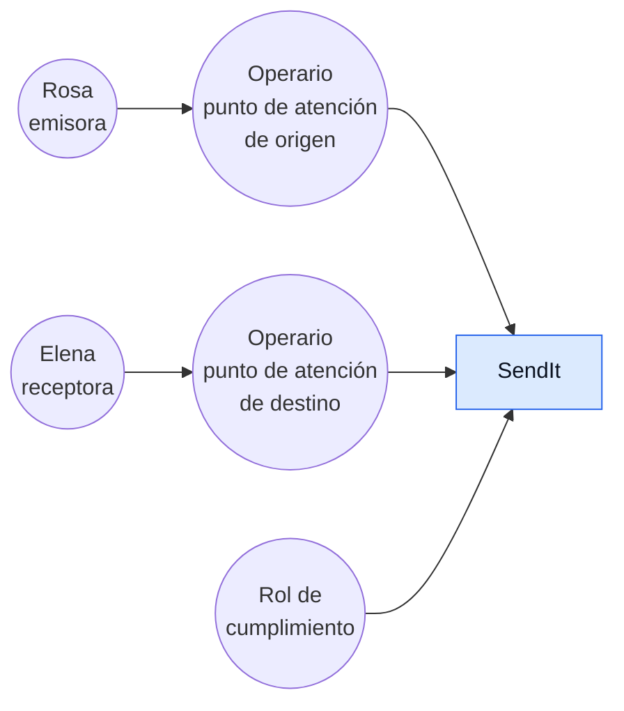
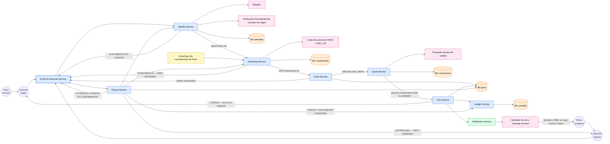
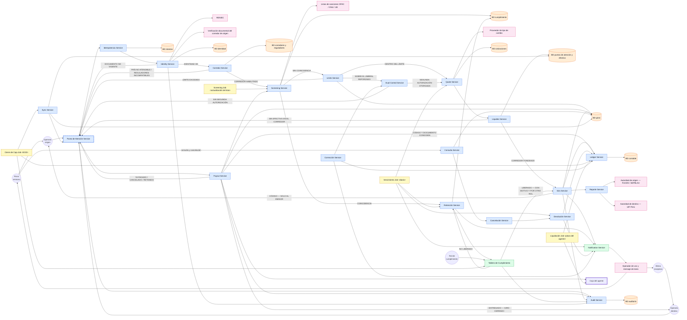

# L — Listar los componentes

> Paso 5 de [R.E.D.A.L.E.](../README.md) · anterior:
> [**A** — Armar el modelo de datos](../A-armar-modelo-datos/README.md) · siguiente:
> [**E** — Escalar](../E-escalar/README.md) · bitácora: [`ITERACIONES.md`](../ITERACIONES.md)

**Estado: tres iteraciones dibujadas y trazabilidad completa.** Las 81 filas del backlog —67 `RF` y
14 `RNF`— tienen componente e iteración. Lo que queda abierto está marcado como abierto y no como
hecho.

Diagramar la arquitectura con todo lo mapeado en los pasos previos. **Este es el paso donde el
enunciado exige «mostrar claramente las iteraciones de su diseño»**, y el ejemplo que el profesor
mostró en clase define qué significa eso: el **mismo diagrama, dibujado tres veces, cada vez más
abierto**. Transcripción completa en
[`EJEMPLO-CLASE-TOP-DOWN.md`](../../docs/EJEMPLO-CLASE-TOP-DOWN.md); la lectura queda fijada en
[D-05](../../docs/DECISIONES.md#d-05--las-iteraciones-del-diseño-son-iteraciones-del-diagrama-de-componentes).

El vocabulario es el del backlog y no se traduce: **giro**, **emisor**, **receptor**, **punto de
atención**, **operario**. Un componente que dice «envío» o «remitente» está nombrando otra cosa.

---

## Contrato con los pasos vecinos

| | |
|---|---|
| **Consume de R** | El backlog completo. Es lo que **gobierna** las iteraciones: una pasada del diagrama existe porque hay un ítem sin `DONE` |
| **Consume de D** | Los servicios, las fronteras con terceros y la frontera interna con el punto de atención. Las cajas de la iteración 2 son los servicios que `D` nombró |
| **Consume de A** | Las bases de datos. **Son varias, no una**: cada grupo de servicios tiene la suya, y cuál es cuál lo decidió `A` |
| **Consume de E** (estimar) | Solo para saber si un componente necesita estar separado por volumen. La estimación no dibuja cajas |
| **Entrega a E** (escalar) | El diagrama base sobre el que se pregunta qué se rompe primero cuando la carga sube |
| **Queda inválido si R cambia** | La tabla de trazabilidad, y con ella la justificación de cada iteración. Un ítem nuevo del backlog **fuerza una pasada más** del diagrama |
| **Queda inválido si D o A cambian** | La caja o la `BD` afectada, en las tres iteraciones donde aparezca. Un componente renombrado en la iteración 3 y no en la 2 es una contradicción visible |

---

## Qué muestra el diagrama y qué no

| Muestra | No muestra |
|---|---|
| Los componentes y sus relaciones | Cómo está implementado cada uno |
| Los actores, fuera del sistema | Pantallas, rutas de navegación, texto de interfaz |
| Las bases de datos, una por grupo de servicios | Esquemas, tablas ni campos — eso es [`A`](../A-armar-modelo-datos/README.md) |
| Los sistemas de terceros, marcados como externos | Versiones, proveedores concretos ni topología de despliegue |
| La etiqueta de cada rama condicional | Números de rendimiento — eso es [`E`](../E-estimar/README.md) |

El ejemplo de clase es literal en esto: sus cajas dicen `Login Service`, `Validation Service`,
`BD` — no dicen con qué se construyeron ni dónde corren.

## Convenciones del repositorio

Heredadas del ejemplo de clase y adoptadas aquí sin cambios.

| Elemento | Regla |
|---|---|
| **Servicio** | `<Nombre> Service` |
| **Proceso batch** | `<Nombre> Job <momento>` — p. ej. `<EOD>` para fin de día |
| **Base de datos** | `BD <de qué>`, en elipse. **Varias, no una** (en Mermaid, el cilindro `[(…)]`) |
| **Sistema externo** | Su nombre real, sin eufemismo |
| **Actor** | Círculo con etiqueta, fuera del sistema |
| **Rama condicional** | La arista lleva su etiqueta: `TODO OK`, `Validation Failed`, `OK`, `NO LOAN` |

**Código de color** — y hace un trabajo real, no decorativo: **el rosado marca dónde termina el
mando.** Todo lo rosado puede fallar, tardar o mentir sin que el diseño pueda impedirlo.

| Color | Qué agrupa | Clase en Mermaid |
|---|---|---|
| Azul | Servicios propios | `propio` |
| Verde | Soporte y notificación | `soporte` |
| Rosado | Terceros, fuera de la frontera de confianza | `externo` |
| Amarillo | Procesos batch y servicios secundarios | `batch` |
| Naranja (elipse) | Bases de datos | `bd` |

**El color no alcanza, y la categoría que faltaba queda resuelta acá.** El andamiaje anterior dejó
abierta una categoría —«propio pero incomunicable»— y `RF-24` mostró que hacían falta **dos** marcas
distintas, no una, porque son dos fronteras distintas que caen sobre la misma caja:

| Marca | Qué afirma | Ejemplo, con su ítem |
|---|---|---|
| **Borde punteado** (`stroke-dasharray`) | Propio en el mando y **cortable en la conexión**. El diseño manda ahí, salvo mientras no llega | `Punto de Atención Service` — `RF-45`, `RNF-06`, `RNF-08` |
| **Borde grueso** (`stroke-width:4px`) | Propio en el mando y **ajeno en la contabilidad**: el efectivo que se entrega no salió de la caja de SendIt | `Caja del agente` — `RF-24`, `RF-20` |

Ninguna de las dos es un color, y esa es la razón de ser: pintar el punto de atención de rosado dice
que el diseño no manda ahí —y sí manda—; pintarlo de azul a secas esconde los dos únicos modos de
falla que importan. `RF-24` es el caso que obliga a la segunda marca: **el agente pone efectivo de su
propia caja y SendIt se lo liquida después**, de modo que entre el momento en que Elena cuenta los
billetes y el momento en que la liquidación corre, hay dinero entregado que todavía no es un
movimiento entre cuentas de SendIt. Eso es una frontera contable, y el azul no la distingue.

```
classDef propio  fill:#dbeafe,stroke:#2563eb,color:#0b1220;
classDef soporte fill:#dcfce7,stroke:#16a34a,color:#0b1220;
classDef externo fill:#fce7f3,stroke:#db2777,color:#0b1220;
classDef batch   fill:#fef9c3,stroke:#ca8a04,color:#0b1220;
classDef bd      fill:#ffedd5,stroke:#ea580c,color:#0b1220;
classDef corte   stroke-dasharray: 6 3,stroke-width:3px;
classDef agente  stroke-width:4px;
```

---

## Las tres iteraciones

**La regla que las gobierna: no se dibuja el diagrama final y después se inventan las iteraciones
previas.** La primera es un cuadrado. Lo que fuerza la segunda es un ítem del backlog que el
cuadrado no explica, y lo mismo la tercera. Cada pasada cierra marcando ítems como `DONE`, y el
diagrama deja de crecer cuando el backlog está cubierto.

El motivo de cada pasada —qué ítem la forzó— se anota en [`ITERACIONES.md`](../ITERACIONES.md). Qué
quedó cubierto se anota **aquí**, en la tabla de trazabilidad.

### Iteración 1 — la caja única

Lo único que afirma: **quién habla con el sistema**. Los actores salen de
[`../../personas/`](../../personas/), no de una decisión de este paso.



**Las dos puntas pasan por una ventanilla, y por eso ni Rosa ni Elena tocan la caja.** Bajo el
modelo Western Union ([D-07](../../docs/DECISIONES.md#d-07--sendit-opera-el-modelo-western-union))
Rosa entrega efectivo y se identifica ante un operario (`RF-01`, `RF-02`), y Elena cobra efectivo
ante otro operario en el país destino (`RF-34`). Dibujarlas conectadas directamente a la caja es
cómodo y falso: **la corrección de esa arista es todo lo que esta pasada decide.**

**La pregunta que el andamiaje dejaba abierta queda cerrada acá:** el operario **es actor**, igual
que `Proveedor` en el ejemplo de Leasing, y no una caja de la iteración 2. El argumento que decide
es que hay ítems que el sistema le muestra **a él y a nadie más** —`RF-39` le entrega la acción,
`RF-40` le oculta el motivo, `RF-57` le recorta lo que ve—, y un componente interno no puede ser el
destinatario de un requisito de mínimo privilegio. Son **dos** círculos de operario y no uno: el de
origen y el de destino están en países distintos, con reguladores distintos (`RF-15`), y colapsarlos
borra la única frontera que este caso tiene por definición. Kevin es la persona de los dos
([`Operario.MD`](../../personas/Operario.MD)).

El **rol de cumplimiento** entra como actor por `RF-30`: el giro retenido se deriva a un rol
**distinto** del operario que lo atendió. Un actor que no existe en el diagrama no puede recibir una
derivación.

| Componente | Qué hace | De qué paso previo sale | Persona o requisito que lo exige |
|---|---|---|---|
| `SendIt` | Todo el sistema, sin abrir. Solo afirma quién puede dirigirse a él | `D` — el alcance, antes de partirlo en servicios | `RF-12`: si ninguna arista sale del sistema hacia el receptor, el código no puede llegarle por canal propio |

**Ítems del backlog que quedan `DONE`:** `RF-12` — y solo ese. Es el único que se demuestra con el
grafo de actores: la prohibición de `RF-12` **es** la ausencia de una arista.

**Lo que esta caja no explica, y fuerza la iteración 2:** `RF-26` exige contrastar a emisor y
receptor contra las listas de sanciones **antes de aceptar el efectivo**. Un cuadrado no tiene
«antes»: no hay dónde dibujar un control que corre previo al momento en que el dinero se compromete,
que es la decisión `D`(e). Con `RF-26` sin cubrir, hay una pasada más.

### Iteración 2 — la caja se abre en servicios

La caja deja de ser una caja. En el ejemplo de clase, esta pasada es la que hace aparecer por
primera vez la **autenticación**, la **validación contra terceros**, la **bifurcación del resultado**
y el **canal por el que se avisa cuando falla**. El equivalente en SendIt cubre el camino que va
desde que Rosa entrega el efectivo hasta que Elena lo cobra, con su rama de rechazo: **identificación,
tamizaje, creación del giro y pago.**



| Componente | Qué hace | De qué paso previo sale | Persona o requisito que lo exige |
|---|---|---|---|
| `Punto de Atención Service` | Lo que corre en la ventanilla. Recibe el efectivo, muestra al operario **la acción y no el motivo**, y le recorta la vista a la operación que atiende | `D` — la frontera interna centro↔mostrador, decisión `D`(c) | `RF-02`, `RF-39`, `RF-40`, `RF-57`, `RNF-09` |
| `Identity Service` | Comprueba documento oficial vigente del emisor antes de crear, y del receptor antes de pagar. Guarda la verificación, no el documento en claro | `A` — entidad *Verificación de identidad* | `RF-01`, `RNF-01`; y `RF-34` desde el lado del pago |
| `Screening Service` | Contrasta emisor y receptor contra listas **antes de aceptar el efectivo**, separa coincidencia exacta de homonimia y deja el giro retenido | `D`(e) — el momento del tamizaje | `RF-26`, `RF-28`, `RF-29` |
| `Screening Job <actualización de lista>` | Re-tamiza los giros ya aprobados cuando una lista cambia, que es el caso que `D`(e) señaló como imposible de resolver «antes o después» | `D`(e) | `RF-27` |
| `Limits Service` | Cuenta el límite por operación y el acumulado de la ventana **sobre la identidad del emisor**, no sobre el punto de atención | `R` — `BR-04` | `RF-08`, `RF-09`, `RF-10` |
| `Quote Service` | Produce y fecha la cotización, fija el monto en moneda destino y lo conserva sin recalcular | `D`(d) — cuándo se fija el tipo de cambio | `RF-05`, `RF-06`, `RF-07`, `RF-21` |
| `Giro Service` | Crea el giro con un receptor, un país, un punto de atención elegido y un código que entrega **solo** al emisor | `A` — entidad *Giro* | `RF-03`, `RF-04`, `RF-11`, `RF-63`, `RNF-10` |
| `Ledger Service` | Escribe el libro de movimientos. Toda operación deja la suma igual | `D`(a) — la verdad del dinero | `RNF-07` |
| `Payout Service` | Autoriza el pago contra código **y** documento, rechaza el segundo intento en cualquier punto, entrega el monto fijado y cierra el giro cuando el receptor recibe | `D`(b), `D`(c) | `RF-34`, `RF-35`, `RF-36`, `RF-37`, `RF-38`, `RF-64` |
| `Notification Service` | El canal hacia el receptor. Habla por **llamada o mensaje de texto**, sin exigir aplicación, correo ni datos móviles | `R` — tensión T5 | `RF-25`, `RF-41` |
| `BD identidad`, `BD cumplimiento`, `BD cotizaciones`, `BD giros`, `BD contable` | Cinco, no una. Cada grupo de servicios tiene la suya | `A` — entrega a `L` | — (las exige el componente que escribe en ellas) |

**Lo que esta pasada hace visible y la iteración 1 no podía:**

- El punto exacto en que el dinero se compromete, y qué control corre **antes** de él —la decisión
  `D`(e), dibujada—: `Screening Service` está aguas arriba de `Ledger Service`, de modo que la
  herramienta es detener y no revertir (`RF-26`).
- La rama de rechazo del tamizaje, que **no puede explicarse al cliente** (tensión T2). La arista
  lleva etiqueta igual que `Validation Failed`, pero lo que sale por ella hacia el operario es la
  acción y no el motivo: `RF-39` y `RF-40` son dos aristas distintas del mismo rechazo.
- El canal hacia Elena, que **no tiene datos ni correo**: `Notification Service` sale a un
  `Operador de voz y mensaje de texto`, no a un `Email Service`. `RF-25` lo exige por su nombre, y
  `RF-41` obliga a que llegue **antes de que viaje**.
- La frontera entre el centro y el punto de atención —**interna, no rosada**— dibujada con borde
  punteado: `Punto de Atención Service` es azul y es nuestro, y el punteado dice que la conexión se
  corta aunque el mando no.

**Ítems del backlog que quedan `DONE`:** los 28 `RF` y 5 `RNF` marcados con **2** en la tabla de
trazabilidad — el camino de identificación, tamizaje, creación y pago con su rama de rechazo.

**Lo que esta pasada no explica, y fuerza la iteración 3:** `RF-13` exige la autorización de un
segundo rol sobre el umbral reforzado y `RF-14` prohíbe recibir el efectivo mientras no exista —y en
el diagrama de arriba no hay un segundo rol en ninguna parte—; `RF-45` prohíbe que un punto sin
conexión pague un giro que el centro ya retuvo, y nada dibujado reconcilia esas dos versiones;
`RF-24` dice que el efectivo lo pone el agente de su caja, y no hay ninguna caja del agente. Tres
huecos, tres razones para una pasada más.

### Iteración 3 — cobertura del backlog restante

Repite el subgrafo de la iteración 2 y le agrega lo que falta hasta que ningún ítem quede sin
`DONE`. En el ejemplo de clase, esta pasada trae la evaluación, el presupuesto, la cobranza, el
proceso batch de fin de día y el tablero.



| Componente | Qué hace | De qué paso previo sale | Persona o requisito que lo exige |
|---|---|---|---|
| `Corredor Service` | Aplica a un mismo giro las reglas del regulador de origen **y** las del de destino, rechaza cuando son incompatibles en vez de elegir una, y avisa el país no atendible antes del efectivo | `D` — el negocio es multirregulador | `RF-15`, `RF-16`, `RF-19`, `RF-23`, `RNF-12`, `RNF-14` |
| `Reporte Service` | Reporta a la autoridad de origen el giro sobre el umbral transfronterizo, midiendo el umbral **sobre el giro completo** y no sobre su tramo local | `R` — `BR-06` | `RF-17`, `RF-22` |
| `Liquidez Service` | Exige efectivo disponible en el corredor de destino antes de dar el giro por fondeado | `A` — catálogo de puntos y efectivo | `RF-20` |
| `Dual Control Service` | Segunda autorización sobre el umbral reforzado y para corregir un giro pagado, con la identidad de los dos roles separada | `R` — `BR-05`, `BR-13` | `RF-13`, `RF-14`, `RF-61`, `RNF-02` |
| `Retención Service` | Abre el caso de cumplimiento con el plazo del regulador **más estricto de los dos países**, lo deriva a un rol distinto del operario que atendió y avisa al emisor que su giro quedó retenido | `A` — entidad *Caso de cumplimiento* | `RF-30`, `RF-31` |
| `Tablero de Cumplimiento` | Donde trabaja el rol de cumplimiento: es el `Debt Dashboard` de este caso. Libera con motivo registrado y **le impide liberar al operario que atendió** | `D` — la consola de cumplimiento no es el punto de venta | `RF-33`, `RF-58` |
| `Vencimiento Job <diario>` | El terminador. Hace caducar solas las retenciones sin liberar, las cotizaciones de `D`(d) y los giros prescritos, y avisa antes de que prescriban | `D`(d) · `R` — *estado sin terminador* | `RF-32`, `RF-49`, `RF-51` |
| `Devolución Service` | Devuelve al emisor: por cancelación, por retención vencida y por prescripción. Y rechaza el pago de un giro ya devuelto | `D`(a) — la devolución es un asiento, no un `UPDATE` | `RF-47`, `RF-50`, `RF-62`, `RNF-13` |
| `Cancelación Service` | Cancela mientras el dinero **no esté a disposición del receptor**, y rechaza toda cancelación pedida por el receptor | `R` — tensión T6 | `RF-46`, `RF-48` |
| `Consulta Service` | El único canal directo de Rosa, y es de lectura: estado de sus giros sin depender del receptor, disponible-para-cobro distinguido del que no lo está, y retención con su fecha | `R` — `BR-01` | `RF-52`, `RF-53`, `RF-66` |
| `Idempotencia Service` | Persiste la clave del intento **antes** de mover un centavo. El reintento de una creación o de un pago interrumpidos es la misma operación, no una nueva | `D`(b) | `RF-42`, `RF-43`, `RF-44` |
| `Sync Service` | Reconcilia lo que el punto sostuvo sin conexión. Impide que un punto incomunicado pague un giro que el centro ya retuvo, canceló o dio por pagado, y recupera el estado **sin que el operario haga nada** | `D`(c) | `RF-45`, `RNF-06`, `RNF-08` |
| `Cierre de Caja Job <EOD>` | El equivalente del `Debt Job <EOD>`. Cuadra la caja de cada punto contra el libro y es donde aparece el doble pago si apareció | `D`(a), `D`(c) | `RNF-05` |
| `Liquidación Job <plazo del agente>` | Liquida con el agente el efectivo que puso de su caja, en el plazo acordado con él | `D`(a) — la caja del agente es una cuenta del libro | `RF-24` |
| `Corrección Service` | Registra la corrección de un giro pagado como movimiento nuevo, le atribuye la diferencia a un responsable nombrado y se la informa al receptor por su canal | `A` — sección 5, inmutabilidad | `RF-56`, `RF-59`, `RF-60` |
| `Audit Service` | Asocia cada acto a la identidad de quien lo ejecutó, impide modificar o eliminar lo ya ejecutado, deja traza de todo acceso a identidad y conserva por el plazo más largo de los dos países | `A` — entidad *Traza de auditoría* | `RF-18`, `RF-54`, `RF-55`, `RNF-03`, `RNF-04` |
| `Notification Service` (ampliado) | El mismo de la iteración 2, con el segundo destinatario que la 2 no tenía: el **emisor**. Le avisa el cobro, la retención y la prescripción | `R` — tensión T2 y T6 | `RF-65`, `RF-67`, y `RF-51` desde el `Vencimiento Job` |
| `Caja del agente` | No es un servicio: es la cuenta contable del efectivo que el agente puso y SendIt todavía no le liquidó. Borde grueso porque es propia en el mando y ajena en la contabilidad | `D`(a) — cuentas del libro | `RF-24`, `RF-20` |
| `BD intentos`, `BD corredores y reguladores`, `BD puntos de atención y efectivo`, `BD auditoría` | Las cuatro que esta pasada agrega a las cinco de la iteración 2 | `A` — entrega a `L` | — (las exige el componente que escribe en ellas) |

**Ítems del backlog que quedan `DONE`:** los 38 `RF` y 9 `RNF` marcados con **3** en la tabla de
trazabilidad. Con eso la columna `DONE` no tiene ningún vacío, y por lo tanto **no hay iteración 4**.

---

## Trazabilidad backlog → iteración

Esta tabla **es** el `DONE` escrito a mano del profesor, en forma verificable. Reemplaza a la
palabra al final del renglón y hace comprobable la exigencia del enunciado.

**81 filas: 67 `RF` y 14 `RNF`.** Una por ítem del backlog, ninguna agrupada, ninguna vacía. La
columna del medio nombra la iteración **y el componente** que lo cierra, porque decir «iteración 3»
sin decir qué caja no es verificable.

| ID del ítem | Título | Iteración que lo cubre | `DONE` |
|---|---|---|---|
| RF-01 | el sistema identificará al emisor contra un documento oficial vigente antes de crear un giro - Rosa | **2** — Identity Service | `DONE` |
| RF-02 | el sistema rechazará registrar la recepción del efectivo antes de identificar al emisor - Kevin | **2** — Punto de Atención Service | `DONE` |
| RF-03 | el sistema exigirá un único receptor designado por giro - Rosa | **2** — Giro Service | `DONE` |
| RF-04 | el sistema exigirá un único país destino por giro - Rosa | **2** — Giro Service | `DONE` |
| RF-05 | el sistema informará al emisor el monto exacto en moneda destino antes de que entregue el efectivo - Rosa | **2** — Quote Service | `DONE` |
| RF-06 | el sistema conservará ese monto sin recalcularlo durante toda la vida del giro - Rosa | **2** — Quote Service | `DONE` |
| RF-07 | el sistema producirá y fechará la cotización de la que sale ese monto - Rosa | **2** — Quote Service | `DONE` |
| RF-08 | el sistema rechazará el giro que haga al emisor superar su límite por operación - Rosa | **2** — Limits Service | `DONE` |
| RF-09 | el sistema rechazará el giro que haga al emisor superar su acumulado en la ventana vigente - Rosa | **2** — Limits Service | `DONE` |
| RF-10 | el sistema contará esos límites sobre la identidad del emisor y no sobre el punto de atención - Kevin | **2** — Limits Service | `DONE` |
| RF-11 | el sistema entregará el código de seguimiento del giro únicamente al emisor - Rosa | **2** — Giro Service | `DONE` |
| RF-12 | el sistema no transmitirá el código al receptor por ningún canal propio - Rosa | **1** — el grafo de actores — ninguna arista sale del sistema hacia el receptor | `DONE` |
| RF-13 | el sistema exigirá la autorización de un segundo rol antes de crear un giro sobre el umbral reforzado - Kevin | **3** — Dual Control Service | `DONE` |
| RF-14 | el sistema no habilitará la recepción del efectivo mientras esa autorización no exista - Kevin | **3** — Dual Control Service | `DONE` |
| RF-15 | el sistema aplicará a un mismo giro las reglas del regulador de origen y las del regulador de destino - Kevin | **3** — Corredor Service | `DONE` |
| RF-16 | el sistema rechazará el giro cuando los dos reguladores impongan condiciones incompatibles, en vez de elegir una - Kevin | **3** — Corredor Service | `DONE` |
| RF-17 | el sistema reportará a la autoridad de origen el giro que supere su umbral de reporte transfronterizo - Kevin | **3** — Reporte Service | `DONE` |
| RF-18 | el sistema conservará el registro de un giro por el plazo más largo de los dos países que lo tocaron - Kevin | **3** — Audit Service | `DONE` |
| RF-19 | el sistema informará al emisor que un país destino no puede atenderse antes de que entregue el efectivo - Rosa | **3** — Corredor Service | `DONE` |
| RF-20 | el sistema exigirá efectivo disponible en el corredor de destino antes de dar un giro por fondeado - Kevin | **3** — Liquidez Service | `DONE` |
| RF-21 | el sistema informará al emisor en qué moneda cobrará el receptor, con su nombre y no solo su cifra - Rosa | **2** — Quote Service | `DONE` |
| RF-22 | el sistema aplicará el umbral de reporte de cada país sobre el giro completo y no sobre su tramo local - Kevin | **3** — Reporte Service | `DONE` |
| RF-23 | el sistema impedirá que un giro rechazado por el regulador de destino se cree en el de origen - Kevin | **3** — Corredor Service | `DONE` |
| RF-24 | el sistema liquidará con el agente el efectivo que puso de su caja, en el plazo acordado con él - Kevin | **3** — Liquidación Job &lt;plazo del agente&gt; | `DONE` |
| RF-25 | el sistema avisará al receptor que hay un giro a su nombre por llamada o mensaje de texto, sin exigirle aplicación, correo ni datos móviles - Elena | **2** — Notification Service → Operador de voz y mensaje de texto | `DONE` |
| RF-26 | el sistema contrastará a emisor y receptor contra las listas de sanciones antes de aceptar el efectivo - Kevin | **2** — Screening Service | `DONE` |
| RF-27 | el sistema contrastará al receptor contra las listas vigentes al momento de autorizar el pago - Kevin | **2** — Screening Job &lt;actualización de lista&gt; | `DONE` |
| RF-28 | el sistema separará una coincidencia exacta de sanciones de una coincidencia por homonimia - Kevin | **2** — Screening Service | `DONE` |
| RF-29 | el sistema dejará retenido el giro con coincidencia de sanciones, ni pagable ni cancelable - Kevin | **2** — Screening Service | `DONE` |
| RF-30 | el sistema derivará el giro retenido a un rol distinto del operario que lo atendió - Kevin | **3** — Retención Service | `DONE` |
| RF-31 | el sistema exigirá que toda retención lleve el plazo del regulador más estricto de los dos países del giro - Kevin | **3** — Retención Service | `DONE` |
| RF-32 | el sistema devolverá al emisor el monto del giro cuya retención venció sin haber sido liberada - Kevin | **3** — Vencimiento Job &lt;diario&gt; → Devolución Service | `DONE` |
| RF-33 | el sistema permitirá liberar un giro retenido únicamente al rol de cumplimiento, dejando registrado el motivo - Kevin | **3** — Tablero de Cumplimiento | `DONE` |
| RF-34 | el sistema autorizará el pago solo contra el código del giro y un documento que coincida con el receptor designado - Elena | **2** — Payout Service | `DONE` |
| RF-35 | el sistema rechazará todo intento de pago sobre un giro ya pagado, en cualquier punto de la red - Elena | **2** — Payout Service | `DONE` |
| RF-36 | el sistema no habilitará el pago de un giro cuyos fondos de origen no estén confirmados - Kevin | **2** — Payout Service | `DONE` |
| RF-37 | el sistema entregará al receptor el monto en moneda destino fijado al crearse el giro - Elena | **2** — Payout Service | `DONE` |
| RF-38 | el sistema impedirá entregar al receptor un monto distinto del fijado al crear el giro - Elena | **2** — Payout Service | `DONE` |
| RF-39 | el sistema entregará al operario la acción que corresponde ofrecer ante un rechazo - Kevin | **2** — Punto de Atención Service | `DONE` |
| RF-40 | el sistema omitirá al operario el motivo de un rechazo cuando revelarlo esté prohibido - Kevin | **2** — Punto de Atención Service | `DONE` |
| RF-41 | el sistema informará al receptor, por ese mismo canal y antes de que viaje, el monto que cobrará y si el punto puede pagarle - Elena | **2** — Notification Service → Operador de voz y mensaje de texto | `DONE` |
| RF-42 | el sistema dejará el giro en un estado único y legible ante una interrupción - Kevin | **3** — Idempotencia Service | `DONE` |
| RF-43 | el sistema tratará todo reintento de una creación interrumpida como la misma operación - Kevin | **3** — Idempotencia Service | `DONE` |
| RF-44 | el sistema tratará todo reintento de un pago interrumpido como la misma operación - Kevin | **3** — Idempotencia Service | `DONE` |
| RF-45 | el sistema impedirá que un punto sin conexión pague un giro que el centro ya retuvo, canceló o dio por pagado en otro punto - Kevin | **3** — Sync Service | `DONE` |
| RF-46 | el sistema permitirá al emisor cancelar su giro mientras el dinero no esté a disposición del receptor - Rosa | **3** — Cancelación Service | `DONE` |
| RF-47 | el sistema devolverá al emisor el monto entregado al cancelar - Rosa | **3** — Devolución Service | `DONE` |
| RF-48 | el sistema rechazará toda cancelación pedida por el receptor - Elena | **3** — Cancelación Service | `DONE` |
| RF-49 | el sistema dejará no pagable el giro cuyo plazo de prescripción venció - Rosa | **3** — Vencimiento Job &lt;diario&gt; | `DONE` |
| RF-50 | el sistema pondrá a disposición del emisor el monto del giro prescrito - Rosa | **3** — Devolución Service | `DONE` |
| RF-51 | el sistema avisará al emisor antes de que su giro prescriba - Rosa | **3** — Vencimiento Job &lt;diario&gt; → Notification Service | `DONE` |
| RF-52 | el sistema permitirá al emisor consultar el estado de sus giros sin depender del receptor - Rosa | **3** — Consulta Service | `DONE` |
| RF-53 | el sistema distinguirá al emisor el giro disponible para cobro del que todavía no lo está - Rosa | **3** — Consulta Service | `DONE` |
| RF-54 | el sistema asociará cada acto sobre un giro a la identidad de quien lo ejecutó - Kevin | **3** — Audit Service | `DONE` |
| RF-55 | el sistema impedirá modificar o eliminar el registro de un acto ya ejecutado - Kevin | **3** — Audit Service | `DONE` |
| RF-56 | el sistema registrará la corrección de un giro pagado como un movimiento nuevo - Kevin | **3** — Corrección Service | `DONE` |
| RF-57 | el sistema limitará lo que el operario ve a los datos de la operación que está atendiendo - Kevin | **2** — Punto de Atención Service | `DONE` |
| RF-58 | el sistema impedirá que el operario que atendió un giro sea quien lo libere - Kevin | **3** — Tablero de Cumplimiento | `DONE` |
| RF-59 | el sistema atribuirá a un responsable nombrado toda diferencia entre el monto fijado y el entregado - Elena | **3** — Corrección Service | `DONE` |
| RF-60 | el sistema informará al receptor por su canal toda diferencia registrada sobre su giro - Elena | **3** — Notification Service | `DONE` |
| RF-61 | el sistema exigirá la autorización de un segundo rol para corregir un giro pagado - Kevin | **3** — Dual Control Service | `DONE` |
| RF-62 | el sistema rechazará todo intento de pago sobre un giro ya cancelado y devuelto al emisor - Elena | **3** — Devolución Service | `DONE` |
| RF-63 | el sistema permitirá al emisor elegir el punto de atención donde cobrará el receptor, entre los disponibles en el país destino - Rosa | **2** — Giro Service | `DONE` |
| RF-64 | el sistema dará el giro por cerrado en el momento en que el receptor recibe el dinero - Elena | **2** — Payout Service | `DONE` |
| RF-65 | el sistema avisará al emisor que su giro fue cobrado - Rosa | **3** — Notification Service | `DONE` |
| RF-66 | el sistema mostrará al emisor que su giro está retenido y hasta qué fecha - Rosa | **3** — Consulta Service | `DONE` |
| RF-67 | el sistema avisará al emisor cuando su giro pase a estar retenido - Rosa | **3** — Notification Service | `DONE` |
| RNF-01 | el sistema mantendrá ilegibles los datos de identidad y el código para quien administre la infraestructura | **2** — Identity Service + `BD identidad` | `DONE` |
| RNF-02 | el sistema impedirá que una misma identidad ejerza dos roles de un mismo giro | **3** — Dual Control Service | `DONE` |
| RNF-03 | el sistema conservará el registro de actos inalterable por el plazo más largo de los dos reguladores del giro | **3** — Audit Service + `BD auditoría` | `DONE` |
| RNF-04 | el sistema dejará traza de todo acceso a datos de identidad | **3** — Audit Service | `DONE` |
| RNF-05 | el sistema impedirá que un giro quede pagado dos veces o con dos montos distintos | **3** — Cierre de Caja Job &lt;EOD&gt; | `DONE` |
| RNF-06 | el sistema mantendrá un solo estado del giro entre el centro y el punto de atención | **3** — Sync Service | `DONE` |
| RNF-07 | el sistema conservará la suma del dinero en toda operación | **2** — Ledger Service + `BD contable` | `DONE` |
| RNF-08 | el sistema recuperará el estado de los giros de un punto caído sin intervención del operario | **3** — Sync Service | `DONE` |
| RNF-09 | el sistema completará una operación de ventanilla en un tiempo acotado | **2** — Punto de Atención Service | `DONE` |
| RNF-10 | el sistema dejará un giro fondeado disponible para cobro en el destino en un tiempo acotado | **2** — Giro Service → Notification Service | `DONE` |
| RNF-11 | el sistema sostendrá la capacidad de crear y de pagar giros | **2** — el camino crear→pagar, aislado del resto de las cajas | `DONE` |
| RNF-12 | el sistema operará con más de un país de origen desde el primer día | **3** — Corredor Service | `DONE` |
| RNF-13 | el sistema impedirá que un giro quede devuelto y cobrado a la vez | **3** — Devolución Service | `DONE` |
| RNF-14 | el sistema operará con más de una moneda destino desde el primer día | **3** — Corredor Service | `DONE` |

Los títulos se copian del [backlog](../R-requerimientos/backlog.md) tal como están escritos allá, en
el formato que fija
[D-06](../../docs/DECISIONES.md#d-06--el-backlog-adopta-el-formato-literal-del-profesor). Reescribir
un título aquí rompe la traza sin que se note.

Se lee en las dos direcciones y las dos fallan distinto:

- **De componente a ítem.** Un componente que no traza a ningún ítem del backlog es un **huérfano**.
  Se borra, o se descubre que el backlog tenía un hueco — y entonces el arreglo va en `R`, no en el
  diagrama.
- **De ítem a componente.** Un ítem del backlog que ninguna iteración cubre es un **hueco**, y es
  exactamente lo que obliga a una pasada más.

**Dos huérfanos se borraron por esta regla y conviene dejar dicho cuáles**, porque volverían solos:

| Caja borrada | Por qué era huérfana |
|---|---|
| `Procesador del cobro a Rosa` | No traza a ningún ítem, y no puede trazar: `RF-02` dice que el efectivo se **recibe** en la ventanilla. Rosa entrega billetes a un operario. No hay cobro que procesar, y la caja era un residuo del modelo de originación por aplicación que [D-07](../../docs/DECISIONES.md#d-07--sendit-opera-el-modelo-western-union) descartó |
| `Tablero de cumplimiento` **como sistema externo** | El tablero sí existe y sí traza —`RF-33`, `RF-58`—, pero no es de un tercero: es nuestro, es el `Debt Dashboard` del ejemplo, y lo opera un rol de SendIt. Estaba en la tabla equivocada. No se borró: se mudó a la iteración 3 como componente propio de soporte |

El diagrama está terminado cuando la columna `DONE` no tiene ningún vacío. No antes, y tampoco
porque «ya se ve completo».

---

## Frontera de confianza

En el ejemplo de Leasing, lo rosado —`SUNAT`, `RENIEC`, `INFO CORP API`— **informa**. En SendIt lo
rosado también informa casi todo el tiempo: identidad, listas, tasa, la autoridad. **El peor defecto
de consistencia de este caso no está en una frontera rosada: está adentro.** El punto de atención es
azul —es de SendIt, corre su sistema, obedece sus órdenes— hasta que pierde la conexión, y entonces
sigue teniendo billetes en la caja y una autorización previa que dice «paga».

De modo que hay **dos clases de frontera y no fallan por la misma causa**. Con un tercero, la
consistencia se rompe porque del otro lado hay otro registro que no participa de nuestra
transacción. Con el punto de atención no hay otro registro —la contabilidad es una sola— y aun así se
rompe: mientras el punto está incomunicado, el centro y la ventanilla sostienen cada uno una versión
del mismo giro, y **las dos son nuestras**. El repertorio del diseño es el mismo en los dos casos
—**detectar la divergencia, acotar cuánto dura y decidir cuál lado manda mientras tanto**, la
decisión `D`(c)—, con una diferencia a favor del caso interno: aquí sí se puede decidir de antemano
qué se le permite hacer a la ventanilla sin conexión, cosa que con un tercero no se podía.

**Todo lo de esta tabla es rosado, y nada más lo es.** La columna final es la que decide si la caja
existe: sin ítem, se borra.

| Sistema externo | Qué se le manda | Qué se recibe | Qué se rompe si no responde, tarda o miente | Ítem que lo exige |
|---|---|---|---|---|
| `RENIEC` | Número de documento del emisor o del receptor peruano | Vigencia y titularidad del documento | Sin él no se identifica, y `RF-02` prohíbe recibir el efectivo. Si **miente**, se paga a quien no es: `RF-34` queda satisfecho en la forma y violado en el fondo | `RF-01`, `RF-34` |
| `Verificación documental del corredor de origen` | Documento del emisor en Estados Unidos o España | Vigencia y titularidad | Igual que arriba, y con un corredor caído se cae un país entero, no una operación — que es lo que `RNF-12` obliga a mirar | `RF-01`, `RNF-12` |
| `Listas de personas y entidades sancionadas — OFAC / ONU / UE` | Nombre y documento de emisor y receptor | Coincidencia, su grado, y la **versión** de la lista contra la que se contrastó | Sin respuesta no se puede aceptar el efectivo (`RF-26`). Si tarda, el costo lo paga la cola de la ventanilla (`RNF-09`). Si la lista se actualiza sin aviso, alcanza a giros ya aprobados — por eso existe el `Screening Job` | `RF-26`, `RF-27`, `RF-28` |
| `Proveedor de tipo de cambio` | Par de monedas y momento | Tasa, con su vigencia | Sin tasa no hay cotización y `RF-05` no se puede cumplir. Si miente, el error queda **congelado** por `RF-06` durante toda la vida del giro y lo carga la empresa | `RF-05`, `RF-07`, `RF-21` |
| `Autoridad de origen — FinCEN / SEPBLAC` | El reporte del giro sobre el umbral de reporte transfronterizo | Acuse | Un reporte no entregado es incumplimiento regulatorio, no un mensaje perdido. Y su **existencia** no puede filtrarse hacia el cliente por ninguna arista | `RF-17`, `RF-22` |
| `Autoridad de destino — UIF-Perú` | El reporte cuando el umbral que aplica es el peruano | Acuse | Igual, y `RF-22` obliga a medir el umbral sobre el giro completo: reportar el tramo local es reportar mal | `RF-22`, `RF-15` |
| `Operador de voz y mensaje de texto` | El aviso al receptor y el aviso al emisor | Entrega o fallo de entrega | Si no entrega, Elena no sabe que hay un giro a su nombre y viaja o no viaja a ciegas (`RF-25`, `RF-41`). Del lado de Rosa, no se entera del cobro ni de la retención (`RF-65`, `RF-67`). **Nunca transporta el código**: `RF-12` | `RF-25`, `RF-41`, `RF-51`, `RF-60`, `RF-65`, `RF-67` |

**La frontera interna, que la tabla de arriba no puede contener** porque no es un sistema externo y
pintarla de rosado sería mentir. Son **dos filas y dos marcas distintas**, y esa es la categoría que
el andamiaje había dejado abierta:

| Frontera interna | Marca | Qué le baja | Qué sube | Qué se rompe | Ítem que lo exige |
|---|---|---|---|---|---|
| **`Punto de Atención Service`** — propio, incomunicable | Borde punteado | La autorización de pago, el catálogo de giros disponibles, la acción a ofrecer ante un rechazo | El pago hecho, el efectivo contado, la identificación del receptor | Mientras dura el corte, el centro y la ventanilla afirman cosas distintas del mismo giro y **las dos son nuestras**. El `Sync Service` es lo que las vuelve una | `RF-45`, `RNF-06`, `RNF-08` |
| **`Caja del agente`** — propia en el mando, ajena en la contabilidad | Borde grueso | Nada: no es un sistema, es una cuenta del libro | El efectivo entregado a Elena que todavía no se liquidó | El agente pone billetes suyos y SendIt se los debe hasta que corre el `Liquidación Job`. Si esa cuenta no existe en el libro, `RNF-07` no cierra: sale dinero que no entró de ninguna cuenta de SendIt | `RF-24`, `RF-20` |

Tres preguntas que las tablas tienen que contestar y suelen quedar sin contestar:

1. **¿Qué entra desde afuera y se cree sin verificar?** La tasa del proveedor y el resultado de las
   listas entran y se creen. Y lo que sube un punto que estuvo sin conexión entra al registro
   contable como hecho consumado: no es dato de un tercero, es **dato nuestro llegando tarde**, y el
   centro no tuvo forma de impedirlo (`RF-45`).
2. **¿Qué sale y no debería?** La existencia de un reporte a la autoridad no puede filtrarse hacia
   el cliente por ninguna arista, ni siquiera por un estado que se deduzca. Por eso `RF-66` le
   muestra a Rosa **que** está retenido y **hasta cuándo**, y `RF-40` le oculta el motivo al
   operario: el diagrama no tiene ninguna arista desde `Reporte Service` hacia el
   `Punto de Atención Service` ni hacia el `Consulta Service`, y esa ausencia es la garantía.
3. **¿Qué frontera está dibujada como externa y no lo es?** El operario de Huanta **sí** es usuario
   de SendIt y opera sobre su sistema. Dibujarlo en rosado hace creer que el diseño no puede
   mandarle —cuando puede, salvo en el único caso en que no puede, que es el punto sin conexión—.
   Ese caso es lo que hay que dejar visible, y **no se resuelve con un color**: se resuelve con el
   borde punteado y con el `Sync Service` dibujado.

---

## Entrega

La versión final de cada iteración va **también como imagen** para la entrega —el enunciado se sube
como archivo y el evaluador no ejecuta Mermaid—. Los `.md` con los bloques son la fuente; las
imágenes se generan desde ellos y viven en esta misma carpeta, una por iteración. El
[ejemplo de clase](../../docs/EJEMPLO-CLASE-TOP-DOWN.md) muestra las tres en un solo lienzo, una
debajo de otra; conviene entregarlas así, porque la comparación entre pasadas es justamente lo que
el enunciado pide ver.

## Verificación antes de dar el paso por cerrado

```
- [x] La iteración 1 es un cuadrado. No se dibujó al final para justificar las otras dos
- [x] Ni el emisor ni el receptor tocan el sistema: las dos puntas pasan por una ventanilla
- [ ] Cada iteración declara qué ítem del backlog la forzó, en ITERACIONES.md
- [x] Ningún componente sin ítem del backlog que lo exija — sin huérfanos
- [x] Ningún ítem del backlog sin componente que lo cubra — 81 filas, sin huecos
- [x] Todo lo que está fuera de la frontera de confianza está en rosado, y nada más lo está
- [x] El punto de atención no está en rosado: es propio, y su modo de falla es la conexión, no el mando
- [x] El modo de falla del punto sin conexión se ve por algo que no sea el color — borde punteado y Sync Service
- [x] La frontera contable con el agente tiene su propia marca, distinta de la de conexión (RF-24)
- [x] Toda rama condicional lleva su etiqueta
- [x] Las BD son varias —nueve— y cada una tiene dueño en A
- [x] Un componente renombrado se renombró en las tres iteraciones
- [ ] Las tres iteraciones existen como imagen, además del bloque Mermaid
```
