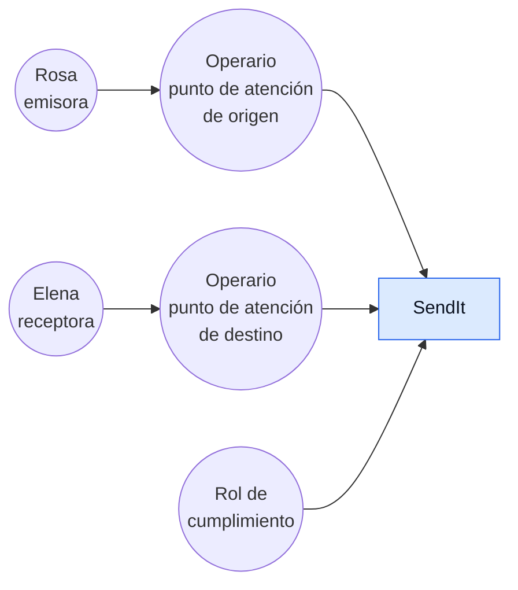
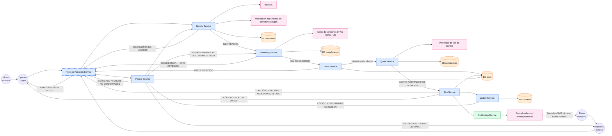

# L — Listar los componentes

> Paso 5 de [R.E.D.A.L.E.](../README.md) · anterior:
> [**A** — Armar el modelo de datos](../A-armar-modelo-datos/README.md) · siguiente:
> [**E** — Escalar](../E-escalar/README.md) · bitácora: [`ITERACIONES.md`](../ITERACIONES.md)

**Estado: tres iteraciones dibujadas y trazabilidad completa.** Las 222 filas del backlog —202 `RF` y
20 `RNF`— tienen componente e iteración. Lo que queda abierto está marcado como abierto y no como
hecho.

**Repropagación de la ronda 17.** El backlog pasó de 216 a 222 ítems. `RF-29` y `RF-182` pasaron a hablar de **retención** —el vocabulario que sus ocho títulos gobernantes ya usaban— y `RF-220` recogió el «no pagable» que `RF-29` cargaba solo.
Este archivo se repropagó **hacia abajo**: las cajas que existían solo para un identificador retirado
se resolvieron contra el ítem que hoy lo cubre, y ninguna caja de acá subió un requisito al backlog.
Lo que este paso encontró y **no** puede arreglar sin tocar `R` está en
[la lista del final](#lo-que-este-paso-no-puede-arreglar-desde-acá), y sigue abierto.

Diagramar la arquitectura con todo lo mapeado en los pasos previos. **Este es el paso donde el
enunciado exige «mostrar claramente las iteraciones de su diseño»**, y el ejemplo que el profesor
mostró en clase define qué significa eso: el **mismo diagrama, dibujado tres veces, cada vez más
abierto**. Transcripción completa en
[`EJEMPLO-CLASE-TOP-DOWN.md`](../../docs/EJEMPLO-CLASE-TOP-DOWN.md); la lectura queda fijada en
[D-05](../../docs/DECISIONES.md#d-05--las-iteraciones-del-diseño-son-iteraciones-del-diagrama-de-componentes).

El vocabulario es el del backlog y no se traduce: **giro**, **emisor**, **receptor**, **punto de
atención**, **operario**. Un componente que dice «envío» o «remitente» está nombrando otra cosa.

---

## Contrato con los pasos vecinos

| | |
|---|---|
| **Consume de R** | El backlog completo. Es lo que **gobierna** las iteraciones: una pasada del diagrama existe porque hay un ítem sin `DONE` |
| **Consume de D** | Los servicios, las fronteras con terceros y la frontera interna con el punto de atención. Las cajas de la iteración 2 son los servicios que `D` nombró |
| **Consume de A** | Las bases de datos. **Son varias, no una**: cada grupo de servicios tiene la suya, y cuál es cuál lo decidió `A` |
| **Consume de E** (estimar) | Solo para saber si un componente necesita estar separado por volumen. La estimación no dibuja cajas |
| **Entrega a E** (escalar) | El diagrama base sobre el que se pregunta qué se rompe primero cuando la carga sube |
| **Queda inválido si R cambia** | La tabla de trazabilidad, y con ella la justificación de cada iteración. Un ítem nuevo del backlog **fuerza una pasada más** del diagrama |
| **Queda inválido si D o A cambian** | La caja o la `BD` afectada, en las tres iteraciones donde aparezca. Un componente renombrado en la iteración 3 y no en la 2 es una contradicción visible |

---

## Qué muestra el diagrama y qué no

| Muestra | No muestra |
|---|---|
| Los componentes y sus relaciones | Cómo está implementado cada uno |
| Los actores, fuera del sistema | Pantallas, rutas de navegación, texto de interfaz |
| Las bases de datos, una por grupo de servicios | Esquemas, tablas ni campos — eso es [`A`](../A-armar-modelo-datos/README.md) |
| Los sistemas de terceros, marcados como externos | Versiones, proveedores concretos ni topología de despliegue |
| La etiqueta de cada rama condicional | Números de rendimiento — eso es [`E`](../E-estimar/README.md) |

El ejemplo de clase es literal en esto: sus cajas dicen `Login Service`, `Validation Service`,
`BD` — no dicen con qué se construyeron ni dónde corren.

## Convenciones del repositorio

Heredadas del ejemplo de clase y adoptadas aquí sin cambios.

| Elemento | Regla |
|---|---|
| **Servicio** | `<Nombre> Service` |
| **Proceso batch** | `<Nombre> Job <momento>` — p. ej. `<EOD>` para fin de día |
| **Base de datos** | `BD <de qué>`, en elipse. **Varias, no una** (en Mermaid, el cilindro `[(…)]`) |
| **Sistema externo** | Su nombre real, sin eufemismo |
| **Actor** | Círculo con etiqueta, fuera del sistema |
| **Rama condicional** | La arista lleva su etiqueta: `TODO OK`, `Validation Failed`, `OK`, `NO LOAN` |

**Código de color** — y hace un trabajo real, no decorativo: **el rosado marca dónde termina el
mando.** Todo lo rosado puede fallar, tardar o mentir sin que el diseño pueda impedirlo.

| Color | Qué agrupa | Clase en Mermaid |
|---|---|---|
| Azul | Servicios propios | `propio` |
| Verde | Soporte y notificación | `soporte` |
| Rosado | Terceros, fuera de la frontera de confianza | `externo` |
| Amarillo | Procesos batch y servicios secundarios | `batch` |
| Naranja (elipse) | Bases de datos | `bd` |

**El color no alcanza, y la categoría que faltaba queda resuelta acá.** El andamiaje anterior dejó
abierta una categoría —«propio pero incomunicable»— y `RF-24` mostró que hacían falta **dos** marcas
distintas, no una, porque son dos fronteras distintas que caen sobre la misma caja:

| Marca | Qué afirma | Ejemplo, con su ítem |
|---|---|---|
| **Borde punteado** (`stroke-dasharray`) | Propio en el mando y **cortable en la conexión**. El diseño manda ahí, salvo mientras no llega | `Punto de Atención Service` — `RNF-05`, `RNF-06`, `RNF-13`, `RNF-08` |
| **Borde grueso** (`stroke-width:4px`) | Propio en el mando y **ajeno en la contabilidad**: el efectivo que se entrega no salió de la caja de SendIt | `Caja del agente` — `RF-24`, `RF-20` |

Ninguna de las dos es un color, y esa es la razón de ser: pintar el punto de atención de rosado dice
que el diseño no manda ahí —y sí manda—; pintarlo de azul a secas esconde los dos únicos modos de
falla que importan. `RF-24` es el caso que obliga a la segunda marca: **el agente pone efectivo de su
propia caja y SendIt se lo liquida después**, de modo que entre el momento en que Elena cuenta los
billetes y el momento en que la liquidación corre, hay dinero entregado que todavía no es un
movimiento entre cuentas de SendIt. Eso es una frontera contable, y el azul no la distingue.

```
classDef propio  fill:#dbeafe,stroke:#2563eb,color:#0b1220;
classDef soporte fill:#dcfce7,stroke:#16a34a,color:#0b1220;
classDef externo fill:#fce7f3,stroke:#db2777,color:#0b1220;
classDef batch   fill:#fef9c3,stroke:#ca8a04,color:#0b1220;
classDef bd      fill:#ffedd5,stroke:#ea580c,color:#0b1220;
classDef corte   stroke-dasharray: 6 3,stroke-width:3px;
classDef agente  stroke-width:4px;
```

---

## Las tres iteraciones

**La regla que las gobierna: no se dibuja el diagrama final y después se inventan las iteraciones
previas.** La primera es un cuadrado. Lo que fuerza la segunda es un ítem del backlog que el
cuadrado no explica, y lo mismo la tercera. Cada pasada cierra marcando ítems como `DONE`, y el
diagrama deja de crecer cuando el backlog está cubierto.

El motivo de cada pasada —qué ítem la forzó— se anota en [`ITERACIONES.md`](../ITERACIONES.md). Qué
quedó cubierto se anota **aquí**, en la tabla de trazabilidad.

### Iteración 1 — la caja única

Lo único que afirma: **quién habla con el sistema**. Los actores salen de
[`../../personas/`](../../personas/), no de una decisión de este paso.



**Las dos puntas pasan por una ventanilla, y por eso ni Rosa ni Elena tocan la caja.** Bajo el
modelo Western Union ([D-07](../../docs/DECISIONES.md#d-07--sendit-opera-el-modelo-western-union))
Rosa entrega efectivo y se identifica ante un operario (`RF-01`, `RF-79`), y Elena cobra efectivo
ante otro operario en el país destino (`RF-02`, `RF-34`). Dibujarlas conectadas directamente a la caja es
cómodo y falso: **la corrección de esa arista es todo lo que esta pasada decide.**

**La pregunta que el andamiaje dejaba abierta queda cerrada acá:** el operario **es actor**, igual
que `Proveedor` en el ejemplo de Leasing, y no una caja de la iteración 2. El argumento que decide
es que hay ítems que el sistema le muestra **a él y a nadie más** —`RF-130` le muestra la acción
ofrecible, `RF-40` le oculta el motivo, `RF-57` le recorta lo que ve, `RF-125` le confirma que el
código salió sin mostrárselo—, y un componente interno no puede ser el
destinatario de un requisito de mínimo privilegio. Son **dos** círculos de operario y no uno: el de
origen y el de destino están en países distintos, con reguladores distintos (`RF-16`), y colapsarlos
borra la única frontera que este caso tiene por definición. Kevin es la persona de los dos
([`Operario.MD`](../../personas/Operario.MD)).

El **rol de cumplimiento** entra como actor por `RF-30`: el giro retenido se deriva a un rol
**distinto** del operario que lo atendió. Un actor que no existe en el diagrama no puede recibir una
derivación.

| Componente | Qué hace | De qué paso previo sale | Persona o requisito que lo exige |
|---|---|---|---|
| `SendIt` | Todo el sistema, sin abrir. Solo afirma quién puede dirigirse a él | `D` — el alcance, antes de partirlo en servicios | `RF-11`: el código sale por la única arista que va hacia el operario de origen, y no hay ninguna que lo lleve al receptor |

**Ítems del backlog que quedan `DONE`:** `RF-11` — y solo ese. Es el único que se demuestra con el
grafo de actores: que el código sea **únicamente** del emisor es la ausencia de una arista, no una
regla escrita adentro de una caja. Las iteraciones 2 y 3 le agregan avisos hacia el receptor
(`RF-25`, `RF-37`, `RF-41`), y ninguno transporta el código — esa distinción nace acá.

**Lo que esta caja no explica, y fuerza la iteración 2:** `RF-26` y `RF-119` exigen contrastar al
emisor y al receptor designado contra las listas de sanciones **antes de aceptar el efectivo**. Un cuadrado no tiene
«antes»: no hay dónde dibujar un control que corre previo al momento en que el dinero se compromete,
que es la decisión `D`(e). Con `RF-26` y `RF-119` sin cubrir, hay una pasada más.

### Iteración 2 — la caja se abre en servicios

La caja deja de ser una caja. En el ejemplo de clase, esta pasada es la que hace aparecer por
primera vez la **autenticación**, la **validación contra terceros**, la **bifurcación del resultado**
y el **canal por el que se avisa cuando falla**. El equivalente en SendIt cubre el camino que va
desde que Rosa entrega el efectivo hasta que Elena lo cobra, con su rama de rechazo: **identificación,
tamizaje, creación del giro y pago.**



| Componente | Qué hace | De qué paso previo sale | Persona o requisito que lo exige |
|---|---|---|---|
| `Punto de Atención Service` | Lo que corre en la ventanilla. Recibe el efectivo, **muestra al operario la acción ofrecible del giro que tiene delante** (`RF-130`) y no el motivo (`RF-40`), y le recorta la vista a la operación que atiende. La acción que muestra no la inventa: se la asoció el `Giro Service` al estado, y eso es `RF-39`, que es otra fila | `D` — la frontera interna centro↔mostrador, decisión `D`(c) | `RF-130`, `RF-40`, `RF-57`, `RNF-09` |
| `Identity Service` | Comprueba documento oficial vigente del emisor antes de crear, y la titularidad del receptor antes de pagar. **Es el sistema y no el operario quien decide qué diferencia de escritura cuenta como coincidencia** (`RF-84`). Guarda la evidencia de la verificación, no el documento en claro | `A` — entidad *Verificación de identidad* | `RF-01`, `RF-80`, `RF-84`, `RF-85`, `RNF-01` |
| `Screening Service` | Contrasta al emisor (`RF-26`) **y al receptor designado** (`RF-119`) contra listas **antes de aceptar el efectivo**, separa coincidencia exacta de homonimia y deja el giro retenido. Y lo vuelve a hacer cuando el `Payout Service` le pide el veredicto **contra las listas vigentes al momento de autorizar el pago**, que es `RF-27` y **no** el re-tamizaje por cambio de lista | `D`(e) — el momento del tamizaje | `RF-26`, `RF-119`, `RF-27`, `RF-28`, `RF-29` |
| `Limits Service` | Cuenta el límite por operación y el acumulado de la ventana **sobre la identidad del emisor**, no sobre el punto de atención | `R` — `BR-04` | `RF-08`, `RF-09`, `RF-10` |
| `Quote Service` | Produce y fecha la cotización, fija el monto **en moneda destino** y lo conserva sin recalcular | `D`(d) — cuándo se fija el tipo de cambio | `RF-05`, `RF-06`, `RF-07` |
| `Giro Service` | Crea el giro con un receptor —que después ya no se altera—, un país, un punto de atención elegido y un código que entrega **solo** al emisor y guarda comprobable, nunca legible. Da el giro por creado en el instante en que se registra la recepción del efectivo. Y **asocia al menos una acción ofrecible a todo estado rechazado, retenido o no pagable** (`RF-39`): es el productor de lo que el `Punto de Atención Service` muestra, y por eso son dos filas y no una | `A` — entidad *Giro*; `A`(114) — `accion_ofrecible_id` obligatorio en esos tres estados | `RF-03`, `RF-04`, `RF-39`, `RF-63`, `RF-70`, `RF-79`, `RNF-10`, `RNF-15`; y `RF-11` desde la iteración 1 |
| `Ledger Service` | Escribe el libro de movimientos. Toda operación deja la suma igual | `D`(a) — la verdad del dinero | `RNF-07` |
| `Payout Service` | Autoriza el pago contra código **y** documento, pide al `Screening Service` el veredicto contra las listas vigentes en ese momento (`RF-27`), entrega el monto fijado **en efectivo y sin exigir cuenta bancaria**, y cierra el giro cuando el receptor recibe | `D`(b), `D`(c) | `RF-02`, `RF-34`, `RF-36`, `RF-64`, `RNF-16` |
| `Notification Service` | El canal hacia el receptor. Habla por **llamada o mensaje de texto**, sin exigir aplicación, correo ni datos móviles | `R` — tensión T5 | `RF-25`, `RF-41` |
| `BD identidad`, `BD cumplimiento`, `BD cotizaciones`, `BD giros`, `BD contable` | Cinco, no una. Cada grupo de servicios tiene la suya | `A` — entrega a `L` | — (las exige el componente que escribe en ellas) |

**Lo que esta pasada hace visible y la iteración 1 no podía:**

- El punto exacto en que el dinero se compromete, y qué control corre **antes** de él —la decisión
  `D`(e), dibujada—: `Screening Service` está aguas arriba de `Ledger Service`, de modo que la
  herramienta es detener y no revertir (`RF-26`).
- La rama de rechazo del tamizaje, que **no puede explicarse al cliente** (tensión T2). La arista
  lleva etiqueta igual que `Validation Failed`, pero lo que sale por ella hacia el operario es la
  acción y no el motivo. Son **tres** ítems y no uno: `RF-39` asocia la acción al estado en el
  `Giro Service`, `RF-130` la muestra en el mostrador y `RF-40` calla el motivo.
- El canal hacia Elena, que **no tiene datos ni correo**: `Notification Service` sale a un
  `Operador de voz y mensaje de texto`, no a un `Email Service`. `RF-25` lo exige por su nombre, y
  `RF-41` obliga a que llegue **antes de que viaje**.
- La frontera entre el centro y el punto de atención —**interna, no rosada**— dibujada con borde
  punteado: `Punto de Atención Service` es azul y es nuestro, y el punteado dice que la conexión se
  corta aunque el mando no.

**Ítems del backlog que quedan `DONE`:** los 29 `RF` y 7 `RNF` marcados con **2** en la tabla de
trazabilidad — el camino de identificación, tamizaje, creación y pago con su rama de rechazo.

**Una caja salió de esta pasada al repropagar la ronda 11.** El
`Screening Job <actualización de lista>` estaba dibujado acá porque cargaba `RF-27`, y `RF-27` no es
el re-tamizaje por cambio de lista: es *contrastar al receptor contra las listas vigentes al momento
de autorizar el pago*, que corre en el camino del pago y lo pide el `Payout Service`. El re-tamizaje
es `RF-97`, y con él el job se mueve a la iteración 3, donde además existe el canal por el que
`RF-37` avisa al receptor que su giro quedó retenido — que es lo que un cambio de lista produce, y no
la devolución que el retirado `RF-108` anunciaba. **No se rehízo la pasada: se corrigió una caja que
estaba en la pasada equivocada por un puntero mal trazado.**

**Lo que esta pasada no explica, y fuerza la iteración 3:** `RF-13` exige la autorización de un
segundo rol sobre el umbral reforzado y `RNF-02` prohíbe que una misma identidad ejerza dos roles del
mismo giro —y en el diagrama de arriba no hay un segundo rol en ninguna parte—; `RNF-05`, `RNF-06` y
`RNF-13` prohíben que el centro y el punto afirmen a la vez cosas distintas del mismo giro —pagado
dos veces, retenido y disponible, devuelto y cobrado—, y nada dibujado reconcilia esas dos versiones; `RF-24` dice que el efectivo lo pone el agente de su caja, y
no hay ninguna caja del agente; `RF-122` deja cobrar con documento vencido a quien responde un
desafío que `RF-114` y `RNF-17` prohíben mostrar, leer o digitar **a los dos lados del
mostrador**, lo que exige un almacén y una superficie de entrada que esta pasada no tiene; y
`RNF-15` exige que el código llegue al emisor sin que quien atiende pueda leerlo, cosa que la arista
`CÓDIGO — SOLO AL EMISOR` de arriba todavía hace pasar por el mostrador. Cinco huecos, cinco razones
para una pasada más.

### Iteración 3 — cobertura del backlog restante

Repite el subgrafo de la iteración 2 y le agrega lo que falta hasta que ningún ítem quede sin
`DONE`. En el ejemplo de clase, esta pasada trae la evaluación, el presupuesto, la cobranza, el
proceso batch de fin de día y el tablero.

**Un actor nuevo, por el mismo argumento con que entró el rol de cumplimiento.** El **agente** —el
dueño del punto, distinto del operario que atiende y distinto del punto mismo, como `A`:88 lo
modela— aparece acá porque hay ítems cuyo destinatario es **él y nadie más**: `RF-141` le informa la
diferencia entre el efectivo esperado y el declarado en cada cierre de caja de sus puntos, `RF-104`
le exige informarle todo descuento con su evidencia antes de aplicarlo, y `RF-145` **recibe de él una
objeción**. Un actor que no existe en el diagrama no puede recibir un aviso ni originar una objeción,
y sin él la arista de `RF-145` no tendría de dónde salir.

```mermaid
flowchart LR
  ROSA(( Rosa<br/>emisora )) --> OPO(( Operario<br/>origen ))
  ELENA(( Elena<br/>receptora )) --> OPD(( Operario<br/>destino ))
  CUMP(( Rol de<br/>cumplimiento ))
  AGE(( Agente<br/>dueño del punto ))

  OPO --> PDA["Punto de Atención Service"]
  OPD --> PDA
  PDA --> IDM["Idempotencia Service"]
  IDM --> BDIN[("BD intentos")]
  IDM --> IDN["Identity Service"]

  IDN --> RENIEC["RENIEC"]
  IDN --> VDOC["Verificación documental del corredor de origen"]
  IDN --> BDID[("BD identidad")]
  IDN -->|"DOCUMENTO NO VIGENTE"| PDA
  IDN -->|"IDENTIDAD OK"| COR["Corredor Service"]

  COR --> BDCR[("BD corredores y reguladores")]
  COR -->|"PAÍS NO ATENDIBLE / REGULADORES INCOMPATIBLES"| PDA
  COR -->|"CORREDOR HABILITADO"| SCR["Screening Service"]

  SCRJ["Screening Job &lt;actualización de lista&gt;"] -->|"LISTA CAMBIADA — RE-TAMIZAR LOS NO PAGADOS"| SCR
  SCRJ -->|"QUIÉN DEJA DE PODER COBRAR, Y QUÉ PUEDE HACER"| NOT
  SCR --> LIST["Listas de sanciones OFAC / ONU / UE"]
  SCR --> BDCU[("BD cumplimiento")]
  SCR -->|"COINCIDENCIA"| RET["Retención Service"]
  SCR -->|"SIN COINCIDENCIA"| LIM["Limits Service"]

  LIM --> BDGI[("BD giros")]
  LIM -->|"LÍMITE EXCEDIDO"| PDA
  LIM -->|"SOBRE EL UMBRAL REFORZADO"| DUAL["Dual Control Service"]
  LIM -->|"DENTRO DEL LÍMITE"| QUO["Quote Service"]
  DUAL -->|"SIN SEGUNDA AUTORIZACIÓN"| PDA
  DUAL -->|"SEGUNDA AUTORIZACIÓN OTORGADA"| QUO

  QUO --> FX["Proveedor de tipo de cambio"]
  QUO --> BDCO[("BD cotizaciones")]
  QUO -->|"MONTO, COMISIÓN Y MARGEN — ANTES DEL EFECTIVO"| PDA
  QUO --> LIQ["Liquidez Service"]
  LIQ --> BDPA[("BD puntos de atención y efectivo")]
  LIQ -->|"SIN EFECTIVO EN EL CORREDOR"| PDA
  LIQ -->|"CORREDOR FONDEADO"| GIR["Giro Service"]

  GIR --> BDGI
  GIR --> LED["Ledger Service"]
  LED --> BDLI[("BD contable")]
  GIR -->|"ACCIÓN OFRECIBLE ASOCIADA AL ESTADO"| PDA
  GIR -->|"GIRO INTERRUMPIDO — ESTADO ÚNICO, LEGIBLE Y RETOMABLE"| PDA
  PDA -->|"LA ACCIÓN OFRECIBLE DEL GIRO QUE TIENE DELANTE, NO EL MOTIVO"| OPO
  GIR --> COD["Código Service"]
  COD --> BDGI
  COD -->|"CÓDIGO SELLADO — NI EL OPERARIO LO LEE"| TCL["Terminal del Cliente"]
  TCL -->|"SOLO EL EMISOR LO VE"| ROSA
  COD --> NOT
  COD -->|"CÓDIGO YA ENTREGADO — NO SE REEMITE NI SE RECONSULTA"| PDA
  COD -->|"SALIÓ HACIA EL EMISOR — CONFIRMACIÓN SIN EL CÓDIGO"| PDA
  GIR --> NOT["Notification Service"]
  GIR --> REP["Reporte Service"]
  IDN -->|"FECHA DE NACIMIENTO QUE EL REPORTE EXIGE"| REP
  REP -->|"SOBRE EL UMBRAL DE REPORTE DE ORIGEN"| AUTO["Autoridad de origen — FinCEN / SEPBLAC"]
  REP -->|"SOBRE EL UMBRAL DE REPORTE DE LA JURISDICCIÓN DE DESTINO"| AUTD["Autoridad de destino — UIF-Perú"]

  PDA --> CUS["Custodia de Efectivo Service"]
  CUS --> BDGI
  CUS --> LED
  CUS -->|"EFECTIVO EN CUSTODIA — ESTADO ÚNICO, LEGIBLE Y RETOMABLE"| PDA
  CUS -->|"RETOMADO — EL GIRO SE COMPLETA"| GIR

  PDA --> PAY["Payout Service"]
  PAY -->|"LISTAS VIGENTES AL AUTORIZAR EL PAGO"| SCR
  PAY --> IDN
  PAY --> BDGI
  PAY --> DES["Desafío Service"]
  DES --> BDDE[("BD desafíos")]
  GIR --> DES
  IDN -->|"DOCUMENTO VENCIDO — HAY DESAFÍO"| DES
  ELENA --> TCL
  TCL -->|"RESPUESTA DIGITADA POR EL RECEPTOR"| DES
  DES --> NOT
  DES -->|"INTENTOS AGOTADOS"| PDA
  DES -->|"RESPUESTA CORRECTA — PAGO CON DOCUMENTO VENCIDO"| PAY
  PAY --> CRE["Cobros del Receptor Service"]
  CRE --> BDCU
  CRE -->|"ACUMULADO DE COBROS SUPERADO"| RET
  CRE -->|"DENTRO DEL ACUMULADO"| PAY
  PAY -->|"YA PAGADO / CANCELADO / RETENIDO"| PDA
  PAY -->|"CÓDIGO Y DOCUMENTO COINCIDEN"| LED
  PAY -->|"ENTREGADO — GIRO CERRADO"| OPD
  PAY -->|"GIRO COBRADO — AVISO AL EMISOR"| NOT
  PAY -->|"CONFIRMACIÓN QUE NO LLEGÓ DEL PUNTO AL CENTRO — PAGO EN DUDA"| SYN
  PAY --> CAJA["Caja del agente"]

  PDA --> CPS["Caja del Punto Service"]
  CPS --> BDPA
  CPS -->|"EFECTIVO DECLARADO EN EL PUNTO"| PDA
  CPS -->|"EL PUNTO PUEDE PAGAR / DEJÓ DE PODER"| NOT
  CPS -->|"EL PUNTO ELEGIDO NO PUEDE PAGAR"| PAL["Punto Alternativo Service"]
  PAL --> BDPA
  PAL --> NOT
  PAL -->|"OTRO PUNTO DEL MISMO DISTRITO, CON PLAZO PARA RESPONDER"| PDA
  PAL -->|"SIN RESPUESTA DEL EMISOR DENTRO DEL PLAZO"| DEV
  PAL -->|"NINGÚN PUNTO DEL DISTRITO PUEDE PAGARLO"| DEV

  PDA --> REC["Reclamo Service"]
  REC --> BDGI
  REC --> CRR
  REC --> AUD

  ELENA --> TEL
  TEL -->|"declaración o consulta del receptor, por llamada o SMS"| ARS["Atención al Receptor Service"]
  ARS -->|"¿QUIÉN LLAMA ES EL RECEPTOR DESIGNADO?"| IDN
  IDN -->|"NO ES EL RECEPTOR DESIGNADO — DECLARACIÓN NO ADMITIDA"| ARS
  ARS -->|"ES EL RECEPTOR DESIGNADO — DECLARACIÓN ADMITIDA"| REC
  ARS -->|"ES EL RECEPTOR DESIGNADO — GIROS A SU NOMBRE"| CON
  ARS --> AUD

  RET --> BDCU
  RET --> TAB["Tablero de Cumplimiento"]
  RET -->|"RETENIDO — AVISO AL EMISOR DENTRO DEL PLAZO PROMETIDO"| NOT
  CUMP --> TAB
  TAB -->|"LIBERADO — CON MOTIVO Y POR OTRO ROL"| GIR
  TAB -->|"DEJÓ DE ESTAR RETENIDO — AVISO AL EMISOR"| NOT
  TAB -->|"NO LIBERADO"| RET

  VEN["Vencimiento Job &lt;diario&gt;"] --> RET
  VEN --> QUO
  VEN --> NOT
  VEN --> DEV["Devolución Service"]
  VEN -->|"DEVOLUCIÓN NO RETIRADA — PRESCRIBE"| DEV
  VEN -->|"72 H SIN RETOMAR EL EFECTIVO EN CUSTODIA"| CUS
  CUS -->|"NADIE LO RETOMÓ — VUELVE AL EMISOR"| DEV

  PDA --> CPR["Condiciones Previas Service"]
  LIQ --> CPR
  RET --> CPR
  DEV --> CPR
  CPR -->|"PLAZOS Y CONDICIONES ANTES DEL EFECTIVO"| PDA

  ROSA -->|"consulta y cancelación"| CON["Consulta Service"]
  CON --> BDGI
  CON --> CAN["Cancelación Service"]
  CON --> SUP["Supresión Service"]
  SUP --> BDID
  SUP --> AUD
  AUD -->|"LO QUE EL REGISTRO DE ACTOS CONSERVA"| SUP
  CAN -->|"CANCELADO — ES UNA DEVOLUCIÓN, Y EL AVISO SALE DE AHÍ"| DEV
  CAN -->|"CÓDIGO PERDIDO — REHACER AL MISMO RECEPTOR"| REH["Rehacer Service"]
  REH -->|"LA COTIZACIÓN QUE FIJÓ EL GIRO CANCELADO, SIN NUEVA COMISIÓN"| QUO
  REH -->|"LOS CONTROLES DE UN GIRO NUEVO"| SCR
  REH --> LIM
  REH --> DUAL
  REH --> GIR
  DEV --> LED
  DEV --> BDGI
  DEV --> NOT
  PDA -->|"retiro de la devolución"| DEV

  SYN["Sync Service"] --> PDA
  SYN -->|"PAGO EN DUDA RESUELTO CONTRA EL REGISTRO DEL CENTRO, SIN EL OPERARIO"| BDGI
  SYN --> BDPA
  EOD["Cierre de Caja Job &lt;EOD&gt;"] --> SYN
  EOD --> LED
  EOD --> TAB
  EOD --> CPS
  VEN --> DES
  LQJ["Liquidación Job &lt;plazo del agente&gt;"] --> CAJA
  LQJ --> LED

  CRR["Corrección Service"] --> DUAL
  CRR --> LED
  CRR --> NOT
  CRR -->|"DIFERENCIA REPUESTA, ORIGINADA EN ESE PUNTO"| DAG["Descuento al Agente Service"]
  EOD -->|"DIFERENCIA ENTRE EL EFECTIVO ESPERADO Y EL DECLARADO"| DAG
  DAG --> BDPA
  DAG --> AUD
  DAG -->|"DESCUENTO INFORMADO, CON LA EVIDENCIA QUE LO SUSTENTA"| AGE
  AGE -->|"OBJECIÓN AL DESCUENTO, ANTES DE APLICARLO"| DAG
  DAG -->|"INFORMADO, EVIDENCIADO Y NO OBJETADO — RECIÉN AHORA SE DESCUENTA"| LQJ

  NOT --> TEL["Operador de voz y mensaje de texto"]
  TEL --> ELENA
  TEL --> ROSA
  TEL -->|"ENTREGA O FALLO DE ENTREGA, CUANDO EL CANAL LO REPORTA"| NOT
  NOT --> AUD

  PDA --> AUD["Audit Service"]
  PAY --> AUD
  GIR --> AUD
  TAB --> AUD
  IDN --> AUD
  AUD --> BDAU[("BD auditoría")]

  classDef propio  fill:#dbeafe,stroke:#2563eb,color:#0b1220;
  classDef soporte fill:#dcfce7,stroke:#16a34a,color:#0b1220;
  classDef externo fill:#fce7f3,stroke:#db2777,color:#0b1220;
  classDef batch   fill:#fef9c3,stroke:#ca8a04,color:#0b1220;
  classDef bd      fill:#ffedd5,stroke:#ea580c,color:#0b1220;
  classDef corte   stroke-dasharray: 6 3,stroke-width:3px;
  classDef agente  stroke-width:4px;

  class PDA,IDM,IDN,COR,SCR,LIM,DUAL,QUO,LIQ,GIR,LED,PAY,RET,DEV,CAN,CON,SYN,CRR,REP,AUD propio;
  class DES,CRE,CPS,PAL,REC,SUP,COD,TCL,REH,CPR,ARS,CUS,DAG propio;
  class NOT,TAB soporte;
  class RENIEC,VDOC,LIST,FX,TEL,AUTO,AUTD externo;
  class SCRJ,VEN,EOD,LQJ batch;
  class BDID,BDCU,BDCO,BDGI,BDLI,BDIN,BDCR,BDPA,BDAU,BDDE bd;
  class PDA,TCL corte;
  class CAJA agente;
```



| Componente | Qué hace | De qué paso previo sale | Persona o requisito que lo exige |
|---|---|---|---|
| `Corredor Service` | Aplica a un mismo giro las reglas del regulador de origen **y** las del de destino, rechaza cuando son incompatibles en vez de elegir una, y avisa el país no atendible antes del efectivo | `D` — el negocio es multirregulador | `RF-16`, `RF-16`, `RF-19`, `RF-23`, `RNF-12`, `RNF-14` |
| `Screening Job <actualización de lista>` | Re-tamiza **los giros aún no pagados** cuando cambia una lista de sanciones (`RF-97`), que es el caso que `D`(e) señaló como imposible de resolver «antes o después». Baja acá desde la iteración 2 porque allá cargaba `RF-27`, que es otra cosa; y acá tiene además el canal que le faltaba: el giro que pasa a coincidir queda **retenido** (`RF-29`) y el aviso al receptor sale por `RF-37`, no por el retirado `RF-108`, que anunciaba una devolución que ningún título ordenaba | `D`(e) — el momento del tamizaje | `RF-97`; y `RF-29`, `RF-37` desde el `Retención Service` |
| `Reporte Service` | Reporta **a las dos autoridades y por dos umbrales distintos**: a la de origen el giro que supera el umbral de reporte transfronterizo (`RF-17`) y a la del país de destino el que supera el umbral de esa jurisdicción (`RF-139`), midiendo cada umbral **sobre el giro completo** y no sobre su tramo local (`RF-22`). Le pide al `Identity Service` la fecha de nacimiento de las dos puntas cuando el reporte la exige (`RF-140`), y ninguna arista suya vuelve hacia el `Punto de Atención Service` ni hacia el `Consulta Service`: la existencia del reporte no se filtra | `R` — `BR-17` · el negocio es multirregulador | `RF-17`, `RF-22`, `RF-139`, `RF-140` |
| `Liquidez Service` | Exige efectivo disponible en el corredor de destino antes de dar el giro por fondeado, y de ahí sale la fecha desde la cual el giro se podrá cobrar, que el emisor ve **antes** de entregar el efectivo | `A` — catálogo de puntos y efectivo | `RF-20`, `RF-77` |
| `Quote Service` (ampliado) | El mismo de la iteración 2, y ahora dice **el precio entero antes del efectivo** y no solo la cifra de destino: la comisión que se le cobra al emisor (`RF-136`) y el margen que se aplica sobre la cotización (`RF-142`). Es lo que convierte «monto exacto» en un número que Rosa puede comparar contra otro operador | `D`(d) — cuándo se fija el tipo de cambio | `RF-136`, `RF-142`; y `RF-05`, `RF-06`, `RF-07` desde la iteración 2 |
| `Dual Control Service` | Segunda autorización sobre el umbral reforzado y para corregir el monto de un giro pagado, con la identidad de los dos roles separada en toda la cadena crear → autorizar → pagar → liberar → corregir | `R` — `BR-05`, `BR-13` | `RF-13`, `RF-61`, `RNF-02` |
| `Retención Service` | Abre el caso de cumplimiento con el plazo del regulador **más estricto de los dos países** —más corto para la homonimia que para la coincidencia exacta—, lo deriva a un rol distinto del operario que atendió y avisa la retención al emisor **dentro del plazo que `RF-115` le prometió** —y ese plazo tiene un techo duro, `RF-133`— y al receptor | `A` — entidad *Caso de cumplimiento* | `RF-30`, `RF-31`, `RF-37`, `RF-67`, `RF-78`, `RF-133` |
| `Tablero de Cumplimiento` | Donde trabaja el rol de cumplimiento: es el `Debt Dashboard` de este caso. Libera **solo** ese rol, toda liberación deja su motivo registrado (`RF-87`) **y el aviso sale hacia el emisor por el mismo acto** (`RF-127`). Hasta la ronda 11 el motivo se escribía y nadie lo leía: Rosa no se enteraba de que su retención se había levantado, y ese productor sin consumidor está cerrado por la arista `TAB → NOT` | `D` — la consola de cumplimiento no es el punto de venta | `RF-33`, `RF-87`, `RF-127` |
| `Vencimiento Job <diario>` | El terminador. Hace caducar solas las retenciones sin liberar, las cotizaciones de `D`(d), las respuestas de desafío y los giros prescritos —y con ellos la devolución que nadie retiró—, y avisa antes de que prescriban **a las dos puntas**: el emisor pierde su dinero y el receptor pierde su cobro. Dos terminadores nuevos cuelgan de él: la devolución que nadie retiró **prescribe** al vencer ese plazo (`RF-137`) y el efectivo en custodia que nadie retomó vuelve al emisor a las 72 horas (`RF-138`, ejecutado por el `Custodia de Efectivo Service`) | `D`(d) · `R` — *estado sin terminador* | `RF-32`, `RF-49`, `RF-51`, `RF-120`, `RF-83`, `RF-89`, `RF-137` |
| `Devolución Service` | Devuelve al emisor por cancelación, por retención vencida, por prescripción, por intentos de desafío agotados y por punto que no puede pagar sin respuesta a tiempo: **siempre en efectivo, siempre en la moneda que entregó, comisión incluida cuando el giro no llegó a pagarse**, en el punto que él elija y con el plazo informado antes de que soltara el dinero. Avisa al receptor que ese giro volvió, porque quien viaja al mostrador es él. Rechaza el pago de un giro ya devuelto | `D`(a) — la devolución es un asiento, no un `UPDATE` | `RF-14`, `RF-47`, `RF-50`, `RF-71`, `RF-72`, `RF-74`, `RF-88`, `RF-89`, `RF-106`, `RF-111`, `RNF-13` |
| `Cancelación Service` | Cancela mientras el dinero **no esté a disposición del receptor**, y solo a pedido del emisor que creó el giro. Es también la salida del código perdido —tensión T7—: se cancela mientras el dinero no esté a disposición del receptor, y de ahí sale el `Rehacer Service`. El aviso al receptor no es una fila suya: `RF-47` hace de la cancelación una **devolución**, y el que avisa es `RF-106` desde el `Devolución Service` — que es exactamente por qué `RF-107` se retiró. La cancelación por código perdido **no tiene fila propia desde la ronda 12**: `RF-110` decía el mismo borde que `RF-46` palabra por palabra y se retiró | `R` — tensiones T6 y T7 | `RF-46`, `RF-48` |
| `Consulta Service` | El canal de lectura de **las dos puntas**, y solo de lectura. Rosa entra directo: estado de sus giros sin depender del receptor, disponible-para-cobro distinguido del que no lo está, y retención con su fecha. Elena entra por teléfono a través del `Atención al Receptor Service`, que la identifica primero: `RF-128` le da el estado de los giros a su nombre **sin depender del emisor**, y esa es la primera vez que Elena consulta algo en este diseño | `R` — `BR-01` | `RF-52`, `RF-53`, `RF-66`, `RF-128` |
| `Idempotencia Service` | Persiste la clave del intento **antes** de mover un centavo: el reintento de una creación o de un pago interrumpidos es la misma operación, no una nueva. Y **nada más que eso**. `A:90` es explícito —la clave *«caduca sola y no deja registro contable, y por eso mismo no puede cargar con `RF-42` ni con `RF-118`»*—: un estado que el operario debe poder leer y retomar no se confía a una fila que se borra sola. Los dos ítems que este paso le asignaba mal viven donde `A` los puso: `RF-42` en `Giro.estado`, del `Giro Service`; `RF-118` en la entidad *Recepción de efectivo en custodia*, del `Custodia de Efectivo Service` | `D`(b) · `A`(90) — la frontera que este servicio **no** cruza | `RF-43`, `RF-44` |
| `Custodia de Efectivo Service` | El efectivo que el operario ya contó y guardó cuando la creación se cortó antes de que el giro existiera. Le da el **estado único, legible y retomable** que `RF-118` exige, con asiento contable desde que entra al cajón —`BR-01` lo vuelve deuda de SendIt con giro o sin él— y **sin transición por vencimiento**: se cierra completando el giro o devolviendo el dinero. A las 72 horas sin que nadie lo retome, `RF-138` lo devuelve al emisor, y ese es el terminador que a esta custodia le faltaba | `A` — entidad *Recepción de efectivo en custodia*; `A`(119) — «no hay transición por vencimiento» | `RF-118`, `RF-138` |
| `Giro Service` (ampliado) | El mismo de la iteración 2, con el estado que la 2 no podía dibujar: el giro interrumpido queda en **un estado único que el operario puede leer y retomar** (`RF-42`), sobre `Giro.estado` y no sobre una clave de intento con vencimiento | `A` — entidad *Giro*, campo `estado` | `RF-42` |
| `Sync Service` | Reconcilia lo que el punto sostuvo sin conexión. Impide que el centro y la ventanilla afirmen a la vez cosas distintas del mismo giro —pagado dos veces (`RNF-05`), retenido y disponible (`RNF-06`), devuelto y cobrado (`RNF-13`)— y recupera el estado **sin que el operario haga nada** (`RNF-08`). El caso duro tiene ítem desde la ronda 11: el pago cuya confirmación no llegó del punto al centro queda en **un estado único** (`RF-144`) que este servicio resuelve **contra el registro del centro y sin intervención del operario** (`RF-146`). Hasta entonces el «pago en duda» vivía en `D:427` y no lo enunciaba ningún título | `D`(c) | `RF-144`, `RF-146`, `RNF-05`, `RNF-06`, `RNF-08` |
| `Cierre de Caja Job <EOD>` | El equivalente del `Debt Job <EOD>`. Cuadra la caja de cada punto contra el libro y es donde aparece el doble pago si apareció | `D`(a), `D`(c) | `RNF-05` |
| `Liquidación Job <plazo del agente>` | Liquida con el agente el efectivo que puso de su caja, en el plazo acordado con él. **Ya no descuenta por su cuenta**: aplica el descuento por diferencia solo cuando el `Descuento al Agente Service` se lo entrega informado, evidenciado y no objetado. La versión anterior de esta caja ejecutaba un `RF-104` que hoy dice lo contrario | `D`(a) — la caja del agente es una cuenta del libro | `RF-24` |
| `Descuento al Agente Service` | La caja que la ronda 11 obliga a partir en dos, porque **descontar y controlar el descuento son dos actos y hoy son dos ítems opuestos**. Descuenta de la liquidación la diferencia repuesta que se originó en el punto del agente (`RF-143`); **no aplica ningún descuento que no le haya informado antes con la evidencia que lo sustenta** (`RF-104`); y admite del agente una **objeción antes de aplicarlo** (`RF-145`). Por la misma superficie le informa la diferencia entre el efectivo esperado y el declarado en cada cierre de caja de sus puntos (`RF-141`), que hasta la ronda 10 se calculaba, se guardaba y no avisaba a nadie | `A` — *Agente* es entidad distinta del punto (`A`:88) · `R` — `BR-13`, `BR-01` | `RF-104`, `RF-141`, `RF-143`, `RF-145` |
| `Corrección Service` | Registra la corrección del monto de un giro pagado como movimiento nuevo, repone al emisor o al receptor según a quién le faltó, y se la informa **a los dos**, cada uno por su canal. **No descuenta**: le pasa la diferencia repuesta al `Descuento al Agente Service`, que es quien la lleva —o no— a la liquidación | `A` — sección 5, inmutabilidad | `RF-56`, `RF-59`, `RF-60`, `RF-121` |
| `Audit Service` | Asocia cada acto a la identidad de quien lo ejecutó, impide modificar o eliminar lo ya ejecutado, deja traza de todo acceso a identidad y conserva por el plazo más largo de los dos países | `A` — entidad *Traza de auditoría* | `RF-18`, `RF-54`, `RNF-03`, `RNF-03`, `RNF-04` |
| `Notification Service` (ampliado) | El mismo de la iteración 2, con el segundo destinatario que la 2 no tenía: el **emisor**. Le avisa el cobro, la retención, **que su giro dejó de estar retenido** (`RF-127`), la prescripción y su devolución disponible. Y por el mismo canal lleva al receptor todo lo que la 2 no sabía darle: giro retenido, giro devuelto, prescripción inminente, diferencia registrada, punto que dejó de poder pagar y a cuál ir en su lugar, y que su reposición está disponible y en qué punto retirarla (`RF-156`). **Registra si el aviso llegó cuando el canal lo reporta** (`RF-131`) y **trata como no avisado a quien no tenga constancia de que llegó** (`RF-132`): la arista de vuelta desde el `Operador de voz y mensaje de texto` es lo que convierte «se envió» en «se entregó». **Nunca transporta el código ni la respuesta del desafío** | `R` — tensiones T2, T5 y T6 | `RF-98`, `RF-131`, `RF-132`; `RF-60` y `RF-121` desde el `Corrección Service`, `RF-65` desde el `Payout Service`, `RF-67` y `RF-37` desde el `Retención Service`, `RF-127` desde el `Tablero de Cumplimiento`, `RF-51` y `RF-120` desde el `Vencimiento Job`, `RF-14` y `RF-106` desde el `Devolución Service`, `RF-156` desde el `Corrección Service`, `RF-75` y `RF-109` desde el `Caja del Punto Service`, `RF-124` desde el `Punto Alternativo Service` y `RF-69` desde el `Desafío Service` |
| `Caja del agente` | No es un servicio: es la cuenta contable del efectivo que el agente puso y SendIt todavía no le liquidó. Borde grueso porque es propia en el mando y ajena en la contabilidad | `D`(a) — cuentas del libro | `RF-24`, `RF-20` |
| `Desafío Service` | Guarda la pregunta que el emisor acordó con el receptor y registra al crear el giro, y **comprueba** la respuesta sin mostrarla: ni al operario del mostrador ni a quien administra la infraestructura. Es lo que autoriza el pago con documento **vencido** (`RF-122`) sin bajar la vara de identificación, y desde la ronda 12 es también donde termina la duda del operario sobre si la **fotografía** corresponde al receptor: la resuelve el desafío y no su criterio (`RF-148`). Acota los intentos, devuelve al agotarlos y caduca con el giro | `R` — tensión T3 · `A` — el secreto se guarda comprobable, no legible | `RF-68`, `RF-69`, `RF-82`, `RF-83`, `RF-101`, `RF-103`, `RF-122`, `RF-148`, `RNF-17`; y `RF-86` junto al `Identity Service` |
| `Cobros del Receptor Service` | Cuenta cuántos giros cobró **un mismo receptor** en la ventana vigente y **retiene el que la supera**. Es el gemelo del `Limits Service` en la otra punta: aquel cuenta sobre el emisor al crear, este sobre el receptor al pagar. Contar ya no es una fila aparte: `RF-58` se retiró porque contar el acumulado está contenido en retenerlo por superarlo | `R` — `BR-04`; `A` — acumulados por identidad | `RF-93` |
| `Caja del Punto Service` | El efectivo **por punto**, que el `Liquidez Service` no ve porque mira el corredor entero. Registra lo que cada punto declara al abrir y al cerrar su caja, descuenta cada pago **y cada devolución** sin esperar al cierre, y le dice al operario cuánto tiene antes de habilitarle un pago **o una devolución**. Avisa al receptor si el punto elegido puede pagarle **y vuelve a avisarle si deja de poder**, que es el aviso que evita el viaje inútil | `A` — catálogo de puntos y efectivo · `D`(c) | `RF-75`, `RF-76`, `RF-92`, `RF-95`, `RF-109` |
| `Punto Alternativo Service` | La salida cuando el punto que el emisor eligió no puede pagar: ofrece otro **del mismo distrito** en vez de dejar a Elena sin dinero frente al mostrador. No cambia el punto sin la respuesta del emisor, le dice **dentro de cuánto** debe responder, le devuelve el giro si ese plazo pasa en silencio, y al receptor le dice a qué otro punto ir — que es el único que viaja. Y tiene su propio fondo de saco desde la ronda 11: cuando **no queda ningún punto capaz de pagarlo en el distrito elegido**, el giro se devuelve al emisor en vez de quedarse esperando una alternativa que no existe (`RF-129`) | `R` — `BR-11`; y `RF-39`, que prohíbe un rechazo sin salida | `RF-91`, `RF-105`, `RF-111`, `RF-116`, `RF-124`, `RF-129` |
| `Reclamo Service` | El caso de diferencia declarada por el receptor: abre lo que el `Corrección Service` resuelve. Le llega por dos superficies con título propio cada una —el **mostrador** (`RF-166`) y el **teléfono** a través del `Atención al Receptor Service` (`RF-90`)— y **ninguna de las dos lo admite sin identificación previa**; fuera del mostrador la identificación la exige `RF-196`. Y quien decide si la diferencia queda **comprobada** no es el punto donde ocurrió, sino un rol ajeno a él (`RF-154`). Sin esta caja, la diferencia solo se detecta en el cierre de caja y del lado de SendIt | `R` — `BR-13` | `RF-166`, `RF-154`, `RF-162`; y `RF-90` junto al `Atención al Receptor Service` |
| `Atención al Receptor Service` | **La entrada que faltaba, y el hallazgo más caro que este paso arrastraba.** El `Operador de voz y mensaje de texto` tenía dieciséis avisos salientes y **cero entradas**, de modo que `RF-90` —declarar por llamada o mensaje de texto que el dinero recibido no coincide— no tenía por dónde entrar, mientras el descuento que dispara sí estaba dibujado. Esta caja recibe lo que el receptor origina por ese canal y **no admite nada sin control de identidad**: le pregunta al `Identity Service` si quien llama es **el receptor designado** *antes* de admitir la declaración (`RF-196`), y recién entonces la pasa al `Reclamo Service` (`RF-90`) o le devuelve el estado de los giros a su nombre (`RF-128`). Todo lo que entra por acá deja traza en el `Audit Service`, porque es la única superficie del diseño donde una persona que no está frente a un mostrador mueve dinero ajeno | `R` — `BR-13`, `BR-09`, `BR-01` · `A` — la identificación del receptor es una verificación con evidencia, no un nombre dicho por teléfono | `RF-90`, `RF-196`, `RF-128` |
| `Supresión Service` | Suprime a pedido los datos personales **de quien los entregó y de nadie más**, dejando en pie lo que el registro de actos debe conservar. La arista con el `Audit Service` es la que hace visible el conflicto: `RNF-03` es inmutable y esta caja no lo toca | `A` — sección de retención · `R` — `BR-15` | `RF-81` |
| `Código Service` | El código de seguimiento, del lado de la única persona a la que pertenece. Lo emite una vez y **no lo reemite nunca**, ni al emisor que lo perdió; nadie que atienda el mostrador puede leerlo ni transcribirlo (`RNF-15`, `RNF-15`); sale hacia el emisor por llamada o mensaje de texto y **vuelve a entrar por la `Terminal del Cliente`**, tecleado por el propio receptor (`RF-147`), nunca por la pantalla del operario. Y cuando no hay constancia de que el aviso del código llegó, deja el giro **no pagable** (`RF-149`) en vez de dejarlo mudo. Sin esta caja, `RF-11` es una promesa de la iteración 1 que la 3 rompe al dibujar la arista | `R` — tensiones T5 y T7 · `A` — el secreto se guarda comprobable, no legible | `RF-94`, `RNF-15`, `RF-147`, `RF-149`; y `RF-11`, `RNF-15` desde las iteraciones 1 y 2 |
| `Terminal del Cliente` | La superficie del mostrador que mira al cliente y no al operario. Es donde el receptor **digita él mismo** el código del giro (`RF-147`) y la respuesta del desafío (`RF-114`). **El emisor no lee acá su código**: le llega por llamada o mensaje de texto al teléfono que registró (`RF-11`), y esta superficie es solo la **entrada** del secreto, nunca su salida. Existe porque `RNF-15`, `RF-114`, `RNF-15` y `RNF-17` no se cumplen con una regla escrita adentro de una caja: se cumplen con un camino físico que no pasa por las manos de Kevin. Borde punteado por lo mismo que el `Punto de Atención Service`: está en la ventanilla y se corta con ella | `D`(c) — la frontera centro↔mostrador · `R` — Kevin es el vector, no el guardián | `RF-114`, `RF-147` |
| `Rehacer Service` | La otra mitad de la salida al código perdido: rehace el giro cancelado **al mismo receptor** (`RF-117`), **conserva la cotización que fijó el giro cancelado** (`RF-134`) y **no vuelve a cobrar la comisión** (`RF-135`) — tres ítems desde la ronda 11, donde antes había uno solo que decía las tres cosas. Y no es un atajo: el giro rehecho vuelve a pasar por tamizaje, límites, segunda autorización **y la identificación del emisor contra su documento**, como si fuera nuevo, porque la identidad y las listas pueden haber cambiado entre uno y otro | `R` — tensión T7 · `D`(e) | `RF-117`, `RF-123`, `RF-134`, `RF-135` |
| `Identity Service` (ampliado) | El mismo de la iteración 2, con dos usos que la 2 no tenía. **Registra la fecha de nacimiento del emisor y la del receptor cuando el reporte a una autoridad la exige** (`RF-140`, `RF-161`) — un dato que existe por el regulador y no por la operación, y por eso entra acá y sale solo hacia el `Reporte Service`. Y es quien contesta si **quien llama es el receptor designado** antes de que el `Atención al Receptor Service` admita nada (`RF-196`) | `A` — entidad *Verificación de identidad* | `RF-140`, `RF-161`, `RF-160`; y `RF-196` junto al `Atención al Receptor Service` |
| `Condiciones Previas Service` | Todo lo que el emisor tiene que saber **antes de soltar el efectivo**, junto y en un solo lugar: cuánto puede durar como máximo una revisión, dentro de cuánto le avisarán si su giro queda retenido —y ese plazo tiene techo—, y el plazo de una eventual devolución. Está separado del `Quote Service` a propósito: la cotización dice cuánto, esto dice cuándo, y son dos promesas distintas que se rompen distinto | `R` — `BR-06`, `BR-12` · `D`(d) | `RF-73`, `RF-96`, `RF-115` |
| `BD desafíos` | El almacén del secreto de `RNF-17`. Guarda la respuesta de modo que se pueda comprobar y no leer, y por eso es **su propia base** y no una columna de `BD giros`: quien administra la infraestructura del giro no debe poder alcanzarla | `A` — entrega a `L` | `RF-114`, `RNF-17` |
| `BD intentos`, `BD corredores y reguladores`, `BD puntos de atención y efectivo`, `BD auditoría` | Las cuatro que esta pasada agrega a las cinco de la iteración 2 | `A` — entrega a `L` | — (las exige el componente que escribe en ellas) |

**Ítems del backlog que quedan `DONE`:** los 108 `RF` y 10 `RNF` marcados con **3** en la tabla de
trazabilidad. Con eso la columna `DONE` no tiene ningún vacío, y por lo tanto **no hay iteración 4**.

**Esta pasada creció, y las otras dos no.** La iteración 1 sigue siendo el cuadrado que era y la
iteración 2 sigue siendo el camino crear→pagar con su rama de rechazo: ninguna de las dos se
reescribió para que pareciera que siempre tuvo la forma final, porque su valor es exactamente
mostrar el progreso. Lo que absorbió los veintidós ítems nuevos del backlog fue la **tercera**, que
pasó de **99 a 118 filas** de la tabla de trazabilidad —de 89 `RF` a 108, con los mismos 10 `RNF`—
mientras la tabla entera pasaba de **137 a 155**. Cajas nuevas y ninguna caja borrada:
`Atención al Receptor Service`, `Custodia de Efectivo Service` y `Descuento al Agente Service`, más
el `Quote Service` y el `Giro Service` ampliados, el `Screening Job <actualización de lista>` que
bajó desde la iteración 2 y el actor `Agente`.

---

## Trazabilidad backlog → iteración

Esta tabla **es** el `DONE` escrito a mano del profesor, en forma verificable. Reemplaza a la
palabra al final del renglón y hace comprobable la exigencia del enunciado.

**222 filas: 202 `RF` y 20 `RNF`.** Una por ítem vivo del backlog, ninguna agrupada, ninguna vacía,
ningún puntero a un identificador retirado. La columna del medio nombra la iteración **y el
componente** que lo cierra, porque decir «iteración 3» sin decir qué caja no es verificable.

El reparto: **1** fila en la iteración 1, **46** en la 2 (39 `RF` + 7 `RNF`) y **175** en la 3
(162 `RF` + 13 `RNF`). Los títulos de abajo se **extraen del backlog**, no se transcriben a mano: es
la única forma de que la advertencia del párrafo que cierra la tabla no sea una promesa. La ronda 10
la encontró rota en cinco filas a la vez —`RF-104`, `RF-72`, `RF-86`, `RF-111` y `RF-67`— y una de
ellas, `RF-104`, se había **ejecutado** en dos cajas con el sentido invertido.

| ID del ítem | Título | Iteración que lo cubre | `DONE` |
|---|---|---|---|
| RF-01 | el sistema identificará al emisor contra un documento oficial vigente antes de recibir su efectivo - Rosa | **2** — Identity Service | `DONE` |
| RF-02 | el sistema entregará al receptor su dinero en efectivo, sin exigirle cuenta bancaria - Elena | **2** — Payout Service | `DONE` |
| RF-79 | el sistema dará el giro por creado en el momento en que registra la recepción del efectivo - Kevin | **2** — Giro Service | `DONE` |
| RF-03 | el sistema exigirá un único receptor designado por giro - Rosa | **2** — Giro Service | `DONE` |
| RF-04 | el sistema exigirá un único país destino por giro - Rosa | **2** — Giro Service | `DONE` |
| RF-63 | el sistema permitirá al emisor elegir el punto de atención donde cobrará el receptor, entre los disponibles en el país destino - Rosa | **2** — Giro Service | `DONE` |
| RF-05 | el sistema informará al emisor el monto exacto en moneda destino antes de que entregue el efectivo - Rosa | **2** — Quote Service | `DONE` |
| RF-06 | el sistema conservará sin recalcularlo, durante toda la vida del giro, el monto en moneda destino que informó al emisor - Rosa | **2** — Quote Service | `DONE` |
| RF-07 | el sistema producirá y fechará la cotización de la que sale el monto en moneda destino - Rosa | **2** — Quote Service | `DONE` |
| RF-157 | el sistema producirá y fechará la comisión que aplica a cada giro - Rosa | **2** — Quote Service | `DONE` |
| RF-158 | el sistema producirá y fechará el margen que aplica sobre la cotización - Rosa | **2** — Quote Service | `DONE` |
| RF-201 | el sistema dejará de ofrecer al emisor la cotización que no se ejecutó dentro de `[ASSUMPTION: 10 minutos]` de producida - Rosa | **2** — Quote Service + Vencimiento Job &lt;diario&gt; | `DONE` |
| RF-209 | el sistema conservará para el giro que espera la autorización de un segundo rol la cotización que se le informó al emisor antes de pedirla - Rosa | **3** — Dual Control Service → Quote Service | `DONE` |
| RF-08 | el sistema rechazará, antes de que el operario reciba el efectivo, el giro que haga al emisor superar su límite por operación - Rosa | **2** — Limits Service | `DONE` |
| RF-09 | el sistema rechazará, antes de que el operario reciba el efectivo, el giro que haga al emisor superar su acumulado en la ventana vigente `[ASSUMPTION: la ventana es de 30 días corridos]` - Rosa | **2** — Limits Service | `DONE` |
| RF-10 | el sistema contará el límite por operación y el acumulado sobre la identidad del emisor y no sobre el punto de atención - Kevin | **2** — Limits Service | `DONE` |
| RF-11 | el sistema hará llegar el código de seguimiento al emisor por llamada o mensaje de texto al teléfono que él registró - Rosa | **1** — el grafo de actores — ninguna arista del sistema lleva el código al receptor | `DONE` |
| RF-125 | el sistema confirmará al operario que el código salió hacia el emisor, sin mostrárselo - Kevin | **3** — Código Service → Punto de Atención Service | `DONE` |
| RF-114 | el sistema recibirá la respuesta del desafío del propio receptor - Elena | **3** — Terminal del Cliente → Desafío Service | `DONE` |
| RF-94 | el sistema no volverá a entregar un código ya emitido, ni siquiera al emisor que lo perdió - Rosa | **3** — Código Service | `DONE` |
| RF-189 | el sistema tendrá por llegado el aviso cuyo canal no reporta fallo dentro de `[ASSUMPTION: 15 minutos]` del despacho - Rosa | **3** — Código Service → Notification Service | `DONE` |
| RF-217 | el sistema tendrá por no llegado el código de seguimiento cuyo canal no reporta entrega - Rosa | **3** — Código Service | `DONE` |
| RF-149 | el sistema dejará no pagable el giro del que no tiene constancia de que el código llegó a su emisor - Kevin | **3** — Código Service → Giro Service | `DONE` |
| RF-173 | el sistema volverá pagable el giro no pagable por falta de constancia cuando la constancia llega - Kevin | **3** — Código Service | `DONE` |
| RF-174 | el sistema devolverá al emisor el giro que sigue sin constancia del código a las `[ASSUMPTION: 72 horas]` de emitido - Rosa | **3** — Vencimiento Job &lt;diario&gt; → Devolución Service | `DONE` |
| RF-117 | el sistema permitirá rehacer al mismo receptor el giro que se cerró sin pagarse porque su código se perdió o no llegó - Rosa | **3** — Rehacer Service | `DONE` |
| RF-134 | el sistema conservará en el giro rehecho la cotización que fijó el giro cancelado - Rosa | **3** — Rehacer Service → Quote Service | `DONE` |
| RF-135 | el sistema no volverá a cobrar la comisión del giro rehecho - Rosa | **3** — Rehacer Service | `DONE` |
| RF-123 | el sistema volverá a correr sobre el giro rehecho los mismos controles que sobre uno nuevo, incluida la identificación del emisor contra su documento - Kevin | **3** — Rehacer Service → Screening Service + Limits Service + Dual Control Service | `DONE` |
| RF-13 | el sistema exigirá la autorización de un segundo rol antes de que el operario reciba el efectivo de un giro sobre el umbral reforzado - Kevin | **3** — Dual Control Service | `DONE` |
| RF-191 | el sistema rechazará, antes de que el operario reciba el efectivo, el giro cuya autorización de segundo rol no llega en `[ASSUMPTION: 10 minutos]` - Kevin | **3** — Dual Control Service + Vencimiento Job &lt;diario&gt; | `DONE` |
| RF-14 | el sistema avisará al emisor por llamada o mensaje de texto que su devolución está disponible y en qué punto retirarla - Rosa | **3** — Devolución Service → Notification Service | `DONE` |
| RF-16 | el sistema rechazará el giro cuando los dos reguladores impongan condiciones incompatibles, en vez de elegir una - Kevin | **3** — Corredor Service | `DONE` |
| RF-17 | el sistema reportará a la autoridad de origen el giro que supere su umbral de reporte transfronterizo `[ASSUMPTION: USD 10 000 por operación, o el que fije cada regulador si es menor]` - Kevin | **3** — Reporte Service → Autoridad de origen | `DONE` |
| RF-139 | el sistema reportará a la autoridad del país de destino el giro que supere el umbral de reporte de esa jurisdicción - Kevin | **3** — Reporte Service → Autoridad de destino | `DONE` |
| RF-185 | el sistema reportará a cada autoridad dentro del plazo que fija esa jurisdicción, y no del más largo de los dos - Kevin | **3** — Reporte Job &lt;plazo regulatorio&gt; | `DONE` |
| RF-140 | el sistema registrará la fecha de nacimiento del emisor cuando el reporte a una autoridad la exige - Kevin | **3** — Identity Service → Reporte Service | `DONE` |
| RF-161 | el sistema registrará la fecha de nacimiento del receptor cuando el reporte a una autoridad la exige - Kevin | **3** — Identity Service → Reporte Service | `DONE` |
| RF-18 | el sistema conservará el registro de un giro por el plazo más largo de los dos países que lo tocaron - Kevin | **3** — Audit Service | `DONE` |
| RF-19 | el sistema informará al emisor que un país destino no puede atenderse antes de que entregue el efectivo - Rosa | **3** — Corredor Service | `DONE` |
| RF-20 | el sistema exigirá efectivo disponible en el corredor de destino antes de dar un giro por fondeado - Kevin | **3** — Liquidez Service | `DONE` |
| RF-22 | el sistema aplicará el umbral de reporte de cada país sobre el giro completo y no sobre su tramo local - Kevin | **3** — Reporte Service | `DONE` |
| RF-23 | el sistema impedirá que un giro rechazado por el regulador de destino se cree en el de origen - Kevin | **3** — Corredor Service | `DONE` |
| RF-26 | el sistema contrastará al emisor contra las listas de sanciones antes de aceptar el efectivo - Kevin | **2** — Screening Service | `DONE` |
| RF-167 | el sistema rechazará la creación de un giro mientras no pueda contrastar a las dos puntas contra listas vigentes - Kevin | **2** — Screening Service | `DONE` |
| RF-177 | el sistema rechazará, antes de aceptar el efectivo, el giro cuya consulta a una lista externa no responde en `[ASSUMPTION: 60 segundos]` - Kevin | **2** — Screening Service | `DONE` |
| RF-186 | el sistema tratará como no vigente la copia de una lista de sanciones que no se actualizó en `[ASSUMPTION: 24 horas]` - Kevin | **3** — Screening Job &lt;actualización de lista&gt; | `DONE` |
| RF-119 | el sistema contrastará al receptor designado contra las listas de sanciones antes de aceptar el efectivo - Kevin | **2** — Screening Service | `DONE` |
| RF-27 | el sistema contrastará al receptor contra las listas vigentes al momento de autorizar el pago - Kevin | **2** — Screening Service, llamado por el Payout Service al autorizar el pago | `DONE` |
| RF-97 | el sistema volverá a tamizar los giros aún no pagados cuando cambia una lista de sanciones - Kevin | **3** — Screening Job &lt;actualización de lista&gt; | `DONE` |
| RF-28 | el sistema separará una coincidencia exacta de sanciones de una coincidencia por homonimia - Kevin | **2** — Screening Service | `DONE` |
| RF-78 | el sistema resolverá la coincidencia por homonimia en `[ASSUMPTION: 24 horas]`, plazo más corto que el de la coincidencia exacta - Kevin | **3** — Retención Service | `DONE` |
| RF-29 | el sistema retendrá el giro con coincidencia de sanciones - Kevin | **2** — Screening Service | `DONE` |
| RF-220 | el sistema dejará no pagable todo giro retenido - Kevin | **3** — Retención Service | `DONE` |
| RF-182 | el sistema dejará no cancelable todo giro retenido - Kevin | **3** — Retención Service | `DONE` |
| RF-213 | el sistema volverá cancelable el giro cuya retención terminó sin devolución - Rosa | **3** — Retención Service → Cancelación Service | `DONE` |
| RF-30 | el sistema derivará el giro retenido a un rol distinto del operario que lo atendió - Kevin | **3** — Retención Service | `DONE` |
| RF-31 | el sistema exigirá que toda retención lleve el plazo del regulador más estricto de los dos países del giro - Kevin | **3** — Retención Service | `DONE` |
| RF-32 | el sistema devolverá al emisor el monto del giro cuya retención venció sin liberarse - Kevin | **3** — Vencimiento Job &lt;diario&gt; → Devolución Service | `DONE` |
| RF-106 | el sistema avisará al receptor por llamada o mensaje de texto cuando un giro se devuelva al emisor - Elena | **3** — Devolución Service → Notification Service | `DONE` |
| RF-71 | el sistema devolverá siempre en efectivo - Rosa | **3** — Devolución Service | `DONE` |
| RF-203 | el sistema exigirá el documento oficial vigente del emisor antes de entregarle en el mostrador el efectivo de una devolución - Kevin | **2** — Devolución Service → Identity Service | `DONE` |
| RF-88 | el sistema devolverá siempre en la moneda que el emisor entregó - Rosa | **3** — Devolución Service | `DONE` |
| RF-72 | el sistema devolverá en el punto de atención que el emisor elija, y a falta de elección en aquel donde entregó el efectivo - Rosa | **3** — Devolución Service | `DONE` |
| RF-207 | el sistema identificará contra los datos que registró al crear el giro, antes de admitirla, la elección del punto de devolución hecha fuera del mostrador - Rosa | **3** — Devolución Service → Identity Service | `DONE` |
| RF-73 | el sistema informará al emisor el plazo de una eventual devolución antes de que entregue el efectivo - Rosa | **3** — Condiciones Previas Service | `DONE` |
| RF-96 | el sistema informará al emisor, antes de que entregue el efectivo, cuánto puede durar como máximo la retención de su giro - Rosa | **3** — Condiciones Previas Service | `DONE` |
| RF-115 | el sistema informará al emisor, antes de que entregue el efectivo, dentro de cuánto le avisará si su giro queda retenido - Rosa | **3** — Condiciones Previas Service | `DONE` |
| RF-133 | el sistema no dejará pasar más de `[ASSUMPTION: 1 hora]` entre la retención de un giro y el aviso a su emisor - Rosa | **3** — Retención Service → Notification Service | `DONE` |
| RF-89 | el sistema mantendrá disponible la devolución no retirada durante `[ASSUMPTION: 12 meses]` contados desde que quedó disponible - Rosa | **3** — Devolución Service + Vencimiento Job &lt;diario&gt; | `DONE` |
| RF-137 | el sistema dará por prescrita la devolución que nadie retiró al vencer su plazo de disponibilidad - Rosa | **3** — Vencimiento Job &lt;diario&gt; → Devolución Service | `DONE` |
| RF-74 | el sistema devolverá también la comisión cobrada cuando el giro no llegó a pagarse - Rosa | **3** — Devolución Service | `DONE` |
| RF-33 | el sistema permitirá liberar un giro retenido únicamente al rol de cumplimiento - Kevin | **3** — Tablero de Cumplimiento | `DONE` |
| RF-87 | el sistema registrará el motivo de cada liberación de un giro retenido - Kevin | **3** — Tablero de Cumplimiento | `DONE` |
| RF-163 | el sistema mostrará al rol de cumplimiento el motivo con que se liberó cada giro retenido - Kevin | **3** — Tablero de Cumplimiento | `DONE` |
| RF-127 | el sistema avisará al emisor por llamada o mensaje de texto cuando su giro deja de estar retenido - Rosa | **3** — Tablero de Cumplimiento → Notification Service | `DONE` |
| RF-93 | el sistema retendrá, antes de aceptar el efectivo, el giro cuyo receptor superó su acumulado de cobros en la ventana `[ASSUMPTION: 30 días corridos]` - Kevin | **3** — Cobros del Receptor Service → Retención Service | `DONE` |
| RF-159 | el sistema fijará por jurisdicción de destino el acumulado de cobros que un receptor no puede superar en la ventana - Kevin | **3** — Cobros del Receptor Service | `DONE` |
| RF-34 | el sistema exigirá el código del giro para autorizar un pago - Elena | **2** — Payout Service | `DONE` |
| RF-147 | el sistema recibirá el código del giro del propio receptor - Elena | **3** — Terminal del Cliente → Código Service | `DONE` |
| RF-85 | el sistema exigirá un documento de identidad cuyo titular coincida con el receptor designado - Elena | **2** — Identity Service | `DONE` |
| RF-86 | el sistema exigirá que el documento del receptor esté vigente - Elena | **3** — Identity Service ↔ Desafío Service | `DONE` |
| RF-68 | el sistema exigirá al emisor registrar al crear el giro una pregunta acordada con el receptor, y su respuesta - Rosa | **3** — Desafío Service | `DONE` |
| RF-101 | el sistema no transmitirá a nadie la respuesta del desafío, ni siquiera a quien registró la pregunta - Rosa | **3** — Desafío Service | `DONE` |
| RF-102 | el sistema impedirá que el punto de atención cobre al receptor por recibir su dinero - Elena | **3** — Payout Service | `DONE` |
| RF-69 | el sistema entregará al receptor por llamada o mensaje de texto la pregunta del desafío cuando no tiene documento vigente - Elena | **3** — Desafío Service → Notification Service | `DONE` |
| RF-122 | el sistema autorizará el pago con documento vencido cuando el receptor responde correctamente el desafío - Elena | **3** — Desafío Service → Payout Service | `DONE` |
| RF-82 | el sistema limitará a `[ASSUMPTION: 3]` los intentos de responder el desafío de un giro - Kevin | **3** — Desafío Service | `DONE` |
| RF-103 | el sistema devolverá al emisor el giro cuyos intentos de desafío se agotaron y cuya identificación por el rol de cumplimiento no prosperó - Kevin | **3** — Desafío Service → Devolución Service | `DONE` |
| RF-212 | el sistema derivará al rol de cumplimiento la identificación del receptor cuyos intentos de desafío se agotaron, antes de devolver el giro - Elena | **3** — Desafío Service → Tablero de Cumplimiento | `DONE` |
| RF-218 | el sistema habilitará el pago del giro cuyo receptor identificó el rol de cumplimiento tras agotarse los intentos - Elena | **3** — Tablero de Cumplimiento → Payout Service | `DONE` |
| RF-219 | el sistema resolverá dentro de `[ASSUMPTION: 24 horas]` la identificación derivada al rol de cumplimiento - Elena | **3** — Tablero de Cumplimiento + Vencimiento Job &lt;diario&gt; | `DONE` |
| RF-83 | el sistema caducará la respuesta del desafío junto con el giro que la lleva - Kevin | **3** — Desafío Service → Vencimiento Job &lt;diario&gt; | `DONE` |
| RF-84 | el sistema decidirá qué diferencias de escritura cuentan como coincidencia de titular, y no el operario - Kevin | **2** — Identity Service | `DONE` |
| RF-148 | el sistema resolverá con el desafío, y no con el criterio del operario, la duda sobre si la fotografía del documento corresponde al receptor - Elena | **3** — Identity Service ↔ Desafío Service | `DONE` |
| RF-36 | el sistema no habilitará el pago de un giro cuyos fondos de origen no estén confirmados - Kevin | **2** — Payout Service | `DONE` |
| RF-24 | el sistema liquidará con el agente el efectivo que puso de su caja, en el plazo acordado con él `[ASSUMPTION: al cierre del día hábil siguiente]` - Kevin | **3** — Liquidación Job &lt;plazo del agente&gt; | `DONE` |
| RF-37 | el sistema avisará al receptor por llamada o mensaje de texto si su giro quedó retenido - Elena | **3** — Retención Service → Notification Service | `DONE` |
| RF-59 | el sistema repondrá al emisor o al receptor, según a quién le faltó, toda diferencia comprobada entre el monto fijado y el entregado - Elena | **3** — Corrección Service | `DONE` |
| RF-154 | el sistema decidirá en un rol ajeno al punto donde ocurrió si una diferencia declarada queda comprobada - Kevin | **3** — Reclamo Service | `DONE` |
| RF-193 | el sistema decidirá toda diferencia declarada dentro de `[ASSUMPTION: 5 días hábiles en la jurisdicción del punto donde se originó]` - Elena | **3** — Reclamo Service + Vencimiento Job &lt;diario&gt; | `DONE` |
| RF-194 | el sistema repondrá la diferencia cuyo plazo de decisión venció sin decidirse - Elena | **3** — Vencimiento Job &lt;diario&gt; → Corrección Service | `DONE` |
| RF-214 | el sistema no repondrá por una diferencia más que lo que el giro fijó menos lo que la evidencia de entrega acredita - Kevin | **3** — Reclamo Service → Corrección Service | `DONE` |
| RF-155 | el sistema pagará al receptor en efectivo, en el punto donde cobró, la diferencia repuesta a su favor - Elena | **3** — Corrección Service → Payout Service | `DONE` |
| RF-204 | el sistema exigirá el documento del receptor designado antes de entregarle en el mostrador el efectivo de una reposición - Elena | **3** — Corrección Service → Identity Service | `DONE` |
| RF-156 | el sistema avisará al receptor por llamada o mensaje de texto que su reposición está disponible y en qué punto retirarla - Elena | **3** — Corrección Service → Notification Service | `DONE` |
| RF-175 | el sistema mantendrá disponible la reposición no retirada durante `[ASSUMPTION: 12 meses]` contados desde que quedó disponible - Elena | **3** — Corrección Service + Vencimiento Job &lt;diario&gt; | `DONE` |
| RF-176 | el sistema dará por prescrita la reposición que nadie retiró al vencer su plazo de disponibilidad - Elena | **3** — Vencimiento Job &lt;diario&gt; → Corrección Service | `DONE` |
| RF-104 | el sistema no aplicará a la liquidación del agente ningún descuento por diferencia que no le haya informado antes - Kevin | **3** — Descuento al Agente Service | `DONE` |
| RF-195 | el sistema acompañará con la evidencia que lo sustenta todo descuento por diferencia que informe al agente - Kevin | **3** — Descuento al Agente Service | `DONE` |
| RF-143 | el sistema descontará de la liquidación del agente la diferencia repuesta que se originó en su punto - Kevin | **3** — Descuento al Agente Service → Liquidación Job &lt;plazo del agente&gt; | `DONE` |
| RF-145 | el sistema admitirá del agente una objeción a un descuento por diferencia antes de aplicarlo a su liquidación - Kevin | **3** — Descuento al Agente Service | `DONE` |
| RF-153 | el sistema resolverá toda objeción del agente a un descuento por diferencia dentro de `[ASSUMPTION: 5 días hábiles en la jurisdicción del punto donde se originó la diferencia]` - Kevin | **3** — Descuento al Agente Service + Vencimiento Job &lt;diario&gt; | `DONE` |
| RF-184 | el sistema aplicará el descuento objetado cuyo plazo de resolución venció sin resolverse - Kevin | **3** — Descuento al Agente Service + Vencimiento Job &lt;diario&gt; | `DONE` |
| RF-60 | el sistema informará al emisor por llamada o mensaje de texto toda diferencia registrada sobre el giro - Rosa | **3** — Corrección Service → Notification Service | `DONE` |
| RF-121 | el sistema informará al receptor por llamada o mensaje de texto toda diferencia registrada sobre el giro - Elena | **3** — Corrección Service → Notification Service | `DONE` |
| RF-90 | el sistema permitirá al receptor declarar por llamada o mensaje de texto que el dinero recibido no coincide con el informado - Elena | **3** — Atención al Receptor Service → Reclamo Service | `DONE` |
| RF-166 | el sistema admitirá del receptor, en el mostrador donde cobró y contra su documento, la declaración de que el dinero recibido no coincide con el informado - Elena | **3** — Punto de Atención Service → Reclamo Service | `DONE` |
| RF-91 | el sistema ofrecerá al emisor por llamada o mensaje de texto otro punto de atención del mismo distrito que el elegido cuando ese se queda sin efectivo para pagar - Rosa | **3** — Punto Alternativo Service | `DONE` |
| RF-129 | el sistema devolverá al emisor el giro para el que no queda ningún punto de atención con efectivo para pagarlo en el distrito elegido - Rosa | **3** — Punto Alternativo Service → Devolución Service | `DONE` |
| RF-105 | el sistema no cambiará el punto de atención elegido sin la respuesta del emisor - Rosa | **3** — Punto Alternativo Service | `DONE` |
| RF-208 | el sistema identificará contra los datos que registró al crear el giro, antes de admitirla, la respuesta del emisor a un cambio de punto hecha fuera del mostrador - Rosa | **3** — Punto Alternativo Service → Identity Service | `DONE` |
| RF-187 | el sistema admitirá del receptor designado la solicitud de cambio de punto de atención - Elena | **3** — Atención al Receptor Service → Punto Alternativo Service | `DONE` |
| RF-192 | el sistema informará al emisor, al ofrecerle un cambio de punto de atención, si la solicitud la originó el receptor - Rosa | **3** — Punto Alternativo Service → Notification Service | `DONE` |
| RF-111 | el sistema devolverá al emisor el giro cuyo punto se quedó sin efectivo para pagar, cuya respuesta no llega dentro del plazo y para el que el receptor no solicitó otro punto - Rosa | **3** — Punto Alternativo Service → Devolución Service | `DONE` |
| RF-211 | el sistema cambiará al punto que el receptor solicitó el giro cuyo emisor no respondió dentro del plazo, en vez de devolverlo - Elena | **3** — Punto Alternativo Service | `DONE` |
| RF-164 | el sistema devolverá al emisor el giro cuyo punto se quedó sin efectivo para pagar y cuyo cambio de punto el emisor rechazó - Rosa | **3** — Punto Alternativo Service → Devolución Service | `DONE` |
| RF-116 | el sistema informará al emisor por llamada o mensaje de texto, al ofrecerle otro punto de atención, dentro de cuánto debe responder - Rosa | **3** — Punto Alternativo Service | `DONE` |
| RF-183 | el sistema no dará al emisor menos de `[ASSUMPTION: 24 horas]` para responder a un cambio de punto de atención - Rosa | **3** — Punto Alternativo Service | `DONE` |
| RF-39 | el sistema asociará al menos una acción ofrecible a todo giro rechazado - Kevin | **2** — Giro Service | `DONE` |
| RF-150 | el sistema asociará al menos una acción ofrecible a todo giro retenido - Kevin | **2** — Giro Service | `DONE` |
| RF-151 | el sistema asociará al menos una acción ofrecible a todo giro no pagable - Kevin | **2** — Giro Service | `DONE` |
| RF-152 | el sistema asociará al giro cuyo motivo de rechazo está prohibido revelar una acción ofrecible que no permita deducirlo - Kevin | **3** — Giro Service → Punto de Atención Service | `DONE` |
| RF-171 | el sistema asociará al giro cuyo motivo de retención está prohibido revelar una acción ofrecible que no permita deducirlo - Kevin | **3** — Retención Service → Punto de Atención Service | `DONE` |
| RF-130 | el sistema mostrará al operario la acción ofrecible del giro que tiene delante - Kevin | **3** — Punto de Atención Service | `DONE` |
| RF-40 | el sistema omitirá al operario el motivo de un rechazo cuando revelarlo esté prohibido - Kevin | **2** — Punto de Atención Service | `DONE` |
| RF-170 | el sistema omitirá al operario el motivo de una retención cuando revelarlo esté prohibido - Kevin | **2** — Punto de Atención Service | `DONE` |
| RF-25 | el sistema avisará al receptor que hay un giro a su nombre por llamada o mensaje de texto - Elena | **2** — Notification Service → Operador de voz y mensaje de texto | `DONE` |
| RF-210 | el sistema no avisará al receptor que hay un giro a su nombre antes de tener constancia de que el código llegó al emisor - Elena | **3** — Código Service → Notification Service | `DONE` |
| RF-41 | el sistema informará al receptor por llamada o mensaje de texto, antes de que viaje, el monto que cobrará - Elena | **2** — Notification Service → Operador de voz y mensaje de texto | `DONE` |
| RF-199 | el sistema informará al receptor por llamada o mensaje de texto, antes de que viaje, en qué punto de atención puede cobrar - Elena | **3** — Giro Service → Notification Service | `DONE` |
| RF-75 | el sistema informará al receptor por llamada o mensaje de texto si el punto elegido tiene efectivo para pagarle - Elena | **3** — Caja del Punto Service → Notification Service | `DONE` |
| RF-109 | el sistema volverá a avisar al receptor por llamada o mensaje de texto si el punto elegido se queda sin efectivo para pagarle - Elena | **3** — Caja del Punto Service → Notification Service | `DONE` |
| RF-124 | el sistema informará al receptor por llamada o mensaje de texto a qué otro punto de atención puede ir, una vez que el cambio de punto queda en firme - Elena | **3** — Punto Alternativo Service → Notification Service | `DONE` |
| RF-76 | el sistema registrará el efectivo que cada punto de atención declara al abrir y al cerrar su caja - Kevin | **3** — Caja del Punto Service | `DONE` |
| RF-92 | el sistema informará al operario el efectivo disponible en su punto antes de habilitarle un pago o una devolución - Kevin | **3** — Caja del Punto Service | `DONE` |
| RF-95 | el sistema descontará del efectivo del punto cada pago y cada devolución que autoriza, sin esperar al cierre de caja - Kevin | **3** — Caja del Punto Service | `DONE` |
| RF-141 | el sistema informará al agente cada cierre de caja de sus puntos en que el efectivo declarado difiere del esperado - Kevin | **3** — Cierre de Caja Job &lt;EOD&gt; → Descuento al Agente Service | `DONE` |
| RF-77 | el sistema informará al emisor la fecha desde la cual el giro estará disponible para cobro, antes de que entregue el efectivo - Rosa | **3** — Liquidez Service → Punto de Atención Service | `DONE` |
| RF-136 | el sistema informará al emisor la comisión que se le cobra por el giro, antes de que entregue el efectivo - Rosa | **3** — Quote Service → Punto de Atención Service | `DONE` |
| RF-142 | el sistema informará al emisor el margen que se aplica sobre la cotización, antes de que entregue el efectivo - Rosa | **3** — Quote Service → Punto de Atención Service | `DONE` |
| RF-42 | el sistema dejará el giro interrumpido en un estado único que el operario puede leer y retomar - Kevin | **3** — Giro Service, sobre `Giro.estado` | `DONE` |
| RF-118 | el sistema dejará el efectivo ya recibido sin giro creado en un estado único que el operario puede leer y retomar - Kevin | **3** — Custodia de Efectivo Service | `DONE` |
| RF-138 | el sistema devolverá al emisor el efectivo en custodia que nadie retomó al vencer `[ASSUMPTION: 72 horas]` - Kevin | **3** — Custodia de Efectivo Service → Devolución Service | `DONE` |
| RF-43 | el sistema tratará todo reintento de una creación interrumpida como la misma operación - Kevin | **3** — Idempotencia Service | `DONE` |
| RF-44 | el sistema tratará todo reintento de un pago interrumpido como la misma operación - Kevin | **3** — Idempotencia Service | `DONE` |
| RF-100 | el sistema impedirá que un punto sin conexión autorice un pago que no puede comprobar contra el centro - Kevin | **3** — Punto de Atención Service → Sync Service | `DONE` |
| RF-144 | el sistema dejará en un estado único el pago cuya confirmación no llegó del punto al centro - Kevin | **3** — Sync Service | `DONE` |
| RF-146 | el sistema resolverá contra el registro del centro el pago cuya confirmación no llegó, sin intervención del operario - Kevin | **3** — Sync Service | `DONE` |
| RF-46 | el sistema permitirá al emisor cancelar su giro mientras el dinero no esté a disposición del receptor - Rosa | **3** — Cancelación Service | `DONE` |
| RF-47 | el sistema devolverá al emisor, al cancelar, el efectivo que entregó por el giro - Rosa | **3** — Devolución Service | `DONE` |
| RF-48 | el sistema admitirá la cancelación de un giro únicamente del emisor que lo creó - Rosa | **3** — Cancelación Service | `DONE` |
| RF-206 | el sistema identificará contra los datos que registró al crear el giro, antes de admitirla, la cancelación pedida fuera del mostrador - Rosa | **3** — Cancelación Service → Identity Service | `DONE` |
| RF-49 | el sistema dejará no pagable el giro cuyo plazo de prescripción venció - Rosa | **3** — Vencimiento Job &lt;diario&gt; | `DONE` |
| RF-50 | el sistema devolverá al emisor el monto del giro prescrito - Rosa | **3** — Devolución Service | `DONE` |
| RF-51 | el sistema avisará al emisor por llamada o mensaje de texto antes de que el giro prescriba - Rosa | **3** — Vencimiento Job &lt;diario&gt; → Notification Service | `DONE` |
| RF-120 | el sistema avisará al receptor por llamada o mensaje de texto antes de que el giro prescriba - Elena | **3** — Vencimiento Job &lt;diario&gt; → Notification Service | `DONE` |
| RF-52 | el sistema permitirá al emisor consultar por llamada o mensaje de texto el estado de sus giros sin depender del receptor - Rosa | **3** — Consulta Service | `DONE` |
| RF-205 | el sistema identificará contra los datos que registró al crear el giro, antes de responderle, a quien consulta fuera del mostrador el estado de sus giros como emisor - Rosa | **3** — Consulta Service → Identity Service | `DONE` |
| RF-128 | el sistema permitirá al receptor consultar por llamada o mensaje de texto el estado de los giros a su nombre sin depender del emisor - Elena | **3** — Atención al Receptor Service → Consulta Service | `DONE` |
| RF-178 | el sistema confirmará al receptor designado, por llamada o mensaje de texto, si el código que dice tener corresponde a un giro a su nombre, sin decirle cuál es - Elena | **3** — Atención al Receptor Service → Código Service | `DONE` |
| RF-179 | el sistema limitará a `[ASSUMPTION: 3]` los intentos de comprobar un código contra un mismo giro - Elena | **3** — Código Service | `DONE` |
| RF-180 | el sistema identificará contra los datos que el emisor registró, antes de responderle, a quien consulta fuera del mostrador el estado de un giro a su nombre - Elena | **3** — Atención al Receptor Service → Identity Service | `DONE` |
| RF-196 | el sistema identificará contra los datos que el emisor registró, antes de admitirla, la declaración de diferencia hecha fuera del mostrador - Elena | **3** — Atención al Receptor Service → Identity Service | `DONE` |
| RF-197 | el sistema identificará contra los datos que el emisor registró, antes de responderle, a quien comprueba un código fuera del mostrador - Elena | **3** — Atención al Receptor Service → Identity Service | `DONE` |
| RF-198 | el sistema identificará contra los datos que el emisor registró, antes de admitirla, la solicitud de cambio de punto hecha fuera del mostrador - Elena | **3** — Atención al Receptor Service → Identity Service | `DONE` |
| RF-53 | el sistema distinguirá al emisor el giro disponible para cobro del que todavía no lo está - Rosa | **3** — Consulta Service | `DONE` |
| RF-64 | el sistema dará el giro por cerrado en el momento en que el receptor recibe el dinero - Elena | **2** — Payout Service | `DONE` |
| RF-65 | el sistema avisará al emisor por llamada o mensaje de texto que su giro fue cobrado - Rosa | **3** — Payout Service → Notification Service | `DONE` |
| RF-66 | el sistema mostrará al emisor que su giro está retenido y hasta qué fecha - Rosa | **3** — Consulta Service | `DONE` |
| RF-67 | el sistema avisará al emisor por llamada o mensaje de texto cuando su giro pase a estar retenido - Rosa | **3** — Retención Service → Notification Service | `DONE` |
| RF-172 | el sistema avisará al emisor por llamada o mensaje de texto cuando su giro quede no pagable - Rosa | **3** — Código Service → Notification Service | `DONE` |
| RF-190 | el sistema avisará al receptor por llamada o mensaje de texto cuando el giro a su nombre quede no pagable - Elena | **3** — Código Service → Notification Service | `DONE` |
| RF-200 | el sistema informará al operario que registró la recepción del efectivo que ese giro quedó no pagable, sin mostrarle ningún otro dato de la operación - Kevin | **3** — Código Service → Punto de Atención Service | `DONE` |
| RF-54 | el sistema asociará cada acto sobre un giro a la identidad de quien lo ejecutó - Kevin | **3** — Audit Service | `DONE` |
| RF-56 | el sistema registrará la corrección del **monto** de un giro pagado como un movimiento nuevo - Kevin | **3** — Corrección Service | `DONE` |
| RF-70 | el sistema impedirá alterar el receptor designado de un giro después de creado - Rosa | **2** — Giro Service | `DONE` |
| RF-61 | el sistema exigirá la autorización de un segundo rol para corregir el monto de un giro pagado - Kevin | **3** — Dual Control Service | `DONE` |
| RF-57 | el sistema limitará lo que el operario ve a los datos de la operación que está atendiendo, excluida la respuesta del desafío - Kevin | **2** — Punto de Atención Service | `DONE` |
| RF-80 | el sistema conservará la evidencia de la identificación del emisor de cada giro - Kevin | **2** — Identity Service + `BD identidad` | `DONE` |
| RF-160 | el sistema conservará la evidencia de la identificación del receptor de cada giro - Kevin | **2** — Identity Service + `BD identidad` | `DONE` |
| RF-168 | el sistema conservará la evidencia, firmada por el receptor, de que recibió el efectivo - Kevin | **3** — Payout Service + `BD auditoría` | `DONE` |
| RF-98 | el sistema conservará constancia de cada aviso enviado - Elena | **3** — Notification Service → Audit Service | `DONE` |
| RF-162 | el sistema mostrará la constancia de un aviso únicamente a su destinatario, y por el canal por el que se despachó - Elena | **3** — Audit Service → Reclamo Service | `DONE` |
| RF-131 | el sistema registrará el resultado que el canal reporta sobre cada aviso - Elena | **3** — Notification Service → Audit Service | `DONE` |
| RF-132 | el sistema tratará como no avisado a quien no tenga constancia de que el aviso llegó - Elena | **3** — Notification Service | `DONE` |
| RF-202 | el sistema volverá a despachar por llamada o mensaje de texto el aviso que el canal reporta como no entregado dentro de `[ASSUMPTION: 15 minutos]` del despacho - Elena | **3** — Notification Service | `DONE` |
| RF-169 | el sistema no descartará ningún aviso, cualquiera sea la causa - Elena | **3** — Notification Service | `DONE` |
| RF-188 | el sistema entregará primero el aviso sujeto a un plazo cuando la capacidad del canal no alcanza para todos - Elena | **3** — Notification Service | `DONE` |
| RF-99 | el sistema descartará a los `[ASSUMPTION: 3 días]` la evidencia de identificación de un emisor que no llegó a crear un giro - Rosa | **3** — Identity Service → Supresión Service | `DONE` |
| RF-81 | el sistema suprimirá a pedido los datos personales de quien los entregó, y de nadie más - Rosa | **3** — Supresión Service | `DONE` |
| RF-215 | el sistema identificará contra los datos que registró, antes de admitirla, la supresión de datos personales pedida fuera del mostrador - Rosa | **3** — Supresión Service → Identity Service | `DONE` |
| RNF-01 | el sistema mantendrá ilegibles los datos de identidad para quien administre la infraestructura | **2** — Identity Service + `BD identidad` | `DONE` |
| RNF-15 | el sistema mantendrá ilegible el código de seguimiento para quien administre la infraestructura y para quien atiende el mostrador | **2** — Giro Service + `BD giros`, y **3** — Código Service para el lado del mostrador | `DONE` |
| RNF-17 | el sistema mantendrá ilegible la respuesta del desafío para quien administre la infraestructura y para quien atiende el mostrador | **3** — Desafío Service + `BD desafíos` | `DONE` |
| RNF-02 | el sistema impedirá que una misma identidad ejerza dos roles sobre un giro | **3** — Dual Control Service | `DONE` |
| RNF-18 | el sistema impedirá que quien atiende un mostrador inicie una corrección sobre un giro pagado | **3** — Corrección Service | `DONE` |
| RNF-03 | el sistema conservará inalterable el registro de actos | **3** — Audit Service + `BD auditoría` | `DONE` |
| RNF-04 | el sistema dejará traza de todo acceso a datos de identidad | **3** — Audit Service | `DONE` |
| RNF-05 | el sistema impedirá que un giro quede pagado dos veces | **3** — Cierre de Caja Job &lt;EOD&gt; + Sync Service | `DONE` |
| RNF-16 | el sistema impedirá que un giro quede pagado con un monto distinto del que se le informó al emisor | **2** — Payout Service | `DONE` |
| RNF-06 | el sistema mantendrá un solo estado del giro entre el centro y el punto de atención | **3** — Sync Service | `DONE` |
| RNF-13 | el sistema impedirá que un giro quede devuelto y cobrado a la vez | **3** — Devolución Service | `DONE` |
| RNF-19 | el sistema impedirá que un giro quede devuelto y pagable a la vez | **3** — Sync Service + `BD giros` | `DONE` |
| RNF-07 | el sistema conservará la suma del dinero en toda operación | **2** — Ledger Service + `BD contable` | `DONE` |
| RNF-08 | el sistema recuperará el estado de los giros de un punto caído sin intervención del operario | **3** — Sync Service | `DONE` |
| RNF-09 | el sistema resolverá en un tiempo acotado la parte de una atención que solo depende de él | **2** — Punto de Atención Service | `DONE` |
| RNF-20 | el sistema resolverá en un tiempo acotado la espera por la autorización de un segundo rol | **3** — Dual Control Service | `DONE` |
| RNF-10 | el sistema dejará un giro fondeado disponible para cobro en el destino en un tiempo acotado | **2** — Giro Service → Notification Service | `DONE` |
| RNF-11 | el sistema sostendrá la capacidad de crear y de pagar giros | **2** — el camino crear→pagar, aislado del resto de las cajas | `DONE` |
| RNF-12 | el sistema no supondrá un solo país de origen en ninguna cifra ni en ninguna regla | **3** — Corredor Service | `DONE` |
| RNF-14 | el sistema operará con más de una moneda destino desde el primer día | **3** — Corredor Service | `DONE` |

Los títulos se copian del [backlog](../R-requerimientos/backlog.md) tal como están escritos allá, en
el formato que fija
[D-06](../../docs/DECISIONES.md#d-06--el-backlog-adopta-el-formato-literal-del-profesor). Reescribir
un título aquí rompe la traza sin que se note — y es peor que romperla, porque el título reescrito se
**ejecuta**: la versión vieja de `RF-104` decía *«descontará de la liquidación del agente»* y dos
cajas de la iteración 3 descontaban. Hoy `RF-104` dice lo contrario —*no aplicará ningún descuento
que no haya informado antes con su evidencia*—, el que descuenta es `RF-143` y el que admite la
objeción del agente es `RF-145`. Tres ítems, tres filas, una caja nueva.

**Doce identificadores retirados, y sus números quedan muertos.** No se reutilizan y no quedan
punteros a ellos en ninguna caja ni en ningún diagrama de este archivo:

| Retirado | Dónde aparecía en `L` | Qué lo cubre ahora |
|---|---|---|
| `RF-21` | Fila de trazabilidad · `Quote Service` · fila del `Proveedor de tipo de cambio` en la frontera de confianza | `RF-05` — informar el monto exacto **en moneda destino** antes del efectivo |
| `RF-45` | Fila de trazabilidad · `Sync Service` · las dos marcas de borde · la frontera interna · la pregunta 1 del cierre | `RNF-05`, `RNF-06` y `RNF-13` — los tres invariantes que ya prohíben pagar dos veces, retener y estar disponible, devolver y cobrar |
| `RF-58` | Fila de trazabilidad · `Cobros del Receptor Service` | `RF-93` — retener al receptor que superó su acumulado; contar está contenido en retener |
| `RF-107` | Fila de trazabilidad · `Cancelación Service` · `Notification Service` ampliado · fila del operador de voz | `RF-106` vía `RF-47` — cancelar es devolver, y la devolución ya se avisa al receptor |
| `RF-112` | Fila de trazabilidad · `Código Service` | `RNF-15` — no poder leer el código contiene no poder volver a consultarlo |
| `RF-12` | Fila de trazabilidad · `Desafío Service` | `RF-114` y `RNF-17`, este último ya extendido al mostrador |
| `RF-110` | Fila de trazabilidad · `Cancelación Service` · `Rehacer Service` | `RF-46` — el mismo borde palabra por palabra desde que T6 lo alineó |
| `RF-108` | Fila de trazabilidad · `Screening Job <actualización de lista>` · `Notification Service` | `RF-37` y `RF-106` — un cambio de lista **retiene**, y la devolución la produce el vencimiento de la retención |
| `RF-165` | Fila de trazabilidad · `Cobros del Receptor Service` | `RF-93` — dar de baja lo anterior a la ventana está contenido en contar «en la ventana» |
| `RF-126` | Fila de trazabilidad · `Atención al Receptor Service` → `Identity Service` | `RF-180`, `RF-196`, `RF-197` y `RF-198` — un título por disparador desde la ronda 15 |
| `RF-15` | Fila de trazabilidad · `Corredor Service` | `RF-16`, `RF-17`, `RF-139`, `RF-185`, `RF-22`, `RF-31`, `RF-23` — los que nombran el hecho en vez del área |
| `RF-113` | Fila de trazabilidad · `Código Service` · `Terminal del Cliente` | `RNF-15` — el invariante ya decía esa mitad palabra por palabra |

Se lee en las dos direcciones y las dos fallan distinto:

- **De componente a ítem.** Un componente que no traza a ningún ítem del backlog es un **huérfano**.
  Se borra, o se descubre que el backlog tenía un hueco — y entonces el arreglo va en `R`, no en el
  diagrama.
- **De ítem a componente.** Un ítem del backlog que ninguna iteración cubre es un **hueco**, y es
  exactamente lo que obliga a una pasada más.

**Dos huérfanos se borraron por esta regla y conviene dejar dicho cuáles**, porque volverían solos:

| Caja borrada | Por qué era huérfana |
|---|---|
| `Procesador del cobro a Rosa` | No traza a ningún ítem, y no puede trazar: `RF-02` dice que el efectivo se **recibe** en la ventanilla. Rosa entrega billetes a un operario. No hay cobro que procesar, y la caja era un residuo del modelo de originación por aplicación que [D-07](../../docs/DECISIONES.md#d-07--sendit-opera-el-modelo-western-union) descartó |
| `Tablero de cumplimiento` **como sistema externo** | El tablero sí existe y sí traza —`RF-33`, `RF-87`—, pero no es de un tercero: es nuestro, es el `Debt Dashboard` del ejemplo, y lo opera un rol de SendIt. Estaba en la tabla equivocada. No se borró: se mudó a la iteración 3 como componente propio de soporte |

El diagrama está terminado cuando la columna `DONE` no tiene ningún vacío. No antes, y tampoco
porque «ya se ve completo».

---

## Frontera de confianza

En el ejemplo de Leasing, lo rosado —`SUNAT`, `RENIEC`, `INFO CORP API`— **informa**. En SendIt lo
rosado también informa casi todo el tiempo: identidad, listas, tasa, la autoridad. **El peor defecto
de consistencia de este caso no está en una frontera rosada: está adentro.** El punto de atención es
azul —es de SendIt, corre su sistema, obedece sus órdenes— hasta que pierde la conexión, y entonces
sigue teniendo billetes en la caja y una autorización previa que dice «paga».

De modo que hay **dos clases de frontera y no fallan por la misma causa**. Con un tercero, la
consistencia se rompe porque del otro lado hay otro registro que no participa de nuestra
transacción. Con el punto de atención no hay otro registro —la contabilidad es una sola— y aun así se
rompe: mientras el punto está incomunicado, el centro y la ventanilla sostienen cada uno una versión
del mismo giro, y **las dos son nuestras**. El repertorio del diseño es el mismo en los dos casos
—**detectar la divergencia, acotar cuánto dura y decidir cuál lado manda mientras tanto**, la
decisión `D`(c)—, con una diferencia a favor del caso interno: aquí sí se puede decidir de antemano
qué se le permite hacer a la ventanilla sin conexión, cosa que con un tercero no se podía.

**Todo lo de esta tabla es rosado, y nada más lo es.** La columna final es la que decide si la caja
existe: sin ítem, se borra.

| Sistema externo | Qué se le manda | Qué se recibe | Qué se rompe si no responde, tarda o miente | Ítem que lo exige |
|---|---|---|---|---|
| `RENIEC` | Número de documento del emisor o del receptor peruano | Vigencia y titularidad del documento | Sin él no se identifica, y `RF-01` no se puede cumplir. Si **miente**, se paga a quien no es: `RF-85` queda satisfecho en la forma y violado en el fondo | `RF-01`, `RF-85`, `RF-86` |
| `Verificación documental del corredor de origen` | Documento del emisor en el país de origen del corredor | Vigencia y titularidad | Igual que arriba, y con un corredor caído se cae un país entero, no una operación — que es lo que `RNF-12` obliga a mirar | `RF-01`, `RNF-12` |
| `Listas de personas y entidades sancionadas — OFAC / ONU / UE` | Nombre y documento de emisor y receptor | Coincidencia, su grado, y la **versión** de la lista contra la que se contrastó | Sin respuesta no se puede aceptar el efectivo (`RF-26`). Si tarda, el costo lo paga la cola de la ventanilla (`RNF-09`). Si la lista se actualiza sin aviso, alcanza a giros ya aprobados — por eso existe el `Screening Job` (`RF-97`), y por eso `RF-27` vuelve a preguntar **al autorizar el pago** y no se conforma con el veredicto de la creación | `RF-26`, `RF-27`, `RF-28`, `RF-97`, `RF-119` |
| `Proveedor de tipo de cambio` | Par de monedas y momento | Tasa, con su vigencia | Sin tasa no hay cotización y `RF-05` no se puede cumplir. Si miente, el error queda **congelado** por `RF-06` durante toda la vida del giro y lo carga la empresa. El margen que se aplica sobre esa tasa se le informa a Rosa antes del efectivo (`RF-142`), de modo que lo que el tercero manda y lo que la empresa agrega son dos cifras distintas y las dos se dicen | `RF-05`, `RF-07`, `RF-142` |
| `Autoridad de origen — FinCEN / SEPBLAC` | El reporte del giro que supera el umbral de reporte transfronterizo de origen (`RF-17`), con la fecha de nacimiento de las dos puntas cuando la exige (`RF-140`) | El acuse. **No es un dato que se archive y ya**: es un acto sobre el giro, y por eso lo registra el `Audit Service` con autor y momento (`RF-54`), inalterable (`RNF-03`) y conservado por el plazo más largo de los dos países (`RF-18`) | Un reporte no entregado es incumplimiento regulatorio, no un mensaje perdido. Y su **existencia** no puede filtrarse hacia el cliente por ninguna arista | `RF-17`, `RF-22`, `RF-140`, `RF-54`, `RNF-03`, `RF-18` |
| `Autoridad de destino — UIF-Perú` | El reporte del giro que supera **el umbral de reporte de la jurisdicción de destino** — que es un umbral distinto del de origen y por eso es un ítem distinto | El acuse, con el mismo tratamiento: acto registrado (`RF-54`), inalterable (`RNF-03`), conservado por el plazo más largo de los dos países (`RF-18`) | Igual que arriba, y `RF-22` obliga a medir el umbral **sobre el giro completo**: reportar el tramo local es reportar mal | `RF-139`, `RF-22`, `RF-140`, `RF-54`, `RNF-03`, `RF-18` |
| `Operador de voz y mensaje de texto` | **Sale:** el aviso al receptor, el aviso al emisor y el código de seguimiento del emisor. **Entra —y esta es la mitad que faltaba—:** la declaración de diferencia del receptor y su consulta de estado, que llegan al `Atención al Receptor Service` y **no se admiten sin que el `Identity Service` confirme que quien llama es el receptor designado** (`RF-196`) | La entrega o el fallo de entrega **cuando el canal lo reporta** (`RF-131`); y la llamada o el mensaje entrantes del receptor (`RF-90`, `RF-128`) | Si no entrega, Elena no sabe que hay un giro a su nombre, ni si el punto puede pagarle, ni a qué otro punto ir cuando deja de poder, ni que quedó retenido o devuelto, y viaja o no viaja a ciegas (`RF-25`, `RF-41`, `RF-75`, `RF-109`, `RF-124`, `RF-37`, `RF-106`). Del lado de Rosa, no se entera del cobro, de la retención, de que **dejó** de estar retenida ni de que su devolución está lista (`RF-65`, `RF-67`, `RF-127`, `RF-14`). Y como el acuse puede no llegar, `RF-98` obliga a conservar constancia de cada aviso y `RF-132` a **tratar como no avisado a quien no tenga constancia de que llegó**: el silencio del tercero no se cuenta como entrega. **Nunca transporta la respuesta del desafío, y el código va sellado**: `RF-101`, `RNF-15`, `RNF-15`, `RNF-17` | `RF-11`, `RF-14`, `RF-25`, `RF-37`, `RF-41`, `RF-51`, `RF-60`, `RF-65`, `RF-67`, `RF-69`, `RF-75`, `RF-90`, `RF-106`, `RF-109`, `RF-120`, `RF-121`, `RF-124`, `RF-196`, `RF-127`, `RF-128`, `RF-131`, `RF-132`, `RF-156`, `RF-169` |

**La frontera interna, que la tabla de arriba no puede contener** porque no es un sistema externo y
pintarla de rosado sería mentir. Son **dos filas y dos marcas distintas**, y esa es la categoría que
el andamiaje había dejado abierta:

| Frontera interna | Marca | Qué le baja | Qué sube | Qué se rompe | Ítem que lo exige |
|---|---|---|---|---|---|
| **`Punto de Atención Service`** — propio, incomunicable | Borde punteado | La autorización de pago, el catálogo de giros disponibles, la acción a ofrecer ante un rechazo | El pago hecho, el efectivo contado, la identificación del receptor | Mientras dura el corte, el centro y la ventanilla afirman cosas distintas del mismo giro y **las dos son nuestras**: pagado dos veces (`RNF-05`), retenido y disponible (`RNF-06`), devuelto y cobrado (`RNF-13`). El `Sync Service` es lo que las vuelve una, y el pago cuya confirmación no llegó queda en el estado único de `RF-144` hasta que `RF-146` lo resuelve contra el registro del centro | `RNF-05`, `RNF-06`, `RNF-13`, `RNF-08`, `RF-144`, `RF-146` |
| **`Caja del agente`** — propia en el mando, ajena en la contabilidad | Borde grueso | Nada: no es un sistema, es una cuenta del libro | El efectivo entregado a Elena que todavía no se liquidó | El agente pone billetes suyos y SendIt se los debe hasta que corre el `Liquidación Job`. Si esa cuenta no existe en el libro, `RNF-07` no cierra: sale dinero que no entró de ninguna cuenta de SendIt | `RF-24`, `RF-20` |

Tres preguntas que las tablas tienen que contestar y suelen quedar sin contestar:

1. **¿Qué entra desde afuera y se cree sin verificar?** La tasa del proveedor y el resultado de las
   listas entran y se creen. Y lo que sube un punto que estuvo sin conexión entra al registro
   contable como hecho consumado: no es dato de un tercero, es **dato nuestro llegando tarde**, y el
   centro no tuvo forma de impedirlo (`RNF-06`, `RNF-08`). Desde la ronda 11 también entra **lo que
   el receptor dice por teléfono** —una diferencia declarada fuera del mostrador—, y esa sí se
   verifica antes de creerse: desde la ronda 15 **hay un título por disparador** —`RF-180` para
   consultar, **`RF-196` para declarar una diferencia**, `RF-197` para comprobar un código y
   `RF-198` para solicitar un cambio de punto—, los cuatro contra los datos que el emisor registró,
   porque aguas abajo esa palabra mueve dinero. La enumeración dentro de un solo título fue lo que
   permitió que el cuarto disparador desapareciera en la ronda 14 sin que nadie lo viera.
2. **¿Qué sale y no debería?** La existencia de un reporte a la autoridad no puede filtrarse hacia
   el cliente por ninguna arista, ni siquiera por un estado que se deduzca. Por eso `RF-66` le
   muestra a Rosa **que** está retenido y **hasta cuándo**, y **`RF-170`** le oculta al operario el
   motivo de la **retención** —que es el estado que puede tener el reporte detrás; `RF-40` cubre el
   del *rechazo*, que es otra cosa— con `RF-171` impidiendo además deducirlo desde la acción
   ofrecible: el diagrama no tiene ninguna arista desde `Reporte Service` hacia el
   `Punto de Atención Service` ni hacia el `Consulta Service`, y esa ausencia es la garantía.
3. **¿Qué frontera está dibujada como externa y no lo es?** El operario de Huanta **sí** es usuario
   de SendIt y opera sobre su sistema. Dibujarlo en rosado hace creer que el diseño no puede
   mandarle —cuando puede, salvo en el único caso en que no puede, que es el punto sin conexión—.
   Ese caso es lo que hay que dejar visible, y **no se resuelve con un color**: se resuelve con el
   borde punteado y con el `Sync Service` dibujado.

---

## Lo que este paso no puede arreglar desde acá

**La regla de dirección no admite excepciones: los requerimientos bajan.** Si una caja de este
archivo hiciera algo que ningún título exige, la caja se saca — no se le agrega un título al backlog.
Lo que sigue son los huecos que la repropagación dejó a la vista y que **solo `R` puede cerrar**.
Están anotados y no ejecutados, que es la diferencia entre un hallazgo y una invención.

| Qué falta | Dónde se nota en `L` | Por qué no se resuelve acá |
|---|---|---|
| ~~**Ningún título fija el plazo para reportar a una autoridad.**~~ **Cerrado en la ronda 13 por `RF-185`**, que lo fija por jurisdicción y no por el más largo de los dos | Las dos filas de autoridad en la frontera de confianza. El acuse sí quedó atado a títulos vivos —`RF-54`, `RNF-03`, `RF-18`—, pero el plazo de presentación no tiene ninguno | Dibujar un `Reporte Job <plazo regulatorio>` sería inventar una obligación temporal que el backlog no enuncia. La caja queda sin plazo hasta que exista el título |
| ~~**Ningún título obliga a leer el motivo de liberación de `RF-87`.**~~ **Cerrado en la ronda 12 por `RF-163`.** Lo que sigue abajo es el texto con que se abrió: `RF-127` cerró la mitad que faltaba —ahora el emisor **se entera** de que su giro dejó de estar retenido— pero el motivo escrito sigue sin lector obligado | `Tablero de Cumplimiento` → `Audit Service`. El motivo se registra, se conserva y nadie está obligado a mirarlo | El aviso a Rosa no transporta el motivo: `RF-40` y la tensión T2 lo prohíben del lado del operario, y nada dice qué se hace con él del lado de cumplimiento |
| ~~**El aviso `no_entregado` no es reintentable por ningún título.**~~ **Cerrado en la ronda 15 por `RF-202`**, con la ventana de 15 minutos que la 16 le puso. Texto original: `RF-131` registra si llegó y `RF-132` trata como no avisado a quien no tenga constancia — pero *no avisado* no es *volver a avisar* | `Notification Service` ← `Operador de voz y mensaje de texto`. La arista de vuelta existe y el estado terminal también; el reintento no lo pide nadie | Un reintento automático es una decisión de comportamiento, y este paso dibuja componentes. Sin título, la caja quedaría haciendo algo que nadie exigió |
| ~~**La retención nacida de `RF-93` no tiene caso de cumplimiento.**~~ **Cerrado: `RF-30`, `RF-31` y `RF-33` dicen «toda retención».** Texto original: Todo el aparato de liberación —`RF-33`, `RF-87`, `RF-127`— cuelga del caso que abre una coincidencia de sanciones | `Cobros del Receptor Service` → `Retención Service` → `Tablero de Cumplimiento` | La arista está dibujada porque `RF-93` retiene; qué rol libera **esa** retención y con qué plazo no lo dice ningún título, y el paso no puede elegirlo por el regulador |
| **`D:272-274` sigue cerrando toda entrada originada por el receptor.** Este archivo ya la dibuja, porque `RF-90`, `RF-180` y `RF-128` la exigen | `Atención al Receptor Service` | La contradicción es con `D`, no con `R`, y `D` es de otro agente. `L` se alineó con el backlog, que es la autoridad |

---

## Entrega

La versión final de cada iteración va **también como imagen** para la entrega —el enunciado se sube
como archivo y el evaluador no ejecuta Mermaid—. Los `.md` con los bloques son la fuente; las
imágenes se generan desde ellos y viven en esta misma carpeta, una por iteración. El
[ejemplo de clase](../../docs/EJEMPLO-CLASE-TOP-DOWN.md) muestra las tres en un solo lienzo, una
debajo de otra; conviene entregarlas así, porque la comparación entre pasadas es justamente lo que
el enunciado pide ver.

## Verificación antes de dar el paso por cerrado

```
- [x] La iteración 1 es un cuadrado. No se dibujó al final para justificar las otras dos
- [x] Ni el emisor ni el receptor originan desde una aplicación: las dos puntas pasan por la ventanilla, y la `Terminal del Cliente` es parte de ella — solo lleva el código y la respuesta del desafío, que son lo único que el operario no puede ver
- [ ] Cada iteración declara qué ítem del backlog la forzó, en ITERACIONES.md
- [x] Ningún componente sin ítem del backlog que lo exija — sin huérfanos; los siete sistemas externos trazan en la tabla de la frontera de confianza
- [x] Los títulos de la tabla de trazabilidad se extraen del backlog y coinciden palabra por palabra con él
- [x] El canal de voz tiene entrada además de salida, y esa entrada tiene control de identidad (RF-196)
- [x] Ninguna caja ejecuta un título que el backlog ya no dice — RF-104 quedó del lado del control y RF-143 del lado del descuento
- [x] Ningún ítem del backlog sin componente que lo cubra — 222 filas, una por ítem vivo, sin huecos y sin punteros a identificadores retirados
- [x] Todo lo que está fuera de la frontera de confianza está en rosado, y nada más lo está
- [x] El punto de atención no está en rosado: es propio, y su modo de falla es la conexión, no el mando
- [x] El modo de falla del punto sin conexión se ve por algo que no sea el color — borde punteado y Sync Service
- [x] La frontera contable con el agente tiene su propia marca, distinta de la de conexión (RF-24)
- [x] Toda rama condicional lleva su etiqueta
- [x] Las BD son varias —diez— y cada una tiene dueño en A
- [x] Un componente renombrado se renombró en las tres iteraciones
- [ ] Las tres iteraciones existen como imagen, además del bloque Mermaid
```
