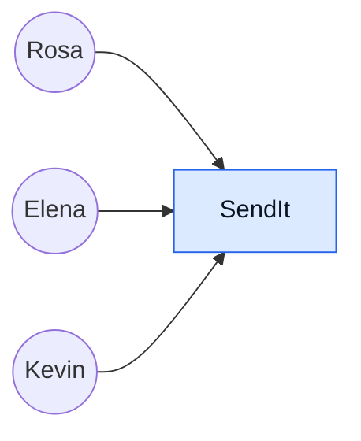

# L — Listar los componentes

> Paso 5 de [R.E.D.A.L.E.](../README.md) · anterior:
> [**A** — Armar el modelo de datos](../A-armar-modelo-datos/README.md) · siguiente:
> [**E** — Escalar](../E-escalar/README.md) · bitácora: [`ITERACIONES.md`](../ITERACIONES.md)

**Estado: andamiaje.** Los tres diagramas están vacíos y el inventario de componentes también.

Diagramar la arquitectura con todo lo mapeado en los pasos previos. **Este es el paso donde el
enunciado exige «mostrar claramente las iteraciones de su diseño»**, y el ejemplo que el profesor
mostró en clase define qué significa eso: el **mismo diagrama, dibujado tres veces, cada vez más
abierto**. Transcripción completa en
[`EJEMPLO-CLASE-TOP-DOWN.md`](../../docs/EJEMPLO-CLASE-TOP-DOWN.md); la lectura queda fijada en
[D-05](../../docs/DECISIONES.md#d-05--las-iteraciones-del-diseño-son-iteraciones-del-diagrama-de-componentes).

---

## Contrato con los pasos vecinos

| | |
|---|---|
| **Consume de R** | El backlog completo. Es lo que **gobierna** las iteraciones: una pasada del diagrama existe porque hay un ítem sin `DONE` |
| **Consume de D** | Los servicios y las fronteras con terceros. Las cajas de la iteración 2 son los servicios que `D` nombró |
| **Consume de A** | Las bases de datos. **Son varias, no una**: cada grupo de servicios tiene la suya, y cuál es cuál lo decidió `A` |
| **Consume de E** (estimar) | Solo para saber si un componente necesita estar separado por volumen. La estimación no dibuja cajas |
| **Entrega a E** (escalar) | El diagrama base sobre el que se pregunta qué se rompe primero cuando la carga sube |
| **Queda inválido si R cambia** | La tabla de trazabilidad, y con ella la justificación de cada iteración. Un ítem nuevo del backlog **fuerza una pasada más** del diagrama |
| **Queda inválido si D o A cambian** | La caja o la `BD` afectada, en las tres iteraciones donde aparezca. Un componente renombrado en la iteración 3 y no en la 2 es una contradicción visible |

---

## Qué muestra el diagrama y qué no

| Muestra | No muestra |
|---|---|
| Los componentes y sus relaciones | Cómo está implementado cada uno |
| Los actores, fuera del sistema | Pantallas, rutas de navegación, texto de interfaz |
| Las bases de datos, una por grupo de servicios | Esquemas, tablas ni campos — eso es [`A`](../A-armar-modelo-datos/README.md) |
| Los sistemas de terceros, marcados como externos | Versiones, proveedores concretos ni topología de despliegue |
| La etiqueta de cada rama condicional | Números de rendimiento — eso es [`E`](../E-estimar/README.md) |

El ejemplo de clase es literal en esto: sus cajas dicen `Login Service`, `Validation Service`,
`BD` — no dicen con qué se construyeron ni dónde corren.

## Convenciones del repositorio

Heredadas del ejemplo de clase y adoptadas aquí sin cambios.

| Elemento | Regla |
|---|---|
| **Servicio** | `<Nombre> Service` |
| **Proceso batch** | `<Nombre> Job <momento>` — p. ej. `<EOD>` para fin de día |
| **Base de datos** | `BD`, en elipse. **Varias, no una** |
| **Sistema externo** | Su nombre real, sin eufemismo |
| **Actor** | Círculo con etiqueta, fuera del sistema |
| **Rama condicional** | La arista lleva su etiqueta: `TODO OK`, `Validation Failed`, `OK`, `NO LOAN` |

**Código de color** — y hace un trabajo real, no decorativo: **el rosado marca dónde termina el
sistema.** Todo lo rosado puede fallar, tardar o mentir sin que el diseño pueda impedirlo.

| Color | Qué agrupa | Clase en Mermaid |
|---|---|---|
| Azul | Servicios propios | `propio` |
| Verde | Soporte y notificación | `soporte` |
| Rosado | Terceros, fuera de la frontera de confianza | `externo` |
| Amarillo | Procesos batch y servicios secundarios | `batch` |
| Naranja (elipse) | Bases de datos | `bd` |

```
classDef propio  fill:#dbeafe,stroke:#2563eb,color:#0b1220;
classDef soporte fill:#dcfce7,stroke:#16a34a,color:#0b1220;
classDef externo fill:#fce7f3,stroke:#db2777,color:#0b1220;
classDef batch   fill:#fef9c3,stroke:#ca8a04,color:#0b1220;
classDef bd      fill:#ffedd5,stroke:#ea580c,color:#0b1220;
```

---

## Las tres iteraciones

**La regla que las gobierna: no se dibuja el diagrama final y después se inventan las iteraciones
previas.** La primera es un cuadrado. Lo que fuerza la segunda es un ítem del backlog que el
cuadrado no explica, y lo mismo la tercera. Cada pasada cierra marcando ítems como `DONE`, y el
diagrama deja de crecer cuando el backlog está cubierto.

El motivo de cada pasada —qué ítem la forzó— se anota en [`ITERACIONES.md`](../ITERACIONES.md). Qué
quedó cubierto se anota **aquí**, en la tabla de trazabilidad.

### Iteración 1 — la caja única

Lo único que afirma: **quién habla con el sistema**. Los actores salen de
[`../../personas/`](../../personas/), no de una decisión de este paso.



| Componente | Qué hace | De qué paso previo sale | Persona o requisito que lo exige |
|---|---|---|---|
| `SendIt` | — | — | — |

**Pendiente de decidir en esta pasada:** si la red pagadora entra como actor —igual que `Proveedor`
en el ejemplo de Leasing— o aparece recién en la iteración 2 como sistema externo. Elena no habla
directamente con el sistema: habla con Kevin en el mostrador, y **Rosa tampoco** —bajo el modelo
Western Union (D-07) las dos puntas pasan por una ventanilla—. Dibujarlas conectadas directamente a
la caja es cómodo y falso, y ese es exactamente el error que la tensión T6 describe.

**Ítems del backlog que quedan `DONE`:** —

### Iteración 2 — la caja se abre en servicios

La caja deja de ser una caja. En el ejemplo de clase, esta pasada es la que hace aparecer por
primera vez la **autenticación**, la **validación contra terceros**, la **bifurcación del resultado**
y el **canal por el que se avisa cuando falla**. El equivalente en SendIt cubre el camino que va
desde que Rosa paga hasta que Elena cobra, con su rama de rechazo.

```mermaid
flowchart LR
  %% Iteración 2 — pendiente.
  %% Abrir la caja de la iteración 1 en los servicios que D nombró,
  %% con sus BD, sus sistemas externos y las etiquetas de cada rama.

  classDef propio  fill:#dbeafe,stroke:#2563eb,color:#0b1220;
  classDef soporte fill:#dcfce7,stroke:#16a34a,color:#0b1220;
  classDef externo fill:#fce7f3,stroke:#db2777,color:#0b1220;
  classDef bd      fill:#ffedd5,stroke:#ea580c,color:#0b1220;
```

| Componente | Qué hace | De qué paso previo sale | Persona o requisito que lo exige |
|---|---|---|---|
| — | — | — | — |

**Lo que esta pasada tiene que hacer visible y la iteración 1 no podía:**

- El punto exacto en que el dinero se compromete, y qué control corre **antes** de él —la decisión
  `D`(e), dibujada.
- La rama de rechazo del tamizaje, que en este caso **no puede explicarse al cliente** (tensión T2).
  La arista lleva etiqueta igual que `Validation Failed`, pero lo que sale por ella hacia Rosa no es
  el motivo.
- El canal hacia Elena, que **no tiene datos ni correo**: llamada y mensaje de texto (T5). Un
  `Messaging Service` que solo sabe hablar por aplicación la deja afuera.
- La frontera con la red pagadora, y del otro lado de ella, el registro que no obedece a nuestra
  transacción.

**Ítems del backlog que quedan `DONE`:** —

### Iteración 3 — cobertura del backlog restante

Repite el subgrafo de la iteración 2 y le agrega lo que falta hasta que ningún ítem quede sin
`DONE`. En el ejemplo de clase, esta pasada trae la evaluación, el presupuesto, la cobranza, el
proceso batch de fin de día y el tablero.

```mermaid
flowchart LR
  %% Iteración 3 — pendiente.
  %% Repetir el subgrafo de la iteración 2 y agregar los componentes
  %% que cubren los ítems del backlog todavía sin DONE.

  classDef propio  fill:#dbeafe,stroke:#2563eb,color:#0b1220;
  classDef soporte fill:#dcfce7,stroke:#16a34a,color:#0b1220;
  classDef externo fill:#fce7f3,stroke:#db2777,color:#0b1220;
  classDef batch   fill:#fef9c3,stroke:#ca8a04,color:#0b1220;
  classDef bd      fill:#ffedd5,stroke:#ea580c,color:#0b1220;
```

| Componente | Qué hace | De qué paso previo sale | Persona o requisito que lo exige |
|---|---|---|---|
| — | — | — | — |

**Candidatos que este caso obliga a considerar en esta pasada**, sin decidir todavía cuáles entran:
el proceso de **conciliación** con la red pagadora —el equivalente del `Debt Job <EOD>` del ejemplo,
y el punto donde se descubre que una operación figura en dos estados incompatibles—; el
**vencimiento de plazos**, que hace caducar solas las retenciones de cumplimiento y las cotizaciones de
`D`(d); la **devolución** a Rosa; el **re-tamizaje** cuando una lista se actualiza y alcanza a un
envío ya aprobado; y el **tablero de cumplimiento**, que es el `Debt Dashboard` de este caso.

**Ítems del backlog que quedan `DONE`:** —

---

## Trazabilidad backlog → iteración

Esta tabla **es** el `DONE` escrito a mano del profesor, en forma verificable. Reemplaza a la
palabra al final del renglón y hace comprobable la exigencia del enunciado.

| ID del ítem | Título | Iteración que lo cubre | `DONE` |
|---|---|---|---|
| RF-01 | — | — | — |

Los títulos se copian del [backlog](../R-requerimientos/backlog.md) tal como están escritos allá, en
el formato que fija
[D-06](../../docs/DECISIONES.md#d-06--el-backlog-adopta-el-formato-literal-del-profesor). Reescribir
un título aquí rompe la traza sin que se note.

Se lee en las dos direcciones y las dos fallan distinto:

- **De componente a ítem.** Un componente que no traza a ningún ítem del backlog es un **huérfano**.
  Se borra, o se descubre que el backlog tenía un hueco — y entonces el arreglo va en `R`, no en el
  diagrama.
- **De ítem a componente.** Un ítem del backlog que ninguna iteración cubre es un **hueco**, y es
  exactamente lo que obliga a una pasada más.

El diagrama está terminado cuando la columna `DONE` no tiene ningún vacío. No antes, y tampoco
porque «ya se ve completo».

---

## Frontera de confianza

En el ejemplo de Leasing, lo rosado —`SUNAT`, `RENIEC`, `INFO CORP API`— **informa**. En SendIt, lo
rosado **tiene el dinero**. Un tercero que responde tarde en el ejemplo retrasa una validación; una
red pagadora que responde tarde deja un envío simultáneamente retenido y pagado.

Toda frontera es donde la consistencia se rompe, y por una razón estructural: **del otro lado hay
otro registro contable que no participa de nuestra transacción.** Dentro de la frontera, la
atomicidad es una decisión de diseño. Fuera, no existe: solo hay dos afirmaciones sobre el mismo
hecho y la esperanza de que coincidan. Lo único que el diseño puede hacer es **detectar la
divergencia, acotar cuánto dura y decidir cuál registro manda mientras tanto** — la decisión `D`(c).

| Sistema externo | Qué se le manda | Qué se recibe | Qué se rompe si no responde, tarda o miente | Marca |
|---|---|---|---|---|
| Verificación de identidad | — | — | — | — |
| Listas de personas y entidades sancionadas | — | — | — | — |
| Proveedor de tipo de cambio | — | — | — | — |
| **Red pagadora en destino** | — | — | — | — |
| Autoridad a la que reporta cumplimiento | — | — | — | — |
| Procesador del cobro a Rosa | — | — | — | — |
| Canal de voz y mensaje hacia Elena | — | — | — | — |

Las dos últimas están por decidir: si el cobro a Rosa se toma como frontera propia y si el operador
que lleva el mensaje a Elena cuenta como tercero. Ambas tienen argumento a favor —fallan solas y no
obedecen— y el argumento en contra es que multiplican las cajas rosadas hasta que el diagrama deja
de leerse.

Tres preguntas que la tabla tiene que contestar y suelen quedar sin contestar:

1. **¿Qué entra desde afuera y se cree sin verificar?** Lo que la red pagadora informa sobre el cobro
   de Elena entra a nuestro registro contable. Es dato de un tercero moviendo dinero nuestro.
2. **¿Qué sale y no debería?** La existencia de un reporte a la autoridad no puede filtrarse hacia
   el cliente por ninguna arista, ni siquiera por un estado que se deduzca.
3. **¿Qué frontera está dibujada dentro del sistema y no debería?** El agente pagador de Huanta no
   es usuario de SendIt: es usuario de la red pagadora. Dibujarlo como caja propia hace creer que el
   diseño puede mandarle.

---

## Entrega

La versión final de cada iteración va **también como imagen** para la entrega —el enunciado se sube
como archivo y el evaluador no ejecuta Mermaid—. Los `.md` con los bloques son la fuente; las
imágenes se generan desde ellos y viven en esta misma carpeta, una por iteración. El
[ejemplo de clase](../../docs/EJEMPLO-CLASE-TOP-DOWN.md) muestra las tres en un solo lienzo, una
debajo de otra; conviene entregarlas así, porque la comparación entre pasadas es justamente lo que
el enunciado pide ver.

## Verificación antes de dar el paso por cerrado

```
- [ ] La iteración 1 es un cuadrado. No se dibujó al final para justificar las otras dos
- [ ] Cada iteración declara qué ítem del backlog la forzó, en ITERACIONES.md
- [ ] Ningún componente sin ítem del backlog que lo exija — sin huérfanos
- [ ] Ningún ítem del backlog sin componente que lo cubra — sin huecos
- [ ] Todo lo que está fuera de la frontera de confianza está en rosado, y nada más lo está
- [ ] Toda rama condicional lleva su etiqueta
- [ ] Las BD son varias y cada una tiene dueño en A
- [ ] Un componente renombrado se renombró en las tres iteraciones
- [ ] Las tres iteraciones existen como imagen, además del bloque Mermaid
```
