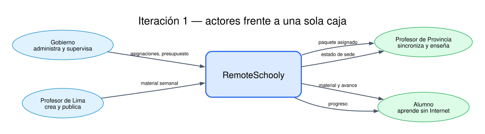
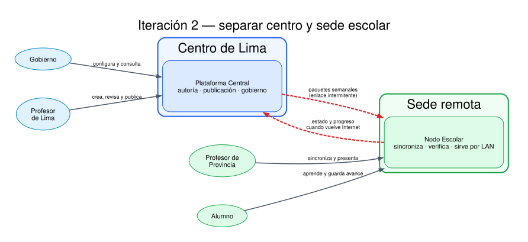
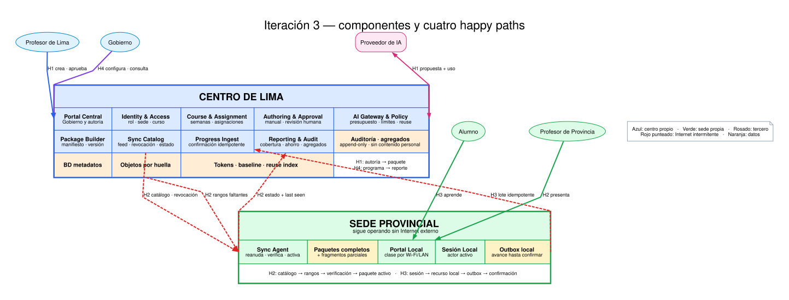

# Arquitectura de RemoteSchooly

Diseño top-down derivado de la spec que obtuvo [9.5/10](../evals/iterations/2026-09-02-01.md).
Los diagramas son vistas lógicas: una caja no implica un microservicio ni un despliegue separado.

## Contrato de este artefacto

| Consume | Produce | Queda inválido si cambia |
|---|---|---|
| `spec.md`, reglas, personas, decisiones y EVAL aprobado | Tres iteraciones, cuatro happy paths y trazabilidad completa | Cualquier `FR`, permiso, estado, métrica de tokens o supuesto de sede |

## Convenciones visuales

| Apariencia | Significado |
|---|---|
| Azul | Componente propio en el centro de Lima |
| Verde | Componente propio que opera en la sede |
| Rosado | Proveedor externo fuera de la frontera de control |
| Naranja | Almacenamiento lógico |
| Arista roja punteada | Cruza el enlace de Internet intermitente |
| H1–H4 | Camino feliz que la arista ayuda a cerrar |

## Iteración 1 — una sola caja



La primera vista afirma únicamente **quién habla con el sistema**. Conserva los cuatro usuarios que
el encargo fijó y evita reemplazar al Gobierno por un administrador genérico o fusionar a los dos
tipos de profesor.

No cubre todavía ningún requisito técnico de entrega: una sola caja no permite distinguir la red
local de la conexión externa, y tampoco muestra dónde se mide IA. `FR-029` y `FR-030` fuerzan abrir
la caja en una sede; `FR-008` y `FR-023` demuestran que una sola caja tampoco bastará después.

## Iteración 2 — centro y sede



Esta vista toma la decisión estructural más importante:

- Lima crea, publica, asigna y supervisa.
- La sede sincroniza durante ventanas de Internet.
- Profesor y alumno usan el nodo por LAN aunque Internet esté caído.
- Estado y progreso regresan cuando vuelve la conexión.

Con eso quedan visibles el inicio de `FR-020` y los recorridos offline de `FR-029` y `FR-030`. Pero
el dibujo todavía puede mentir: no dice por qué un paquete es completo, cómo continúa una descarga,
por qué una entrega no se duplica ni cómo se calcula el 40 %. `FR-021`, `FR-023`, `FR-034` y
`FR-014` fuerzan una tercera iteración.

## Iteración 3 — componentes y datos



La vista final abre centro y sede hasta que cada `FR-001`–`FR-041` tiene un responsable. La matriz
completa está en [`TRACEABILITY.md`](TRACEABILITY.md).

## Responsabilidades

| Componente | Responsabilidad | Requisitos principales |
|---|---|---|
| Portal Central | Superficie para Gobierno y Profesores de Lima | `FR-002`, `FR-003`, `FR-006`, `FR-009`, `FR-036`–`FR-039` |
| Identity & Access | Rol, sede, curso y permiso efectivo | `FR-001`, `FR-004`, `FR-005` |
| Course & Assignment | Cursos, semanas, sedes, presupuestos y asignación única | `FR-002`, `FR-019`, `FR-038` |
| Authoring & Approval | Autoría manual, revisión humana y versión aprobada | `FR-003`, `FR-006`, `FR-007`, `FR-011`, `FR-016` |
| AI Gateway & Policy | Preflight, límites, privacidad, reutilización y medición | `FR-008`–`FR-015` |
| Package Builder | Paquete inmutable, manifiesto y variante liviana | `FR-017`, `FR-018`, `FR-031` |
| Sync Catalog | Feed de asignaciones, versiones, revocaciones y estados | `FR-019`, `FR-020`, `FR-026`, `FR-027`, `FR-036`, `FR-041` |
| Objetos por huella | Recursos inmutables, deduplicables y descargables por rangos | `FR-018`, `FR-021`, `FR-022` |
| Progress Ingest | Confirmación idempotente de avances | `FR-033`, `FR-034` |
| Reporting & Audit | Cobertura, tokens, agregados y trazas | `FR-015`, `FR-036`–`FR-041` |
| Sesión Local | Identidad activa en un equipo compartido y alcance de sede | `FR-001`, `FR-004`, `FR-005` |
| Sync Agent | Reanudar, verificar, activar y procesar revocaciones | `FR-020`–`FR-028` |
| Paquetes/fragmentos locales | Separar versión completa activa de actualización parcial | `FR-023`–`FR-025`, `FR-028`–`FR-031` |
| Portal Local | Clase offline, recursos, estados y avance | `FR-026`, `FR-029`–`FR-035` |
| Outbox local | Conservar trabajo y telemetría hasta confirmación | `FR-032`–`FR-034`, `FR-041` |

## Happy path 1 — Lucía publica con menos tokens

1. Lucía entra por **Portal Central**; **Identity & Access** limita sus cursos.
2. **Authoring & Approval** le permite escribir manualmente o pedir una ayuda opcional.
3. **AI Gateway & Policy** muestra presupuesto, recorta contexto/salida y busca una unidad aprobada
   reutilizable. Si no puede reutilizar, llama al proveedor externo.
4. La medición entra a **Tokens · baseline · reuse index** con entrada, salida, calidad y política.
5. Lucía acepta, edita, rechaza o regenera. Nada sale de Draft sin su aprobación.
6. **Package Builder** genera paquete, manifiesto y recursos por huella.
7. **Sync Catalog** publica la versión y **Reporting** actualiza la comparación.

**Falla contenida:** si IA falla o no hay presupuesto, el paso 2 continúa manualmente. El proveedor
no está en el camino obligatorio de publicación.

## Happy path 2 — Julio recibe la semana

1. **Sync Agent** consulta a **Sync Catalog** las asignaciones y revocaciones de su sede.
2. Descarga solo recursos/fragmentos faltantes de **Objetos por huella**.
3. Cada corte conserva rangos verificados; la reconexión continúa el mismo recurso y validador.
4. El agente comprueba todas las entradas del manifiesto.
5. Solo entonces cambia el puntero del **almacén local** y reporta `Listo`.
6. Julio abre la semana por **Portal Local**; la conexión externa ya no participa.

**Falla contenida:** ausencia, corrupción o espacio insuficiente produce `Incompleto`, nombra el
recurso/acción y conserva la última versión completa.

## Happy path 3 — Diego aprende offline

1. Diego abre una **Sesión Local** desde la LAN de la escuela.
2. **Portal Local** sirve únicamente la versión activa y ofrece la alternativa de bajo consumo.
3. Su actividad se guarda con `progress_id` estable en **Outbox local**.
4. Cuando vuelve Internet, Outbox envía el lote a **Progress Ingest**.
5. El centro confirma cada identificador; reenviarlo devuelve la misma confirmación y no otro avance.

**Falla contenida:** cerrar o reiniciar el navegador no borra el outbox. Cambiar de alumno cambia la
identidad activa y no expone la sesión anterior.

## Happy path 4 — Valeria gobierna sin invadir

1. Valeria usa **Portal Central**; **Identity & Access** le concede configuración y agregados, no
   contenido pedagógico personal.
2. **Course & Assignment** registra sedes, semanas, asignaciones, presupuestos y excepciones.
3. **Reporting & Audit** combina estados del Sync Catalog, fecha de último contacto, progreso
   agregado y comparación de tokens.
4. El tablero muestra `sin reporte reciente` cuando no hay telemetría suficiente.
5. Valeria identifica sedes incompletas y cursos bajo el 40 %, con versión y evidencia comparable.

**Falla contenida:** prompts y entregas individuales no llegan al almacén de agregados; un silencio
de sede nunca se proyecta como entrega fallida confirmada.

## Cómo se obtiene y se demuestra el 40 %

```text
ahorro_tokens = 1 - sum(input + output)_optimizado
                    / sum(input + output)_baseline
```

La suma incluye únicamente unidades que superan el mismo umbral de calidad en ambos lados. Las
palancas que sí reducen el numerador son:

1. **Reutilización sin llamada** de una unidad aprobada cuando docente, intención y fuentes permiten
   adaptarla.
2. **Selección de contexto** para no reenviar documentos completos a tareas locales.
3. **Límite de salida** según el tipo de unidad.
4. **Edición manual** cuando una nueva generación no aporta valor.

Modelo barato, precio, prompt caching y menor volumen se reportan como métricas auxiliares. No pueden
comprar el 40 % por sí mismos.

## Correctitud sin prometer alta disponibilidad

| Incluido ahora | Diferido |
|---|---|
| Manifiesto y huellas | Réplica central activa-activa |
| Descarga reanudable | Failover multi-región |
| Activación atómica local | Quorum entre sedes |
| Última versión completa | 100 % de disponibilidad |
| Avance idempotente y outbox | Operación nacional dimensionada sin datos de carga |

Si el centro cae, una sede puede retrasar su próxima semana; no puede corromper por eso una semana
que ya estaba `Listo`. Esa es la frontera exacta del enunciado.
