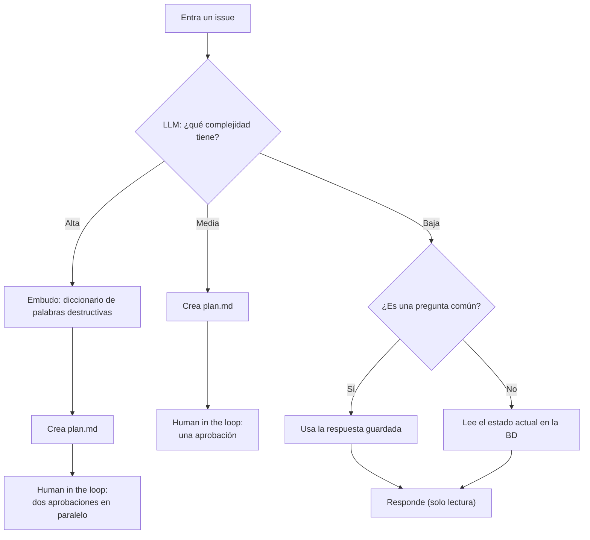
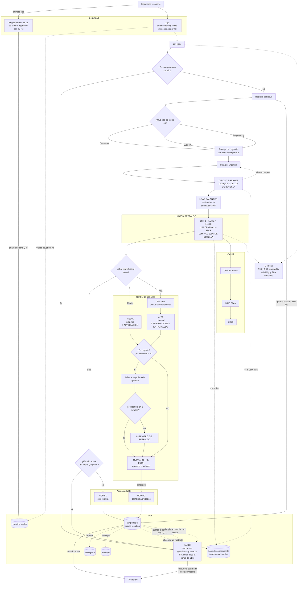

# Lab 5

Hola profe, este será el readme más manual que hemos realizado en nuestras vidas y lamentablemente (para nosotros) hicimos todas las task usando nuestro cerebro. Eso dolió

Solo usamos IA para corregir ortografía y subir los archivos.

Identificamos 6 tareas según lo que pide el lab.

1. Halla el SPOF
2. Buscar los componentes de mayor riesgo.
3. Tipos de incidentes y sus variables individuales
4. Ciclo de vida de un issue
5. Diseño del nuevo harness
6. Diagrama de arquitectura

## 1. SPOF

Según la teoría, el SPOF viene a ser la pieza que si falla, compromete todo el flujo del sistema. Ademas de no tener un respaldo.

Por eso consideramos que el LLM es el SPOF.

Sin ese componente no hay comunicación mediante la api ni funcionarían los MCPs

## 2. Componentes de mayor riesgo

Aquí la diferencia es que el componente de riesgo puede causar daños graves pese a que siga funcionando. Consideremos 3:

* LLM: Causó el problema más grave cuando borró la BD y también nos cuentan que da respuestas incorrectas o con info desfasada.
* MCP de BD: Porque fue el punto de entrada cuando se borró la BD
* BD: Tiene los issues y en caso se borré, se pierde todo. Además que si no se lee el estado actual, un incidente cerrado puede aparecer como pendiente.

## 3. Issues

Para calcular la urgencia usamos estos porcentajes:

* Customer (SLA de 1 día): SLA 50 %, categoría del cliente 30 % y tipo de mercado 20 %.
* Support (SLA de 2 días): SLA 50 %, categoría del cliente 30 % y tipo de mercado 20 %.
* Engineering: SLA 50 % y sistema afectado 50 %.

Cada variable recibe un puntaje:

* SLA: suma 1 punto por cada día que pasa. Customer empieza en 9, Support en 8 y Engineering en 7. Cuando vence el SLA llega a 10 y ya no sube más.
* Categoría del cliente: normal = 5 y VIP = 10.
* Tipo de mercado: B2C = 5 y B2B = 10.
* Sistema afectado: impacto bajo = 3, medio = 6 y alto = 10.

El puntaje final se calcula así:

* Customer y Support: SLA × 50 % + categoría × 30 % + mercado × 20 %.
* Engineering: SLA × 50 % + sistema afectado × 50 %.

El resultado queda entre 1 y 10. Los issues con puntaje de 8 a 10 se consideran urgentes. Customer siempre se atiende antes que Support y Engineering. Después, la cola ordena los issues por su puntaje de urgencia.

## 4. Ciclo de vida

Cuando entra un issue pasa por el LLM y se abren 3 caminos según la complejidad:

* Alta: pasa primero por un "embudo", que es unn diccionario con palabras clave potencialmente destructivas y después se crea el plan.md.
* Media: se crea directamente el plan.md.
* Baja: solo se permiten consultas de lectura. Si es una pregunta común, se usa la respuesta ya guardada para que siempre sea la misma. Si no, se lee el estado actual en la BD y se responde.

Alta y Media terminan en un plan.md que pasa por Human in the loop. Media necesita la aprobación de un ingeniero. Alta necesita dos aprobaciones, pero se solicitan al mismo tiempo para reducir la espera.

## 5. Harness

Nosotros entendemos que el harness es todo lo que ponemos alrededor del LLM para que funcione bien y no dependa solo de él. El LLM sigue siendo el que responde, pero el harness decide qué información le va a llegar, qué hacer y cómo reaccionar cuando falla. El harness actual solo tenía la API y los MCP de base de datos y Slack, por eso nada frenó al LLM cuando borró la BD y cuando falla no hay plan B.

Lo que agregamos:

* Varios LLM con load balancer: como el LLM es nuestro SPOF, ponemos más de una instancia. El load balancer revisa el /health de cada una y si alguna se cae deja de mandarle issues, así las demás siguen respondiendo.
* Cola por urgencia: los issues entran a una cola y se ordenan con el puntaje de la parte 3. En la primera semana del mes, que es cuando llegan más incidentes, se atienden primero los que están por vencer su SLA.
* Aprobación rápida: si un issue Alta o Media tiene un puntaje de 8 a 10, el plan.md se envía inmediatamente al ingeniero de guardia. Media pide una aprobación y Alta pide dos en paralelo. Si un ingeniero no responde en 5 minutos, se avisa a uno de respaldo. Nada se ejecuta sin las aprobaciones necesarias.
* Circuit breaker: si el LLM empieza a fallar muchas veces seguidas, se cortan los pedidos por un rato para que se recupere y no se sature más. Mientras tanto las preguntas comunes se responden con las respuestas guardadas y lo demás espera en la cola.
* Control de acciones: el MCP de BD por defecto solo deja leer. Si hace falta cambiar algo, va en un plan.md y recién se ejecuta cuando el ingeniero lo aprueba en el human in the loop de la parte 4. Así el LLM ya no puede borrar nada por su cuenta.
* Backups y réplica de la BD: en la parte 2 vimos que si se borra la BD se pierde todo, por eso sacamos backups seguido y tenemos una réplica para recuperarla si pasa algo.
* Estado actualizado: el estado de un incidente siempre se lee de la BD. Si usamos caché le ponemos un TTL corto y se limpia apenas el incidente cambia de estado, así no aparece un incidente cerrado como pendiente.
* Respuestas guardadas: las preguntas comunes tienen una respuesta ya revisada en caché, entonces el LLM responde siempre lo mismo y no algo distinto cada día.
* Base de conocimiento: cada vez que se cierra un incidente guardamos cómo se resolvió y el LLM lo consulta antes de responder. Es su forma de aprender de casos anteriores sin reentrenarlo.
* Cola para Slack: si Slack no responde, los avisos se guardan y se mandan cuando vuelva, para que no frene lo demás.
* Métricas: medimos el P95 y P99 desde que entra un issue hasta que recibe una respuesta o se aprueba su plan.md. También medimos la availability con 2xx / (2xx + 5xx), la reliability con 2xx / (2xx + 4xx + 5xx) y cuántos issues vencen su SLA.

### Sesiones por ingeniero

También entendemos que cada ingeniero abre una o más sesiones con el LLM por cada issue. El problema es cuando alguien es irresponsable y abre muchas sesiones para lo mismo. Cada sesión ocupa al LLM, entonces se satura más rápido, sobre todo en la primera semana del mes que es cuando llegan más incidentes. Además, cada sesión puede dar una respuesta distinta para el mismo issue, se pueden crear varios plan.md que se contradicen entre sí y los issues urgentes terminan esperando más en la cola.

Por eso proponemos un máximo de sesiones por ingeniero según la relevancia de su rol, la misma que usamos en la parte 3. Cuando alguien llega a su límite, el harness no le deja abrir más sesiones hasta que cierre alguna.

| Rol | Máximo de sesiones |
|---|---|
| Practicante | 10 |
| Analista junior | 20 |
| Analista semi senior | 35 |
| Senior | 50 |
| Lead AI | 100 |

Son valores de ejemplo y se pueden ajustar según cómo se use la plataforma.

## 6. Diagrama de arquitectura

Aquí juntamos todo lo anterior. Antes el sistema iba de la API al LLM y de ahí a los MCP de la BD y de Slack, y si algo fallaba se caía todo. Ahora se entra con login, cada issue se registra con su tipo, el LLM tiene respaldo, nada se ejecuta sin aprobación y la BD tiene réplica y backups.

En el diagrama marcamos el LLM como SPOF y también como cuello de botella, porque en la primera semana del mes ahí se acumulan los issues. El load balancer con varias instancias evita el SPOF, y la cola, el circuit breaker y la caché ayudan a que no se sature.

Las preguntas comunes usan la respuesta guardada antes de llamar al LLM. Para consultar el estado de un incidente, primero se revisa la caché y, si no tiene un valor vigente, se lee la BD.

Las flechas normales son el camino de un issue y las punteadas son lo que pasa por detrás, como las réplicas, los backups o lo que hace el circuit breaker cuando el LLM falla.

## Carpetas para el evaluador de minions

El profe pidió por Discord que corramos el minions archi evaluator cuando ya tengamos la arquitectura. Ese evaluador lee tres carpetas, así que las agregamos solo para eso:

* `requirements/`: requerimientos funcionales y no funcionales, sacados de lo que explicamos en este README.
* `people/`: los usuarios de Genius-x.
* `diagram/`: el diagrama de la parte 6 como imagen.

## Lo que nos dijo el evaluador y lo que cambiamos

Corrimos el minions archi evaluator y la primera vez sacamos 4.5 de 10. Con ese feedback hicimos estos cambios en el diagrama:

* Security (sacamos 0): el diagrama no tenía login ni creación de usuarios. Agregamos el registro de usuarios, donde a cada ingeniero se le asigna su rol, y un login que valida quién entra y cuántas sesiones puede abrir según ese rol.
* Reliability (sacamos 3): encontró el circuit breaker y la caché, pero no sabía qué protegían porque no habíamos marcado el SPOF ni el cuello de botella. Ahora el LLM aparece como SPOF, que es lo que dijimos en la parte 1, y también como cuello de botella. Además dejamos escrito que el load balancer evita el SPOF y que el circuit breaker protege al cuello de botella.
* Spec (sacamos 9): faltaba mostrar cómo se clasifica un issue. Agregamos el registro del issue, la decisión de si es Customer, Support o Engineering, y que ese tipo se guarda en la BD antes de calcular el puntaje de urgencia.

Después de los cambios lo volvimos a correr y sacamos 9.2 de 10.
